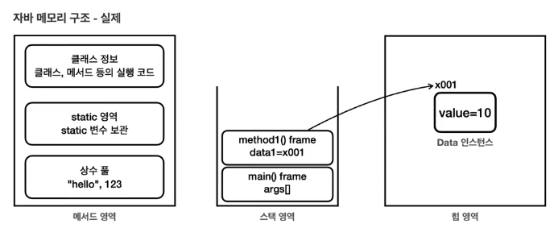
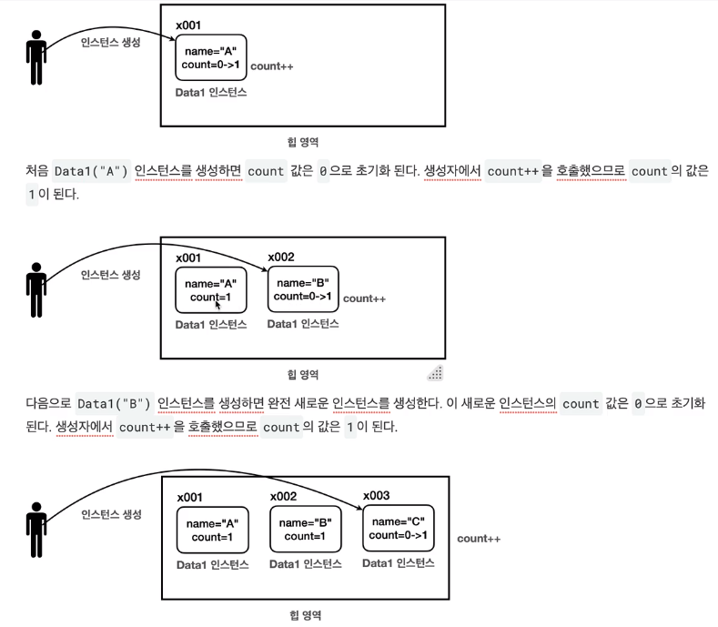

# JAVA BASIC
- psvm: public static void main(String args) 단축어
- sout: System.out.println 단축어
- iter: 향상된 for문 단축어
####
- Shift + F6 : 아래 같은 변수명 같이 선택
- Ctrl + Shift + 10F : 실행
- Ctrl + Alt + V: introduce variable 로 변수 이름 자동 추천
- F2 : Next Highlighted Error
- Ctrl + W: 커서가 있는 단어 블록 지정
#### for mac
- cmd + N - Generator: 기본 생성자 자동 생성 
- ctrl + 위 화살표: 커서가 있는 단어 블록 지정 

## 1. 클래스와 데이터

### 1-1. 클래스가 필요한 이유
- 코드의 변경이 있을 때 유지보수하기 용이하다.
- 사람이 이해하고 관리하기 편리하다.

### 1-2. 클래스 도입
- 클래스: 사용자 정의 자료형을 만드는 설계도 이다.
- 인스턴스: 설계도인 클래스에 의해 만들어져서 실제 메모리에 로드된 실체이다.
- 클래스명은 첫글자가 대문자인 카멜표기법을 사용한다.
- 변수는 소문자로 시작하는 카멜표기법을 사용한다.
####
- 객체를 사용하려면 먼저 설계도인 클래스를 기반으로 인스턴스를 생성해야한다.
- 인스턴스는 생성자를 사용해서 메모리에 실제 객체를 생성한 것이다.  
  (생성 시 이 객체를 사용할 때 필요한 메모리 공간도 함께 확보한다.)
- 객체를 생성하면 자바는 메모리 어딘가에 있는 이 객체에 접근할 수 있는 참조값(주소)를 반환한다.
#### 
    Student student1 = new Student();   // 1. Student 객체 생성
    Student student1 = x001;            // 2. new Student의 결과로 x001 참조값 반환
    student1 = x001;                    // 3. 최종 결과

    // 여기선 임의로 x001이라고 표현했는데 System.out.println(student1); 을 실행하면 @뒤에가 참조 값이다.

### 1-3. 객체 사용
- 객체이름 뒤에 dot(.)을 붙여서 접근한다.
- student1.name은 student1 인스턴스의 name 필드에 접근한다.

### 1-4. 클래스, 객체, 인스턴스 정리
- 객체: 객체는 클래스에서 정의한 속성과 기능을 가진 실체이다. 객체는 서로 독립적인 상태를 가진다.
- 인스턴스: 인스턴스는 특정 클래스로부터 생성된 객체를 의미한다. 인스턴스는 주로 객체가 어떤 클래스에 속해있는지 강조할 때 사용한다.
- 객체 vs 인스턴스: 둘다 클래스에서 나온 실체라는 의미에서 비슷하게 사용되지만, 용어상 인스턴스는 객체보다 좀 더 관계에 초점을 맞춘 단어이다.

### 1-5. 배열 도입 - 시작
- 클래스 배열을 사용하면 특정 타입을 연속한 데이터 구조로 묶어서 편리하게 관리할 수 있다.
- Student 타입을 보관할 수 있는 Students 배열을 만들면 배열은 Student 타입의 참조값을 보관하는 배열로 생성된다.   
  (배열에는 아직 참조값을 대입하지 않았기 때문에 참조값이 없다는 의미의 null 값으로 초기화 된다.)
- **대원칙: 자바는 항상 변수의 값을 복사해서 대입한다!**
- **!변수에는 인스턴스 자체가 들어 있는 것이 아니라 인스턴스의 위치를 가르키는 참조 값이 들어있을 뿐이다!**
- 따라서 인스턴스가 복사되는 것이 아니라 인스턴스에 접근할 수 있는 참조값만 복사된다. (인스턴스가 아니라 접근하는 방법이 늘어나는 것)
- 이런경우 반복문을 향상된 for문을 사용해서 최적화하면 좋다. (iter 입력하면 자동 생성)

### 1-6. 배열 도입 - 리펙토링
- iter를 치면 향상된 for문을 사용할 수 있음 (forEach)

### 1-7. 문제와 풀이

 

## 2. 기본형과 참조형

### 2-1. 기본형 vs 참조형1 -시작
- 변수의 데이터 타입을 가장 크게 두가지로 나누면 기본형과 참조형으로 나눌 수 있다.
  - 기본형(Primitive Type): int, long, double, boolean 처럼 변수에 사용할 값을 직접 넣을 수 있는 타입
  - 참조형(Reference Type): 객체, 배열 처럼 데이터에 접근하기 위한 참조(주소)값을 넣는 타입  
    (객체는 .을 이용해서 요소에 접근하고, 배열은 [ ]를 이용해서 소요에 접근한다.)
- 기본형은 들어있는 값을 그대로 계산에 사용할 수 있고, 참조형은 들어 있는 참조값 그대로 사용할 수 없다.  
  (참조값에서 안의 기본형 멤버에 접근해서 계산해야 한다.)

### 2-2. 기본형 vs 참조형2 -변수 대입
- **대원칙: 자바는 항상 변수의 값을 복사해서 대입한다!**
- 기본형, 참조형 모두 항상 각각의 변수에 있는 실제값, 참조값을 복사해서 대입한다.
####
    // 기본형
    int a = 10;
    int b = a;    // a에 있는 10을 복사해서 b에 대입

    // 참조형
    Student s1 = new Student();
    Student s2 = s1;  // s1이 가지고 있는 인스턴스의 주소를 복사해서 s2에 대입
                      // 인스턴스가 복사되는 것이 아니라 주소만 복사하는 것이다.

### 2-3. 기본형 vs 참조형3 -메서드 호출
- **대원칙: 자바는 항상 변수의 값을 복사해서 대입한다!**
- (call by value) 메서드 호출도 마찬가지이다. 메서드를 호출할 때 사용하는 매개변수(파라미터)도 결국 변수일 뿐이다.    
  따라서 메서드를 호출할 때 매개변수에 값을 전달하는 것도 앞서 설명한 내용과 같이 값을 복사해서 전달한다.    
- call by value 가 call by reference 와 다른 점은 매개 변수에 다른 값을 대입하는 경우 드러난다.  
  call by value로 주소 값을 복사 받은 경우 매개 변수에 다른 값을 대입하고 변화를 준 경우 외부 객체는 변하지 않는다.  
  만약 call by reference 였다면 외부 객체도 같이 변한다.

### 2-4. 참조형과 메서드 호출 -활용
- 아래 코드의 중복을 메서드를 통해 손쉽게 제거할 수 있다.
####
    Student student1;
        
    student1 = new Student();
    student1.name = "학생1";
    student1.age = 15;
    student1.grade = 90;

    Student student2 = new Student();
    student2.name = "학생2";
    student2.age = 16;
    student2.grade = 80;

    System.out.println("이름:" + student1.name + " 나이:" + student1.age + " 성적:" + student1.grade);
    System.out.println("이름:" + student2.name + " 나이:" + student2.age + " 성적:" + student2.grade);

- 메서드로 손쉽게 제거
####
    public static void main(String[] args) {
        Student student1 = creatStudent("학생1", 15, 90);
        Student student2 = creatStudent("학생2", 16, 80);

        printStudent(student1);
        printStudent(student2);
    }

    static Student creatStudent(String name, int age, int grade) {
        Student student = new Student();
        student.name = name;
        student.age = age;
        student.grade = grade;
        return student;
    }

    static void printStudent(Student student) {
        System.out.println("이름:" + student.name + " 나이:" + student.age + " 성적:" + student.grade);
    }
- 메서드 안에서 객체를 생성한 경우 객체를 메서드 밖에서 사용할 수 있게 return 해줘야 한다.

### 2-5. 변수와 초기화
#### 변수의 종류
- 멤버 변수(필드): 클래스에 선언
- 지역 변수: 메서드에 선언, (매개 변수도 지역변수의 한 종류이다.)

#### 변수의 값 초기화
- 멤버 변수: 자동 초기화
  - 인스턴스의 멤버 변수는 인스턴스를 생성할 때 자동으로 초기화 된다.
  - 숫자(int)=0, boolean=false, 참조형=null (**null 값은 참조할 대상이 없다는 의미이다.**)
  - 개발자가 초기값을 직접 지정할 수 있다.
- 지역 변수: 수동 초기화
  - 지역 변수는 학상 직접 초기화 해야 한다.

### 2-6. null
- **null 값은 참조할 대상이 없다는 의미이다.**
- 기본형 변수는 null 값을 할당할 수 없다.
- 참조형 변수에는 항상 객체가 있는 위치를 가리키는 참조값이 들어간다.  
  그런데 아직 가리키는 대상이 없거나 가리키는 대상을 나중에 입력하고 싶을 때 null을 넣어 둔다.
- GC(가비지 컬렉션): 인스턴스를 아무도 참조하기 않게되면 해당 인스턴스에 다시 접근할 방법이 없다.  
  이렇게 아무도 참조하지 않는 인스턴스는 사용되지 않고 메모리 용량만 차지할 뿐이다.  
  자바는 이런 인스턴스를 JVM이 가비지 컬렉션을 사용해서 자동으로 메모리에서 제거한다.

### 2-7. NullPointerException
- 참조(주소)값이 없는 참조형 변수를 point(.)로 사용하려고 할 때 발생한다.
- 지역 변수의 경우에는 null 문제를 파악하는 것이 어렵지 않다.  
  그러나 멤버 변수가 null 인 경우에는 주의가 필요하다.
- 참조형 변수가 null을 가리키는 것이 문제니까 인스턴스를 할당해서 참조값을 넣어주면 해결된다.

### 2-8. 문제와 풀이

 

## 3. 객체 지향 프로그래밍

### 3-1. 절차 지향 프로그래밍1 - 시작
#### 절차 지향 프로그래밍
- 실행 순서를 중요하게 생각하는 방식
- 흐름을 순차적으로 따르며 처리하는 방식이다. 
- 즉, "어떻게"를 중심으로 프로그래밍 한다.

#### 객체 지향 프로그래밍
- 객체를 중요하게 생각하는 방식이다.
- 실제 세계의 사물이나 사건을 객체로 보고, 이러한 객체들 간의 상호작용을 중심으로 프로그래밍하는 방식이다.
- 즉, "무엇을" 중심으로 프로그래밍 한다.

#### 둘의 차이점
- 절차 지향은 데이터와 해당 데이터에 대한 처리 방식이 분리되어 있다.
- 반면 객체 지향은 데이터와 그 데이터에 대한 행동(메서드)이 하나의 '객체'안에 함께 포함되어 있다.

### 3-2. 절차 지향 프로그래밍2 - 데이터 묶음
- class로 데이터를 묶어 두어 이후에 프로그램 로직이 더 복잡해져서 다양한 변수들이 추가되더라도  
  음악 플레이어와 관련된 변수들은 MusicPlayerData data객체에 속해있으므로 쉽게 구분할 수 있다.

### 3-3. 절차 지향 프로그래밍3 - 메서드 추출
- 각각의 기능들은 재사용될 가능성이 높은 경우 메서드로 추출해서 모듈화하면  
  불필요한 코드의 반복을 줄일 수 있다.  
  또한 메서드 이름의 추가로 코드를 더 쉽게 이해하기 쉽다.

- 지금까지 클래스를 사용해서 관련된 데이터를 하나로 묶고,  
  또 메서드를 사용해서 각각의 기능을 모듈화 했다.  
  덕분에 상당히 깔끔하고 읽기 좋고, 유지보수 하기 좋은 코드를 작성할 수 있었다.

- 그러나 우리가 작성한 코드의 한계는 데이터와 기능이 분리되어 있다는 점이다.  
  데이터와 그 데이터를 사용하는 기능은 매우 밀접한 관련이 있다.  
  데이터를 수정하는 순간 기능도 같이 수정되어야하고 반대인 경우도 많다.  
  관리포인트가 2개로 늘어나서 유지보수 관점에서 좋지않은 코드이다.

### 3-4. 클래스와 메서드

### 3-5. 객체 지향 프로그래밍

- 객체 지향 프로그래밍을 위해서는 프그로램의 실행 순서보다는  
  객체가 어떤 속성을 가지고 어떤 기능을 제공 하는지에 초점을 맞춰야 한다.
  
- 이를 위해 음악 플레이어를 만들어서 제공하는 개발자와  
  음악 플레이어를 사용하는 개발자가 분리되어 있다고 생각하면 좋다.

#### 캡슐화
- MusicPlayer4를 보면 음악 플레이어를 구성하기 위한 속성과 기능이 마치 하나의 캡슐에 쌓여 있는 것 같다.  
  이렇게 속성과 기능을 하나로 묶어서 필요한 기능을 메서드를 통해 외부에 제공하는 것을 캡슐화 라고 한다.
- 사용하는 측에서는 캡슐 내부의 코드를 모르더라도 인터페이스만 알면 사용할 수 있다.
- 또 캡슐 내부의 변경이 있다고 하더라도 외부에서 가져다 사용하는 인터페이스가 같으면 사용하는측의 코드는 수정할 필요 없다.

### 3-6. 문제와 풀이

 

## 4. 생성자

### 4-1. 생성자 -필요한 이유
- 객체를 생성하는 시점에 어떤 작업을 하고싶다면 생성자(Construct)를 이용하면 된다.

### 4-2. this
- 종북되는 변수명이 있을 경우 스코프 기준 자신과 가까운 것이 먼저 잡힌다.
- 만약 메소드 안에서 인스턴스 멤버 변수를 선택하고 싶은데 메소드 안의 지역 변수와 같다면  
  this.라는 키워드를 적어서 인스턴스의 멤버 변수임을 알려줘야 한다.
- this는 자기 자신의 인스턴스의 참조를 뜻한다. 

#### this의 생략 (지역 변수랑 멤버 변수랑 다르면 가능)
- this는 생략할 수 있다. 이 경우 변수를 찾을 때 가까운 지역 변수를 먼저 찾고,  
  없으면 그 다음으로 멤버 변수를 찾는다. 멤버 변수도 없으면 오류가 발생한다.
####
    public class MemberThis {
      String nameField;
      
          void initMember(String nameParameter) {
              nameField = nameParameter;
          }
    }

#### this와 코딩 스타일
- 멤버변수에 접근하는 경우에 항상 this를 사용하는 코딩 스타일도 있다.
- 이러면 멤버 변수를 사용할 때 명확히 알 수 있다. (과거에는 많이 썻지만 최근에는 IDE가 발전해서 안씀)

### 4-3. 생성자 -도입
- 프로그래밍을 하다보면 객체를 생성하고 이후에 바로 초기값을 할당해야하는 경우가 많다.  
  그래서 대부분 객체 지향 언어는 객체를 생성하자마자 즉시 필요한 기능을 좀 더 편리하게 수행할 수 있도록 생성자 기능을 제공한다.
- 앞에 static, void 이런 거 붙이지 말고 클래스 이름과 완전 같은 메서드를 선언하면 그게 생성자가 된다.

#### 생성자의 장점
- 중복 호출 제거: 생성자가 없던 시절에는 생성자 직후에 어떤 작업을 수행하기 위해 메서드를 한번 더 호출해야 했다.
- 제약-생성자 호출 필수: 인스턴스를 생성하고 멤버 변수에 값을 할당하지 않는 유령 인스턴스가 존재할 가능성이 줄어든다.

### 4-4. 기본 생성자
- 매개 변수가 없는 생성자를 기본 생성자라고 한다.
- 클래스에 생성자가 하나도 없으면 자바 컴파일러는 매개 변수가 없고, 작동하는 코드가 업는 기본 생성자를 자동으로 만들어준다.
- 생성자가 하나라도 있으면 자바는 기본 생성자를 만들지 않는다.
#### 정리
- 생성자는 반드시 호출되어야 한다.
- 생성자가 없으면 기본 생성자가 제공된다.
- 생성자가 하나라도 있으면 기본 생성자가 제공되지 않는다. 이 경우 개발자가 정의한 생성자를 직접 호출해야 한다.

### 4-5. 생성자 - 오버로딩과 this()
- 생성자도 메서드 오버로딩처럼 매개변수만 다르게 해서 여러 생성자를 제공할 수 있다.
- 생성자 내에서 this()는 자신의 또 다른 생성자를 호출한다. (매개변수 맞는 생성자 호출)
#### 생성자 오버로딩 시 this()로 중복 코드 줄이기!
    public class MemberConstruct {
            String name;
            int age;
            int grade;
    
            // 추가
            MemberConstruct(String name, int age) {
                this(name, age, 50);    // 변경
            }
    
            MemberConstruct(String name, int age, int grade){
                System.out.println("생성자 호출 name=" + name + ", age=" + age + ", grade="+ grade);
                this.name = name;
                this.age = age;
                this.grade = grade;
            }
    }
#### this() 규칙
- this()는 생성자 코드 안에서 첫 줄에만 작성할 수 있다.

### 4-6. 문제와 풀이

 

## 5. 패키지

### 5-1. 패키지 -시작
- 프로그램의 기능들이 추가되어 커지게 된다면 많은 클래스들이 생기게 된다.
- 매우 많은 클래스가 등장하면서 관련 있는 기능들을 분류해서 관리하고 싶을 것이다.
- 구분하기 쉽게 파일 시스템의 개념을 적용해 분류한 것이 패키지 이다.

### 5-2. 패키지 -import
- 다른 패키지에 있는 클래스를 가져와서 사용할 때 풀네임을 적는 것이 불편할 때 사용
- import 로 패키지를 추가하면 풀네임을 적지 않아도 사용할 수 있다.
- import pack.a.* 을 사용하면 a에 있는 패키지를 다 가져온다.
- 그러나 a아래 있는 a.c와 같은 패키지는 가져오지 않는다.

#### 클래스 이름 중복
- 패키지 덕분에 클래스 이름이 같아도 패키지 이름으로 구분해서 같은 이름의 클래스를 사용할 수 있다.
- pack.a.User 와 pack.b.User 둘 다 사용하고 싶으면 어떻게할까?  
  어쩔 수 없이 둘 중 하나는 풀네임으로 써야함
######
        User userA = new User();                // 다른 위치(import)
        pack.b.User userB = new pack.b.User();  // 다른위치(풀네임)

### 5-3. 패키지 규칙
- 패키지의 이름과 위치는 폴더(디렉토리) 위치와 같아야 한다. (필수)
- 패키지 이름은 모두 소문자를 사용한다. (관례)
- 패키지 이름의 앞 부분에는 일반적으로 회사의 도메인 이름을 거꾸로 사용한다. (관례)  
  예를 들어 com.company.myapp 과같이 사용

#### 패키지의 계층 구조
- a.b a.c 처럼 a아래 b와 c가 있는 계층 구조를 이루더라도 모든 패키지는 서로 완전 다른 패키지이다.
- a에서 a.b를 사용하고 싶다면 import 해야한다.

### 5-4. 패키지 활용
- 패키지를 구성할 때 서로 관련된 클래스는 하나의 패키지에 모으고,  
  관련이 적은 클래스는 다른 패키지로 분리하는 것이 좋다. 

 

## 6. 접근 제어자(access modifier)

### 6-1. 접근 제어자 이해1
- 접근 제어자를 사용하면 해당 클래스 외부에서 특정 필드나 메서드에 접근하는 것을 허용하거나 제한할 수 있다.

#### 접근 제어자가 필요한 이유
- 개발자가 인터페이스 내부에서 제약사항을 두었더라도 외부에서 직접 접근해버리면 제약사항이 유명무실해질 수 있다.

### 6-2. 접근 제어자 이해2
- 외부에서 직접 접근해서 내부 제약사항을 무시해버리는 것을 막기 위해서는 외부 접근을 제한하면 된다.

#### private 
- private 접근 제어자는 모든 외부 호출을 막는다. 따라서 내부 호출만 가능하다. 
- 좋은 프로그램은 무한한 자유도가 있는 프로그램이 아니라 적젏한 제약이 있는 프로그램이다. 

### 6-3. 접근 제어자 종류
- private: 모든 외부 호출 금지
- default: 같은 패키지 내부 허용  
- protected: 패키지 + 상속 관계 허용 
- public: 모든 외부 호출 허용 

#### package-private
- 접근 제어자를 명시하지 않으면 같은 패키지 안에서 허용을 호출하는 default 접근 제어자가 적용된다.
- default라는 용어는 해당 접근 제어자가 기본값으로 사용되기 때문에 붙여진 이름이지만,
  실제로는 pacakge-pricate이 더 정확한 표현이다. 

#### 접근 제어자 사용 위치
- 접근 제어자는 필드와 메서드, 생성자에 사용된다. 
- 클래스 레벨에도 일부 접근 제어자를 사용할 수 있다.
- 지역 변수 안에서는 접근 제어자가 의미가 없다.

#### 접근 제어자의 핵심은 속성과 기능을 외부로부터 숨기는 것이다. 
- private 은 나의 클래스 안으로 속성과 기능을 숨길 때 사용한다.
- default 는 나의 패키지 안으로 속성과 기능을 숨길 때 사용한다.
- protected 는 상속 관계로 속성과 기능을 숨실 때 사용한다.
- public 은 기능을 숨기지 않고 어디서든 호출할 수 공개한다.

### 6-4. 접근 제어자 사용 -필드, 메서드
- 위에서 정의한 것과 같다.

### 6-5. 접근 제어자 사용 -클래스 레벨
- 클래스 레벨의 접근 제어자는 public, default만 사용할 수 있다.
- public 클래스는 반드시 파일명과 클래스명이 같아야 한다. 
  - 하나의 자바 파일에 public 클래스는 하나만 만들 수 있다.
  - 하나의 자바 파일에 default 클래스는 여러개 만들 수 있다.

### 6-6. 캡슐화(Encapsulation)
- 캡슐화는 데이터와 해당 데이터를 처리하는 메서드를 하나로 묶어서 외부에서 접근을 제한하는 것을 말한다.
- 캡슐화를 통해 데이터의 직접적인 변경을 방지하거나 제한할 수 있다.
- 캡슐화는 쉽게 이야기해서 속성과 기능을 하나로 묶고, 외부에서 꼭 필요한 기능만 노출하고 나머지는 모두 내부로 숨기는 것이다.

#### 데이터를 숨겨라 (속성)
- 캡슐화에서 가장 필수로 숨겨야하는 것은 속성이다. 
- 객체 내부의 데이터를 외부에서 접근하게 두면, 클래스 안에서 데이터를 다루는 모든 로직을 무시하고,  
  데이터를 변경할 수 있게된다. 결국 모든 안전망을 다 빠져 나가 캡슐화가 깨진다.
- 객체의 데이터는 객체가 제공하는 기능인 메서드를 통해 접근해야 한다.
- 특별한 이유가 없는 한 속성은 대부분 private 으로 막아 둔다.

#### 기능을 숨겨라 (메서드)
- 객체 기능 중 외부에서 사용하지 않고 내부에서만 사용하는 기능들은 감추는 것이 좋다.

#### 캡슐화 예시 BanckAccount

### 6-7. 문제와 풀이

 

## 7. 자바 메모리 구조와 static
- 메서드 영역: 클래스 정보를 보관한다. 이 클래스 정보가 붕어빵 틀이다.
- 스택 영역: 실제 프로그램이 실행되는 영역이다. 메서드를 실행할 때마다 하나씩 쌓인다.
- 힙 영역: 객체(인스턴스)가 생성되는 영역이다. new 명령어를 사용하면 이 영역을 사용한다.   
  쉽게 이야기해서 붕어빵 틀로 부터 생성된 붕어빵이 존재하는 공간이다. (배열도 이 영역에 생성된다.)

### 7-1. 자바 메모리 구조

#### 메서드 영역 (Method Area)
- 메서드 영역은 프로그램을 실행하는데 필요한 공통 데이터를 관리한다. 
- 이 영역은 프로그램의 모든 영역에서 공유한다.
  - 클래스 정보: 클래스의 실행 코드(바이트 코드), 필드, 메서드와 생성자 코드 등 모든 실행 코드가 존재한다.
  - static 영역: static 변수들을 보관한다.
  - 런타임 상수 풀: 프로그램이 실행하는데 필요한 공통 리터럴 상수를 보관한다.   
    (예를 들어 프로그램에 "hello"라는 리터럴 문자가 있으면 이런 문자를 공통으로 묶어서 관리한다.)

#### 스택 영역 (Stack Area)
- 자바 실행 시, 하나의 실행 스택이 생성 된다. 
- 각 스택 프레임은 지역 변수, 중간 연산 결과, 메서드 호출 정보 등을 포함 한다.
  - 스택 프레임: 스택 영역에 쌓이는 네모 박스가 하나의 스택 프레임이다.
  - 메서드를 호출할 때 마다 하나의 스택 프레임이 쌓이고, 메서드가 종료되면 해당 스택 프레임이 제거 된다.
*스택 영역은 더 정확히는 각 쓰레드별로 하나의 실행 스택이 생성된다. 따라서 쓰레드 수 만큼 스택 영역이 생성된다. 

#### 힙 영역 (Heap Area)
- 객체(인스턴스)와 배열이 생성되는 영역이다.
- 가비지 컬렉션이 이뤄어지는 주요 영역이다. 

#### 메서드 코드는 메서드 영역에 

- 자바에서 특정 클래스로 100개의 인스턴스를 생성하면, 힙 메모리에 100개의 인스턴스가 생기고 각각의 인스턴스는 내부에 변수와 메서드를 가진다.
- 같은 클래스로 부터 생성된 객체는 인스턴스 내부의 변수 값은 서로 다를 수 있지만, 메서드는 공통된 코드를 공유한다.
- 따라서 객체가 생성될 때, 인스턴스 변수에는 메모리가 할당되지만, 메서드에 대한 새로운 메모리 할당은 없다. 
- 메서드는 메서드 영역에서 공통으로 관리되고 실행되기 때문이다. 

### 7-2. 스택과 큐 자료 구조

#### 스택 구조 (LIFO)

#### 큐 구조 (FIFO)

### 7-3. 스택 영역
- 자바는 스택 영역을 사용해서 메서드 호출과 지역 변수 (매개변수 포함)를 관리한다.
- 메서드를 계속 호출하면 스택 프레임이 계속 쌓인다.
- 지역 변수(매개변수 포함)는 스택 영역에서 관리한다.
- 스택 프레임이 종료되면 지역 변수도 함께 제거된다.
- 스택 프레임이 모두 제거되면 프로그램도 종료된다.

### 7-4. 스택 영역과 힙 영역
- 스택 영역에서 동작하는 메소드는 힙 영역에 생성된 인스턴스를 참조한다.
- 외부 영역에서 힙 영역 안의 인스턴스를 더이상 참조하지 않을 때 GC가 제거한다.
- **힙 영역 안에서 힙 영역 안을 참조하더라도 외부에서 참조할 방법이 없기 때문에 GC가 제거한다.**
####
- 지역 변수는 스택 영역에서 관리 된다.
- 객체(인스턴스)는 힙 영역에서 관리 된다.
- 정적 변수는 메서드 여역에서 관리 된다.

### 7-5. static 변수1
- static 키워드는 주로 멤버 변수와 메서드에 사용된다.
######
    // 객체가 생성될 때마다 count를 증가시켜 객체가 몇 개 생성되어 있는지 확인

    public class Data1 {
        public String name;
        public int count;
    
        public Data1(String name) {
            this.name = name;
            count++;
        }
    }
######
    public class DataCountMain1 {
        public static void main(String[] args) {
            Data1 data1 = new Data1("A");
            System.out.println("data1 count = " + data1.count);   // Data1 count = 1
    
            Data1 data2 = new Data1("A");
            System.out.println("data2 count = " + data2.count);   // Data1 count = 1
    
            Data1 data3 = new Data1("A");
            System.out.println("data3 count = " + data3.count);   // Data1 count = 1
        }
    }
- 1, 1, 1 이 나오는 이유는 Data1의 멤버 변수인 count는 Heap 영역에 data1, data2, data3 각각 생성 되기 때문이다.
- 객체를 생성할 때마다 Data1 인스턴스는 새로 만들어지고 그 인스턴스에 포함된 count 변수도 새로 만들어지기 때문이다.
- **인스턴에 사용되는 멤버 변수 count 값은 인스턴스 끼리 서로 공유되지 않는다.**
######

######
- 이 문제를 해결하기 위해서는 변수를 서로 공유해야 한다. 
######
    public class Counter {
        public int count;
    }
######
    public class Data2 {
        public String name;
        
            public Data2(String name, Counter counter) {
                this.name = name;
                counter.count++;
            }
    }
######
    public class DataCountMain2 {
        public static void main(String[] args) {
            Counter counter = new Counter();
            Data2 data1 = new Data2("A", counter);
            System.out.println("data1 count = " + counter.count);
    
            Data2 data2 = new Data2("B", counter);
            System.out.println("data2 count = " + counter.count);
    
            Data2 data3 = new Data2("C", counter);
            System.out.println("data3 count = " + counter.count);
        }
    }
######

######
- 그런데 이렇게하면 Data2에 대한 속성이 밖에 정의 되어 있어서 불편하다.

### 7-6. static 변수2
- 특정 클래스에서 공용으로 함께 사용할 수 있는 변수를 만들 수 있다면 편리할 것이다.
- static 키워드를 사용하면 공용으로 함께 사용하는 변수를 만들 수 있다.
- static 키워드를 붙이면 정적 변수 혹은 클래스 변수라고 한다. 
- 위 문제를 해결하기 위해 count 속성에 static 키워드를 명시해서 메소드 영역에 counter를 두고 공유하면 된다.
######
    public class Data3 {
        public String name;
        public static int count;
    
        public Data3(String name) {
            this.name = name;
            count++;
        }
    }
######
    public class DataCountMain3 {
        public static void main(String[] args) {
            Data3 data1 = new Data3("A");
            System.out.println("Data3 count = " + data1.count);
    
            Data3 data2 = new Data3("B");
            System.out.println("Data3 count = " + data2.count);
    
            Data3 data3 = new Data3("C");
            System.out.println("Data3 count = " + data3.count);
        }
    }
- static 키워드가 붙은 변수는 힙 영역에서 관리하는 것이 아니라 메서드 영역에서 관리한다.
- 쉽게 말해, 붕어빵에서 관리하는 변수가 아니라 붕어빵 틀에서 관리하는 변수이다.  
  붕어빵 틀은 1개 이므로 클래스 변수도 하나만 존재한다. 
- 클래스 안에서 공용으로 쓴다고 생각하면 편하다. 그래서 클래스 변수라고도 한다. 

### 7-7. static 변수3
#### 멤버 변수(필드)
- 인스턴스 변수: static이 붙지 않은 멤버 변수, 인스턴스를 생성해야 사용 가능하다.
- 클래스 변수: static이 붙은 멤버 변수, 인스턴스와 무관하게 클래스에 바로 접근해서 사용 가능하다.

#### 변수와 생명주기
- 지역 변수(스택 영역): 메소드 호출과 함께 생성되고 메서드가 종료되면 지역 변수도 함께 제거된다.  
- 인스턴스 변수(힙 영역): 생성자에 의해 성성되고 스택 영역에서 더이상 참조하는 메서드가 없을 때 GC에 의해 제거된다.
- 클래스 변수(메서드 영역): JVM에 로딩 되는 순간 생성되고 JVM이 종료될 때 제거된다. 

#### 정적 변수 접근 법 
- static 변수는 클래스를 통해 바로 접근할 수도 있고, 인스턴스를 통해서도 접근할 수 있다.
- 그러나 인스턴스를 통한 접근은 권장되지 않는다. (인스턴스 변수인지 클래스 변수인지 헷갈려서)
######
    // 인스턴스를 통한 접근
    Data3 data4 = new Data3("D");
    System.out.println(data4.count);

    // 클래스를 통한 접근
    System.out.println(Data3.count);

### 7-8. static 메서드1
- 멤버 변수도 없고 대입 받은 인자로 기능만 제공하는 경우 인스턴스를 생성하는데 의미가 없다.
######
    public class DecoUtil1 {
    
        public String deco(String str) {
            return "*" + str + "*";
        }
    }
######
    public class DecoMain1 {
    
        public static void main(String[] args) {
            String s = "hello java";
            DecoUtil1 utils = new DecoUtil1();
            String deco = utils.deco(s);
    
            System.out.println("before: " + s);
            System.out.println("after: " + deco);
        }
    }
- 이렇게 인스턴스 생성이 큰 의미가 없는 경우 static 메서드로 사용한다.
- 인스턴스를 생성하지 않고 클래스를 통해 바로 접근이 가능하다.
######
    public class DecoUtil2 {
    
        public static String deco(String str) {
            return "*" + str + "*";
        }
    }
######
    public class DecoMain2 {
    
        public static void main(String[] args) {
            String s = "hello java";
            String deco = DecoUtil2.deco(s);
    
            System.out.println("before: " + s);
            System.out.println("after: " + deco);
        }
    }

### 7-9. static 메서드2
#### 정적 메소드 사용시 주의 사항 
- static 메서드는 static 만 사용할 수 있다.
  - 클래스 내부의 기능을 사용할 때, 정적 메서드는 static이 붙ㅌ은 정적 메서드나 정적 변수만 사용할 수 있다.
  - 클래스 내부의 기능을 사용할 때, 정적 메서드는 인스턴스 변수나, 인스턴스 메서드를 사용할 수 없다.
    (인스턴스 변수나 메서드는 생성이 전제되어야 하는데 static 메서드는 생성 절차가 필요 없기 때문에 생성 전에 참조하는 문제가 발생할 수 있다.)
- 반대로 모든 곳에서 static 을 호출할 수 있다.
  - 정적 메서드 역시 정적 변수 처럼 공용으로 사용할 수 있다.
  - 아무리 static 이라고 해도 접근 제한자 영향은 받는다.

***물론 객체의 참조 값을 직접 매개 변수로 전달하면 정적 메서드도 인스턴스의 변수나 메서드를 호출할 수 있다.** 

### 7-10. static 메서드3
#### 멤버 메서드
- 클래스 메서드: 인스턴스 생성 없이 클래스를 통해 바로 호출 가능
- 인스턴스 메서드: 인스턴스를 생성하고 그 인스턴스를 통해 호출 가능

#### 정적 메서드 활용
- 정적 메서드는 객체 생성 없이 메서드의 호출만으로 필요한 기능을 수행할 때 주로 사용한다.  
  (예를 들어 간단한 메서드 하나로 끝나는 유틸성 메서드에 자주 사용한다.)

#### 정적 메서드 접근 법
- static 메서드는 static 변수와 마찬가지로 클래스를 통해 바로 접근할 수 있고 인스턴스를 통해 접근할 수 있다. 
- 역시 인스턴스를 통한 접근은 추천하지 않는다.
######
    // 인스턴스를 통한 접근 
    DecoData data3 = new DecoData();
    data3.staticCall();

    // 클래스를 통한 접근 
    DecoData.staticCall();

#### static import 
- 클래스를 통해 접근하는데 클래스를 쓰는게 번거롭다면 class의 static을 import 해서 사용할 수 있다.
- 정적 메소드와 정적 변수 모두에게 쓸 수 있다.
######
    import static static2.DecoData.staticCall;

    public class DecoDataMain {
    
        public static void main(String[] args) {
            System.out.println("1. 정적 호출");
            staticCall();
    }

#### main() 메서드는 정적 메서드 이다.
- main가 정적 메서드이기 때문에 메소드나 변수를 사용하고자 하면 static으로 사용 했다.
- 더 정확하게는 정작 메서드는 같은 클래스의 내부에서 정적 변수와 정적 메서드만 호출할 수 있다.
- 다른 클래스의 정적 메서드나 정적 변수를 사용하고자 한다면 참조 값을 매개 변수로 입력 받아야 한다.

### 7-11. 문제와 풀이

 

## 8. final

### 8-1. final 변수와 상수1

### 8-2. final 변수와 상수2

### 8-3. final 변수와 참조

 

## 9. 상속

### 9-1. 상속 -시작

### 9-2. 상속 관계

### 9-3. 상속과 메모리 구조

### 9-4. 상속과 기능 추가

### 9-5. 상속과 메서드 오버라이딩

### 9-6. 상속과 접근 제어

### 9-7. super -부모 참조

### 9-8. super -생성자

### 9-9. 문제와 풀이

 

## 10. 다형성1

### 10-1. 다형성 시작

### 10-2. 다형성과 캐스팅

### 10-3. 캐스팅의 종류

### 10-4. 다운캐스팅과 주의점

### 10-5. instanceof

### 10-6. 다형성과 메서드 오버라이딩

 

## 11. 다형성2

### 11-1. 다형성 활용1

### 11-2. 다형성 활용2

### 11-3. 다형성 활용3

### 11-4. 추상 클래스1

### 11-5. 추상 클래스2

### 11-6. 인터페이스

### 11-7. 인터페이스 -다중 구현

### 11-8. 클래스와 인터페이스 활용

 

## 12. 다형성과 설계

### 12-1. 좋은 객체 지향 프로그래밍이란?

### 12-2. 다형성 -역할과 구현 예제1

### 12-3. 다형성 -역할과 구현 예제2

### 12-4. 다형성 -역할과 구현 예제3

### 12-5. OCP(Open-Closed Principle) 원칙

### 12-6. 문제와 풀이

 

## 13. 다음으로