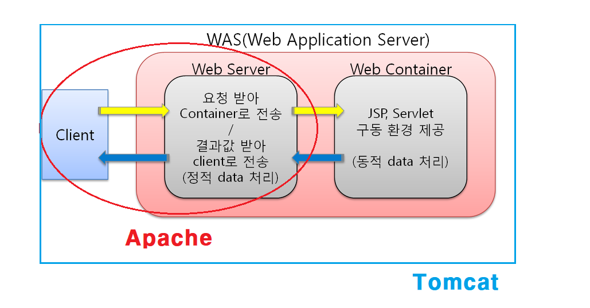

# Java

### 자바 런타임 환경(JRE;Java Runtime Environment)
자바프로그램을 실행할 때 필요한 환경을 제공하는 프로그램이다. JRE에는 JVM, 클래스 라이브러리, 런타임 환경 등이 포함되어 있다. 런타임 환경은 소프트웨어가 실행되는 환경이다. 소프트웨어가 실행될 때 필요한 라이브러리, 런타임 시스템 데이터, 메모리 등이 모두 포함된 환경이다.

### 자바 개발자 도구(JDK;Java Development Kit)
자바 프로그램을 개발하기 위해 필요한 모든 도구와 라이브러리가 포함된 패키지이다. JDK에는 Java Compiler, JVM, 클래스 라이브러리, 디버깅 도구 등이 포함되어 있다.

### 자바 가상 머신(JVM;Java Virtual Machine)
자바 프로그램을 실행하기 위한 가상머신이다. JVM은 운영체제나 하드웨어와 상관없이 동일한 실행환경을 제공한다. Java는 JVM에 설치된 컴퓨터에서 실행되며, JVM은 자바 바이트 코드를 해당 운영체제에서 실행가능한 기계어로 변환하여 실행한다.

### 자바 컴파일 과정

① 소스코드를 작성하면 *파일명.java*로 저장  
② *javac 파일명.java*로 컴파일  
③ *파일명.class*라는 바이트 코드 파일 생성  
④ *java 파일명.java*로 자바 가상 머신이 바이트 코드 파일 실행

    # 컴파일
    % javac 파일명.java / javac -d \[바이트코드파일저장위치] \[소스경로/\*.java]
    
    # 실행    
    % java 파일명.java / java -cp \[바이트코드파일위치] \[패키지…클래스명]
*자바 클래스 생성도 안되고, 실행도 안될 때 -> 디렉토리 우클릭 -> Mark directory as -> Source root 지정하면 된다.

### 패키지(Package)

자바는 소스 파일 및 컴파일된 바이트코드 파일을 쉽게 관리하기 위해 패키지를 사용한다. 패키지는 파일 시스템에서의 디렉토리와 비슷하다.

## 1. JDK

### 1-1. SDKMAN

    # SDKMAN으로 Gradle 설치
    % curl -s "https://get.sdkman.io" | bash    // SDKMAN 설치
    % echo 'source "$HOME/.sdkman/bin/sdkman-init.sh"' >> ~/.zshrc
    // 터미널 재시작
    
    % sdk version
    % sdk list java                      // 설치 가능 버전 조회 (방향키로 움직여서 선택)
    % sdk install java {설치 버전}      // Java 버전 설치 
    % sdk uninstall java {지우려는 버전}    // Java 버전 지우기 
    % sdk use java {사용하려는 버전}        // Java 버전 변경  
    % sdk current                       // 현재 사용 버전 확인
    % sdk default java {사용하려는 버전}    // Java 디폴터 버전 설정

    % echo $JAVA_HOME                   // 터미널 재시작하면 환경 변수 설정되어 있음

    # SDKMAN 지우기
    % rm -rf ~/.sdkman

### 1-2. for Ubuntu
    % sudo apt-get install openjdk-11-jdk
    % java -verison
    % javac -version

    # 환경변수 설정
    % sudo vi ~/.bashrc
    % export JAVA_HOME=$(readlink -f /usr/bin/java | sed "s:bin/java::")
    % source ~/.bashrc
    % echo $JAVA_HOME

    % update-alternatives --list java           // 설치된 자바 버전 확인
    % sudo update-alternatives --config java
    % sudo update-alternatives --config javac

    % sudo apt-get purge poenjdk*               // 자바 삭제

### 1-3. for macOS
    # sdkman 설치 (자바 뿐만아니라 프로그래밍 언어 버전관리를 도와줌)
    % curl -s "https://get.sdkman.io" | bash
    % source "$HOME/.sdkman/bin/sdkman-init.sh"
    % sdk version                               // 설치 확인
    % sdk list java                             // 설치할 수 있는 자바 목록 보기
    % sdk install java 11.0.19-amzn             // 리스트로 확인한 것 중 다운받을 버전 넣기
    % sdk use java 11.0.19-amzn                 // 사용하기
    % sdk current java                          // 현재 사용 버전 확인
    % echo $JAVA_HOME                           // 환경변수 자동 설정 확인

    # JDK 설치
    %  open ~/.zshrc

    # 환경변수 추가
    % export JAVA_HOME=/Library/Java/JavaVirtualMachines/zulu-17.jdk/Contents/Home.
    % export PATH=${PATH}:$JAVA_HOME/bin.

## 2. 의존성 관리 및 빌드 도구
빌드 도구(Build Tool)란 소프트웨어 개발에 있어서 소스 코드를 실행 가능한 애플리케이션으로 만들어 주는 도구이다. 빌드 과정을 자동화하여 관리하는 기능을 하기 때문에 빌드 관리 도구(Build Management Tool) 또는 빌드 자동화 도구(Build Automation Tool)로 불린다.

빌드 도구의 특징은 개발자가 스크립트를 작성하여 다양한 작업을 수행할 수 있게 한다는 것이다. 예를 들어 소스 코드를 컴파일하거나 패키징할 수 있으며, 테스트를 자동으로 수행하거나 의존성 주입 및 배포 작업을 할 수 있다. 또 빌드 도구 종류에 따라 스크립트 작성 시 사용하는 문법이 다를 수 있는데 일반적으로 XML이나 특정 도메인 언어(ex. Groovy)를 사용한다.

### 2-1. Gradle
Gradle은 Maven의 XML을 사용하여 프로젝트가 커지는 경우 장황한 설정과 파일 에러가 쉽게 나는 문제를 해결하기 위해 등장한 Groovy 기반의 오픈소스 빌드 자동화 도구이다. Groovy는 JVM에서 실행되는 스크립트 언어로 문법이 Java와 비슷하고 호환된다. Java 클래스 파일을 그대로 Groovy 클래스로 사용할 수 있다. build.gradle 파일을 사용해서 라이브러리를 지정할 수 있다.

#### Installation 

    % sudo apt install gradle       // Gradle 설치
    % gradle --version              // 설치 확인

    % sdk install gradle {버전}      // SDK로 Gradle 설치

#### Gradle 시작하기

    # Gradle 프로젝트 생성
    IntelliJ [File] - [New] - [Project...] - Build system:[Gradle] - [Create]
    
    # Gradle 스크립트 작성
    build.gradle 파일에 Groovy나 Kotlin 문법으로 스크립트 작성

#### Gradle Structure
       project  
        ├── gradle  
        │   └── wrapper  
        │       ├── gradle-wrapper.jar          // Wrapper 파일이다. 실행 스크립트가 동작하면 wrapper에 맞는 환경을 로컬 캐시에 다운로드 받은 뒤 실제 명령에 해당하는 task를 실행한다.
        │       └── gradle-wrapper.properties   // Gradle Wrapper 설정 파일  
        ├── gradlew                             // Unix에서 wrapper 실행 스크립트
        └── gradlew.bat                         // Wrapper를 빌드할 때 실행할 배치 스크립트

#### Gradle Wrapper
CI 환경에 종속되지 않고, 자동으로 프로젝트를 빌드하고 실행할 수 있게 해준다.

    % gradlew build [task]      // 로컬에 설치된 gradle과 java를 기준으로 빌드
    % ./gradlew [task]          // build.gradle 파일에 정의한 내용을 기준으로 빌드

#### Gradle task
Gradle의 task는 Gradle 프로젝트의 작업 단위이다. task는 다른 task가 먼저 선행되는 것과 같은 의존성을 가지기도하며, 실행 시 콘솔상에서 gradle {task명}으로 실행하면 된다.

이러한 task는 groovy 언어로 작성되며 Gradle 내부에 미리 만들어져 있는 내장 task들과 build.gradle 파일에 사용자가 정의한 사용자 정의 task가 있다.

    % ./gradlew tasks -all  // gradle task 확인 
######
    task {task명} {
        // taks 정의
    }

    % ./gradlew {taks명}     // task 실행

#### build.gradle
    # 자바를 컴파일하기 위해 java plugin을 설정한다.
    apply plugin: 'java'            

    # application으로 컴파일하기 위해 설정한다.
    apply plugin: 'application'     

    # 저장소를 입력하는 섹션이다. 주로 Maven의 저장소를 그대로 사용한다.
    repositories {
        mavenCentral()
      }

    # 종속성을 입력하는 섹션이다. 기존에는 compile이 있었으나 3.0버전부터 deprecated 되었다.
    dependencies {     
        //'group:name:version' 순으로 적는다. group: 'junit', name: 'junit', version: '4.12'식으로도 가능하다.
        api 'com.google.guava:guava:22.0'   //간접 의존, 직접 의존하는 모든 모듈을 rebuild 한다
        implementation 'junit:junit:4.12'   //직접 의존하는 모듈만 rebuild 한다.
    }

    # 메인 class의 위치와 이름을 적는다.
    application {
        mainClass = 'package.name.AppClass' 
    }

### 2-2. Ant
자바 프로젝트 빌드 도구로 가장 널리 되었다. 이클립스에 기본적으로 탑재되어 있으며, XML 스크립트를 기반으로 되어있다. 최근에 나온 빌드 도구들과 달리 자동으로 라이브러리를 업데이트하는 기능이 없기 때문에 현재는 주로 레거시 시스템에서만 사용되고 있다.

### 2-3. Maven
메이븐은 ANT 이후에 나온 자바 빌드 도구로 자동으로 라이브러리와 의존성을 관리하는 기능이 있다. Ant와 마찬가지로 XML 스크립트를 기반으로 하며, pom.xml 파일로 의존성을 관리한다. Maven에서는 라이프 사이클 개념이 도입되어 빌드 순서 등을 정의할 수 있다.

### 2-4. JAR(Java ARchive)
Java 패키징 JAR는 Java 애플리케이션을 배포하고 실행하기 위한 표준 아카이브 파일 형식이다. JAR 파일은 여러 Java 클래스 파일, 리소스 및 메타데이터를 하나의 압축된 파일로 묶어서 제공한다.
- 압축된 형식: ZIP 형식으로 압축되어 있어, 효율적인 파일 전송과 저장 가능하다.
- 클래스 파일 포함: Java 클래스 파일을 포함하며, 이는 Java 가상 머신(JVM)에서 실행되는 bytecode로 변환된 Java 소스 코드이다.
- 리소스 및 설정 파일 포함: 클래스 파일 외에도 애플리케이션에서 사용하는 리소스 파일, 설정 파일, 이미지 등을 포함할 수 있다.
- 메타데이터 및 매니페스트 파일: JAR 파일에는 MAINFEST.MF라는 메타 데이터 파일이 포함된다. 매니페스트 파일은 JAR 파일에 대한 정보와 실행에 필요한 설정을 기술한다.
- 실행 가능한 JAR 파일: 실행 가능한 JAR 파일은 매니페스트 파일에 Main-Class 속성이 설정되어 있어, 명령줄에서 'java -jar'명령어로 직접 실행할 수 있다.

JAR 파일은 Java 개발 및 배포에서 표준적으로 사용되며, 다양한 라이브러리, 프레임워크, 도구 등이 JAR 파일 형식으로 제공된다.

 
 

## 3. Java Project Start with SDKMAN

### 3-1. Gradle로 시작하기

    % gradle init --type java-application
        Select build script DSL : Kotlin / Groovy

 
 

## 4. Web Server

### 4-1. Apache(Web server) port : 80
Apache 소프트웨어 재단의 오픈소스 웹 서버이다. 클라이언트 요청을 받아 응답하는 정적 웹 페이지 구성 시 사용된다. 

### 4-2. Tomcat(WAS) port : 8080
동적인 페이지를 만들기 위한 웹 컨테이너이다. 서블릿 컨테이너라고 불리며, 웹서버에서 정적으로 처리해야할 데이터를 제외한 JSP, ASP, PHP 등은 웹 컨테이너로 전달된다. (WAS; Web Application Server)

Tomcat이 Apache의 기능 일부를 가져와서 제공해주는 형태이기 때문에 Apache Tomcat이라고 같이 부른다. 

#### Installation
다운 받고 압축 풀고 홈 디렉토리로 옮기면 끝  
Mac home 디렉토리 이동 방법: 파일열고 [command + shifht + H]

    %  cd ~/톰켓디렉토리경로/bin
    % ./startup.sh 
    % ./sutdown.sh
