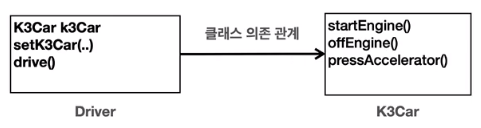
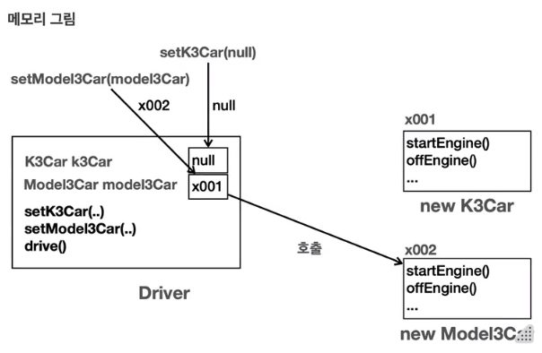
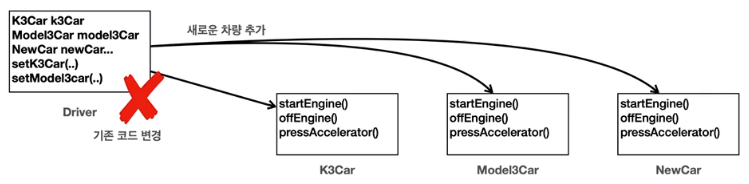
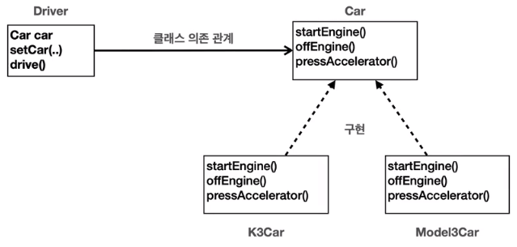
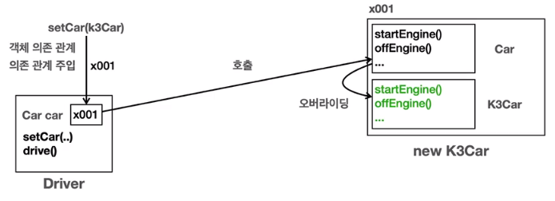
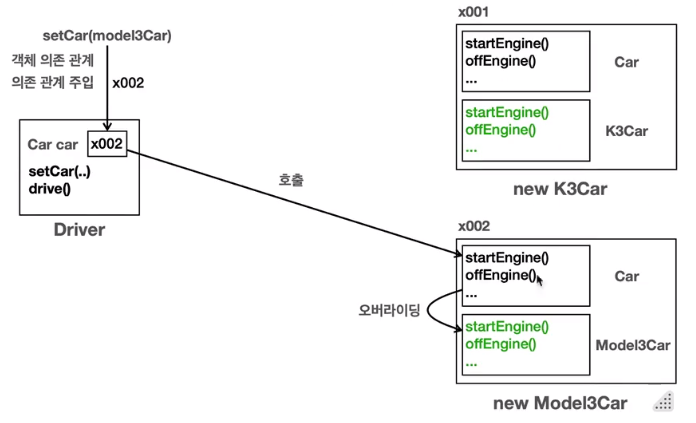
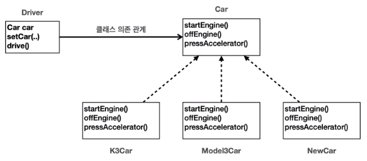

# JAVA BASIC
- psvm: public static void main(String args) 단축어
- sout: System.out.println 단축어
- iter: 향상된 for문 단축어

#### for Win/Linux
- Shift + F6 : 아래 같은 변수명 같이 선택
- Ctrl + Shift + 10F : 실행
- Ctrl + Alt + V: introduce variable 로 변수 이름 자동 추천
- Ctrl + Alt + M: introduce extract method 로 블록 영역 메소드로 추출
- F2 : Next Highlighted Error
- Ctrl + W: 커서가 있는 단어 블록 지정
- Ctrl + O: 상속 받은 자식 클래스에서 누르면 간편한 오버라이딩 생성
#### 인터페이스 상속시 
- Alt + Enter: 구현해야할 메소드 자동으로 오버라이딩 가져와준다.

#### for mac
- cmd + N - Generator: 기본 생성자 자동 생성 
- ctrl + 위 화살표: 커서가 있는 단어 블록 지정 
- option + cmd + V: introduce variable
- option + cmd + M: introduce extract Method 

## 1. 클래스와 데이터

### 1-1. 클래스가 필요한 이유
- 코드의 변경이 있을 때 유지보수하기 용이하다.
- 사람이 이해하고 관리하기 편리하다.

### 1-2. 클래스 도입
- 클래스: 사용자 정의 자료형을 만드는 설계도 이다.
- 인스턴스: 설계도인 클래스에 의해 만들어져서 실제 메모리에 로드된 실체이다.
- 클래스명은 첫글자가 대문자인 카멜표기법을 사용한다.
- 변수는 소문자로 시작하는 카멜표기법을 사용한다.
####
- 객체를 사용하려면 먼저 설계도인 클래스를 기반으로 인스턴스를 생성해야한다.
- 인스턴스는 생성자를 사용해서 메모리에 실제 객체를 생성한 것이다.  
  (생성 시 이 객체를 사용할 때 필요한 메모리 공간도 함께 확보한다.)
- 객체를 생성하면 자바는 메모리 어딘가에 있는 이 객체에 접근할 수 있는 참조값(주소)를 반환한다.
#### 
    Student student1 = new Student();   // 1. Student 객체 생성
    Student student1 = x001;            // 2. new Student의 결과로 x001 참조값 반환
    student1 = x001;                    // 3. 최종 결과

    // 여기선 임의로 x001이라고 표현했는데 System.out.println(student1); 을 실행하면 @뒤에가 참조 값이다.

### 1-3. 객체 사용
- 객체이름 뒤에 dot(.)을 붙여서 접근한다.
- student1.name은 student1 인스턴스의 name 필드에 접근한다.

### 1-4. 클래스, 객체, 인스턴스 정리
- 객체: 객체는 클래스에서 정의한 속성과 기능을 가진 실체이다. 객체는 서로 독립적인 상태를 가진다.
- 인스턴스: 인스턴스는 특정 클래스로부터 생성된 객체를 의미한다. 인스턴스는 주로 객체가 어떤 클래스에 속해있는지 강조할 때 사용한다.
- 객체 vs 인스턴스: 둘다 클래스에서 나온 실체라는 의미에서 비슷하게 사용되지만, 용어상 인스턴스는 객체보다 좀 더 관계에 초점을 맞춘 단어이다.

### 1-5. 배열 도입 - 시작
- 클래스 배열을 사용하면 특정 타입을 연속한 데이터 구조로 묶어서 편리하게 관리할 수 있다.
- Student 타입을 보관할 수 있는 Students 배열을 만들면 배열은 Student 타입의 참조값을 보관하는 배열로 생성된다.   
  (배열에는 아직 참조값을 대입하지 않았기 때문에 참조값이 없다는 의미의 null 값으로 초기화 된다.)
- **대원칙: 자바는 항상 변수의 값을 복사해서 대입한다!**
- **!변수에는 인스턴스 자체가 들어 있는 것이 아니라 인스턴스의 위치를 가르키는 참조 값이 들어있을 뿐이다!**
- 따라서 인스턴스가 복사되는 것이 아니라 인스턴스에 접근할 수 있는 참조값만 복사된다. (인스턴스가 아니라 접근하는 방법이 늘어나는 것)
- 이런경우 반복문을 향상된 for문을 사용해서 최적화하면 좋다. (iter 입력하면 자동 생성)

### 1-6. 배열 도입 - 리펙토링
- iter를 치면 향상된 for문을 사용할 수 있음 (forEach)

### 1-7. 문제와 풀이

 

## 2. 기본형과 참조형

### 2-1. 기본형 vs 참조형1 -시작
- 변수의 데이터 타입을 가장 크게 두가지로 나누면 기본형과 참조형으로 나눌 수 있다.
  - 기본형(Primitive Type): int, long, double, boolean 처럼 변수에 사용할 값을 직접 넣을 수 있는 타입
  - 참조형(Reference Type): 객체, 배열 처럼 데이터에 접근하기 위한 참조(주소)값을 넣는 타입  
    (객체는 .을 이용해서 요소에 접근하고, 배열은 [ ]를 이용해서 소요에 접근한다.)
- 기본형은 들어있는 값을 그대로 계산에 사용할 수 있고, 참조형은 들어 있는 참조값 그대로 사용할 수 없다.  
  (참조값에서 안의 기본형 멤버에 접근해서 계산해야 한다.)

### 2-2. 기본형 vs 참조형2 -변수 대입
- **대원칙: 자바는 항상 변수의 값을 복사해서 대입한다!**
- 기본형, 참조형 모두 항상 각각의 변수에 있는 실제값, 참조값을 복사해서 대입한다.
####
    // 기본형
    int a = 10;
    int b = a;    // a에 있는 10을 복사해서 b에 대입

    // 참조형
    Student s1 = new Student();
    Student s2 = s1;  // s1이 가지고 있는 인스턴스의 주소를 복사해서 s2에 대입
                      // 인스턴스가 복사되는 것이 아니라 주소만 복사하는 것이다.

### 2-3. 기본형 vs 참조형3 -메서드 호출
- **대원칙: 자바는 항상 변수의 값을 복사해서 대입한다!**
- (call by value) 메서드 호출도 마찬가지이다. 메서드를 호출할 때 사용하는 매개변수(파라미터)도 결국 변수일 뿐이다.    
  따라서 메서드를 호출할 때 매개변수에 값을 전달하는 것도 앞서 설명한 내용과 같이 값을 복사해서 전달한다.    
- call by value 가 call by reference 와 다른 점은 매개 변수에 다른 값을 대입하는 경우 드러난다.  
  call by value로 주소 값을 복사 받은 경우 매개 변수에 다른 값을 대입하고 변화를 준 경우 외부 객체는 변하지 않는다.  
  만약 call by reference 였다면 외부 객체도 같이 변한다.

### 2-4. 참조형과 메서드 호출 -활용
- 아래 코드의 중복을 메서드를 통해 손쉽게 제거할 수 있다.
####
    Student student1;
        
    student1 = new Student();
    student1.name = "학생1";
    student1.age = 15;
    student1.grade = 90;

    Student student2 = new Student();
    student2.name = "학생2";
    student2.age = 16;
    student2.grade = 80;

    System.out.println("이름:" + student1.name + " 나이:" + student1.age + " 성적:" + student1.grade);
    System.out.println("이름:" + student2.name + " 나이:" + student2.age + " 성적:" + student2.grade);

- 메서드로 손쉽게 제거
####
    public static void main(String[] args) {
        Student student1 = creatStudent("학생1", 15, 90);
        Student student2 = creatStudent("학생2", 16, 80);

        printStudent(student1);
        printStudent(student2);
    }

    static Student creatStudent(String name, int age, int grade) {
        Student student = new Student();
        student.name = name;
        student.age = age;
        student.grade = grade;
        return student;
    }

    static void printStudent(Student student) {
        System.out.println("이름:" + student.name + " 나이:" + student.age + " 성적:" + student.grade);
    }
- 메서드 안에서 객체를 생성한 경우 객체를 메서드 밖에서 사용할 수 있게 return 해줘야 한다.

### 2-5. 변수와 초기화
#### 변수의 종류
- 멤버 변수(필드): 클래스에 선언
- 지역 변수: 메서드에 선언, (매개 변수도 지역변수의 한 종류이다.)

#### 변수의 값 초기화
- 멤버 변수: 자동 초기화
  - 인스턴스의 멤버 변수는 인스턴스를 생성할 때 자동으로 초기화 된다.
  - 숫자(int)=0, boolean=false, 참조형=null (**null 값은 참조할 대상이 없다는 의미이다.**)
  - 개발자가 초기값을 직접 지정할 수 있다.
- 지역 변수: 수동 초기화
  - 지역 변수는 학상 직접 초기화 해야 한다.

### 2-6. null
- **null 값은 참조할 대상이 없다는 의미이다.**
- 기본형 변수는 null 값을 할당할 수 없다.
- 참조형 변수에는 항상 객체가 있는 위치를 가리키는 참조값이 들어간다.  
  그런데 아직 가리키는 대상이 없거나 가리키는 대상을 나중에 입력하고 싶을 때 null을 넣어 둔다.
- GC(가비지 컬렉션): 인스턴스를 아무도 참조하기 않게되면 해당 인스턴스에 다시 접근할 방법이 없다.  
  이렇게 아무도 참조하지 않는 인스턴스는 사용되지 않고 메모리 용량만 차지할 뿐이다.  
  자바는 이런 인스턴스를 JVM이 가비지 컬렉션을 사용해서 자동으로 메모리에서 제거한다.

### 2-7. NullPointerException
- 참조(주소)값이 없는 참조형 변수를 point(.)로 사용하려고 할 때 발생한다.
- 지역 변수의 경우에는 null 문제를 파악하는 것이 어렵지 않다.  
  그러나 멤버 변수가 null 인 경우에는 주의가 필요하다.
- 참조형 변수가 null을 가리키는 것이 문제니까 인스턴스를 할당해서 참조값을 넣어주면 해결된다.

### 2-8. 문제와 풀이

 

## 3. 객체 지향 프로그래밍

### 3-1. 절차 지향 프로그래밍1 - 시작
#### 절차 지향 프로그래밍
- 실행 순서를 중요하게 생각하는 방식
- 흐름을 순차적으로 따르며 처리하는 방식이다. 
- 즉, "어떻게"를 중심으로 프로그래밍 한다.

#### 객체 지향 프로그래밍
- 객체를 중요하게 생각하는 방식이다.
- 실제 세계의 사물이나 사건을 객체로 보고, 이러한 객체들 간의 상호작용을 중심으로 프로그래밍하는 방식이다.
- 즉, "무엇을" 중심으로 프로그래밍 한다.

#### 둘의 차이점
- 절차 지향은 데이터와 해당 데이터에 대한 처리 방식이 분리되어 있다.
- 반면 객체 지향은 데이터와 그 데이터에 대한 행동(메서드)이 하나의 '객체'안에 함께 포함되어 있다.

### 3-2. 절차 지향 프로그래밍2 - 데이터 묶음
- class로 데이터를 묶어 두어 이후에 프로그램 로직이 더 복잡해져서 다양한 변수들이 추가되더라도  
  음악 플레이어와 관련된 변수들은 MusicPlayerData data객체에 속해있으므로 쉽게 구분할 수 있다.

### 3-3. 절차 지향 프로그래밍3 - 메서드 추출
- 각각의 기능들은 재사용될 가능성이 높은 경우 메서드로 추출해서 모듈화하면  
  불필요한 코드의 반복을 줄일 수 있다.  
  또한 메서드 이름의 추가로 코드를 더 쉽게 이해하기 쉽다.

- 지금까지 클래스를 사용해서 관련된 데이터를 하나로 묶고,  
  또 메서드를 사용해서 각각의 기능을 모듈화 했다.  
  덕분에 상당히 깔끔하고 읽기 좋고, 유지보수 하기 좋은 코드를 작성할 수 있었다.

- 그러나 우리가 작성한 코드의 한계는 데이터와 기능이 분리되어 있다는 점이다.  
  데이터와 그 데이터를 사용하는 기능은 매우 밀접한 관련이 있다.  
  데이터를 수정하는 순간 기능도 같이 수정되어야하고 반대인 경우도 많다.  
  관리포인트가 2개로 늘어나서 유지보수 관점에서 좋지않은 코드이다.

### 3-4. 클래스와 메서드

### 3-5. 객체 지향 프로그래밍

- 객체 지향 프로그래밍을 위해서는 프그로램의 실행 순서보다는  
  객체가 어떤 속성을 가지고 어떤 기능을 제공 하는지에 초점을 맞춰야 한다.
  
- 이를 위해 음악 플레이어를 만들어서 제공하는 개발자와  
  음악 플레이어를 사용하는 개발자가 분리되어 있다고 생각하면 좋다.

#### 캡슐화
- MusicPlayer4를 보면 음악 플레이어를 구성하기 위한 속성과 기능이 마치 하나의 캡슐에 쌓여 있는 것 같다.  
  이렇게 속성과 기능을 하나로 묶어서 필요한 기능을 메서드를 통해 외부에 제공하는 것을 캡슐화 라고 한다.
- 사용하는 측에서는 캡슐 내부의 코드를 모르더라도 인터페이스만 알면 사용할 수 있다.
- 또 캡슐 내부의 변경이 있다고 하더라도 외부에서 가져다 사용하는 인터페이스가 같으면 사용하는측의 코드는 수정할 필요 없다.

### 3-6. 문제와 풀이

 

## 4. 생성자

### 4-1. 생성자 -필요한 이유
- 객체를 생성하는 시점에 어떤 작업을 하고싶다면 생성자(Construct)를 이용하면 된다.

### 4-2. this
- 종북되는 변수명이 있을 경우 스코프 기준 자신과 가까운 것이 먼저 잡힌다.
- 만약 메소드 안에서 인스턴스 멤버 변수를 선택하고 싶은데 메소드 안의 지역 변수와 같다면  
  this.라는 키워드를 적어서 인스턴스의 멤버 변수임을 알려줘야 한다.
- this는 자기 자신의 인스턴스의 참조를 뜻한다. 

#### this의 생략 (지역 변수랑 멤버 변수랑 다르면 가능)
- this는 생략할 수 있다. 이 경우 변수를 찾을 때 가까운 지역 변수를 먼저 찾고,  
  없으면 그 다음으로 멤버 변수를 찾는다. 멤버 변수도 없으면 오류가 발생한다.
####
    public class MemberThis {
      String nameField;
      
          void initMember(String nameParameter) {
              nameField = nameParameter;
          }
    }

#### this와 코딩 스타일
- 멤버변수에 접근하는 경우에 항상 this를 사용하는 코딩 스타일도 있다.
- 이러면 멤버 변수를 사용할 때 명확히 알 수 있다. (과거에는 많이 썻지만 최근에는 IDE가 발전해서 안씀)

### 4-3. 생성자 -도입
- 프로그래밍을 하다보면 객체를 생성하고 이후에 바로 초기값을 할당해야하는 경우가 많다.  
  그래서 대부분 객체 지향 언어는 객체를 생성하자마자 즉시 필요한 기능을 좀 더 편리하게 수행할 수 있도록 생성자 기능을 제공한다.
- 앞에 static, void 이런 거 붙이지 말고 클래스 이름과 완전 같은 메서드를 선언하면 그게 생성자가 된다.

#### 생성자의 장점
- 중복 호출 제거: 생성자가 없던 시절에는 생성자 직후에 어떤 작업을 수행하기 위해 메서드를 한번 더 호출해야 했다.
- 제약-생성자 호출 필수: 인스턴스를 생성하고 멤버 변수에 값을 할당하지 않는 유령 인스턴스가 존재할 가능성이 줄어든다.

### 4-4. 기본 생성자
- 매개 변수가 없는 생성자를 기본 생성자라고 한다.
- 클래스에 생성자가 하나도 없으면 자바 컴파일러는 매개 변수가 없고, 작동하는 코드가 업는 기본 생성자를 자동으로 만들어준다.
- 생성자가 하나라도 있으면 자바는 기본 생성자를 만들지 않는다.
#### 정리
- 생성자는 반드시 호출되어야 한다.
- 생성자가 없으면 기본 생성자가 제공된다.
- 생성자가 하나라도 있으면 기본 생성자가 제공되지 않는다. 이 경우 개발자가 정의한 생성자를 직접 호출해야 한다.

### 4-5. 생성자 - 오버로딩과 this()
- 생성자도 메서드 오버로딩처럼 매개변수만 다르게 해서 여러 생성자를 제공할 수 있다.
- 생성자 내에서 this()는 자신의 또 다른 생성자를 호출한다. (매개변수 맞는 생성자 호출)
#### 생성자 오버로딩 시 this()로 중복 코드 줄이기!
    public class MemberConstruct {
            String name;
            int age;
            int grade;
    
            // 추가
            MemberConstruct(String name, int age) {
                this(name, age, 50);    // 변경
            }
    
            MemberConstruct(String name, int age, int grade){
                System.out.println("생성자 호출 name=" + name + ", age=" + age + ", grade="+ grade);
                this.name = name;
                this.age = age;
                this.grade = grade;
            }
    }
#### this() 규칙
- this()는 생성자 코드 안에서 첫 줄에만 작성할 수 있다.

### 4-6. 문제와 풀이

 

## 5. 패키지

### 5-1. 패키지 -시작
- 프로그램의 기능들이 추가되어 커지게 된다면 많은 클래스들이 생기게 된다.
- 매우 많은 클래스가 등장하면서 관련 있는 기능들을 분류해서 관리하고 싶을 것이다.
- 구분하기 쉽게 파일 시스템의 개념을 적용해 분류한 것이 패키지 이다.

### 5-2. 패키지 -import
- 다른 패키지에 있는 클래스를 가져와서 사용할 때 풀네임을 적는 것이 불편할 때 사용
- import 로 패키지를 추가하면 풀네임을 적지 않아도 사용할 수 있다.
- import pack.a.* 을 사용하면 a에 있는 패키지를 다 가져온다.
- 그러나 a아래 있는 a.c와 같은 패키지는 가져오지 않는다.

#### 클래스 이름 중복
- 패키지 덕분에 클래스 이름이 같아도 패키지 이름으로 구분해서 같은 이름의 클래스를 사용할 수 있다.
- pack.a.User 와 pack.b.User 둘 다 사용하고 싶으면 어떻게할까?  
  어쩔 수 없이 둘 중 하나는 풀네임으로 써야함
######
        User userA = new User();                // 다른 위치(import)
        pack.b.User userB = new pack.b.User();  // 다른위치(풀네임)

### 5-3. 패키지 규칙
- 패키지의 이름과 위치는 폴더(디렉토리) 위치와 같아야 한다. (필수)
- 패키지 이름은 모두 소문자를 사용한다. (관례)
- 패키지 이름의 앞 부분에는 일반적으로 회사의 도메인 이름을 거꾸로 사용한다. (관례)  
  예를 들어 com.company.myapp 과같이 사용

#### 패키지의 계층 구조
- a.b a.c 처럼 a아래 b와 c가 있는 계층 구조를 이루더라도 모든 패키지는 서로 완전 다른 패키지이다.
- a에서 a.b를 사용하고 싶다면 import 해야한다.

### 5-4. 패키지 활용
- 패키지를 구성할 때 서로 관련된 클래스는 하나의 패키지에 모으고,  
  관련이 적은 클래스는 다른 패키지로 분리하는 것이 좋다. 

 

## 6. 접근 제어자(access modifier)

### 6-1. 접근 제어자 이해1
- 접근 제어자를 사용하면 해당 클래스 외부에서 특정 필드나 메서드에 접근하는 것을 허용하거나 제한할 수 있다.

#### 접근 제어자가 필요한 이유
- 개발자가 인터페이스 내부에서 제약사항을 두었더라도 외부에서 직접 접근해버리면 제약사항이 유명무실해질 수 있다.

### 6-2. 접근 제어자 이해2
- 외부에서 직접 접근해서 내부 제약사항을 무시해버리는 것을 막기 위해서는 외부 접근을 제한하면 된다.

#### private 
- private 접근 제어자는 모든 외부 호출을 막는다. 따라서 내부 호출만 가능하다. 
- 좋은 프로그램은 무한한 자유도가 있는 프로그램이 아니라 적젏한 제약이 있는 프로그램이다. 

### 6-3. 접근 제어자 종류
- private: 모든 외부 호출 금지
- default: 같은 패키지 내부 허용  
- protected: 패키지 + 상속 관계 허용 
- public: 모든 외부 호출 허용 

#### package-private
- 접근 제어자를 명시하지 않으면 같은 패키지 안에서 허용을 호출하는 default 접근 제어자가 적용된다.
- default라는 용어는 해당 접근 제어자가 기본값으로 사용되기 때문에 붙여진 이름이지만,
  실제로는 pacakge-pricate이 더 정확한 표현이다. 

#### 접근 제어자 사용 위치
- 접근 제어자는 필드와 메서드, 생성자에 사용된다. 
- 클래스 레벨에도 일부 접근 제어자를 사용할 수 있다.
- 지역 변수 안에서는 접근 제어자가 의미가 없다.

#### 접근 제어자의 핵심은 속성과 기능을 외부로부터 숨기는 것이다. 
- private 은 나의 클래스 안으로 속성과 기능을 숨길 때 사용한다.
- default 는 나의 패키지 안으로 속성과 기능을 숨길 때 사용한다.
- protected 는 상속 관계로 속성과 기능을 숨실 때 사용한다.
- public 은 기능을 숨기지 않고 어디서든 호출할 수 공개한다.

### 6-4. 접근 제어자 사용 -필드, 메서드
- 위에서 정의한 것과 같다.

### 6-5. 접근 제어자 사용 -클래스 레벨
- 클래스 레벨의 접근 제어자는 public, default만 사용할 수 있다.
- public 클래스는 반드시 파일명과 클래스명이 같아야 한다. 
  - 하나의 자바 파일에 public 클래스는 하나만 만들 수 있다.
  - 하나의 자바 파일에 default 클래스는 여러개 만들 수 있다.

### 6-6. 캡슐화(Encapsulation)
- 캡슐화는 데이터와 해당 데이터를 처리하는 메서드를 하나로 묶어서 외부에서 접근을 제한하는 것을 말한다.
- 캡슐화를 통해 데이터의 직접적인 변경을 방지하거나 제한할 수 있다.
- 캡슐화는 쉽게 이야기해서 속성과 기능을 하나로 묶고, 외부에서 꼭 필요한 기능만 노출하고 나머지는 모두 내부로 숨기는 것이다.

#### 데이터를 숨겨라 (속성)
- 캡슐화에서 가장 필수로 숨겨야하는 것은 속성이다. 
- 객체 내부의 데이터를 외부에서 접근하게 두면, 클래스 안에서 데이터를 다루는 모든 로직을 무시하고,  
  데이터를 변경할 수 있게된다. 결국 모든 안전망을 다 빠져 나가 캡슐화가 깨진다.
- 객체의 데이터는 객체가 제공하는 기능인 메서드를 통해 접근해야 한다.
- 특별한 이유가 없는 한 속성은 대부분 private 으로 막아 둔다.

#### 기능을 숨겨라 (메서드)
- 객체 기능 중 외부에서 사용하지 않고 내부에서만 사용하는 기능들은 감추는 것이 좋다.

#### 캡슐화 예시 BanckAccount

### 6-7. 문제와 풀이

 

## 7. 자바 메모리 구조와 static
- 메서드 영역: 클래스 정보를 보관한다. 이 클래스 정보가 붕어빵 틀이다.
- 스택 영역: 실제 프로그램이 실행되는 영역이다. 메서드를 실행할 때마다 하나씩 쌓인다.
- 힙 영역: 객체(인스턴스)가 생성되는 영역이다. new 명령어를 사용하면 이 영역을 사용한다.   
  쉽게 이야기해서 붕어빵 틀로 부터 생성된 붕어빵이 존재하는 공간이다. (배열도 이 영역에 생성된다.)

### 7-1. 자바 메모리 구조

#### 메서드 영역 (Method Area)
- 메서드 영역은 프로그램을 실행하는데 필요한 공통 데이터를 관리한다. 
- 이 영역은 프로그램의 모든 영역에서 공유한다.
  - 클래스 정보: 클래스의 실행 코드(바이트 코드), 필드, 메서드와 생성자 코드 등 모든 실행 코드가 존재한다.
  - static 영역: static 변수들을 보관한다.
  - 런타임 상수 풀: 프로그램이 실행하는데 필요한 공통 리터럴 상수를 보관한다.   
    (예를 들어 프로그램에 "hello"라는 리터럴 문자가 있으면 이런 문자를 공통으로 묶어서 관리한다.)

#### 스택 영역 (Stack Area)
- 자바 실행 시, 하나의 실행 스택이 생성 된다. 
- 각 스택 프레임은 지역 변수, 중간 연산 결과, 메서드 호출 정보 등을 포함 한다.
  - 스택 프레임: 스택 영역에 쌓이는 네모 박스가 하나의 스택 프레임이다.
  - 메서드를 호출할 때 마다 하나의 스택 프레임이 쌓이고, 메서드가 종료되면 해당 스택 프레임이 제거 된다.
*스택 영역은 더 정확히는 각 쓰레드별로 하나의 실행 스택이 생성된다. 따라서 쓰레드 수 만큼 스택 영역이 생성된다. 

#### 힙 영역 (Heap Area)
- 객체(인스턴스)와 배열이 생성되는 영역이다.
- 가비지 컬렉션이 이뤄어지는 주요 영역이다. 

#### 메서드 코드는 메서드 영역에 

- 자바에서 특정 클래스로 100개의 인스턴스를 생성하면, 힙 메모리에 100개의 인스턴스가 생기고 각각의 인스턴스는 내부에 변수와 메서드를 가진다.
- 같은 클래스로 부터 생성된 객체는 인스턴스 내부의 변수 값은 서로 다를 수 있지만, 메서드는 공통된 코드를 공유한다.
- 따라서 객체가 생성될 때, 인스턴스 변수에는 메모리가 할당되지만, 메서드에 대한 새로운 메모리 할당은 없다. 
- 메서드는 메서드 영역에서 공통으로 관리되고 실행되기 때문이다. 

### 7-2. 스택과 큐 자료 구조

#### 스택 구조 (LIFO)

#### 큐 구조 (FIFO)

### 7-3. 스택 영역
- 자바는 스택 영역을 사용해서 메서드 호출과 지역 변수 (매개변수 포함)를 관리한다.
- 메서드를 계속 호출하면 스택 프레임이 계속 쌓인다.
- 지역 변수(매개변수 포함)는 스택 영역에서 관리한다.
- 스택 프레임이 종료되면 지역 변수도 함께 제거된다.
- 스택 프레임이 모두 제거되면 프로그램도 종료된다.

### 7-4. 스택 영역과 힙 영역
- 스택 영역에서 동작하는 메소드는 힙 영역에 생성된 인스턴스를 참조한다.
- 외부 영역에서 힙 영역 안의 인스턴스를 더이상 참조하지 않을 때 GC가 제거한다.
- **힙 영역 안에서 힙 영역 안을 참조하더라도 외부에서 참조할 방법이 없기 때문에 GC가 제거한다.**
####
- 지역 변수는 스택 영역에서 관리 된다.
- 객체(인스턴스)는 힙 영역에서 관리 된다.
- 정적 변수는 메서드 여역에서 관리 된다.

### 7-5. static 변수1
- static 키워드는 주로 멤버 변수와 메서드에 사용된다.
######
    // 객체가 생성될 때마다 count를 증가시켜 객체가 몇 개 생성되어 있는지 확인

    public class Data1 {
        public String name;
        public int count;
    
        public Data1(String name) {
            this.name = name;
            count++;
        }
    }
######
    public class DataCountMain1 {
        public static void main(String[] args) {
            Data1 data1 = new Data1("A");
            System.out.println("data1 count = " + data1.count);   // Data1 count = 1
    
            Data1 data2 = new Data1("A");
            System.out.println("data2 count = " + data2.count);   // Data1 count = 1
    
            Data1 data3 = new Data1("A");
            System.out.println("data3 count = " + data3.count);   // Data1 count = 1
        }
    }
- 1, 1, 1 이 나오는 이유는 Data1의 멤버 변수인 count는 Heap 영역에 data1, data2, data3 각각 생성 되기 때문이다.
- 객체를 생성할 때마다 Data1 인스턴스는 새로 만들어지고 그 인스턴스에 포함된 count 변수도 새로 만들어지기 때문이다.
- **인스턴에 사용되는 멤버 변수 count 값은 인스턴스 끼리 서로 공유되지 않는다.**
######

######
- 이 문제를 해결하기 위해서는 변수를 서로 공유해야 한다. 
######
    public class Counter {
        public int count;
    }
######
    public class Data2 {
        public String name;
        
            public Data2(String name, Counter counter) {
                this.name = name;
                counter.count++;
            }
    }
######
    public class DataCountMain2 {
        public static void main(String[] args) {
            Counter counter = new Counter();
            Data2 data1 = new Data2("A", counter);
            System.out.println("data1 count = " + counter.count);
    
            Data2 data2 = new Data2("B", counter);
            System.out.println("data2 count = " + counter.count);
    
            Data2 data3 = new Data2("C", counter);
            System.out.println("data3 count = " + counter.count);
        }
    }
######

######
- 그런데 이렇게하면 Data2에 대한 속성이 밖에 정의 되어 있어서 불편하다.

### 7-6. static 변수2
- 특정 클래스에서 공용으로 함께 사용할 수 있는 변수를 만들 수 있다면 편리할 것이다.
- static 키워드를 사용하면 공용으로 함께 사용하는 변수를 만들 수 있다.
- static 키워드를 붙이면 정적 변수 혹은 클래스 변수라고 한다. 
- 위 문제를 해결하기 위해 count 속성에 static 키워드를 명시해서 메소드 영역에 counter를 두고 공유하면 된다.
######
    public class Data3 {
        public String name;
        public static int count;
    
        public Data3(String name) {
            this.name = name;
            count++;
        }
    }
######
    public class DataCountMain3 {
        public static void main(String[] args) {
            Data3 data1 = new Data3("A");
            System.out.println("Data3 count = " + data1.count);
    
            Data3 data2 = new Data3("B");
            System.out.println("Data3 count = " + data2.count);
    
            Data3 data3 = new Data3("C");
            System.out.println("Data3 count = " + data3.count);
        }
    }
- static 키워드가 붙은 변수는 힙 영역에서 관리하는 것이 아니라 메서드 영역에서 관리한다.
- 쉽게 말해, 붕어빵에서 관리하는 변수가 아니라 붕어빵 틀에서 관리하는 변수이다.  
  붕어빵 틀은 1개 이므로 클래스 변수도 하나만 존재한다. 
- 클래스 안에서 공용으로 쓴다고 생각하면 편하다. 그래서 클래스 변수라고도 한다. 

### 7-7. static 변수3
#### 멤버 변수(필드)
- 인스턴스 변수: static이 붙지 않은 멤버 변수, 인스턴스를 생성해야 사용 가능하다.
- 클래스 변수: static이 붙은 멤버 변수, 인스턴스와 무관하게 클래스에 바로 접근해서 사용 가능하다.

#### 변수와 생명주기
- 지역 변수(스택 영역): 메소드 호출과 함께 생성되고 메서드가 종료되면 지역 변수도 함께 제거된다.  
- 인스턴스 변수(힙 영역): 생성자에 의해 성성되고 스택 영역에서 더이상 참조하는 메서드가 없을 때 GC에 의해 제거된다.
- 클래스 변수(메서드 영역): JVM에 로딩 되는 순간 생성되고 JVM이 종료될 때 제거된다. 

#### 정적 변수 접근 법 
- static 변수는 클래스를 통해 바로 접근할 수도 있고, 인스턴스를 통해서도 접근할 수 있다.
- 그러나 인스턴스를 통한 접근은 권장되지 않는다. (인스턴스 변수인지 클래스 변수인지 헷갈려서)
######
    // 인스턴스를 통한 접근
    Data3 data4 = new Data3("D");
    System.out.println(data4.count);

    // 클래스를 통한 접근
    System.out.println(Data3.count);

### 7-8. static 메서드1
- 멤버 변수도 없고 대입 받은 인자로 기능만 제공하는 경우 인스턴스를 생성하는데 의미가 없다.
######
    public class DecoUtil1 {
    
        public String deco(String str) {
            return "*" + str + "*";
        }
    }
######
    public class DecoMain1 {
    
        public static void main(String[] args) {
            String s = "hello java";
            DecoUtil1 utils = new DecoUtil1();
            String deco = utils.deco(s);
    
            System.out.println("before: " + s);
            System.out.println("after: " + deco);
        }
    }
- 이렇게 인스턴스 생성이 큰 의미가 없는 경우 static 메서드로 사용한다.
- 인스턴스를 생성하지 않고 클래스를 통해 바로 접근이 가능하다.
######
    public class DecoUtil2 {
    
        public static String deco(String str) {
            return "*" + str + "*";
        }
    }
######
    public class DecoMain2 {
    
        public static void main(String[] args) {
            String s = "hello java";
            String deco = DecoUtil2.deco(s);
    
            System.out.println("before: " + s);
            System.out.println("after: " + deco);
        }
    }

### 7-9. static 메서드2
#### 정적 메소드 사용시 주의 사항 
- static 메서드는 static 만 사용할 수 있다.
  - 클래스 내부의 기능을 사용할 때, 정적 메서드는 static이 붙ㅌ은 정적 메서드나 정적 변수만 사용할 수 있다.
  - 클래스 내부의 기능을 사용할 때, 정적 메서드는 인스턴스 변수나, 인스턴스 메서드를 사용할 수 없다.
    (인스턴스 변수나 메서드는 생성이 전제되어야 하는데 static 메서드는 생성 절차가 필요 없기 때문에 생성 전에 참조하는 문제가 발생할 수 있다.)
- 반대로 모든 곳에서 static 을 호출할 수 있다.
  - 정적 메서드 역시 정적 변수 처럼 공용으로 사용할 수 있다.
  - 아무리 static 이라고 해도 접근 제한자 영향은 받는다.

***물론 객체의 참조 값을 직접 매개 변수로 전달하면 정적 메서드도 인스턴스의 변수나 메서드를 호출할 수 있다.** 

### 7-10. static 메서드3
#### 멤버 메서드
- 클래스 메서드: 인스턴스 생성 없이 클래스를 통해 바로 호출 가능
- 인스턴스 메서드: 인스턴스를 생성하고 그 인스턴스를 통해 호출 가능

#### 정적 메서드 활용
- 정적 메서드는 객체 생성 없이 메서드의 호출만으로 필요한 기능을 수행할 때 주로 사용한다.  
  (예를 들어 간단한 메서드 하나로 끝나는 유틸성 메서드에 자주 사용한다.)

#### 정적 메서드 접근 법
- static 메서드는 static 변수와 마찬가지로 클래스를 통해 바로 접근할 수 있고 인스턴스를 통해 접근할 수 있다. 
- 역시 인스턴스를 통한 접근은 추천하지 않는다.
######
    // 인스턴스를 통한 접근 
    DecoData data3 = new DecoData();
    data3.staticCall();

    // 클래스를 통한 접근 
    DecoData.staticCall();

#### static import 
- 클래스를 통해 접근하는데 클래스를 쓰는게 번거롭다면 class의 static을 import 해서 사용할 수 있다.
- 정적 메소드와 정적 변수 모두에게 쓸 수 있다.
######
    import static static2.DecoData.staticCall;

    public class DecoDataMain {
    
        public static void main(String[] args) {
            System.out.println("1. 정적 호출");
            staticCall();
    }

#### main() 메서드는 정적 메서드 이다.
- main가 정적 메서드이기 때문에 메소드나 변수를 사용하고자 하면 static으로 사용 했다.
- 더 정확하게는 정작 메서드는 같은 클래스의 내부에서 정적 변수와 정적 메서드만 호출할 수 있다.
- 다른 클래스의 정적 메서드나 정적 변수를 사용하고자 한다면 참조 값을 매개 변수로 입력 받아야 한다.

### 7-11. 문제와 풀이

 

## 8. final
- final 키워드는 class, method 를 포함한 여러 곳에 붙일 수 있다. 
- 변수에 final 키워드가 붙으면 더는 값을 변경할 수 없다.

### 8-1. final 변수와 상수1
- final을 지역 변수에 설정할 경우 최초 한 번만 할당할 수 있다. 이후에 값을 변경하면 컴파일 오류가 발생한다.
- 매개 변수에 final이 붙으면 메서드 내부에서 매개변수의 값을 변경할 수 없다. 따라서 메서드 호출 시점에 사용된 값이 끝까지 사용된다.
####
- 생성자를 사용해서 final 필드를 초기화하는 경우, 각 인스턴스마다 final 필드에 다른 값을 할당할 수 있다.
- final 필드를 필드에서 바로 초기화하는 경우, 모든 인스턴스가 같은 값을 가진다.  
  **모든 인스턴스가 같은 값을 가지는 경우 static 을 사용하는게 메모리 누수와 중복을 방지하는 방법이다.**
- 그래서 static final 키워드를 사용해서 상수를 사용한다. 

### 8-2. final 변수와 상수2
#### 상수 (Constant)
- JAVA에서는 static final 키워드가 붙으면 상수라고 한다. (상수는 관례로 상수명을 모두 대문자로 표시한다.)
- 상수는 변하지 않고, 항상 일정한 값을 갖는 수를 말한다. JAVA에서는 보통 단 하나만 존재하는 변하지 않는 고정된 값을 상수라고 한다.
- 필드에 직접 접근해서 사용한다. (기능이 아니라 고정된 값 자체를 사용하는 것이 목적이기 때문)
- 보통 상수들은 애플리케이션 전반에서 사용되기 때문에 public 키워드를 자주 사용한다.  
  (물론 특정 위치에서만 사용된다면 다른 접근 제어자 사용)
- 상수는 중앙에서 값을 하나로 관리할 수 있다는 장점도 있다. (매직 넘버 문제 해소 가능)
- 상수는 런타임에 변경할 수 없다. 상수를 변경하려면 프로그램을 종료하고, 코드를 변경한 다음 다시 실행해야 한다.
- 실제 애플리케이션을 개발할 때 중앙에서 관리되고, 여러 군데서 같이 쓰는 고정된 값인 경우 상수를 사용하는게 좋다. 

### 8-3. final 변수와 참조
- final 은 변수의 값을 변경하지 못하게 막는다.
- 변수는 크게 기본형 변수와 참조형 변수가 있다. 
  - final 을 기본형 변수에 사용하면 값을 변경할 수 없다.
  - final 을 참조형 변수에 사용하면 참조 값을 변경할 수 없다.
- 참조 값을 변경할 수는 없지만 참조 값이 가리키고 있는 참조 대상의 값은 변경 가능하다.   

 

## 9. 상속

### 9-1. 상속 -시작
- 전기 차와 가솔린 차라는 두 class를 만들 때 전기 차와 가솔린 차를 아우를 수 있는 추상적인 개념이 존재한다.  
- 그리고 그 추상적인 개념의 구체적인 객체인 전기 차와 가솔린 차는 공통의 기능이 존재한다.
- 이런 경우 상속 관계인 부모 클래스를 만드는 것이 효과적이다.

### 9-2. 상속 관계
- 상속은 기존 클래스의 필드와 메서드를 새로운 클래스에서 재사용하게 해준다. 
- 상속을 사용하려면 extends 키워드를 사용하면 된다. **그리고 JAVA 에서 extends 대상은 하나만 선택할 수 있다.**
#### 용어 정리
- 부모 클래스(슈퍼 클래스): 상속을 통해 자신의 필드와 메서드를 다른 클래스에 제공하는 클래스
- 자식 클래스(서브 클래스): 부모 클래스로 부터 필드와 메서드를 상속 받는 클래스
#### 상속 구조도 

- 자식은 내가 상속 받을 대상이 누구인지 알고 있다. 그러나 부모는 누가 상속 받는지 모른다.  
  (그래서 화살표는 자식에서 부모로 뻗어 있다.)
#### 단일 상속 
- JAVA는 다중 상속을 지원하지 않는다. 그래서 extend 대상은 하나만 선택할 수 있다. 
- 부모를 하나만 선택할 수 있다는 뜻이다. 물론 부모가 또 다른 부모를 하나 가지는 것은 괜찮다.
- 다이아몬드 문제와 클래스 계층 구조가 복잡해질 수 있기 때문에 단일 상속을 사용한다. 
- 다이아몬드 문제란? 만약 상속을 여러 군데서 받으면 서로 다른 두 부모에게 같은 메서드가 있는 경우 어떤 메서드를 사용할지 알 수 없는 문제를 말한다.
- 대신 이후에 설명할 인터페이스에서는 다중 구현을 허용해서 이러한 문제를 피한다. 

### 9-3. 상속과 메모리 구조
- 자식 클래스를 생성자로 생성하면, 부모 클래스를 포함해서 인스턴스를 생성한다.  
- 단순히 필드와 메서드만 물려받는 것이 아니라 인스턴스 안에 자식과 부모가 같이 생성된다.
- 참조 값은 하나이지만 실제로 그 안에는 자식 클래스와 부모 클래스 두가지 클래스 정보가 공존하게 된다.
- 외부에서 볼 때는 하나의 인스턴스를 생성하는 것 같지만 내부에서는 부모와 지식이 모두 생성되고 공간도 구분된다.
######
- 이렇게 생성된 인스턴스를 통해서 멤버 메소드를 호출하려고 할 때,  
  인스턴스 내부에서 부모 자식 중 어떤 클래스의 메소드를 호출할지 선택해야 한다.
- 호출하는 변수의 타입(클래스)을 기준으로 선택한다.(자식 타입이면 자식 타입에서 먼저 해당 메소드를 찾는다.)
- 이때 만약 자식 타입에 없으면 부모 타입으로 올라가서 해당 메소드를 찾는다.
- 만약 부모에도 해당 기능이 없으면 더 상위 부모로 올라간다. 계속 올라가도 없으면 컴파일 오류가 발생한다.

#### 핵심
- **상속 관계의 객체를 생성하면 그 내부에는 부모와 자식이 모두 생성된다.**
- **상속 관계의 객체를 호출할 때, 대상 타입을 정해야 한다. 이때 호출자의 타입을 통해 대상 타입을 찾는다.**
- **현재 타입에서 기능을 찾지 못하면 상위 부모 타입으로 기능을 찾아서 실행한다.**
- **기능을 찾지 못하면 컴파일 오류가 발생한다.**

### 9-4. 상속과 기능 추가
- 비슷한 자식 클래스를 편리하게 확장할 수 있다.
- 부모 클래스에 기능을 추가하면 자식 클래스에서 모두 사용할 수 있어 중복이 줄어든다.

### 9-5. 상속과 메서드 오버라이딩
- 메서드 오버라이딩: 부모 클래스에서 상속 받은 기능을 자식 클래스에서 같은 이름으로 재정의 하는 것
- @Override 어노테이션: 상위클래스의 메서드를 오버라이딩 했음을 나타내는 어노테이션  
  ***어노테이션: 프로그램이 읽을 수 있는 특별한 주석**
- 이 어노테이션은 옵션이지만 설정하면 실수를 방지할 수 있다. (오버라이드 제대로 안되면 컴파일 오류 출력)

#### 오버로딩 vs 오버라이딩
- 오버로딩: 메서드 이름이 같고 파라미터가 다른 메서드를 여러개 정의하는 것 (매개 변수가 달라야함)
- 오버라이딩: 하위 클래스에서 상위 클래스의 메서드를 재정의하는 것 (상속 관계에서 사용, 매개 변수가 같아야함) 

#### 메서드 오버라이딩 조건 
- 메서드 이름: 메서드 이름이 같아야 한다.
- 메서드 파라미터: 파라미터 타입, 순서, 개수가 같아야 한다.
- 반환 타입: 반환 타입이 같아야 한다. (단, 반환 타입이 하위 클래스 타입일 수 있다.)
- 접근 제어자: 상위 클래스의 메서드보다 더 제한적이어서는 안된다. (같거나 더 범용적인 제어자)
- 생성자는 오버라이딩 할 수 없다.
- final, private, static: 키워드가 붙은 메서드는 오버라이딩 될 수 없다.
  - final: 메서드에 final을 붙이면 이제 못 고친다는 말이다. 그래서 오버라이딩 안된다.
  - private: private은 같은 클래스 내부에서만 접근이 가능하다. 그래서 자식에서는 접근할 수 없다.
  - static: 오버라이드는 인스턴스 레벨에서 이뤄지는 것이다. static은 클래스 레벨에서 작동하므로 오버라이딩이 의미가 없다.
- 예외: 오버라이딩 메서드는 상위 클래스의 메서드보다 더 많은 체크 예외를 throws 로 선언할 수 없다.  
  하지만 더 적가나 같은 수의 예외, 또는 하위 타입의 예외는 선언할 수 있다.  
  예외를 학습해야 이해할 수 있다.

### 9-6. 상속과 접근 제어

- default: 같은 패키지 내부에서만 호출 허용 
- protected: 패키지가 달라도 상속 관계인 경우 호출 허용
######

- 부모 타입에서 찾을 때 보이는 것과 보이지 않는 것의 기준은 접근 제어자이다.
- 부모와 자식은 같은 인스턴스 내부에서 공간이 나뉘어져 있기 때문에 접근 제어자의 영향을 받는다.

### 9-7. super -부모 참조
- 부모와 자식의 필드명이 같거나 메서드가 오버라이딩 되어 있으면, 자식에서 부모의 필드를 호출할 수 없다.   
  이때 super 키워드를 사용하면 부모를 참조할 수 있다. (super는 부모 클래스에 대한 참조를 나타낸다.)
  - this: 자신의 타입에서 찾는 것 
  - super: 부모 타입에서 찾는 것 
######

- super 가 앞에 있으면 부모 타입으로 올라가서 찾게 된다. 

### 9-8. super -생성자
- **(규칙) 상속 관계를 사용하면 자식 클래스의 생성자에서 부모 클래스의 생성자를 반드시 호출해야 한다.**  
  상속 관계에서 부모의 생성자를 호출할 때는 자식 클래스 생성자의 첫 줄에 super(...)를 사용하면 된다.
- 매개 변수 없는 기본 생성자인 경우 생략이 가능하다.
- 부모 클래스에 기본 생성자가 없는 경우 반드시 생성자에 맞게 super(...)를 직접 입력해야 한다.
######

- 상속 관계의 생성자 호출은 결과적으로 부모에서 자식 순서대로 실행이 된다.  
- 따라서 부모의 데이터를 먼저 초기화하고 그 다음에 자식의 데이터를 초기화 한다.
- 상속 관계에서 자식 클래스의 생서자 첫줄에는 반드시 super(...)를 호출해야 한다.  
  (단, 기본 생성자인 경우 생략할 수 있다.)
- 예외로 생성자 첫줄에 this(...)를 사용할 수 있다. 하지만 super(...)는 자식의 생성자 안에서 언젠가는 반드시 호출해야 한다.  
  this(...)를 이용해서 다른 생성자를 호출하더라도 언젠가는 호출된 자식 생성자에서 super(...)를 호출해야 한다.

### 9-9. 문제와 풀이

 

## 10. 다형성1(Ploymorphism)
- 객체지향 프로그래밍의 대표적인 특징으로는 캡슐화, 상속, 다형성이 있다. 
- 다형성은 다양한 형태 or 여러 형태를 의미한다.
- 프로그래밍에서 다형성은 한 객체가 여러 타입의 객체로 취급될 수 있는 능력을 뜻한다.
- 보통 하나의 객체는 하나의 타입으로 고정되어 있다. 그러나 다형성을 사용하면 하나의 객체가 다른 타입으로 사용될 수 있다.

### 10-1. 다형적 참조
- 부모 타입의 변수가 자식 인스턴스를 참조할 수 있다.  

  - Parent 타입의 변수에 Child 클래스의 생성자로 Child 인스턴스를 만든다.
  - Child 인스턴스는 Parent를 상속 받고 있기 때문에 자신과 부모 인스턴스를 모두 생성한다.
  - 생성된 참조값을 Parent 타입의 변수인 ploy에 저장한다.
######
- **JAVA 에서 부모는 자식을 담을 수 있다.** 
  - 자식 타입의 자식 타입인 자손도 다 담을 수 있다.
  - 이렇게 부모 타입이 자손 타입들을 다양하게 참조할 수 있어서 다형적 참조라고 부른다.
  - 그러나 자식 타입은 부모 타입을 담을 수 없다.
######
- 다형적 참조의 한계   

  - Parent 타입으로 선언된 변수가 Child 인스턴스를 생성하더라도 childMothod는 호출할 수 없다.
  - Parent에는 상속 받은 객체에 대한 어떠한 정보도 없다.
  - 따라서 상속 관계에서 부모 방향으로 찾아 올라갈 순 있지만, 자식 방향으로 찾아 내려갈 순 없다.
  - 이런 경우 캐스팅을 통해 자식 타입 변수로 바꿔야 한다.

### 10-2. 다형성과 캐스팅
- 다운 캐스팅(부모 타입 -> 자식 타입): 부모 타입을 자식 타입으로 캐스팅 하는 것이다.
  - 참고로 캐스팅 한다고 해서 Parent poly 의 타입이 변하는 것은 아니다.  
  해당 참조값을 꺼내고, 꺼낸 참조값이 Child 타입이 되는 것이다.   
  따라서 poly 타입은 Parent 로 기존과 같이 유지된다.   

#### 실행 순서 
    Child child = (Child) poly  // 다운 캐스팅을 통해 부모 타입을 자식 타입으로 변환한 다음에 대입 시도 
    Child child = (Child) x001  // 참조값을 읽은 다음 자식 타입으로 지정 
    Child child = x001          // 최종 결과

- 업 캐스팅(자식 타입 -> 부모 타입)

### 10-3. 캐스팅의 종류

#### 일시적 다운 캐스팅
- 다운 캐스팅 결과를 변수에 담아지 않고 자식 타입의 인스턴스에 접근하는 방법이다.
- 자식 인스턴스의 기능을 호출하는 순간만 잠깐 다운 캐스팅 된다.  
- 괄호를 이용해서 연산자 우선순위를 바꾸기 때문에 가능하다.  
  
######
    ((Child) ploy).childMethod()  // 다운 캐스팅을 통해 부모 타입을 자식 타입으로 변환 후 기능 호출
    ((Child) x001).childMethod()  // 참조 값을 읽은 다음 자식 타입으로 다운 캐스팅 
  - Java 는 변수에 새로운 값을 대입하지 않는 이상 절대로 변수 값이 바뀌지 않는다.
  - 변수에 있는 값을 꺼내와서 작업을 한다. 따라서 기존값은 그대로 유지된다.

#### 업 캐스팅
- 다운 캐스팅과 반대로 현재 타입을 부모 타입으로 변경하는 것이다.
- 업 캐스팅은 생략 할 수 있다. (생략 권장) 그래서 부모는 자식을 담을 수 있다고 표현 하기도 한다.
######
    Child child = new Child();
    Parent parent1 = (Parent) child;    // 업 캐스팅
    Parent parent2 = child;             // 업 캐스팅 생략 가능 (생략 권장)

    parent1.parentMethod();
    parent2.parentMethod();

### 10-4. 다운캐스팅과 주의점
- 업 캐스팅은 문제가 되지 않아서 생략해도 되고, 다운 캐스팅은 문제가 될 수 있기 때문에 명시적으로 표시 해야한다.
- 다운 캐스팅을 잘못하면 심각한 런타임 오류가 발생할 수 있다. 
######

- 원래 Child로 만들었기 때문에 Child와 Parent 인스턴스가 생성되어 가능하다.
######

- 처음에 Parent로 만들었기 때문에 Parent 인스턴스만 생성되어 있어서 불가능하다.

#### 업 캐스팅이 안전하고 다운 캐스팅이 위험한 이유

- 업캐스팅은 문제가 발생하지 않는다. 객체를 생성하면 상위 부모 타입은 모두 함께 생성되기 때문이다.
######

- 반면 다운 캐스팅의 경우 인스턴스에 존재하지 않는 하위 타입으로 캐스팅하는 문제가 발생할 수 있다.    
  객체를 생성하면 부모 타입은 함께 생성되지만 자식 타입은 함께 생성되지 않기 때문이다.
- 따라서 개발자가 이런 문제를 인지하고 사용해야 한다는 의미로 명시적으로 캐스팅을 하도록 하고 있다.

### 10-5. instanceof
- 다형성에서 참조형 변수는 이름 그대로 다양한 자식을 대상으로 참조할 수 있다. 
- 그러나 참조하는 대상이 다양하기 때문에 어떤 인스턴스를 참조하고 있는지 확인하는 방법이 필요하다.
- 이렇게 변수가 참조하는 인스턴스 타입을 확인하고 싶을 때 **instanceof 키워드**를 사용한다.
######
    public static void main(String[] args) {
        Parent parent1 = new Parent();
        System.out.println("parent1 호출");
        call(parent1);

        Parent parent2 = new Child();
        System.out.println("parent2 호출");
        call(parent2);
    }

    // 이 매서드는 인스턴스로 넘어온 parent가 참조하는 타입에 따라 다른 명령을 수행한다.
    private static void call(Parent parent) {
        parent.parentMethod();
        if (parent instanceof Child) {
            System.out.println("Child 인스턴스 맞음");
            ((Child) parent).childMethod();
        }
    }

#### instanceof 키워드
- 같은 타입인 경우 true를 반환한다.
- 다른 타입이더라도 **왼쪽의 인스턴스 타입이 오른쪽에 있는 타입에 자동으로 들어갈 수 있으면 true, 없으면 false를 반환**한다.
######
    new Parent() instanceof Parent
    Parent p = new Parent() // 같은 타입 true

    new Child() instanceof Child
    Child c = new Child()   // 같은 타입 true

    new Child() instanceof Parent (업 캐스팅 가능)
    Parent p = new Child()  // 부모는 자식을 담을 수 있다. true

    new Parent() instnaceof Child (다운 캐스팅 불가)
    Child c = new Parent()  // 자식은 부모를 담을 수 없다. false

#### JAVA 16의 Patttern Matching for instanveof
- JAVA 16 부터는 instanceof를 사용하면서 동시에 변수를 선언할 수 있다.
######
    // Child 인스턴스인 경우 childMethod() 실행
    if (parent instanceof Child child) {    // 이게 참이면 변수 child 생성, 사실상 다운 캐스팅
        System.out.println("Child 인스턴스 맞음");
        (child).childMethod();
    }

### 10-6. 다형성과 메서드 오버라이딩
- 다형성을 이루는 또하나의 중요한 핵심 이론은 메서드 오버 라이딩이다.
- 메서드 오버라이딩에서 반드시 기억할 점은 **오버 라이딩 된 메서드가 항상 우선권을 가진다**는 것이다.
- **멤버 변수는 오버라이딩 되지 않는다.** 
######

    // 부모 변수가 자식 인스턴스 참조 (다형적 참조)
    Parent ploy = new Child();
    System.out.println("Parent -> Child");
    System.out.println("value = " + ploy.value);    >> paren (변수는 오버 라이딩 X)
    ploy.method();                                  >> child.method (메서드는 오버 라이딩 O)
- poly 변수는 Parent 타입이다. 따라서 poly.value, poly.method()를 호출하면 인스턴스의 Parent 타입에서 기능을 찾아서 실행한다.
  - ploy.value: Parent 타입에 있는 value 값을 읽는다.
  - ploy.method(): Parent 타입에 있는 method()를 실행하려고 한다.   
    그러나 하위 타입인 Child.method()가 오버라이딩 되어 있다.  
    **오버 라이딩된 메서드는 항상 우선권을 가진다.** 따라서 Child.method()가 실행된다.
- 오버라이딩 된 메서드는 항상 우선권을 가진다. 오버 라이딩은 부모 타입에서 정의한 기능을 자식 타입에서 재정의하는 것이다. 
- 만약 자식에서도 오버라이딩 하고, 손자에서도 같은 메서드를 오버 라이딩 하면 손자의 오버 라이딩 메서드가 우선권을 가진다.  
  (더 하위 자식의 오버라이딩 된 메서드가 우선권을 가지는 것이다.)

#### 다형성 이론
- 다형적 참조: 하나의 변수 타입으로 다양한 자식 인스턴스를 참조할 수 있는 기능이다.
- 메서드 오버라이딩: 기존 기능을 하위 타입에서 새로운 기능으로 재정의하는 것이다.

 

## 11. 다형성 활용

### 11-1. 다형성 활용1 - 다형성을 사용하지 않고는 중복 제거 불가 
- Dog, Cat, Caw 처럼 비슷한 객체들이 비슷한 기능을 할 때 중복 코드를 줄이려는 시도를 할 수 있다.
- 메서드를 활용해 보고 싶지만 Dog, Cat, Caw 타입이 달라서 입력되는 객체마다 메소드를 따로 만들어야 해서 중복을 줄일 수 없다.
- 배열과 반복문을 활용해 보고 싶지만 역시 타입이 다 달라서 하나의 배열에 담을 수 없다.
- 위 두가지 해법을 사용할 수 없는 이유는 바로 타입이 다르기 때문이다.
- Dog, Cat, Caw 가 모두 같은 타입을 사용할 수 있다면 메서드나 배열을 활용해서 코드의 중복을 제거할 수 있다.
- 다른 타입을 하나의 타입처럼 보이게 할 수 있는게 다형성의 다형적 참조이다.
- 다형성의 핵심은 다형적 참조와 메서드 오버라이딩이다. 이 둘을 활용하면 Dog, Cat, Caw 가 모두 같은 타입을 사용하고, 각자 자신의 메서드를 호출할 수 있다.
###### 
    public static void main(String[] args) {
        Dog dog = new Dog();
        Cat cat = new Cat();
        Caw caw = new Caw();

        // 2. 배열과 for 문을 통한 중복 제거 시도 -> 배열에 들어갈 요소의 타입이 달라서 안된다.
        // Caw[] cawArr = {dog, cat, caw};

        /* 
         * 생성하는 부분은 당연히 필요하니 크게 상관 없지만,
         * Dog, Cat, Caw를 사용해서 출력하는 부분은 객체가 늘어날 수록 중복이 증가한다.
         */
        System.out.println("동물 소리 테스트 시작");
        dog.sound();
        System.out.println("동물 소리 테스트 종료");

        System.out.println("동물 소리 테스트 시작");
        cat.sound();
        System.out.println("동물 소리 테스트 종료");

        // System.out.println("동물 소리 테스트 시작");
        // caw.sound();
        // System.out.println("동물 소리 테스트 종료");
        soundCaw(caw);

    }

    // 1. 메서드로 증복 제거 시도 -> 하지만 caw 는 caw 에만 쓸 수 있고 cat 에는 쓸 수 없어서 의미가 없다. 동물이 추가될 때마다 메소드를 만들 수 없다.
    private static void soundCaw(Caw caw) {
        System.out.println("동물 소리 테스트 시작");
        caw.sound();
        System.out.println("동물 소리 테스트 종료");
    }

    // 문제 해결이 안되는 이유는 타입이 다르기 때문이다.

### 11-2. 다형성 활용2 - 메서드를 이용한 중복 제거

- 다형성을 사용하기 위해 상속 관계를 사용한다.
- 부모 클래스의 메서드는 자식 클래스에서 오버라이딩 한다.
######
    public static void main(String[] args) {
        Dog dog = new Dog();
        Cat cat = new Cat();
        Caw caw = new Caw();

        soundAnimal(dog);
        soundAnimal(cat);
        soundAnimal(caw);
    }

    private static void soundAnimal(Animal animal){
        System.out.println("동물 소리 테스트 시작");
        animal.sound(); // 메서드 오버라이드 때문에 각자의 소리가 나온다.
        System.out.println("동물 소리 테스트 종료");
    }

- **다형적 참조** 덕분에 animal 변수는 자식인 Dog, Cat, Caw의 인스턴스를 참조할 수 있다. (부모는 자식을 담을 수 있다.)
- **메서드 오버라이딩** 덕분에 animal.sound() 를 호출해도 자식의 Dog.sound(), Cat.sound, Caw.sound() 가 호출된다.  
  (오버라이딩 된 메서드가 항상 우선권을 가진다!)
- 다형성 덕분에 이후에 새로운 동물을 추가해도 다음 코드를 그대로 재사용 할 수 있다.  
  (물론 다형성을 사용하기 위해 새로운 동물은 Animal 을 상속 받아야 한다.)

### 11-3. 다형성 활용3 - 배열과 for 문을 사용한 중복 제거
- 역시 새로운 동물이 추가되어도 반복문이나 조금 더 개선에서 사용한 메서드는 코드 변경 없이 유지될 수 있다.
- 반복문이나 메서드가 구체적인 클래스를 참조하는 것이 아니라 Animal 이라는 추상적인 부모를 참조하기 때문이다.
#### 
    public static void main(String[] args) {
        Dog dog = new Dog();
        Cat cat = new Cat();
        Caw caw = new Caw();

        // 배열은 같ㅇ느 타입의 데이터를 나열할 수 있다. 부모는 자식을 담을 수 있으니까 요소로 받을 수 있다.
        Animal[] animalArr = {dog, cat, caw};

        // 변하지 않는 부분
        for (Animal animal : animalArr) {
            System.out.println("동물 소리 테스트 시작");
            animal.sound();
            System.out.println("동물 소리 테스트 종료");
        }
    }

#### 조금 더 개선
    public static void main(String[] args) {
        Animal[] animalArr = {new Dog(), new Cat(), new Caw()};

        for (Animal animal : animalArr) {
            soundAnimal(animal);
        }
    }

    private static void soundAnimal(Animal animal) {
        System.out.println("동물 소리 테스트 시작");
        animal.sound();
        System.out.println("동물 소리 테스트 종료");
    }

- **새로운 기능이 추가되었을 때 변하는 부분을 최소화하는 것이 잘 작성된 코드이다.**
- **이렇게 하기 위해서는 코드에서 변하는 부분과 변하지 않는 부분을 명확하게 구분하는 것이 중요하다.**

#### [남은 문제1] Animal 클래스를 생성할 수 있는 문제
- 추상적인 개념의 부모 클래스가 실제로 존재하는 것은 이상하다. 
- 사실 부모 클래스는 다형성을 위해 필요한 것이지 직접 인스턴스를 생성해서 사용할 일이 없다.  

#### [남은 문제2]  Anamal 클래스를 상속 받는 곳에서 sound() 메서드 오버라이딩을 하지 않을 가능성
- 예를 들어 부모 클래스를 상속 받은 자식 클래스에서 메서드 오버라이딩을 깜빡할 수 있다.
- 이렇게 되면 부모의 기능을 상속 받는다. 따라서 코드상 문제는 없지만 우리가 의도한 결과를 얻을 수 없다.

좋은 프로그램은 제약이 있는 프로그램이다. 추상 클래스와 추상 메서드를 사용하면 이런 문제를 한 번에 해결할 수 있다.

### 11-4. 추상 클래스1
#### 추상 클래스
- 동물(Animal)과 같이 부모 클래스는 제공하지만, 실제 생성되면 안되는 클래스를 추상 클래스라고 한다.  
- 추상 클래스는 이름 그대로 추상적인 개념을 제공하는 클래스이다. 따라서 실체인 인스턴스가 존재하지 않는다.
- 대신에 상속을 목적으로 사용되고, 부모 클래스 역할을 담당한다.
- 추상 클래스는 선언할 때 앞에 추상이라는 의미의 abstract 키워드를 붙여주면 된다.  

      abstract class AbstractAnimal {
        ...
      }
- 추상 클래스는 기존 클래스와 완전히 같다. 다만 new AbstractAnimal() 과 같이 직접 인스턴스를 생성하지 못하는 제약이 추가된 것이다.

#### 추상 메서드
- 부모 클래스를 상속 받는 자식 클래스가 반드시 오버라이딩 해야 하는 메서드를 부모 클래스에 정의한 것을 추상 메서드라고 한다.
- 추상 메서드는 이름 그대로 추상적인 개념을 제공하는 메서드이다. 따라서 실체가 존재하지 않고, 메서드 바디가 없다.  
- 추상 메서드는 선언할 때 메서드 앞에 추상이라는 의미의 abstract 키워드를 붙여주면 된다.

          public abstract void sound();           
- **추상 메서드가 하나라도 있는 클래스는 추상 클래스로 선언해야 한다.**
  - 그렇지 않으면 컴파일 오류가 발생한다.
  - 추상 메서드는 메서드 바디가 없다. 따라서 작동하지 않는 메서드를 가진 불완전한 클래스로 볼 수 있다.
  - 따라서 직접 생성하지 못하도록 추상 클래스로 선언해야 한다.
- **추상 메서드는 상속 받는 자식 클래스가 반드시 오버라이딩 해서 사용해야 한다.**
  - 그렇지 않으면 컴파일 오류가 발생한다.
  - 추상 메서드는 자식 클래스가 반드시 오버라이딩 해야 하기 때문에 메서드 바디 부분이 없다.
  - 메서드 바디 부분을 만들면 컴파일 오류가 발생한다.
  - 오버라이딩 하지 않으면 자식도 추상 클래스가 되어야 한다.
- 추상 메서드는 기존 메서드와 완전히 같다. 다만 메서드 바디가 없고, 자식 클래스가 해당 메서드를 반드시 오버라이딩 해야하는 제약이 추가된 것이다.

#### 정리 
- 추상 클래스는 일반 클래스에서 제약이 추가된 클래스이다. 그 제약 덕분에 실수를 근본적으로 방지할 수 있다.
- 추상 클래스 덕분에 실수로 Animal 인스턴스를 생성할 문제를 근본적으로 방지할 수 있다.
- 추상 메서드 덕분에 새로운 동물의 자식 클래스를 만들 때 실수로 sound() 를 오버라이딩 하지 않을 문제를 근본적으로 방지할 수 있다.

### 11-5. 추상 클래스2
#### 순수 추상 클래스
- 모든 메서드가 추상 메서드인 추상 클래스 
- 모든 메서드가 추상 메서드인 순수 추상 클래스는 코드를 실행할 바디 부분이 전혀 없다.  
  그래서 순수 추상 클래스는 실행 로직을 전혀 가지고 있지 않고 단지 다형성을 위한 부모 타입으로써 껍데기 역할만 제공할 뿐이다.
- 순수 추상 클래스의 특징
  - 인스턴스를 생성할 수 없다. (추상 클래스니까 당연하다.)
  - 상속시 자식은 모든 메서드를 오버라이딩 해야한다. (모든 메서드가 추상 메서드이기 때문이다.)
  - 주로 다형성을 위해 사용된다. (상속 보다 다형성을 위해 사용된다.)
- 이것은 우리가 일반적으로 이야기하는 인터페이스와 같이 느껴진다. 
- 정해진 규격이 있고 규격에 맞춰 개발 해야 한다는 점에서 그렇다.
- 이런 순수 추상 클래스의 개념은 프로그래밍에서 매우 자주 사용된다.
- 자바는 순수 추상 클래스를 더 편리하게 사용할 수 있도록 인터페이스라는 개념을 제공한다.  
  (사실 자바에는 순수 추상 클래스라는 개념이 없다. 인터페이스가 있기 때문이다.)

### 11-6. 인터페이스
- 자바는 순수 추상 클래스를 더 편리하게 사용할 수 있는 인터페이스라는 기능을 제공한다. 
- 인터페이스는 class가 아니라 interface 키워드를 사용하면 된다.
- 인터페이스는 추상 메서드의 public abstract 키워드를 생략할 수 있다.
      
      public interface InterfaceAnimal {
          // public abstract 생략가능 
          void sound();
          void move();
      }
- 인터페이스는 앞서 설명한 순수 추상 클래스와 대부분 같지만 몇가지 편의 기능이 추가된다.
  - 인터페이스의 모든 메서드는 모두 public, abstract 이다.
  - 그래서 메서드에 public abstract를 생략할 수 있다. (생략이 권장된다.)
  - 인터페이스는 다중 구현(다중 상속)을 지원한다. 

#### 인터페이스와 멤버 변수
- 인터페이스는 멤버 변수를 가질 수 있다.  
  (인터페이스는 껍데기만 제공해야하는데 멤버변수를 제공하는게 어색하게 느껴질 수 있다.)
- 인터페이스에서 멤버 변수는 public, static, final 이 모두 포함되었다고 간주된다.  
  (static, final 이 들어가면 상수이다. 상수를 만든다고 생각하면 된다.)
- 즉, **인스턴스는 상수와 추상 메서드를 가질 수 있다.**

#### 인터페이스와 구현 
- 인터페이스는 상속이라고 하지 않고 구현이라고 하며 extends 대신 implements 키워드를 사용한다.
- 클래스의 상속 관계는 UML 에서 실선을 사용하지만, 인터페이스 구현 관계는 점선을 사용한다.  

#### 상속 vs 구현 
- 부모 클래스의 기능을 자식 클래스가 상속 받을 때, 클래스는 상속 받는다고 표현하지만,  
  부모 인터페이스의 기능을 자식이 상속 받을 때는 인터페이스를 구현한다고 한다. 
- 상속은 이름 그대로 부모의 기능을 물려 받는 것이 목적이다.
- 하지만 인터페이스는 모든 메서드가 추상 메서드이다. 따라서 물려박을 수 있는 기능이 없다.
- 오히려 인터페이스에 정의한 모든 메서드를 자식이 오버라이딩 해서 기능을 구현해야한다.  
  그래서 구현이라고 표현한다.
- 인터페이스는 메서드 이름만 있는 설계도이고, 실제 어떻게 작동하는지 하위 클래스에서 모두 구현해야 한다.

#### 순수 추상 메서드 대신 인터페이스를 사용해야하는 이유
- 제약: 미래에 순수 추상 클래스에 실행 가능한 메서드를 끼워 넣어 더는 순수 추상 클래스가 아니게 될 수 있다.
- 다중 구현: 클래스 상속은 부모를 하나만 지정할 수 있지만 **인터페이스는 부모를 여러명 두는 다중 구현이 가능하다.**
- 좋은 프로그램은 제약이 있는 프로그램이다.

#### default 메서드 
- Java8 에서 등장한 default 메서드를 사용하면 인터페이스도 메서드를 구현할 수 있다.   
  하지만 이것은 예외적으로 아주 특별한 경우에만 사용해야 한다.
- Java9 에서 등장한 private 메서드도 마찬가지다. (지금 학습 단계에선 고려하지 않는 것이 좋다.)

### 11-7. 인터페이스 - 다중 구현 
#### Java 가 다중 상속을 지원하지 않는 이유

- 만약 비행기와 자동차를 상속 받아서 하늘을 나는 자동차를 만든다고 가정해보자.
- 만약 그림과 같이 다중 상속을 사용하게 되면 자식 입장에서 move()를 호출할 때,   
  어떤 부모의 move()를 사용해야할지 애매한 문제가 발생하게 된다.
- 이러한 문제를 다이아문드 문제라고 한다. 
- 또한 다중 상속을 사용하면 클래스 계충 구조가 매우 복잡해질 수 있다.
######

- 그러나 인터페이스는 모두 추상 메서드로 이루어져 있기 때문에 다중 구현을 허용한다.
- 자식 클래스에서 어떤 인터페이스의 메서드를 호출할지 고민할 필요가 없다.
- 어차피 자식 클래스에서 오버라이딩해서 구현한 메서드가 호출되기 때문이다.  
  (부모의 메서드에는 기능이 없고 자식의 메서드에만 기능이 있다.)

      public static void main(String[] args) {
          InterfaceA a = new Child();
          a.methodA();
          // a.methodB();     InterfaceA 타입으로 접근했는데 거기엔 methodB 가 없어서 자식이 methodB 를 오버라이딩 했다고 하더라도 찾아갈 수 없다.
          a.methodCommon();
  
          InterfaceB b = new Child();
          b.methodB();
          // b.methodA();     InterfaceB 타입으로 접근했는데 거기엔 methodA 가 없어서 자식이 methodA 를 오버라이딩 했다고 하더라도 찾아갈 수 없다.
          b.methodCommon();

          Child c = new Child();
          c.methodA();        Child 타입으로 접근하면 자기가 가지고 있으니까 methodA, methodB 를 사용하는데 제약이 없다.
          c.methodB();
      }
    

### 11-8. 클래스와 인터페이스 활용 

- 클래스 상속과 인터페이스 구현을 함께 사용할 수 있다.
- extends 와 implements 가 같이 나온 경우 extends 를 먼저 적어줘야 한다.

      public class Duck extends AbstractAnimal implements Fly, Swim{
          @Override
          public void sound() {
              System.out.println("꼬기오");
          }
    
          @Override
          public void fly() {
              System.out.println("비행");
          }

          @Override
          public void swin() {
              System.out.pirntln("수영")
          }
        }

 

## 12. 다형성과 설계

### 12-1. 좋은 객체 지향 프로그래밍이란?
#### 객체 지향 특징 
- 추상화, 캡슐화, 상속, 다형성 중 다형성이 가장 중요하다.
- 객체 지향 프로그래밍은 컴퓨터 프로그램을 명령어의 목록으로 보는 시각에서 벗어나 여러개의 독립된 단위,  
  즉 "객체"들의 모임으로 파악하고자 하는 것이다. 각각의 객체는 메시지를 주고 받고, 데이터를 처리할 수 있다.
- 객체 지향 프로그래밍은 프로그램을 유연하고 변경이 용이하게 만들기 때문에 대규모 소프트웨어 개발에 많이 사용된다.
  - 유연하고, 변경이 용이하다는 말의 의미는?
  - 레고 블럭 조립하듯이, 컴퓨터 부품 갈아 끼우듯이
  - 컴포넌트를 쉽고 유연하게 변경하면서 개발할 수 있는 방법
- 프로그램 언어에서 궁극의 유연함과 궁극의 변경이 용이 하도록 설계 하는 방법은 다형성을 활용하는 것이다.

#### 다형성의 실세계 비유
- 실제 세계와 객체 지향 세계는 1:1로 매칭되지 않는다. (그러나 실제 세계의 비유로 이해하기에는 좋다.)
- 실제 세계를 역할과 구현으로 구분한다. 역할은 인터페이스이고 구현은 그 인터페이스를 구현한 실제 객체이다.  
  
  - 자동차를 역할과 구현으로 구분한 이유는 운전자를 위해서이다.
  - 운전자 역할 입장에서 구현된 자동차가 바뀌더라도 운전자의 역할은 바뀌지 않기 때문이다.  
    (자동차가 바뀌어도 운전자에게 영향이 없음 -> 다른 대상으로 변경 가능)
  - 자동차의 기본 역할만 알고 있으면 운전자의 역할에 전혀 영향을 주지 않고 무수히 많은 자동차로 확장될 수 있다.  

  
  - 배우의 역할은 교체 될 수 있다. 대체 가능성은 유연하고 변경이 용이하다.

#### 역할과 구현을 분리
1. 역할과 구현으로 구분하면 세상이 단순해지고, 유연해지며 변경도 편리해진다.
   - 클라이언트는 대상의 역할(인터페이스)만 알면 된다.
   - 클라이언트는 구현 대상의 내부 구조를 몰라도 된다.
   - 클라이언트는 구현 대상의 내부 구조가 변경되어도 영향을 받지 않는다.
   - 클라이언트는 구현 대상 자체를 변경해도 영향을 받지 않는다.

2. 자바 언어의 다형성 활용
   - 역할 = 인터페이스
   - 구현 = 인터페이스를 구현한 클래스, 구현 객체
   - 객체를 설계할 때 **역할**과 **구현**을 명확히 분리한다.
   - 객체 설계시 역할(인터페이스)을 먼저 부여하고, 그 역할을 수행하는 구현 객체 만든다.

3. 객체의 협력이라는 관계부터 생각 
   - 혼자 있는 객체는 없다.
   - 객체 클라이언트: 요청, 객체 서버: 응답
   - 수 많은 객체 클라이언트와 객체 서버는 서로 협력 관계를 가진다.
   

4. 자바 언어의 다형성 
   - 오버라이딩은 자바 기본 문법이고 오버라이딩 된 메서드가 우선권을 가져서 실행된다.
   - 다형성으로 인터페이스를 구현한 객체를 실행 시점에 유연하게 변경할 수 있다. 
   - 물론 클래스 상속 관계도 다형성, 오버라이딩 적용 가능하다.
   
   

5. 다형성의 본질
   - 인터페이스를 구현한 객체 인스턴스를 실행 시점에 유연하게 변경할 수 있다.
   - 다형성의 본질을 이해하려면 협력이라는 객체 사이의 관계에서 시작해야한다.
   - **클라이언트를 변경하지 않고, 서버의 구현 기능을 유연하게 변경할 수 있다.**  
     (운전자를 전혀 변경하지 않고 자동차를 바꿔 탈 수 있는 것과 같다.)
   - 실제 세계의 역할과 구현이라는 편리한 컨셉을 다형성을 통해 객체 세상으로 가져올 수 있다.
   - 다형성을 활용하면 유연하고, 변경이 용이하고, 확장 가능한 설계를 할 수 있게 된다.
   - 클라이언트에 영향을 주지 않는 변경이 가능하다.

6. 역할과 구현 분리의 한계 
   - 역할(인터페이스) 자체가 변하면, 클라이언트, 서버 모두에 큰 변경이 발생한다. 
   - 그래서 인터페이스를 안정적으로 잘 설계하는 것이 중요하다.

#### 정리 
- 다형성이 가장 중요하다.
- 디자인 패턴 대부분은 다형성을 활용하는 것이다.
- 스프링의 핵심인 제어의 역전(IoC), 의존관계 주입(DI)도 결국 다형성을 활용한 것이다.
- 다형성을 잘 활용하면 마치 레고 블럭 조립하듯이! 공연 무대의 배우를 선택하듯이! 구현을 편리하게 할 수 있다.

### 12-2. 다형성 -역할과 구현 예제1

- Driver 는 처음에 k3Car 라는 자동차를 알고 있을 뿐이지 갖고 있지 않다.  
  (멤버 변수에 null 값만 할당 되어 있음)
- setK3Car 메소드로 호출하면서 실제 인스턴스가 k3Car 멤버 변수에 할당된다.  

### 12-3. 다형성 -역할과 구현 예제2

- Driver 는 k3 도 알고 있고 model3 도 알고 있다.  
  
  * model3Car는 x002
- 문제는 새로운 차량을 추가하면 또 다시 Driver 코드를 많이 변경해야 한다.  
  차량의 종류가 늘어나면 점점 더 번경해야 하는 코드가 많아질 것이다.
  

### 12-4. 다형성 -역할과 구현 예제3

- 다형성을 활용하면 역할과 구현을 분리해서, 클라이언트 코드의 변경 없이 구현 객체를 변경할 수 있다.
* 의존 관계: 내가 뭘 알고 있으면 의존한다. (해당 클래스의 정보를 가지고 있으면 의존한다.)
- Driver 는 k3, model3 를 모르고 그냥 자동차라는 역할만 인지한다.

### 12-5. OCP(Open-Closed Principle) 원칙
- 좋은 객체 지향 설계 원칙 중 하나로 OCP 원칙이라는 것이 있다.
  - Open for Extension: 새로운 기능의 추가나 변경 사항이 생겼을 때, 기존 코드는 확장할 수 있어야 한다.
  - Closed for modification: 기존 코드는 수정되지 않아야 한다.
- 확장에는 열려있고, 변경에는 닫혀있다는 뜻이다.
- 쉽게 이야기해서 기존의 코드 수정 없이 새로운 기능을 추가할 수 있다는 의미이다.
######

- 확장에 열려 있다는 의미
  - Car 인터페이스를 사용해서 새로운 차량을 자유롭게 추가할 수 있다.
  - Car 인터페이스를 구현해서 기능을 추가할 수 있다.
  - Car 인터페이스를 사용하는 클라이언트 코드인 Driver 도 Car 인터페이스를 통해 새롭게 추가된 차량을 자유롭게 호출할 수 있다.
- 코드 수정은 닫혀 있다는 의미
  - 새로운 차를 추가하게 되면 기능이 추가되기 때문에 기존 코드의 수정은 불가피하다.
  - 당연히 어딘가의 코드는 수정해야 한다.
    - 변하지 않는 부분 
      - 새로운 자동차를 추가할 때 가장 영향을 받는 클라이언트는 바로 Car 의 기능을 사용하는 Driver 이다.
      - 핵심은 Car 인터페이스를 사용하는 클라이언트인 Driver 의 코드를 수정하지 않아도 된다는 뜻이다.
    - 변하는 부분 
      - main() 과 같이 새로운 차를 생성하고 Driver 에게 필요한 차를 전달해주는 역할은 수정이 발생한다.
      - main() 은 전체 프로그램을 설정하고 조율하는 역할을 한다. 이 부분은 OCP 를 지켜도 변경이 필요하다.

#### 정리 
- Car 를 사용하는 클라이언트 코드인 Driver 코드의 변경 없이 새로운 자동차를 확장할 수 있다.
- 다형성을 활용하고 역할과 구현을 잘 분리한 덕분에 새로운 자동차를 추가해도 대부분의 핵심 코드들은 그대로 유지할 수 있게 되었다.

#### 전략 패턴 (Strategy Pattern)
- 디자인 패턴 중에 가장 중요한 패턴을 하나 꼽으라고 하면 전략 패턴을 뽑을 수 있다.
- 전략 패턴은 알고리즘을 클라이언트 코드의 변경 없이 쉽게 교체할 수 있다.
- 방금 설명한 코드가 바로 전략 패턴을 사용한 코드이다.
- Car 인터페이스가 바로 전략을 정의하는 인터페이스가 되고, 각각의 차량이 전략의 구체적인 구현이 된다.
- 그리고 전략을 클라이언트 코드(Driver)의 변경 없이 손쉽게 교체할 수 있다.

### 12-6. 문제와 풀이

 

## 13. 다음으로

### 13-1. 하고 싶은 이야기
#### 객체 지향 개념의 이해
- 사실 객체 지향 개념을 이해하는게 쉬운 것은 아님
- 실무에 있는 개발자들도 제대로 이해하지 못하는 분들이 상당히 많음
- 이번 강의가 80% 이상 이해가 된다면 프로그래머로 적성이 확실히 있음
- 이해가 어려운 분은 한 번 정도 복습하는 것을 추천
- 물론 실무를 하려면 앞으로 공부할 내용이 많으니 꾸준한 노력이 뒷받침 되어야 함

### 13-2. 실무 개발자가 되는 학습 방향
#### 프로그래밍 언어를 배우는 3단계
- 기본 문법 및 개념 이해 (입문편)
  - 기본 문법, 변수, 타입, 조건문, 반복문, 함수 사용법 등
- 고급 개념과 해당 언어의 라이브러리 활용 (기본편, 중급편, 고급편)
  - 객체지향 개념
  - 고급 문법, 자바의 주요 라이브러리
- 프레임워크 및 생태계 탐색 -> 백엔드 개발자 로드맵
  - 스프링 프레임워크를 포함한 다양한 오픈 소스 학습
  - 실제 프로젝트나 업무에서의 적용에 중점
  - 개발 상태계 내에서의 베스트 프렉티스
  - 어떤 프레임워크를 사용하고, 어떤 라이브러리를 조합해서 사용하는 것이 좋은지 등등 
  - 어떤 스타일로 코딩하는게 좋은지 등등

#### 스프링
- 백엔드 웹 애플리케이션은 대부분 스프링을 사용
- 객체 지향 개념을 편리하게 사용하도록 도와주는 도구 +알파
- 자바가 이렇게 잘 되는 이유는 80% 정도는 스프링 덕분
- 수 많은 베스트 프렉티스가 스프링에 포함되어 있음, 사실 알파가 엄청 큼
  - 수 많은 공통 기능을 이미 만들어 둠
  - 수 많은 오픈 소스 라이브러리를 중앙에서 통합해서 관리
  - 좋은 베스트 프렉티스 제공
- 스프링 학습 전에 준비할 것, 
  - 자바 로드맵 -> 데이터베이스 로드맵 -> 스프링 로드맵

#### 취업이 급한 상황이라면?
- 자바 예외 처리, 자바 컬렉션 (중급편)
- 데이터베이스는 스프링 로드맵 진행 도중에 데이터베이스 관련된 부분이 있을 때 학습 