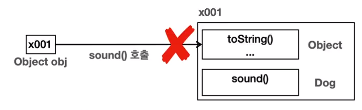
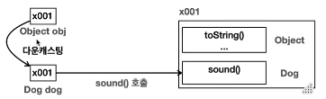
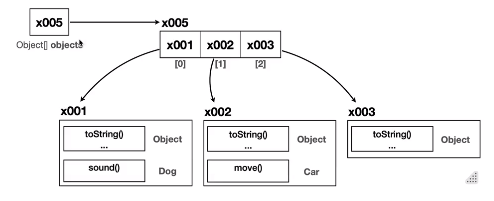

# JAVA MIDDLE 1

#### 단축어
- soutm: 클래스명을 출력하는 코드

#### Java 버전 선택 
- 애플 실리콘칩의 경우 java 버전 뒤에 aarch4 가 붙어 있는 버전을 선택하면 된다.

#### 다운로드 받은 소스코드 사용법 
> [File] - [New] - [Project from Existing Source...] - 프로젝트 루트 디렉토리 선택

## 1. Object 클래스
### 1-1. java-lang(Language) 패키지 소개
- 자바가 기본으로 제공하는 라이브러리(클래스 모음) 중에 가장 기본이 되는 패키지
- 쉽게 말해 자바 언어를 이루는 가장 기본이 되는 클래스들을 보관하는 패키지 
- java.lang 패키지는 모든 자바 애플리케이션에서 자동으로 임포트 되기 때문에 생략 가능하다.

#### java.lang 패키지의 대표적인 클래스들 
- Object: 모든 자바 객체의 부모 클래스
- String: 문자열 
- Integer, Long, Double: 래퍼 타입, 기본형 데이터 타입을 객체로 만드는 것  
- Class: 클래스 메타 정보 
- System: 시스템과 관련된 기보 기능들을 제공 

### 1-2. Object 클래스 
- 클래스를 만들 때 부모 클래스를 지정하지 않으면 묵시적으로 Object 클래스를 상속 받는다.
- **toString()** 메서드는 Object 클래스의 메서드이다.  
  클래스.toString() 을 입력하면 객체에 대한 정보를 출력해준다.

#### 자바에서 Object 클래스가 최상위 부모 클래스인 이유
1. 공통 기능 제공
   - 모든 객체에 필요한 기본적인 기능들을 객체를 만들 때마다 항상 새로 메서드를 만들어 정의하는 번거로움을 줄여준다.
   - 또한 막상 만든다고 해도 개발자마다 서로 다른 이름의 메서드를 만들어서 일관성이 없을 것이다. 
   
   **Object가 제공하는 기능은 다음과 같다.**
    - toString(): 객체의 정보 제공
    - equals(): 객체가 같은지 비교 
    - getClass(): 객체의 클래스 정보를 제공 
    - 기타 여러가지 기능 

2. 다형성의 기본 구현
   - 부모는 자식을 담을 수 있다. Object 는 모든 클래스의 부모 클래스이다. 따라서 모든 객체를 참조할 수 있다.
   - Object 클래스는 다형성을 지원하는 기본적인 매커니즘을 제공한다.
   - 모든 자바 객체는 Object 타입으로 처리될 수 있으며 이는 다양한 타입의 객체를 통합적으로 처리할 수 있게 해준다.
   - 쉽게 말해 Object 는 모든 객체를 다 담을 수 있다. 타입이 다른 객체들을 같이 보관해야할 때 Object 에 보관하면 된다.

### 1-3. Object 다형성 
- Object 는 모든 클래스의 부모 클래스이다. 따라서 Object 는 모든 객체를 참조할 수 있다.
######
    public class ObjectPolyExample1 {
   
        public static void main(String[] args) {
            Dog dog = new Dog();
            Car car = new Car();
    
            action(dog);
            action(car);
        }
    
        private static void action(Object obj) {
            // obj.sound();     // 컴파일 오류, Object 는  sound() 가 없다.
            // obj.move();      // 컴파일 오류, Object 는 move() 가 없다.
    
            // 객체에 맞는 다운 캐스팅이 필요
            if (obj instanceof Dog dog) {   // 이렇게 하면 자동으로 다운 캐스팅이 된다.
                dog.sound();
            } else if (obj instanceof Car car) {
                car.move();
            }
        } 
    }
- Object 는 모든 타입의 부모이다. 부모는 자식을 담을 수 있으므로 위 코드를 아래와 같이 변경할 수 있다.
######
    Object dog = new Dog();   // Dob -> Object
    Object car = new Car();   // Car -> Object

- Object 다형성의 장점: Object 는 모든 객체의 부모이기 때문에 어떤 객체든지 인자로 전달할 수 있다. 
- Object 다형성의 한계: Object 인자로 받은 후 함수에서 자식이 새로 정의한 메소드를 호출하면 컴파일 오류가 발생한다. 

- 따라서 Object를 통해 전달받은 객체를 호출하려면 다운 캐스팅을 해야한다. 

### 1-4. Object 배열
- Object 는 모든 타입의 객체를 담을 수 있기 때문에 Object[ ] 는  모든 객체를 담을 수 있는 배열이다.

       public static void main(String[] args) {
           Dog dog = new Dog();
           Car car = new Car();
           Object object = new Object();   // Object 인스턴스도 만들 수 있다.
   
           Object[] objects = {dog, car, object};
   
           size(objects);
       }

       private static void size(Object[] objects) {
           System.out.println("전달된 객체의 수는: " + objects.length);
       }
- size() 메서드는 메서드 배열에 담긴 객체의 수를 세는 역할을 한다.
- 이 메서드는 Object 타입만 사용한다. Object 타입의 배열은 세상의 모든 객체를 담을 수 있기 때문에  
  새로운 클래스가 추가되거나 변경되더라도 이 메서드를 수정하지 않아도 된다.  
  size() 는 자바를 사용하는 곳이라면 어디서든지 다 사용할 수 있다.

#### Object 가 없다면?
- void action(Object obj) 와 같이 모든 객체를 받을 수 있는 메서드를 만들 수 없다.
- Object[ ] objects 처럼 모든 객체를 젖아할 수 있는 배열을 만들 수 없다.

### 1-5. toString()
- Object.toSting() 메서드는 객체의 정보를 문자열 형태로 제공한다. 그래서 디버깅과 로깅에 유용하게 사용된다.
- 이 메서드는 Object 클래스에 정의되므로 모든 클래스에서 상속받아 사용할 수 있다.

      public static void main(String[] args) {
          Object object = new Object();
          String string = object.toString();
    
          // toString() 반환값 출력
          System.out.println(string);     // java.lang.Object@8efb846
    
          // object 직접 출력
          System.out.println(object);     // java.lang.Object@8efb846
      }

- Object 가 제공하는 toString() 메서드는 기본적으로 패키지를 포함한 객체의 이름과 객체의 참조값(해시코드)을 16진수로 제공한다.

#### println() 과 toString() 
- 그런데 toString() 의 결과를 출력한 코드와 object 를 println() 에 직저 출력한 코드의 결과가 완전히 같다.
- System.out.println() 메서드는 사실 내부에서 toString() 을 호출한다.

### 1-6. Object 와 OCP

### 1-7. equals() - 1. 동일성과 동등성 

### 1-8. equals() - 2. 구현

### 1-9. 문제와 풀이

### 1-10. 정리 

 

## 2. 불변 객체
### 2-1. 기본형과 참조형의 공유

### 2-2. 공유 참조와 사이드 이펙트

### 2-3. 불변 객체 - 도입

### 2-4. 불변 객체 - 예제 

### 2-5. 불변 객체 - 값 변경 

### 2-6. 문제와 풀이

### 2-7. 정리

 

## 3. String 클래스
### 3-1. String 클래스 -기본

### 3-2. String 클래스 - 비교

### 3-3. String 클래스 - 불변 객체

### 3-4. String 클래스 - 주요 메서드1

### 3-5. String 클래스 - 주요 메서드 2

### 3-6. String 클래스 - 가변 String 

### 3-7. String 최적화

### 3-8. 메서드 체인닝 - Method Chaining 

### 3-9. 문제와 풀이 1

### 3-10. 문제와 풀이 2

### 3-11. 정리 

 

## 4. Wrapper Class
### 4-1. 래퍼 클래스 - 기본형의 한계1

### 4-2. 래퍼 클래스 - 기본형의 한계2

### 4-3. 래퍼 클래스 - 자바 래퍼 클래스 

### 4-4. 래퍼 클래스 - 오토 박싱

### 4-5. 주요 메서드와 성능 

### 4-6. Class 클래스 

### 4-7. System 클래스 

### 4-8. Math, Random 클래스

### 4-9. 문제와 풀이1

### 4-10. 문제와 풀이2

### 4-11. 정리 

 

## 5. 열거형 - ENUM
### 5-1. 문자열과 타입 안정성1

### 5-2. 문자열과 타입 안정성2

### 5-3. 타입 안전 열거형 패턴 

### 5-4. 열거형 - Enum Type

### 5-5. 열거형 - 주요 메서드 

### 5-6. 열거형 - 리팩토링1

### 5-7. 열거형 - 리팩토링2

### 5-8. 열거형 - 리팩토링3

### 5-9. 문제와 풀이1

### 5-10. 문제와 풀이2

### 5-11. 정리 

 

## 6. 날짜와 시간
### 6-1. 날짜와 시간 라이브러리가 필요한 이유

### 6-2. 자바 날짜와 시간 라이브러리 소개

### 6-3. 기본 날짜와 시간 - LocalDateTime

### 6-4. 타임존 - ZonedDateTime

### 6-5. 기계 중심의 시간 - Instant

### 6-6. 기간, 시간의 간격 - Duration, Period

### 6-7. 날짜와 시간의 핵심 인터페이스

### 6-8. 날짜와 시간 조회하고 조작하기1

### 6-9. 날짜와 시간 조회하고 조작하기2

### 6-10. 날짜와 시간 문자열 파싱과 포맷팅

### 6-11. 문제와 풀이1

### 6-12. 문제와 풀이2

### 6-13. 정리 

 

## 7. 중첩 클래스, 내부 클래스 1
### 7-1. 중첩 클래스, 내부 클래스란?

### 7-2. 정적 중첩 클래스 

### 7-3. 정적 중첩 클래스의 활용 

### 7-4. 내부 클래스

### 7-5. 내부 클래스의 활용 

### 7-6. 같은 이름의 바깥 변수 접근 

 

## 8. 중첩 클래스, 내부 클래스 2
### 8-1. 지역 클래스 - 시작

### 8-2. 지역 클래스 - 지역 변수 캡처1

### 8-3. 지역 클래스 - 지역 변수 캡처2

### 8-4. 지역 클래스 - 지역 변수 캡처3

### 8-5. 익명 클래스 - 시작 

### 8-6. 익명 클래스 활용1

### 8-7. 익명 클래스 활용2

### 8-8. 익명 클래스 활용3

### 8-9. 문제와 풀이1

### 8-10. 문제와 풀이2

### 8-11. 정리 

 

## 9. 예외 처리 1 - 이론
### 9-1. 예외 처리가 필요한 이유1 - 시작

### 9-2. 예외 처리가 필요한 이유2 - 오류 상황 만들기

### 9-3. 예외 처리가 필요한 이유3 - 반환 값으로 예외 처리

### 9-4. 자바 예외 처리1 - 예외 계층 

### 9-5. 자바 예외 처리2 - 예외 기본 규칙 

### 9-6. 자바 예외 처리3 - 체크 예외

### 9-7. 자바 예외 처리4 - 언체크 예외

 

## 10. 예외 처리 2 - 실습 
### 10-1. 예외 처리 도입1 - 시작

### 10-2. 예외 처리 도입2 - 예외 복구 

### 10-3. 예외 처리 도입3 - 정상, 예외 흐름 분리 

### 10-4. 예외 처리 도입4 - 리소스 반환 문제 

### 10-5. 예외 처리 도입5 - finally

### 10-6. 예외 계층1 - 시작

### 10-7. 예외 계층2 - 활용 

### 10-8. 실무 예외 처리 방안1 - 설명 

### 10-9. 실무 예외 처리 방안2 - 구현 

### 10-10. try-with-resources

### 10-11. 정리 

 

## 다음으로