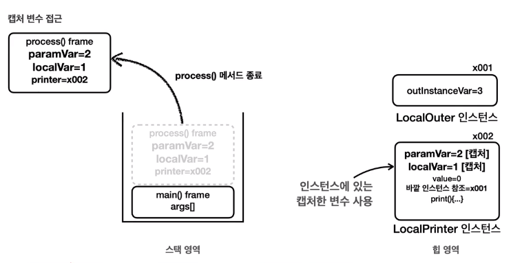

# JAVA MIDDLE 1

#### 단축어
- soutm: 클래스명을 출력하는 코드 자동완성
- soutv: 변수명을 출력하는 코드 자동완성
- {출력할코드}.soutv: 출력할 코드 뒤에 . 찍고 soutv 입력하면 해당 코드를 sout 이 감싸는 코드 자동완성

#### 단축키 for linux
- Ctrl + p: 메소드에 전달할 수 있는 파라미터를 보여준다.
- Alt + Insert: 제너레이트(생성자, toString ...)
- Ctrl + d: 현재줄 아래줄에 복사
- Shift + F6: 소스코드창에서 rename
- Ctrl + Alt + N: inline variable, 두 줄 코드에 교집합 변수가 있을 때 합치는 단축키
#### for mac
- Cmd + n: 제너레이트(생성자, toString ...)

#### Java 버전 선택 
- 애플 실리콘칩의 경우 java 버전 뒤에 aarch4 가 붙어 있는 버전을 선택하면 된다.

#### 다운로드 받은 소스코드 사용법 
> [File] - [New] - [Project from Existing Source...] - 프로젝트 루트 디렉토리 선택

## 1. Object 클래스
### 1-1. java-lang(Language) 패키지 소개
- 자바가 기본으로 제공하는 라이브러리(클래스 모음) 중에 가장 기본이 되는 패키지
- 쉽게 말해 자바 언어를 이루는 가장 기본이 되는 클래스들을 보관하는 패키지 
- java.lang 패키지는 모든 자바 애플리케이션에서 자동으로 임포트 되기 때문에 생략 가능하다.

#### java.lang 패키지의 대표적인 클래스들 
- Object: 모든 자바 객체의 부모 클래스
- String: 문자열 
- Integer, Long, Double: 래퍼 타입, 기본형 데이터 타입을 객체로 만드는 것  
- Class: 클래스 메타 정보 
- System: 시스템과 관련된 기보 기능들을 제공 

### 1-2. Object 클래스 
- 클래스를 만들 때 부모 클래스를 지정하지 않으면 묵시적으로 Object 클래스를 상속 받는다.
- **toString()** 메서드는 Object 클래스의 메서드이다.  
  클래스.toString() 을 입력하면 객체에 대한 정보를 출력해준다.

#### 자바에서 Object 클래스가 최상위 부모 클래스인 이유
1. 공통 기능 제공
   - 모든 객체에 필요한 기본적인 기능들을 객체를 만들 때마다 항상 새로 메서드를 만들어 정의하는 번거로움을 줄여준다.
   - 또한 막상 만든다고 해도 개발자마다 서로 다른 이름의 메서드를 만들어서 일관성이 없을 것이다. 
   
   **Object가 제공하는 기능은 다음과 같다.**
    - toString(): 객체의 정보 제공
    - equals(): 객체가 같은지 비교 
    - getClass(): 객체의 클래스 정보를 제공 
    - 기타 여러가지 기능 

2. 다형성의 기본 구현
   - 부모는 자식을 담을 수 있다. Object 는 모든 클래스의 부모 클래스이다. 따라서 모든 객체를 참조할 수 있다.
   - Object 클래스는 다형성을 지원하는 기본적인 매커니즘을 제공한다.
   - 모든 자바 객체는 Object 타입으로 처리될 수 있으며 이는 다양한 타입의 객체를 통합적으로 처리할 수 있게 해준다.
   - 쉽게 말해 Object 는 모든 객체를 다 담을 수 있다. 타입이 다른 객체들을 같이 보관해야할 때 Object 에 보관하면 된다.

### 1-3. Object 다형성 
- Object 는 모든 클래스의 부모 클래스이다. 따라서 Object 는 모든 객체를 참조할 수 있다.
######
    public class ObjectPolyExample1 {
   
        public static void main(String[] args) {
            Dog dog = new Dog();
            Car car = new Car();
    
            action(dog);
            action(car);
        }
    
        private static void action(Object obj) {
            // obj.sound();     // 컴파일 오류, Object 는  sound() 가 없다.
            // obj.move();      // 컴파일 오류, Object 는 move() 가 없다.
    
            // 객체에 맞는 다운 캐스팅이 필요
            if (obj instanceof Dog dog) {   // 이렇게 하면 자동으로 다운 캐스팅이 된다.
                dog.sound();
            } else if (obj instanceof Car car) {
                car.move();
            }
        } 
    }
- Object 는 모든 타입의 부모이다. 부모는 자식을 담을 수 있으므로 위 코드를 아래와 같이 변경할 수 있다.
######
    Object dog = new Dog();   // Dob -> Object
    Object car = new Car();   // Car -> Object

- Object 다형성의 장점: Object 는 모든 객체의 부모이기 때문에 어떤 객체든지 인자로 전달할 수 있다. 
- Object 다형성의 한계: Object 인자로 받은 후 함수에서 자식이 새로 정의한 메소드를 호출하면 컴파일 오류가 발생한다.

- 따라서 Object를 통해 전달받은 객체를 호출하려면 다운 캐스팅을 해야한다. 

- **!주의 새로 정의한 메소드는 컴파일 오류, 오버라이딩한 메소드는 오버라이딩 하는 메소드가 출력**

### 1-4. Object 배열
- Object 는 모든 타입의 객체를 담을 수 있기 때문에 Object[ ] 는  모든 객체를 담을 수 있는 배열이다.

       public static void main(String[] args) {
           Dog dog = new Dog();
           Car car = new Car();
           Object object = new Object();   // Object 인스턴스도 만들 수 있다.
   
           Object[] objects = {dog, car, object};
   
           size(objects);
       }

       private static void size(Object[] objects) {
           System.out.println("전달된 객체의 수는: " + objects.length);
       }
- size() 메서드는 메서드 배열에 담긴 객체의 수를 세는 역할을 한다.
- 이 메서드는 Object 타입만 사용한다. Object 타입의 배열은 세상의 모든 객체를 담을 수 있기 때문에  
  새로운 클래스가 추가되거나 변경되더라도 이 메서드를 수정하지 않아도 된다.  
  size() 는 자바를 사용하는 곳이라면 어디서든지 다 사용할 수 있다.

#### Object 가 없다면?
- void action(Object obj) 와 같이 모든 객체를 받을 수 있는 메서드를 만들 수 없다.
- Object[ ] objects 처럼 모든 객체를 젖아할 수 있는 배열을 만들 수 없다.

### 1-5. toString()
- Object.toSting() 메서드는 객체의 정보를 문자열 형태로 제공한다. 그래서 디버깅과 로깅에 유용하게 사용된다.
- 이 메서드는 Object 클래스에 정의되므로 모든 클래스에서 상속받아 사용할 수 있다.

      public static void main(String[] args) {
          Object object = new Object();
          String string = object.toString();
    
          // toString() 반환값 출력
          System.out.println(string);     // java.lang.Object@8efb846
    
          // object 직접 출력
          System.out.println(object);     // java.lang.Object@8efb846
      }

- Object 가 제공하는 toString() 메서드는 기본적으로 패키지를 포함한 객체의 이름과 객체의 참조값(해시코드)을 16진수로 제공한다.

#### println() 과 toString() 
- 그런데 toString() 의 결과를 출력한 코드와 object 를 println() 에 직접 출력한 코드의 결과가 완전히 같다.
- System.out.println() 메서드는 사실 내부에서 toString() 을 호출한다.

#### toString() 오버라이딩
- Object.toString() 메서드가 클래스 정보와 참조값을 제공하지만 이 정보만으로는 객체의 상태를 적절히 나타내지 못한다.
- 그래서 보통 toString()을 재정의(오버라이딩)해서 보다 유용한 정보를 제공하는 것이 일반적이다.

    public class ToStringMain2 {
    
        public static void main(String[] args) {
            Car car = new Car("Model Y");
            Dog dog1 = new Dog("멍멍이1", 2);
            Dog dog2 = new Dog("멍멍이2", 5);
    
            System.out.println("1. 단순 toString 호출");
            System.out.println(car.toString());
            System.out.println(dog1.toString());
            System.out.println(dog2.toString());
    
            System.out.println("2. println 내부에서 toString 호출");
            System.out.println(car);
            System.out.println(dog1);
            System.out.println(dog2);
    
            System.out.println("3. Object 다형성 활용");
            Objectprinter.print(car);
            Objectprinter.print(dog1);
            Objectprinter.print(dog2);
        }
    }
######
    public class Objectprinter {

        public static void print(Object obj) {
            String string = "객체 정보 출럭: " + obj.toString();
            System.out.println(string);
        }
    }
- Car 인스턴스는 toString( ) 을 재정의 하지 않아 Object 가 제공하는 기본 toString( ) 메서드를 사용한다.
- Dog 인스턴스는 toString( ) 을 재정의 한 덕분에 객체의 상태를 명확하게 확인할 수 있다.
- 오버라이딩된 메서드가 항상 우선권을 가지기 때문에 Objectprinter.print 메소드가 Object 타입으로   
  인자를 받아도 오버라이딩된 toString( ) 이 실행된다.

#### 참고 - 객체의 참조값 직접 출력 
- toString() 은 기본적으로 객체의 참조값을 출력한다. 
- 그런데 toString() 이나 hashCode() 를 재정의하면 객체의 참조값을 출력할 수 없다.
- 재정의한 출력을 내보내기 때문이다.
- 이때 아래 코드를 사용하여 객체의 참조값을 출력할 수 있다. 

        String refValue = Integer.toHexString(System.identityHashVode(dog1));
        System.out.println("refValue = " + refValue);
        

### 1-6. Object 와 OCP
- 만약 Object 도 없고, Object 가 제공하는 toString( ) 도 없다면 공통의 부모가 없는 객체의 정보를 출력하기 어려울 것이다. 
- 각각의 클래스마다 별도의 객체 출력 정보를 제공하는 객체를 만들어야 하기 때문이다. 

        public class BadObjectPrinter {
            public static void print(Car car) {
                String string = "객체 정보 출력: " + car.carInfo();
                System.out.println(string);
            }

            public static void print(Dog dog) {
                String string = "객체 정보 출력: " + dog.dongInfo();
                System.out.println(string);
            }
        }
- 이후 출력해야할 구체적인 클래스가 10개로 늘어나면 구체적인 클래스에 맞춰 메서드도 10개로 늘어나야 한다.
- BadObjectPrinter 클래스가 구체적인 특정 클래스인 Car, Dog 를 사용하는 것을  
  BadObjectPrinter 클래스가 Car, Dog 에 의존한다고 표현한다.
- 앞서 만든 ObjectPrinter 클래스는 Car, Dog 같은 구체적은 클래스를 사용하는 것이 아니라 추상적인 Obejct 클래스를 사용한다.   
  이것은 ObjectPrinter 클래스가 Object 클래스에 의존한다고 표현한다.
- ObjectPrinter 는 구체적인 것이 아니라 추상적인 것에 의존한다.  

    

- ObjectPrinter 와 Object 를 사용하는 구조는 다형성을 매우 잘 활용하고 있다.
- 다형성을 잘 활용한다는 것은 다형적 참조와 메서드 오버라이딩을 적절하게 사용한다는 뜻이다.
  - 다형적 참조: print(Object obj), Object 타입을 매개변수로 사용해서 다형적 참조를 사용한다.
  - 메서드 오버라이딩: toString( ) 메서드를 오버라이딩 하고 있다.
  
#### OCP 원칙 
- Open: 새로운 클래스를 추가하고, toSTring( ) 을 오버라이딩해서 기능을 확장할 수 있다.
- Close: 새로운 클래스를 추가해도 Object toString( ) 을 사용하는 클라이언트 코드인 ObjectPrinter 는 변경하지 않아도 된다.
######
- 다형적 참조, 메서드 오버라이딩 그리고 클라이언트 코드가 구체적인 Car, Dog에 의존하는 것이 아니라 추상적인 Object 에 의존하면서 OCP 원칙을 지킬 수 있다. 
- 덕분에 새로운 클래스를 추가하고 toString( ) 메서드를 새롭게 오버라이딩해서 기능을 확장할 수 있다.
- 이러한 변화에도 불구하고 클라잉너트 코드인 ObjectPrinter 는 변경할 필요가 없다.

#### System.out.println( )
- 지금까지 설명한 ObjectPrinter.print( ) 는 사실 System.out.println( ) 의 작동 방식을 설명하기 위해 만든 것이다.
- System.out.println( ) 메서드도 Object 매개변수를 사용하고 내부에서 toString( ) 을 호출한다.
- 따라서 System.out.println( ) 를 사용하면서 세상의 모든 객체 정보를 편리하게 출력할 수 있다.

#### 참고 - 정적 의존관계 vs 동적 의존관계 
- 정적 의존관계는 컴파일 시간에 결정되며, 주로 클래스 간의 관계를 의미한다. 앞서 보여준 클래스 의존관계 그림이 정적 의존관계이다.  
  (ObjectPrinter 는 Object 에 의존한다. 와 같은 의존 관계)
- 쉽게 말해, 프로그램을 실행하지 않고, 클래스 내에서 사용하는 타입들만 보면 쉽게 의존 관계를 파악할 수 있다.
- 동적 의존관계는 프로그램을 실행하는 런타임에 확인할 수 있는 의존관계이다. 앞서 ObjectPrint.print(Object obj) 에 인자로 어떤 객체가 전달 될 지는 프로그램을 실행해봐야 알 수 있다.
- 어떤 경우에는 Car 인스턴스가 넘어오고, 어떤 경우에는 Dog 인스턴스가 넘어온다. 이렇게 런타임에 어떤 인스턴스를 사용하는지를 나타내는 것이 동적 의존관계이다.

### 1-7. equals() - 1. 동일성과 동등성 
- Java 는 두 객체가 같다는 표현을 2가지로 분리해서 제공한다.
  - 동일성(Identity): == 연산자를 사용해서 두 객체의 참조가 동일한 객체를 가리키고 있는지 확인 
  - 동등성(Equality): equals( ) 메서드를 사용해 두 객체가 논리적으로 동등한지 확인
- 동일성은 물리적으로 같은 메모리에 있는 객체인지 참조값을 확인하는 것이다. (물리적 기준)
- 동등성은 논리적으로 같은지 확인하는 것이다. (논리적 기준)

    // 물리적으로 다르지만 논리적으로 같은 객체
    User a = new User("id-100")     // 참조 x001
    User b = new User("id-100")     // 참조 x002

#### Object 가 기본으로 제공하는 equals( ) 는 == 을 사용한다.
    public boolean equals(Object obj) {
      return (this == obj);   // 넘어온 것과 object 로 받은 것을 비교 
    }  
- 동등성이라는 개념은 각각의 클래스마다 다르다. 
- 어떤 클래스는 주민등록번호를 기반으로 동등성을 처리할 수 있고, 어떤 클래스는 연락처를 기반으로 동등성을 처리할 수 있다.
- 따라서 동등성 비교를 사용하고 싶으면 equal( ) 메서드를 재정의해야한다. 그렇지 않으면 Object 는 동일성 비교를 기본제공 한다.

### 1-8. equals() - 2. 구현
#### 예제 - id(고객번호)가 같으면 논리적으로 같은 UserV2 클래스 정의 

    public class UserV2 {
        private String id;
    
        public UserV2(String id) {
            this.id = id;
        }
    
        @Override
        public boolean equals(Object obj) {
            UserV2 user = (UserV2) obj;      // 다운 캐스팅하지 않으면 Object 타입에는 id 필드가 없어서 비교할 수 없다.
            return this.id.equals(user.id);  // String 간의 비교는 == 이 아니라 equals( ) 써야한다.
        }
    }

#### 정확한 equals( ) 구현 
- 앞서 UserV2 에서 구현한 equals( ) 는 이해를 돕기 위해 매우 간단히 만든 버전이고, 실제로 정확하게 동작하려면 더 복잡하다.
- 정확한 equals( ) 메서드를 구현하는 것은 생각보다 쉽지 않다. 복잡한 룰이 많기 때문이다.
- IntelliJ 를 포함한 대부분의 IDE 는 정확한 equals( ) 코드를 자동으로 만들어 준다.
> Generate(Alt + Insert) -> equals n-hashcode

    @Override
    public boolean equals(Object o) {
        if (this == o) return true;
        if (o == null || getClass() != o.getClass()) return false;
        UserV2 userV2 = (UserV2) o;
        return Objects.equals(id, userV2.id);
    }

#### equals( ) 메서드를 구현할 때 지켜야 하는 규칙 
- 반사성(Reflexivity): 객체는 자기 자신과 동등해야 한다.
- 대칭성(Symmetry): 두 객체가 서로에 대해 동일하다고 판단하면, 이는 양방향으로 동일해야 한다.
- 추이성(Transitivity): 만약 한 객체가 두 번째 객체와 동일하고, 두 번째 객체가 세 번째 객체와 동일하다면, 첫 번째 객체는 세번째 객체와도 동일해야 한다.
- 일관성(Consistency): 두 객체의 상태가 변경되지 않는 한, equals( ) 메소드는 항상 동일한 값을 반환해야 한다.
- null 에 대한 비교: 모든 객체는 null 과 비교했을 때 false 를 반환해야 한다.  
- !주의 그러나 동일성 비교가 항상 필요한 것은 아니다. 필요한 경우에만 equals( ) 메소드를 재정의 하면 된다.

### 1-9. 문제와 풀이
#### 문제 - toString( ), equals( ) 구현하기
- 다음 코드와 실행 결과를 참고해서 Rectangle 클래스를 만들어라.
- Reactangle 클래스에 IDE 기능을 사용해서 toString(), equals() 메서드를 실행 결과에 맞도록 재정의 해라.
- rect1 과 recr2 는 넓이와 높이를 가진다. 넓이와 높이가 모두 같다면 동등성 비교에 성공해야 한다.

### 1-10. 정리 
#### Object 의 나머지 메서드 
- clone( ): 객체를 복사할 때 사용한다. 잘 사용하지 않으므로 다루지 않는다.
- hashCode( ): equals( ) 와 hasCode( ) 는 종종 함께 사용된다. hashCode( ) 는 컬렉션 프레임워크에서 설명한다.
- getClass( ): 뒤에 Class 에서 설명 
- notify( ), notifyAll( ), wait( ): 멀티쓰레드용 메서드이다. 멀티쓰레드에서 다룬다. 

 

## 2. 불변 객체
### 2-1. 기본형과 참조형의 공유
- 자바의 데이터 타입을 가장 크게 보면 기본형(Primitive Type)과 참조형(Reference Type)으로 나눌 수 있다.
  - 기본형: 하나의 값을 여러 변수에서 절대로 공유하지 않는다.
  - 참조형: 하나의 객체를 참조값을 통해 여러 변수에서 공유할 수 있다.

#### 기본형 예제
- 기본형 변수 a 와 b 는 절대로 하나의 값을 공유하지 않는다. b = a 라고 하면 **Java 는 항상 값을 복사해서 대입한다.** 
- 이 경우 a 에 있는 10 을 복사해서 b 에 대입한다. 따라서 a 의 10 과 b 의 10 은 다른 곳에 저장된 다른 값이다.

      public class PrimitiveMain {
      
          public static void main(String[] args) {
              // 기본형은 절대로 같은 값을 공유하지 않는다.
              int a = 10;
              int b = a;  // a -> b, 값 복사 후 대입
              System.out.println("a = " + a); // 10
              System.out.println("b = " + b); // 10
      
              b = 20;
              System.out.println("a = " + a); // 10
              System.out.println("b = " + b); // 20
      
          }
      }

#### 참조형 예제 
- 참조형 변수들은 같은 참조값을 통해 같은 인스턴스를 참조할 수 있다.
- b = a 라고 하면 a 에 있는 참조값 x001 을 복사해서 b 에 전달한다.

      public class RefMain1_1 {
      
          public static void main(String[] args) {
              // 참조형 변수는 하나의 인스턴스를 공유할 수 있다.
              Address a = new Address("서울");
              Address b = a;
              System.out.println("a = " + a); // 서울
              System.out.println("b = " + b); // 서울 
      
              b.setValue("부산");   
              System.out.println("a = " + a); // 부산
              System.out.println("b = " + b); // 부산 
          }
      }

- **!자바에서 모든 값 대입은 변수가 가지고 있는 값을 복사해서 전달한다.**  
  기본형 값을 가지고 있으면 값을 복사해서 전달하고, 주소인 참조 값을 가지고 있으면 주소를 복사해서 전달한다.

### 2-2. 공유 참조와 사이드 이펙트
- 사이드 이펙트(Side Effect)는 프로그래밍에서 어떤 계산이 주된 작업 외에 추가적인 부수 효과를 일으키는 것을 말한다.
- 앞에서 b 의 값을 부산으로 변경했지만 a 의 값 역시 부산으로 함께 변경되는 것 역시 부수 효과라고 할 수 있다.
- 프로그래밍에서 사이드 이펙트는 보통 부정적인 의미로 사용된다. 
- 사이드 이펙트로 인해 디버깅이 어려워지고 코드의 안정성이 저하될 수 있기 때문이다.

#### 사이드 이펙트 해결 방안 
- 생각해보면 문제의 해결방안은 아주 단순하다. 처음부터 a 와 b 가 서로 다른 인스턴스를 참조하면 된다.

      public class RefMain1_2 {

          public static void main(String[] args) {
              Address a = new Address("서울");
              Address b = new Address("서울");
              System.out.println("a = " + a); // 서울
              System.out.println("b = " + b); // 서울
        
              b.setValue("부산");
              System.out.println("a = " + a); // 서울
              System.out.println("b = " + b); // 부산
          }
      }

#### 그러나 여러 변수가 하나의 객체를 공유하는 것을 막을 방법은 없다.
- 객체의 공유가 반드시 필요할 때도 있찌만, 때로는 공유하는 것이 사이드 이펙트를 만드는 경우도 있다.
- 그러나 하나의 객체를 여러 변수가 공유하지 않도록 강제로 막을 수 있는 방법은 없다.
- Address 를 사용하는 개발자 입장에서 실수로 b = a 라고 해도 아무런 오류가 발생하지 않는다.

      Address a = new Address("서울");
      Address b = a;  // 참조값 대입을 막을 수 있는 방법이 없다.

### 2-3. 불변 객체 - 도입
- 지금까지 발생한 문제를 잘 생각해보면 공유하면 안되는 객체를 여러 변수에서 공유했기 때문에 발생한 문제이다.
- 하지만 앞서 살펴보았듯이 객체의 공유를 막을 수 있는 방법은 없다.
- 그런데 사이드 이펙트의 더 근본적인 원인을 고려해보면, 객체를 공유하는 것 자체는 문제가 아니다. 
- 객체를 공유한다고 바로 사이드 이펙트가 발생하지 않는다. 오히려 단순 공유 참조는 메모리를 절약할 수 있다.
- **문제의 직접적인 원인은 공유된 객체의 값을 변경한 것에 있다.**
- 따라서 공유된 객체의 값을 변경하지 못하게 설계했다면 이런 사이드 이펙트 자체가 발생하지 않을 것이다.

#### 불변 객체 도입
- 객체의 상태(객체 내부의 값, 필드, 멤버 변수)가 변하지 않는 객체를 불변 객체(Immutable Object)라고 한다.
- 앞에서 만든 Address 클래스를 불변 객체로 다시 만들면 아래와 같다.

  
      public class ImmutableAddress {

        private final String value;
    
        public ImmutableAddress(String value) {
            this.value = value;
        }
    
        public String getValue() {
            return value;
        }
    
        // 불변객체라서 setValue() 는 존재할 수 없다.
    
        @Override
        public String toString() {
            return "ImmutableAddress{" +
                    "value='" + value + '\'' +
                    '}';
        }
    }
- 이 클래스는 생성자를 통해서만 값을 설정할 수 있고, 이후에는 값을 변경하는 것이 불가능하다.
- 불변 클래스를 만드는 방법은 아주 단순하다. 어떻게든 필드값을 변경할 수 없게 클래스를 설계하면 된다.
- 불변이라는 단순한 제약을 사용해서 사이드 이펙트라는 큰 문제를 막을 수 있다.

#### 가변 vs 불변 
- 하나를 바꿨을 때 다른 게 바뀌면 안되는 상황이라면 불변으로 만든다.
- 하나를 바꿨을 때 같이 바뀌어야 되는 상황이라면 가변으로 만든다.

### 2-4. 불변 객체 - 예제 

    public class MemberMainV2 {
    
        public static void main(String[] args) {
            ImmutableAddress address = new ImmutableAddress("서울");
            MemberV2 memberA = new MemberV2("회원A", address);
            MemberV2 memberB = new MemberV2("회원A", address);
    
            // 회원 A, 회원 B의 처음 주소는 모두 서울
            System.out.println("memberA: " + memberA);
            System.out.println("memberB: " + memberB);
    
            // 회원 B의 주소를 부산으로 변경 (B가 불변인게 아니라 B가 가진 address 가 불변인 것이다.)
            // memberB.getAddress().setValue("부산");
            memberB.setAddress(new ImmutableAddress("부산"));
            System.out.println("memberA: " + memberA);
            System.out.println("memberB: " + memberB);
        }
    }

### 2-5. 불변 객체 - 값 변경 
#### 가변 객체 값 변경 
    public class MutableObj {

        private int value;
    
        public MutableObj(int value) {
            this.value = value;
        }
    
        public void add (int addValue) {
            this.value = this.value + addValue;
        }
    
        public int getValue() {
            return this.value;
        }
    
        public void setValue(int value) {
            this.value = value;
        }
    }
######
    public class MutableMain {

        public static void main(String[] args) {
            MutableObj obj = new MutableObj(10);
            obj.add(20);
    
            // 계산 이후 기존 값은 사라짐
            System.out.println("obj = " + obj.getValue());
        }
    }
#### 불변 객체 값 변경 
    public class ImmutableObj {

        private final int value;
    
        public ImmutableObj(int value) {
            this.value = value;
        }
    
        public ImmutableObj add (int addValue) {
            int result = value + addValue;
            // value 값을 바꾸지 않고 바꿔야하는 상황이 오면 새로운 객체를 만들어서 반환한다.
            return new ImmutableObj(result);
        }
    
        public int getValue() {
            return value;
        }
    }
- 여기서 핵심은 add( ) 메서드이다.
- 불변 객체는 값을 변경하면 안된다! 그러면 이미 불변 객체가 아니기 때문이다.
- 하지만 여기서는 기존 값에 새로운 값을 더해야 한다.
- 불변 객체는 기존 값은 변경하지 않고 대신에 계산 결과를 바탕으로 새로운 객체를 만들어서 반환한다.
- 이렇게 하면 불변도 유지하면 새로운 결과도 만들 수 있다.
######
    public class ImmutableMain1 {

        public static void main(String[] args) {
            ImmutableObj obj1 = new ImmutableObj(10);
            ImmutableObj obj2 = obj1.add(20);
    
            // 계산 이후에도 기존 값과 신규 값 모두 확인 가능
            System.out.println("obj1 = " + obj1.getValue());
            System.out.println("obj2 = " + obj2.getValue());
        }
    }
- 불변 객체를 설계할 때 기존 값을 변경해야 하는 메서드가 필요할 수 있다. 
- 이때는 기존 객체의 값을 그대로 두고 대신에 변경된 결과를 새로운 객체에 담아서 반환하면 된다.
- 결과를 보면 기존 값이 그대로 유지되는 것을 확인할 수 있다.
- 불변 객체의 단점은 값이 바뀌면 계속 새로운 객체를 생성해야 한다는 것이다.
- 그래서 값이 계속 바뀌어야되는 상황이라면 가변 객체를 사용하는게 더 나은 선택일 수 있다.
 
### 2-6. 문제와 풀이

### 2-7. 정리
- 지금까지 왜 이렇게 불변 객체 이야기를 많이 했을까?
- 자바에서 가장 많이 사용되는 String 클래스가 바로 불변 객체이기 때문이다. 
- 뿐만 아니라 자바가 기본적으로 제공하는 Interger, LocalData 등 의 수많은 클래스가 불변으로 설계되어 있다.
- 따라서 불변 객체가 필요한 이유와 원리를 제대로 이해해야, 이런 기본 클래스들도 제대로 이해할 수 있다.

#### 모든 클래스를 불변으로 만드는 것은 아니다.
- 우리가 만드는 대부분의 클래스는 값을 변경할 수 있게 만들어진다. 
- 가변 클래스가 더 일반적이고, 불변 클래스는 값을 변경하면 안되는 특별한 경우에 만들어서 사용한다고 생각하면 된다.
- 때로는 같은 기능을 하는 클래스를 하나는 불변으로 하나는 가변으로 만드는 경우도 있다.

#### 클래스를 불변으로 설계하는 이유는 더 많다.
- 캐시 안정성
- 멀티 쓰레드 안정성
- 엔티티의 값 타입

 

## 3. String 클래스
### 3-1. String 클래스 -기본
    public class CharArrayMain {
    
        public static void main(String[] args) {
            // char 는 문자 하나만 다룰 수 있다.
            char a = '가';
            System.out.println(a);
    
            // 문자 여러개를 다루기 위해서는 char[] 배열을 사용해야 한다.
            char[] charArr = new char[]{'h', 'e', 'l', 'l', 'o'};
            System.out.println(charArr);
    
            // String 을 사용하면 편하다.
            String str = "hello";
            System.out.println(str);
        }
    }
#### String 을 사용해서 문자열 만드는 2가지 방법 
    public class StringBasicMain {
        // 데이터 타입  int, double, boolean 등은 소문자로 시작하며 기본형 데이터 타입이다.
        // 그러나 대문자로 시작하는 데이터 타입들은 객체 즉, 참조형 데이터 타입이다.
        
        public static void main(String[] args) {
            // 방법1. 쌍따옴표 사용 
            String str1 = "hello";
            // 방법2. 객체 생성 
            String str2 = new String("hello");
    
            System.out.println("str1: " + str1);
            System.out.println("str2: " + str2);
        }
    }

#### String 클래스 구조 

    public final class String {
      
      // 문자열 보관 
      private final char[] value; // 자바 9 이전 
      private final byte[] value; // 자바 9 이후 

      // 여러 메서드
      public String contact(String str) {...}
      public int length() {...}
      ...

    }

#### String 클래스와 참조형
- String은 클래스이다. 따라서 기본형이 아니라 참조형이다. 
- 참조형은 변수에 계산할 수 있는 값이 들어있는 것이 아니라 x001 과 같이 계산할 수 없는 주소 값이 들어있다.
- 따라서 원칙적으로 + 와 같은 연산을 사용할 수 없다.
- 원래 자바에서 문자열을 더할 때는 String 이 제공하는 concat( ) 과 같은 메서드를 사용해야 한다.
- 하지만 문자열은 너무 자주 다루어지기 때문에 자바 언어에서 편의상 특별히 + 연산을 제공한다.

### 3-2. String 클래스 - 비교
- String 클래스 비교를 비교할 때는 == 비교가 아니라 항상 equals( ) 비교를 해야한다.
  - 동일성(Identity): == 연산자를 사용해서 두 객체의 참조가 동일한 객체를 가리키고 있는지 확인 
  - 동등성(Equality): equals( ) 메서드를 사용하여 두 객체가 논리적으로 같은지 확인
- Object 의 equals( ) 비교는 == 비교가 default 이지만, String 객체에서 오버라이딩을 해두었다.

    public class StringEqualsMain1 {
    
        public static void main(String[] args) {
            String str1 = new String("hello");
            String str2 = new String("hello");
            System.out.println("str1 == str2: " + (str1 == str2));            // false
            System.out.println("str1.equals(str2): " + str1.equals(str2));    // true
    
            String str3 = "hello";
            String str4 = "hello";
            System.out.println("리터럴 == 비교: " + str3 == str4);               // true
            System.out.println("리터럴 equals( ) 비교: " + str3.equals(str4));   // true
    
        }
    }

  
- str1 과 str2 는 new String( ) 을 사용해서 각각 인스턴스를 생성했다. 서로 다른 인스턴스이므로 동일성비교(==)는 실패한다.
- 그러나 둘은 내부에 같은 "hello" 값을 가지고 있기 때문에 논리적으로 같다 따라서 동등성 비교(equals( )) 비교는 성공한다.  

- str3 과 str4 는 문자열 리터럴을 사용하여 생성하였다. 이런 경우 자바에서 자동으로 new String("hello"); 로 String 객체를 생성한다.
- 또한 문자열 리터럴을 사용하여 생성하는 경우 자바는 메모리 효율성과 성능 최적화를 위해 문자열 풀을 사용한다.
- 자바가 실행되는 시점에 클래스에 문자열 리터럴이 있으면 문자열 풀에 String 인스턴스를 미리 만들어 둔다. 이때 같은 문자열이 있으면 만들지 않는다.
- 문자열 풀 덕분에 같은 문자를 사용하는 경우 메모리 사용량을 줄이고 문자를 만드는 시간도 줄어들기 때문에 성능 최적화 할 수 있다.
- 따라서 str3 과 str4 는 같은 객체를 참조하고 있기 때문에 동일성(==) 비교에서 true 를 반환한다.
- 그럼에도 String 객체를 비교할 때는 항상 equals( ) 비교를 해야한다. 
  

    public class StringEqualsMain2 {
  
        public static void main(String[] args) {
            String str1 = new String("hello");
            String str2 = new String("hello");
            System.out.println("메서드 호출 비교1: " + isSame(str1, str2));    // false
  
            String str3 = "hello";
            String str4 = "hello";
            System.out.println("메서드 호출 비교1: " + isSame(str3, str4));    // true
  
        }
  
        private static boolean isSame(String x, String y) {
            return x == y;
        }
    }
- isSame 메서드를 만드는 개발자 입장에서는 x, y 값으로 리터럴 문자열이 들어올지, new 로 생성한 문자열이 들어올지 알 수 없기 때문이다.

    
#### Pool 이란?
- 프로그래밍에서 풀은 공용 자원을 모아둔 곳을 의미한다. 여러곳에서 함께 사용할 수 있는 객체를 필요할 때 마다 생성하고, 제거하는 것은 비효율 적이다.
- 대신에 이렇게 풀에 필요한 인스턴스를 미리 만들어 두고 여러곳에서 재사용할 수 있다면 성능과 메모리를더 최적화 할 수 있다.
- 참고로 문자열 풀은 힙 영역을 사용한다. 그리고 문자열 풀에서 문자를 찾을 때는 해시 알고리즘을 사용하기 때문에 매운 빠른 속도로 원하는 String 인스턴스를 찾을 수 있다.

### 3-3. String 클래스 - 불변 객체
- String 은 불변 객체이다. 따라서 생성 이후에 절대로 내부의 문자열 값을 변경할 수 없다.
- 따라서 수정 변경을 가한 결과를 return 으로 받아야 한다.

  
    public class StringImmutable1 {
    
        public static void main(String[] args) {
            String str1 = "hello";
            str.concat(" java");
            System.out.println(str);    // hello 출력 

            String str2 = "hello";
            String result = str.concat(" java");
            System.out.println(result);    // hello java 출력 
        }
    }

#### String 이 불변으로 설계된 이유
- 문자열 풀에 있는 String 인스턴스의 값이 중간에 변경되면 같은 문자열을 참고하는 다른 변수도 함께 변경되기 때문이다.

### 3-4. String 클래스 - 주요 메서드
- String 클래스는 문자열을 편리하게 다루기 위한 다양한 메서드를 제공한다. 여기서는 자주 사용되는 기능 위주로 나열한다.  
  (기능이 너무 많기 때문에 메서드를 외우기 보다는 주로 사용하는 메서드가 이런 것이구나 대략 알아두고 필요할 때 검색하거나 API 문서를 통해 원하는 기능을 찾는 것이 좋다.)

#### 문자열 정보 조회
- length(): 문자열의 길이를 반환한다.
- isEmpty(): 문자열이 비어있는지 확인한다. (길이가 0)
- isBlank(): 문자열이 비어있는지 확인한다. (길이가 0이거나 공백(Whitespace)만 있는 경우), Java 11
- charAt(int index): 지정된 인덱스에 있는 문자를 반환한다.

#### 문자열 비교
- equals(Object anObject): 두 문자열이 동등한지 비교한다.
- equalsIgnoreCase(String anotherString): 두 문자열을 대소문자 구분 없이 비교한다.
- compareTo(String anotherSTring): 두 문자열을 사전 순으로 비교한다.
- compareToIgnoreCase(String str): 두 문자열을 대소문자 구분 없이 사전적으로 비교한다.
- startsWith(String prefix): 문자열이 특정 접두사로 시작하는지 확인한다.
- endsWith(String suffix): 문자열이 특정 접미사로 끝나는지 확인한다.

#### 문자열 검색 
- contains(CharSequence s): 문자열이 특정 문자열을 포함하고 있는지 확인한다.
- indexOf(String ch) / indexOf(String ch, int fromIndex): 문자열이 처음 등장하는 위치를 반환한다.
- lastIndexOf(String ch): 문자열이 마지막으로 등장하는 위치를 반환한다. 

#### 문자열 조작 및 변환 -> 모두 반환 값을 받아서 사용해야 한다.
- substring(int beginIndex) / substring(int beginIndex, int endIndex): 문자열의 부분 문자열을 반환한다.
- concat(String str): 문자열의 끝에 다른 문자열을 붙인다.
- replace(CharSequence target, CharSequence replacement): 특정 문자열을 새 문자열로 대체한다.
- replaceAll(String regex, String replacement): 문자열에서 정규 표현식과 일치하는 부분을 새 문자열로 대체한다.
- replaceFist(String regex, String replacement): 문자열에서 정규 표현식과 일치하는 첫 번째 부분을 새 문자열로 대체한다.
- toLowerCase() / toUpperCase(): 문자열을 소문자나 대문자로 변환한다.
- trim(): 문자열 양쪽 끝의 공백을 제거한다. 단순 Whitespace 만 제거할 수 있다.
- strip(): Whitespace 와 유니코드 공백을 포함해서 제거한다. Java 11

#### 문자열 분할 및 조합
- split(String regex): 문자열을 정규 표현식 기준으로 분할한다.
- join(CharSequence delimiter, CharSequence... elements): 주어진 구분자로 여러 문자열을 결합한다.

#### 기타 유틸리티 
- valueOf(Object obj): 다양한 타입을 문자열로 변환한다.
- toCharArray(): 문자열을 문자 배열로 변환한다.
- format(String format, Object ... args): 형식 문자열과 인자를 사용하여 새로운 문자열을 생성한다.
- matches(String regex): 문자열이 주어진 정규 표현식과 일치하는지 확인한다.

    
    // format 메서드 
    int num = 100;
    boolean = bool = true;
    String str = "Hello, Java!";
    str.format("num: %d, bool: %b, str: %s", num, bool, str)

    >> num: 100, bool: true, str: Hello, Java!

#### 문자 + x 
- Java 에서 문자열에 다른 데이터 타입을 더하면 문자열이 된다.

### 3-6. String 클래스 - 가변 String 
#### 불변인 String 클래스의 단점 
- 불변인 String 의 내부 값은 변경할 수 없다. 따라서 변경된 값을 기반으로 새로운 String 객체를 생성한다.
- 예를 들어 "A" + "B" + "C" + "D" 라는 작업을 한다고 가정해보자. "ABCD" 라는 String 객체를 얻기 위해 "AB", "ABC" 를 거쳐서 "ABCD" 를 얻게 된다.
- 문제는 중간에 만들어진 "AB" 와 "ABC" 는  사용되지 않고 GC 의 대상이 된다.
- 즉, 불변인 String 클래스의 단점은 문자를 더하거나 변경할 때마다 계속 새로운 객체를 생성해야 한다는 것이다.
- 결과적으로 컴퓨터의 CPU, 메모리 자원을 더 많이 사용하게 되고 문자열의 크기가 크고 더 자주 변경될 수록 시스템의 자원을 더 많이 소모한다. 
> !참고 - 실제로는 문자열을 다룰 때 자바가 내부에서 최적화를 적용하는데, 이 부분은 뒤에서 다룬다.

#### StringBuilder
- 위의 문제를 해결하는 방법은 단순하다. 가변 String이 존재하면 된다. 이를 위해 Java 는 StringBuilder 라는 가변 String 을 제공한다.   
  (물론 가변의 경우 사이드 이펙트에 주의해서 사용해야 한다.)
- StringBuilder 는 내부에 final 이 아닌 변경할 수 있는 byte[ ] 를 가지고 있다.

      public final class StringBuilder {
          byte[] value;

          // 여러 메서드
          public StringBuilder append(String str) {...}
          public int length() {...}
          ...
      }
######
- StringBuilder 사용 예: 문자열 변경이 있을 때 사용하다가 변경이 끝나면 다시 String 으로 바꿔준다.

      public class StringBuilderMain1_1{

          public static void main(String[] args) {
              StringBuilder sb = new StringBuilder();

              // append: 맨 뒤에 추가
              sb.append("A");
              sb.append("B");
              sb.append("C");
              sb.append("D");
              System.out.println("sb.append = " + sb);

              // insert: 특정 인덱스 위치에 추가
              sb.insert(4, "Java");
              System.out.println("sb.insert = " + sb);

              // delete: 부분 삭제
              sb.delete(4, 8);
              System.out.println("sb.delete = " + sb);

              // reverse: 역순 정렬
              sb.reverse();
              System.out.println("sb.reverse = " + sb);

              // StringBuilder -> String
              String string = sb.toString();
              System.out.println("sb.toString = " + string.getClass());
          }
      }

### 3-7. String 최적화
#### 문자열 리터럴 최적화 
- Java 컴파일러는 문자열 리터럴을 더하는 부분을 자동으로 합쳐준다.
- 따라서 런타임에 별도의 문자열 결합 연산을 수행하지 않기 때문에 성능이 향상된다.

      // 컴파일 전
      String hellowWorld = "Hello, " + "World!"; 
  
      // 컴파일 후
      String helloWorld = "Hello, World!";

#### String 변수 최적화
- 문자열 변수의 경우 그 안에 어떤 값이 들어 있는지 컴파일 시점에서는 알 수 없기 때문에 단순하게 합칠 수 없다.
- 이런 경우 다음과 같이 최적화를 수행한다. (최적화 방식은 자바 버전에 따라 달라진다.)
  
      String result = str1 + str2;

      String result = new StringBuilder().append(str1).append(str2).toString();
  > !참고 - Java 9 부터는 StringConcatFactory 를 사용해서 최적화를 수행한다.

- 이렇듯 Java 가 최적화 처리를 해주기 때문에 지금처럼 간단한 경우에는 StringBuilder 를 사용하지 않아도 된다.
- 대신에 문자열 더하기 연산(+)을 사용하면 충분하다.

#### String 최적화가 어려운 경우 
- 문자열을 루프안에서 더하는 경우에는 최적화가 이루어지지지 않는다.   
  반복문의 루프 내부에서는 최적화가 되는 것 처럼 보이지만 반복 횟수만큼 객체를 생성해야한다. 
- 반복문 내에서의 문자열 연결은 런타임에 연결할 문자열의 개수와 내용이 결정된다.  
  이런 경우, 컴파일러는 얼마나 많은 반복이 일어날지, 각 반복에서 문자열이 어떻게 변할지 예측할 수 없다. 
- StringBuilder 는 물론이고 반복횟수 만큼의 String 객체를 생성했을 것이다. 이런 상황에서는 컴파일러가 최적화하기 어렵다.
    
      // 컴파일 전 
      public class LoopStringMain {
  
          public static void main(String[] args) {
              long startTime = System.currentTimeMillis();
      
              String result = "";
              for (int i = 0; i < 100000; i++) {
                  result += "Hello Java";
              }
      
              long endTime = System.currentTimeMillis();
      
              System.out.println("time = " + (endTime - startTime) + "ms");   // 2.5초
          }
      }
  
      // 컴파일 후 
            ...
              String result = "";
              for (int i = 0; i < 100000; i++) {
                result = new StringBuilder().append(result).append("Hello Java ").toString();
              }

######
- 이런 경우 우리가 직접 StringBuilder 사용하여 최적화하는 것이 좋다.  
  아래와 같이 Builder 를 반복문 밖에 정의 함으로 어느정도 해결할 수 있다.  
  (성능 700 ~ 800배 개선)

      public class LoopStringBuilderMain {
  
          public static void main(String[] args) {
              long startTime = System.currentTimeMillis();
      
              StringBuilder sb = new StringBuilder();
              for (int i = 0; i < 100000; i++) {
                  sb.append("Hello Java");
              }
      
              long endTime = System.currentTimeMillis();
      
              System.out.println("time = " + (endTime - startTime) + "ms");   // 0.003초
          }
      }

#### StringBuilder 정리
- 문자열을 합칠 때 대부분의 경우 최적화가 되므로 + 연산을 사용하면 된다.
- 그럼에도 StringBuilder 를 직접 사용하면 더 좋은 경우
  - 반복문에서 반복해서 문자를 연결할 때 (몇 십번은 그냥 써도 되는데 몇 백번 돌면 builder 사용)
  - 조건문을 통해 동적으로 문자열을 조합할 때
  - 복잡한 문자열의 특정 부분을 변경해야 할 때
  - 매우 긴 대용량 문자열을 다룰 때

> !참고 - StringBuilder vs StringBuffer
> - StringBuilder 와 똑같은 기능을 수행하는 StringBuffer 클래스도 있다.
> - StringBuffer 는 내부에 동기화가 되어 있어서, 멀티 스레드 상황에 안전하지만 동기화 오버헤드로 인해 성능이 느리다.
> - StringBuilder 는 멀티 쓰레드 상황에서 안전하지 않지만 동기화 오버헤드가 없으므로 속도가 빠르다.

### 3-8. 메서드 체인닝 - Method Chaining
    public class ValueAdder {
    
        private int value;
    
        public ValueAdder add(int addValue) {
            value += addValue;
            return this;    // 자기 자신을 반환
        }
    
        public int getValue() {
            return value;
        }
    
    }
- 단순히 값을 누적해서 더하는 기능을 제공하는 클래스다.
- add( ) 메서드를 호출할 때 마다 내부의 value 에 값을 누적한다.
- add( ) 메서드를 보면 자기자신(this)의 참조값을 반환한다. 이 부분에 유의하자!
######
    public class MethodChainingMain1 {
    
        public static void main(String[] args) {
            ValueAdder adder = new ValueAdder();
            adder.add(1);
            adder.add(2);
            adder.add(3);
    
            int result = adder.getValue();
            System.out.println("result = " + result);
        }
    }
- add() 메서드를 여러번 호출해서 누적합을 구한다. 여기서는 add() 메서드의 반환값은 사용하지 않았다. 
- 그럼 add() 메서드의 반환 값을 사용하면 어떻게 될까?
######
    public class MethodChainingMain2 {
    
        public static void main(String[] args) {
            ValueAdder adder = new ValueAdder();
            ValueAdder adder1 = adder.add(1);
            ValueAdder adder2 = adder1.add(2);
            ValueAdder adder3 = adder2.add(3);
    
            int result = adder3.getValue();
            System.out.println("result = " + result);
    
            System.out.println("adder1 = " + adder1);
            System.out.println("adder2 = " + adder2);
            System.out.println("adder3 = " + adder3);
        }
    }

    /* 출력 결과
     * result = 6
     * adder1 = lang.immutable.string.chaining.ValueAdder@23fc625e
     * adder2 = lang.immutable.string.chaining.ValueAdder@23fc625e
     * adder3 = lang.immutable.string.chaining.ValueAdder@23fc625e
     */
- 실행 결과는 기존과 같지만, 자기 자신을 반환하기 때문에 같은 참조값을 가지고 있다.
  
  
- add( ) 메서드는 자기 자신(this)의 참조값을 반환한다. 이 반환 값을 adder1, adder2, adder3에 보관 했다.
- 따라서 adder, adder1, adder2, adder3 는 모두 같은 참조값을 사용한다.
- 그런데 이 방식은 처음 방식보다 더 불편하고 코드도 잘 읽히지 않는다.
######
    public class MethodChainingMain3 {
    
        public static void main(String[] args) {
            ValueAdder adder = new ValueAdder();
            int result = adder.add(1).add(2).add(3).getValue();
            System.out.println("result = " + result);
        }
    }
- add( ) 메서드가 자기 자신을 반환하기 때문에 체인 처럼 메서드를 연결해서 호출할 수 있다.
- 반환된 참조값을 변수에 담아두지 않아도 된다. 
- 대신 반환된 참조값을 즉시 사용해서 바로 메서드를 호출할 수 있다.
- 메서드 체이닝 기법은 코드를 간결하고 읽기 쉽게 만들어준다.

> !참조 - 다음과 같은 순서로 실행 (참조값을 x001 이라고 가정)  
> adder.add(1).add(2).add(3).getValue()  
> x001.add(2).add(3).getValue()  
> x001.add(3).getValue()  
> x001.getValue()  

#### StringBuilder 와 메서드 체인 
- StringBuilder 는 메서드 체이닝 기법을 제공한다.
- StringBuilder 의 append() 메서드를 보면 자기 자신의 참조값을 반환한다.
- StringBuilder 에서 문자열을 변경하는 대부분의 메서드도 메서드 체이닝 기법을 제공하기 위해 자기 자신을 반환한다.  
  예: insert( ), delete( ), reverse( )

      public StringBuilder append(String str) {
        super.append(str);
        return this;
      }

#### 정리
- 만드는 사람이 수고스러우면 쓰는 사람이 편하고, 만드는 사람이 편하면 쓰는 사람이 수고롭다.
- 메서드 체이닝은 구현하는 입장에서는 번거롭지만 사용하는 개발자는 편리해진다.
- 참고로 자바의 라이브러리와 오픈 소소들은 메서드 체이닝 방식을 종종 사용한다.

### 3-9. 문제와 풀이 1

### 3-10. 문제와 풀이 2

### 정리
- 문자열 비교에서는 equals( ) 를 사용한다.
- 문자열은 불변객체이기 때문에 concat( ) 같은 메소드 사용 시 반환값을 받아서 사용한다.
- StringBuilder 는 가변 String 이다. 변경이 끝나면 다시 String 으로 바꾼다.
- 자바 컴파일러가 String 최적화를 하기 때문에 StringBuilder 를 사용할 일이 별로 없다.  
- 그러나 반복문, 조건문에서 동적으로 문자열 조합, 매우 긴 문자열 다룰 땐 StringBuilder 를 사용한다.
- 메서드 체이닝은 자기 자신의 값을 반환하기 때문에 연결해서 쭉 쓸 수 있다.

 

## 4. Wrapper Class
### 4-1. 래퍼 클래스 - 기본형의 한계1
- 자바는 객체 지향 언어이다. 그러나 int, double 같은 기본형(Primitive Type) 은 객체가 아니다.
- 기본형은 객체가 아니기 때문에 다음과 같은 한계가 있다.
- 객체 아님: 기본형 데이터는 객체가 아니기 때문에, 객체 지향 프로그래밍의 장점을 살릴 수 없다.  
  예를 들어 객체는 유용한 메서드를 제공할 수 있는데, 기본형은 객체가 아니므로 메서드를 제공할 수 없다.
- null 값을 가질 수 없음: 기본형 데이터 타입은 null 값을 가질 수 없다. 그리고 제네릭도 사용할 수 없다.

      /* 
       * 기본형의 한계를 이해하기 위해, 두 값을 비교해서 다음과 같은 결과를 출력하는 코드를 작성해보자.
       * 왼쪽 값이 더 크다 1
       * 두 값이 같다 0
       * 왼쪽 값이 더 작다 -1
       */
  
      public class MyIntegerMethodMain0 {
          public static void main(String[] args) {
              int value = 10;
              int i1 = compareTo(value, 5);
              int i2 = compareTo(value, 10);
              int i3 = compareTo(value, 20);
            
              System.out.println("i1 = " + i1);
              System.out.println("i2 = " + i2);
              System.out.println("i3 = " + i3);
        
          }
        
          public static int compareTo(int value, int target) {
              if (value < target) {
                  return -1;
              } else if (value > target) {
                  return 1;
              } else {
                  return 0;
              }
          }
      }

- 여기서는 value 와 비교 대상 값을 compareTo( ) 라는 외부 메서드를 사용해서 비교한다.
- 그런데 자기 자신인 value 와 다른 값을 연산하는 것이기 때문에 항상 자기 자신의 값인 value 가 사용된다.
- 만약 value 가 객체라면 value 스스로 자기 자신의 값과 다른 값을 비교하는 메서드를 만드는 것이 더 유용하다.
    
#### 직접 만든 래퍼 클래스
- int 를 클래스로 만들어보자, int 는 클래스가 아니지만, int 값을 가지고 클래스를 만들면 된다.
- 다음 코드는 마치 int 를 클래스로 감싸서 만드는 것 처럼 보인다.
- 이렇게 특정 기본형을 감싸서(Wrap) 만드는 클래스를 래퍼 클래스(Wrapper class)라고 한다.

      public class MyInteger {
          private final int value;
      
          public MyInteger(int value) {
              this.value = value;
          }
      
          public int getValue() {
              return value;
          }
      
          public int compareTo(int target) {
              if (value < target) {
                  return -1;
              } else if (value > target) {
                  return 1;
              } else {
                  return 0;
              }
          }
        
          @Override
          public String toString() {
              return String.valueOf(value);
          }
      }

      public class MyIntegerMain1 {
          public static void main(String[] args) {
              MyInteger myInteger = new MyInteger(10);
            
                  int i1 = myInteger.compareTo(5);
                  int i2 = myInteger.compareTo(10);
                  int i3 = myInteger.compareTo(20);
          
                  System.out.println("i1 = " + i1);
                  System.out.println("i2 = " + i2);
                  System.out.println("i3 = " + i3);
          }
      }
- myInteger.compareTo( ) 는 자기 자산의 값을 외부의 값과 비교한다.
- MyInteger 는 객체이므로 자기 자신이 가진 메서드를 편리하게 호출할 수 있다.

### 4-2. 래퍼 클래스 - 기본형의 한계2
- 기본형은 항상 값을 가져야한다. 선언만 해도 해당 타입의 default 값이 들어 있다.
- 하지만 때로는 데이터가 '없음'이라는 상태가 필요할 수 있다.

      public class MyIntegerNullMain0 {

          public static void main(String[] args) {
              int[] intArr = {-1, 0, 1, 2, 3};
              System.out.println(findValue(intArr, -1));    // -1
              System.out.println(findValue(intArr, 0));     // 0
              System.out.println(findValue(intArr, 1));     // 1
              System.out.println(findValue(intArr, 100));   // -1
          }
            
          public static int findValue(int[] intArr, int target){
              for (int value : intArr) {
                  if (value == target) {
                    return value;
                  }
              }
              return -1;  // 반환 타입이 int  이기 때문에 뭐라도 반환해야한다. 이런 경우 실패인 경우 -1 이나 0 을 반환한다.
          }
      }
- findValue( )는 배열에 찾는 값이 있으면 해당 값을 반환하고, 없으면 -1 을 반환한다.
- findValue( )는 결과로 int 를 반환한다. int 와 같은 기본형은 항상 값이 있어야한다.  
  여기서도 값을 반환할 때 값을 찾지 못하면 숫자 중에 하나를 반환해야 하는데 보통 -1 또는 0 을 사용한다.
- 그런데 여기서 -1을 찾아도 -1을 반환하고 100을 못찾아도 -1을 반환한다.  
  못찾았다라는 것도 숫자로 반환해야하는 문제이다.
- 그러나 객체의 경우에는 null 을 반환할 수 있다.

      public class MyIntegerNullMain1 {
    
          public static void main(String[] args) {
              MyInteger[] intArr = {new MyInteger(-1), new MyInteger(0), new MyInteger(1), new MyInteger(2), new MyInteger(3)};
              System.out.println(findValue(intArr, -1));
              System.out.println(findValue(intArr, 0));
              System.out.println(findValue(intArr, 1));
              System.out.println(findValue(intArr, 100));
          }
            
          public static MyInteger findValue(MyInteger[] intArr, int target){
              for (MyInteger myInteger : intArr) {
                  if (myInteger.getValue() == target) {
                      return myInteger;
                  }
              }
              return null;
          }
      }
- 물론 null 값을 반환하는 경우 잘못하면 NullPointException 이 발생할 수 있기 때문에 주의해서 사용해야 한다.  
  (null 에 . 을 찍으면 발생)

### 4-3. 래퍼 클래스 - 자바 래퍼 클래스 
- 자바는 기본형에 대응하는 래퍼클래스를 기본적으로 제공한다.
  - byte -> Byte
  - short -> Short
  - int -> Integer
  - long -> Long
  - float -> Float
  - double -> Double
  - char -> Character
  - boolean -> Boolean
- 그리고 자바가 제공하는 기본 래퍼 클래스는 다음과 같은 특징을 가지고 있다.
  - 불변이다.
  - equals( ) 로 비교해야한다.

#### 래퍼 클래스 생성 - 박싱(Boxing)
- 기본형을 래퍼 클래스로 변경하는 것을 마치 박스에 물건을 넣은 것 같다고 해서 박싱이라고 한다.
- new Integer(10) 은 직접 사용하면 안된다. 작동은 하지만, 향후 자바에서 제거될 예정이다.
- 대신에 Integer.valueOf(10) 을 사용하면 된다.
- 추가로 Integer.valueOf( )에는 성능 최적화 기능이 있다.  
  개발자들이 일반적으로 자주 사용햐는 -128 ~ 127 범위의 Integer 클래스를 미리 생성해준다.
- **inValue( ) - 언박싱**: 래퍼 클래스에 들어있는 기본형 값을 다시 꺼내는 메서드이다.
- **equals( ) - 비교**: 래퍼 클래스 내부 값을 비교하는 메서드 이다.

      public class WrapperClassMain {
      
          public static void main(String[] args) {
              Integer newInteger = new Integer(10);   // 미래에 삭제 예정, 대신에 valueOf() 사용, -128 ~ 127 는 자바가 미리 만들어 둬서 new 로 새로 만들지 말 것을 권장
              Integer integerObj = Integer.valueOf(10);   // Integer integerObj = 10; 과 같음,
              Long longObj = Long.valueOf(100);
              Double doubleOjb = Double.valueOf(10.5);
      
              System.out.println("newInteger = " + newInteger.toString());    // toString() 이 기본적으로 오버라이딩 되어 있음
              System.out.println("integerObj = " + integerObj);
              System.out.println("longObj = " + longObj);
              System.out.println("doubleOjb = " + doubleOjb);
      
              System.out.println("내부 값 읽기");
              int intValue = integerObj.intValue();
              System.out.println("intValue = " + intValue);
              long longValue = longObj.longValue();
              System.out.println("longValue = " + longValue);
      
              System.out.println("비교");
              System.out.println("==: " + (newInteger == integerObj));    // false, 참조값이 달라서 false, 미리 만들어 둔 valueOf 로 만드 경우 참조값이 같아서 true
              System.out.println("equals( ): " + (newInteger.equals(integerObj)));    // true
          }
      }

### 4-4. 래퍼 클래스 - 오토 박싱
- 오토 박싱(Auto Boxing): 자바에서 int 를 Integer 로 변환하거나 Integer 를 int 로 변환할 때,
  valueOf( ) 와 intValue( ) 메서드를 사용하면 된다.
  - 박싱: valueOf( )
  - 언박싱: xxxValue( )
- 개발자들이 오랜기간 개발을 하다 보니 기본형을 래퍼 클래스로 변환하거나 또는 래퍼 클래스를 기본형으로 변환하는 일이 자주 발생 했다.
- 자바는 이런 문제를 해결하기 위해 Java 5 부터 오토 박싱과 오토 언박싱을 지원한다.  
  즉, 컴파일러가 개발자 대신 valueOf( ), xxxValue( ) 등의 코드를 추가해주는 것이다.

#### 오토 박싱 & 오토 언박싱
    public class AutoboxingMain2 {
    
        public static void main(String[] args) {
            // Auto-boxing
            int value = 7;
            Integer boxedVlaue = value;
    
            // Auto-unboxing
            int unboxedVlaue = boxedVlaue;
    
            System.out.println("boxedVlaue = " + boxedVlaue);
            System.out.println("unboxedVlaue = " + unboxedVlaue);
        }
    }

### 4-5. 주요 메서드와 성능 
    public class WrapperUtilsMain {
    
        public static void main(String[] args) {
            // 변환
            Integer i1 = Integer.valueOf(10);       // 숫자, 래퍼 객체 변환
            Integer i2 = Integer.valueOf("10");     // 문자열, 래퍼 객체 변환
            int intValue = Integer.parseInt("10");  // 문자열 전용, 기본형 변환
    
            // 비교
            int compareResult = i1.compareTo(20);   // i1 이 20 에 비해 더 작으니까 -1 반환
            System.out.println("compareResult = " + compareResult);
    
            // 산술 연산
            System.out.println("sum: " + Integer.sum(10, 20));
            System.out.println("min: " + Integer.min(10, 20));
            System.out.println("max: " + Integer.max(10, 20));
        }
    }
- valueOf( ): 래퍼 타입을 반환한다. 숫자, 문자열 모두 지원한다.
- parseInt( ): 문자열을 기본형으로 변환한다.
- compateTo( ): 내 값과 인수로 넘어온 값을 비교한다. 내 값이 크면 1, 같으면 0, 내 값이 작으면 -1을 반환한다.
- Integer.sum( ), Integer.min( ), Integer.max( ): static 메서드이다. 간단한 덧셈, 최소값, 최대값 연산을 수행한다.

#### parseInt( ) vs valueOf( )
- valueOf("10") 은 래퍼 타입을 반환한다.
- parseInt("10") 은 기본형을 반환한다. Long.parseLong( ) 처럼 parseXxx( ) 가 존재한다.

#### 래퍼 클래스와 성능 
- 래퍼 클래스는 객체이기 때문에 기본형보다 다양한 기능을 제공한다.
- 그렇다면 더 좋은 래퍼 클래스만 제공하면 되지 기본형을 제공하는 이유는 기본형이 성능이 더 좋기 때문이다.

      public class WrapperVsPrimitive {
      
          public static void main(String[] args) {
              int iterations = 1_000_000_000; // 반복 횟수 설정 10억
              long startTime, endTime;
      
              // 기본형 long 사용
              long sumPrimitive = 0;
              startTime = System.currentTimeMillis();
              for (int i = 0; i < iterations; i++) {
                  sumPrimitive += i;
              }
              endTime = System.currentTimeMillis();
              System.out.println("sumPrimitive = " + sumPrimitive);
              System.out.println("기본 자료형 long 실행 시간: " + (endTime - startTime) + "ms");   // 227ms
      
              // 기본형 long 사용
              Long sumWrapper = 0L;
              startTime = System.currentTimeMillis();
              for (int i = 0; i < iterations; i++) {
                  sumWrapper += i;
              }
              endTime = System.currentTimeMillis();
              System.out.println("sumPrimitive = " + sumPrimitive);
              System.out.println("래퍼 자료형 long 실행 시간: " + (endTime - startTime) + "ms");   // 2978ms
      
          }
      }
- 기본형은 메모리에서 단순히 그 크기만큼의 공간을 차지한다. 예를 들어 int 는 보통 4byte 의 메모리를 사용한다.
- 래퍼 클래스의 인스턴스는 내부 필드로 가지고 있는 기본형의 값 뿐만 아니라 자바에서 객체 자체를 다루는데 필요한 객체 메타 데이터를 포함하므로 더 많은 메모리를 사용한다, 자바 버전과 시스템마다 다르지만 대략 8-16byte 의 메모리를 추가로 사용한다.
- CPU 연산을 아주 많이 수행하는 특수한 경우이거나, 수만-수십만 이상 연속해서 연산을 수행해야 하는 경우라면 기본형을 사용해서 최적화를 고려한다.
- 그렇지 않은 일반적인 경우라면 코드를 유지보수하기 더 나은 것을 선택하면 된다.

#### 유지보수 vs 최적화
- 유지보수와 최적화가 이율배반적이라면 유지보수하기 좋은 코드를 먼저 고민해야 한다.
- 특히 최신 컴퓨터는 매우 빠르기 때문에 메모리 상에서 발생하는 연산을 몇 번 줄인다고해도 실질적인 도움이 되지 않는 경우가 많다.
- 코드 변경 없이 성능 최적화를 하면 가장 좋겠지만, 성능 최적화는 대부분 단순함 보다는 복잡함을 요구하고, 더 많은 코드를 추가로 만들어야 한다.
- 이는 최적화를 위해 유지보수 해야하는 코드가 더 늘어나는 것이다.
- 그런데 진짜 문제는 최적화를 한다고 했지만 전체 애플리케이션의 성능 관점에서 보면 불필요한 최적화를 할 가능성이 있다.
- 특히 웹 애플리케이션의 경우 메모리 안에서 발생하는 연산 하나보다 네트워크 호출 한 번이 많게는 수십만배 더 오래 걸린다.
- 자바 메모리 내부에서 발생하는 연산을 수천번에서 한 번으로 줄이는 것 보다, 네트워크 호출 한 번을 더 줄이는 것이 효과적이다.

### 4-6. Class 클래스 
- 자바에서 Class 클래스는 클래스의 정보(메타데이터)를 다루는데 사용된다.
- Class 클래스를 통해 실행 중인 자바 애플리케이션 내에서 필요한 클래스의 속성과 메소드에 대한 정보를 조회하고 조작할 수 있다.
  - **타입 정보 얻기**: 클래스의 이름, 슈퍼 클래스, 인터페이스, 접근 제한자 등과 같은 정보를 조회할 수 있다.
  - **리플렉션**: 클래스에 정의된 메소드, 필드, 생성자 등을 조회하고, 이들을 통해 객체 인스턴스를 생성하거나 메소드를 호출하는 등의 작업을 할 수 있다. 
  - **동적 로딩과 생성**: Class.forName( ) 메서드를 사용하여 클래스를 동적으로 로드하고, newInstance( ) 메서드를 통해 새로운 인스턴스를 생성할 수 있다.
  - **어노테이션 처리**: 클래스에 적용된 어노테이션을 조회하고 처리하는 기능을 제공한다.
- 예를 들어, String.class 는 String 클래스에 대한 Class 객체를 나타내며, 이를 통해 String 클래스에 대한 메타데이터를 조회하거나 조작할 수 있다.

      public class ClassMetaMain {

          // main( ) 옆에 throws Exception 이 추가된 부분에 주의하자. 이 코드가 없으면 컴파일 오류가 발생한다. 자세한 내용은 예외처리에서 학습한다.
          public static void main(String[] args) throws Exception {
              // Class 조회
              Class clazz = String.class; // 1. 클래스에서 조회
              // Class clazz1 = new String().getClass();   // 2. 인스턴스에서 조회
              // Class clazz2 = Class.forName("java.lang.String");   // 3. 문자열로 조회
              
              // 모든 필드 출력
              Field[] fields = clazz.getDeclaredFields();
              for (Field field : fields) {
                  System.out.println("field = " + field);
              }
      
              // 모든 메서드 출력
              Method[] declaredMethods = clazz.getDeclaredMethods();
              for (Method method : declaredMethods) {
                  System.out.println("method = " + method);
              }
      
              // 상위 클래스 정보 출력
              System.out.println("Superclass = " + clazz.getSuperclass());
      
              // 인터페이스 정보 출력
              Class[] interfaces = clazz.getInterfaces();
              for (Class i : interfaces) {
                  System.out.println("Interfaces = " + i);
              }
          }
      }

#### Class 클래스의 주요 기능
- getDeclaredFields( ): 클래스의 모든 필드를 조회한다.
- getDeclaredMethods( ): 클래스의 모든 메서드를 조회한다.
- getSuperclass( ): 클래스의 부모 클래스를 조회한다.
- getInterfaces( ): 클래스의 인터페이스들을 조회한다.

#### 클래스 생성하기
- Class 클래스에는 클래스의 모든 정보가 들어있다. 이 정보를 기반으로 인스터스를 생성하거나, 메서드를 호출하고, 필드의 값도 변경할 수 있다.

      public class Hello {
          public String hello() {
              return "Hello!";
          }
      }

      public class ClassCreateMain {
      
          public static void main(String[] args) throws Exception {
              Class helloClass = Hello.class;
              // Class helloClass = Class.forName("lang.clazz.Hello");
      
              Hello hello = (Hello) helloClass.getDeclaredConstructor().newInstance();   // hello 클래스가 가진 생성자를 얻어서 객체를 생성한다. 반환하면 Object 니까 Hello 로 캐스팅 한다.
              String result = hello.hello();
              System.out.println("hello: " + hello);
              System.out.println("result: " + result);
          }
      }

- getDeclaredConstructor( ): 생성자를 선택한다.
- newInstance( ) 는 선택된 생성자를 기반으로 인스턴스를 생성한다.

#### 리플랙션 - reflection
- Class 를 사용하면 클래스의 메타 정보를 기반으로 클래스에 정의된 메소드, 필드, 생성자 등을 조회하고,  
  이들을 통해 객체 인스턴스를 생성하거나 메소드를 호출하는 작업을 할 수 있다.
- 이런 작업을 리플렉션이라 한다. 추가로 어노테이션 정보를 읽어서 특별한 기능을 수행할 수 도 있다.  
  최신 프레임워크들은 이런 기능을 적극 활용한다.
- 지금은 Class 가 뭔지, 그리고 대략 어떤 기능들을 제공하는지만 알아두면 충분하다.

### 4-7. System 클래스 
    public class SystemMain {
    
        public static void main(String[] args) {
            // 현재 시간(밀리초)
            long currentTimeMillis = System.currentTimeMillis();
            System.out.println("currentTimeMillis = " + currentTimeMillis);
    
            // 현재 시간(나노초)
            long currentTimeNano = System.nanoTime();
            System.out.println("currentNano = " + currentTimeNano);
    
            // 환경 변수 읽기 (운영체제가 사용하는 환경 변수)
            Map<String, String> getenv = System.getenv();
            System.out.println("getenv = " + getenv);
    
            // 시스템 속성 읽기 (자바가 사용하는 시스템의 환경)
            Properties properties = System.getProperties();
            System.out.println("properties = " + properties);
            System.out.println("Java version: " + properties.getProperty("java.version"));
    
            // 배열 고속 복사
            char[] originalArray = {'h', 'e', 'l', 'l', 'o'};
            char[] copiedArray = new char[5];
            System.arraycopy(originalArray, 0, copiedArray, 0, originalArray.length);   // 자바에서 루프돌면서 복사하는게 아니라 운영체제에서 통채로 복사한다.
    
            // 배열 출력
            System.out.println("copiedArray = " + copiedArray); // 배열은 그냥 출력하면 배열의 참조값이 나온다. [C@6b884d57 [ 이 배열이란 뜻, C 가 char 란 뜻, @ 이가 참조값이란 뜻 이다.
            System.out.println("Arrays.toString = " + Arrays.toString(copiedArray));
    
            // 프로그램 종료 (일반적으로 사용을 권장하지 않음, 웹 어플리케이션은 쓰면 안됨)
            System.exit(0);
    
        }
    }
- 표준 입력, 출력, 오류 스트림: System.in, System.out, System.err 는 각각 표준 입력, 표준 출력, 표준 오류 스트림을 나타낸다.
- 시간 측정: System.currentTimeMillis( )와 System.nanoTime( )은 현재 시간을 밀리초 또는 나초로 단위로 제공한다.
- 환경 변수: System.getenv( ) 메서드를 사용하여 OS 에서 설정한 환경 변수의 값을 얻을 수 있다. 환경 변수는 운영체제에서 사용하는 변수이다.
- 시스템 속성: System.getProperties( ) 를 사용해 현재 시스템 속성을 얻거나 System.getProperty(String key)로 특정 속성을 얻을 수 있다. 시스템 속성은 자바에서 사용하는 설정 값이다.
- 시스템 종료: System.exit(int status) 메서드는 프로그램을 종료하고, OS 에 프로그램 종료의 상태코드를 전달한다.
  - 상태 코드 0: 정상종료
  - 상태 코드 0 이 외: 오류나 예외적인 종료
- 배열 고속 복사: System.arraycopy 는 시스템 레벨에서 최적화된 메모리 복사 연산을 사용한다. 직접 반복문을 사용해서 배열 복사할 때보다 수 배 이상 빠른 성능을 제공한다.

### 4-8. Math, Random 클래스
#### Math 클래스
- Math 는 수 많은 수학 문제를 해결해주는 클래스이다. 너무 많은 기능을 제공하기 때문에 대략 이런 것이 있구나 하는 정도면 충분하다.
1. **기본 연산 메서드**
   - abs(x): 절대값
   - max(x): 최대값 
   - min(x): 최소값
2. **지수 및 로그 연산 메서드**
   - exp(x): e^x 계산
   - log(x): 자연 로그 
   - log10(x): 로그 10
   - pow(a, b): a^b 계산
3. **반올림 및 정밀도 메서드**
   - ceil(x): 올림
   - floor(x): 내림
   - rint(x): 가장 가까운 정수로 반올림
   - round(x): 반올림
4. **삼각 함수 메서드**
   - sin(x):
   - cos(x):
   - tan(x):
5. **기타 유용한 메서드** 
   - sqrt(x): 제곱근
   - cbrt(x): 세제곱근
   - random(): 0.0 과 1.0 사이의 무작위 값 생성

> **!참고** - 아주 정밀한 숫자와 반올림 계산이 필요하다면 BigDecimal 을 사용한다. 

#### Random 클래스 
- Math.random( ) 을 사용해도 되지만 Random 클래스를 사용하면 더욱 다양한 랜덤 값을 구할 수 있다.
- 사실 Math.random( ) 도 내부에서 Random 클래스를 사용한다.  
- 참고로 Random 클래스는 java.util 패키지 소속이다.

      public class RandomMain {
      
          public static void main(String[] args) {
              Random random = new Random();
      
              int randomInt = random.nextInt();   // 0.0 ~ 1.0
              System.out.println("randomInt: " + randomInt);
      
              double randomDouble = random.nextDouble();  // 0.0d ~ 1.0d
              System.out.println("randomDouble: " + randomDouble);
      
              boolean randomBoolean = random.nextBoolean();
              System.out.println("randomBoolean: " + randomBoolean);
      
              // 범위 조회
              int randomRange1 = random.nextInt(10);   // 0 ~ 9
              System.out.println("0 ~ 9: " + randomRange1);
      
              int randomRange2 = random.nextInt(10) + 1;   // 1 ~ 10
              System.out.println("1 ~ 10: " + randomRange2);
              
          }
      }

#### 씨드 - Seed
- 랜덤은 내부에서 씨드(Seed) 값을 사용해서 랜덤 값을 구한다.
- 그런데 이 씨드 값이 같으면 항상 같은 결과가 출력된다.

      // Random random = new Random();
      Random random = new Random(1);  // seed 가 같으면 Random 의 결과가 같다.

### 4-9. 문제와 풀이1

### 4-10. 문제와 풀이2

 

## 5. 열거형 - ENUM
### 5-1. 문자열과 타입 안정성1
- 자바가 제공하는 열겨형(Enum Type)을 제대로 이해하려면 먼저 열거형이 생겨난 이유를 알아야한다.

#### 비즈니스 요구사항
- 고객은 3등급으로 나누고, 상품 구매시 등급별로 할인을 적용한다. 할인시 소수점 이하는 버린다.
  - BASIC: 10% discount
  - GOLD: 20% discount
  - DIAMOND: 30% discount
####
    /*
     * 회원 등급과 가격을 입력하면 할임 금액을 계싼해주는 클래스를 만들어보자.
     * 예를 들어서 GOLD, 10000원을 입력하면 할인 대상 금액인 2000원을 반환한다.
     */
    
    public class DiscountService {
    
        public int discount(String grade, int price){
            int dicountPercent = 0;
    
            if (grade.equals("BASIC")){
                dicountPercent = 10;
            } else if (grade.equals("GOLD")){
                dicountPercent = 20;
            } else if (grade.equals("DIAMOND")){
                dicountPercent = 30;
            } else {
                System.out.println(grade + " : 할인X");
            }
    
            return price * dicountPercent/100;
        }
    }
####
    public class StringGradeEx0_1 {
    
        public static void main(String[] args) {
            int price = 10000;
    
            DiscountService discountService = new DiscountService();
            int basic = discountService.discount("BASIC", price);
            int gold = discountService.discount("GOLD", price);
            int diamond = discountService.discount("DIAMOND", price);
    
            System.out.println("BASIC 등급의 할인 금액 = " + basic);
            System.out.println("GOLD 등급의 할인 금액 = " + gold);
            System.out.println("DIAMOND 등급의 할인 금액 = " + diamond);
        }
    }
- 그러나 이렇게 수동으로 등급을 입력하면 오타 혹은 존재하지 않는 등급을 입력하는 실수를 할 수 있다.
  - 타입 안정성 부족: 문자열은 오타가 발생하기 쉽고, 유효하지 않은 값이 입력될 수 있다. 
  - 데이터 일관성: "GOLD", "gold". "Gold" 등 다양한 형식으로 문자열을 입력할 수 있어 일관성이 떨어진다.
- String 사용 시 타입 안정성 부족 문제 
  - 값의 제한 부족: String 으로 상태나 카테고리를 표현하면,  
    잘못된 문자열을 실수로 입력할 가능성이 있다.
  - 컴파일 시 오류 감지 불가: 이러한 잘못된 값은 컴파일 시에는 감지되지 않고,  
    런타임에서만 문제가 발견되기 때문에 디버깅이 어려워질 수 있다.
- 이러한 문제를 해결하려면 특정 범위로 값을 제한해야한다. 
- 예를 들어 BASIC, GOLD, DIAMOND 라는 정확한 문자만 discount( ) 메서드에 전달되어야 한다.
- 하지만 String 은 어떤 문자열이든 받을 수 있기 때문에 자바 문법 관점에서는 아무런 문제가 없다.
- 결국 String 타입을 사용해서는 문제를 해결할 수 없다.

### 5-2. 문자열과 타입 안정성2
- 이번에는 대안으로 문자열 상수를 사용해보자. 상수는 미리 정의한 변수명을 사용할 수 있기 때문에 문자열을 직접 사용하는 것 보다는 더 안전한다.
####
    public class StringGrade {
        public static final String BASIC = "BASIC";
        public static final String GOLD = "GOLD";
        public static final String DIAMOND = "DIAMOND";
    }
####
    public class DiscountService {
    
        public int discount(String grade, int price){
            int dicountPercent = 0;
    
            if (grade.equals(StringGrade.BASIC)){
                dicountPercent = 10;
            } else if (grade.equals(StringGrade.GOLD)){
                dicountPercent = 20;
            } else if (grade.equals(StringGrade.DIAMOND)){
                dicountPercent = 30;
            } else {
                System.out.println(grade + " : 할인X");
            }
    
            return price * dicountPercent/100;
        }
    
    }
####
    public class StringGradeEx1_1 {
    
        public static void main(String[] args) {
            int price = 10000;
    
            enumeration.ex0.DiscountService discountService = new DiscountService();
            int basic = discountService.discount(StringGrade.BASIC, price);
            int gold = discountService.discount(StringGrade.GOLD, price);
            int diamond = discountService.discount(StringGrade.DIAMOND, price);
    
            System.out.println("BASIC 등급의 할인 금액 = " + basic);
            System.out.println("GOLD 등급의 할인 금액 = " + gold);
            System.out.println("DIAMOND 등급의 할인 금액 = " + diamond);
        }
    }
- 문자열 상수를 사용한 덕분에 전체적으로 코드가 더 명확해졌다.
- 그리고 discount( ) 에 인자를 전달할 때도 StringGrade 가 제공하는 문자열 상수를 사용하면 된다.
- 더 좋은 점은 만약 실수로 상수의 이름을 잘못 입력하면 컴파일 시점에서 오류가 발생한다는 점이다.
- 하지만 문자열 상수를 사용해도, 지금까지 발생한 문제들을 근본적으로 해결할 수는 없다.
- 왜냐하면 String 타입은 어떤 문자열이든 입력할 수 있기 때문이다. 개발자가 실수로 StringGrade 에 있는  
  문자열 상수를 사용하지 않고 직접 문자열을 사용해도 막을 수 있는 방법이 없다.

### 5-3. 타입 안전 열거형 패턴 (Type-Safe Enum Pattern)
- 지금까지 설명한 문제를 해결하기 위해 많은 개발자들이 오랜기간 고민하고 나온 결과가 바로 타입 안전 열거형 패턴이다.
- 여기서 영어인 enum 은 enumeration 의 줄임말인데, 번역하면 열거라는 뜻이고, 어떤 항목을 나열하는 것을 뜻한다.
- 우리의 경우 회원 등급이 BASIC, GOLD, DIAMOND 를 나열하는 것이다.
- 여기서 중요한 것은 타입 안전 열거형 패턴을 사용하면 이렇게 나열한 항목만 사용할 수 있다는 것이 핵심이다.
####
    public class ClassGrade {
        public static final ClassGrade BASIC = new ClassGrade();
        public static final ClassGrade GOLD = new ClassGrade();
        public static final ClassGrade DIAMOND = new ClassGrade();
    }
- 먼저 회원 등급을 다루는 클래스를 만들고, 각 회원 등급별로 상수를 선언한다.
- 이때 각각의 상수마다 별도의 인스턴스를 생성하고, 생성한 인스턴스를 대입한다.
- 각각을 상수로 선언하기 위해 static 과 final 을 사용한다.  
 
####
    public class DiscountService {
    
        public int discount(ClassGrade classGrade, int price){
            int dicountPercent = 0;
    
            // 같은 참조값을 가진 것과 비교
            if (classGrade == ClassGrade.BASIC) {
                dicountPercent = 10;
            } else if (classGrade == ClassGrade.GOLD) {
                dicountPercent = 20;
            } else if (classGrade == ClassGrade.DIAMOND) {
                dicountPercent = 30;
            } else {
                System.out.println(classGrade + " : 할인X");
            }
    
            return price * dicountPercent/100;
        }
    
    }
- discount( ) 메서드는 매개변수로 ClassGrade 클래스를 사용한다.
- 값을 비교할 때는 classGrade == ClassGrade.BASIC 과 같이 == 참조값 비교를 사용하면 된다.
- 매개 변수로 넘어오는 인수도 classGrade 가 가진 상수 중에 하나를 사용하기 때문이다.  
  (같은 참조값을 가진 것 끼리 == 비교하기 때문에 가능)

####
    public class ClassGradeEX2_1 {
    
        public static void main(String[] args) {
            int price = 10000;
    
            DiscountService discountService = new DiscountService();
            int basic = discountService.discount(ClassGrade.BASIC, price);
            int gold = discountService.discount(ClassGrade.GOLD, price);
            int diamond = discountService.discount(ClassGrade.DIAMOND, price);
    
            System.out.println("BASIC 등급의 할인 금액 = " + basic);
            System.out.println("GOLD 등급의 할인 금액 = " + gold);
            System.out.println("DIAMOND 등급의 할인 금액 = " + diamond);
    
        }
    }

#### 외부에서 ClassGrade 를 생성할 수 없게 막지 않은 경우 
    public class ClassGradeEx2_2 {
    
        public static void main(String[] args) {
            int price = 10000;
    
            DiscountService discountService = new DiscountService();
    
            // 외부에서 ClassGrade 를 생성
            ClassGrade newClassGrade = new ClassGrade();
    
            int result = discountService.discount(newClassGrade, price);
            System.out.println(" newClassGrade 등급의 할인 금액 : " + result);
        }
    }
- 외부에서 ClassGrade 를 생성하면 할인X 가 출력된다.

#### 외부에서 ClassGrade 를 생성할 수 없게 막은 경우 (기본생성자를 private 로 변경)
    public class ClassGrade {
        public static final ClassGrade BASIC = new ClassGrade();
        public static final ClassGrade GOLD = new ClassGrade();
        public static final ClassGrade DIAMOND = new ClassGrade();
    
        // private 생성자 추가
        private ClassGrade() {}
    }
- private 생성자를 사용해서 외부에서 ClassGrade 를 임의로 생성하지 못하게 막으면  
  ClassGrade 타입의 값을 전달할 때 BASIC, GOLD, DIAMOND 처럼 내부에서 생성한 상수만 사용 가능하다.
- 그리고 이를 타입 안전 열거형 패턴이라고 한다.
  - 타입 안정성 향상: 정해진 객체만 사용할 수 있기 때문에, 잘못된 값을 입력하는 문제를 근본적으로 방지할 수 있다.
  - 데이터 일관성: 정해진 객체만 사용하므로 데이터의 일관성이 보장된다.
  - 제한된 인스턴스 생성: 클래스는 사전에 정의된 몇 개의 인스턴스만 생성하고,  
    외부에서는 이 인스턴스들만 사용할 수 있도록 한다. 이를 통해 정의된 값들만 사용하도록 보장한다.
  - 타입 안정성: 이 패턴을 사용하면, 잘못된 값이 할당되거나 사용되는 것을 컴파일 시점에서 방지할 수 있다. 
    예를 들어, 특정 메서드가 특정 열거형 타입의 값을 요구한다면, 오직 그 타입의 인스턴스만 전달할 수 있다.

### 5-4. 열거형 - Enum Type
- 자바는 타입 안전 열거형 패턴(Type-Safe Enum Pattern)을 매우 편리하게 사용할 수 있는 열거형(Enum Type)을 제공한다.
- 쉽게 이야기해서 자바의 열거형은 앞서 배운 타입 안전 열거형 패턴을 쉽게 사용할 수 있도록 프로그래밍 언어에서 지원하는 것이다.
- 영어인 enum 은 enumeration 의 줄임말인데, 번역하면 열거라는 뜻이고, 어떤 항목을 나열하는 것을 뜻한다.
- 'Enumeration' 은 일련의 명명된 상수들의 집합을 정의하는 것이며,  
  프로그래밍에서는 이러한 상수들을 사용하여 코드 내에서 미리 정의된 값들의 집합을 나타낸다.
####
    public enum Grade {
        BASIC, GOLD, DIAMOND
    }
- 열거형을 정의할 때는 class 대신에 enum 을 사용한다.
- 원하는 상수의 이름을 나열하면 된다.
####
    public class DiscountService {
    
        public int discount(Grade grade, int price){
            int dicountPercent = 0;
    
            if (grade == Grade.BASIC) {
                dicountPercent = 10;
            } else if (grade == Grade.GOLD) {
                dicountPercent = 20;
            } else if (grade == Grade.DIAMOND) {
                dicountPercent = 30;
            } else {
                System.out.println(grade + " : 할인X");
            }
    
            return price * dicountPercent/100;
        }
    
    }
####
    import static enumeration.ex3.Grade.BASIC;  // static import 
    
    public class ClassGradeEx3_1 {
    
        public static void main(String[] args) {
            int price = 10000;
    
            DiscountService discountService = new DiscountService();
            int basic = discountService.discount(BASIC, price);
            int gold = discountService.discount(Grade.GOLD, price);
            int diamond = discountService.discount(Grade.DIAMOND, price);
    
            System.out.println("BASIC 등급의 할인 금액 = " + basic);
            System.out.println("GOLD 등급의 할인 금액 = " + gold);
            System.out.println("DIAMOND 등급의 할인 금액 = " + diamond);
        }
    }
- 열거형의 사용법이 앞서 타입 안전 열거형 패턴을 직접 구현한 코드와 같은 것을 확인할 수 있다.
- 참고로 열거형은 switch 문에 사용할 수 있다. 또한 열거형은 외부 생성이 불가능하다.

#### 열거형의 장점
- 타입 안정성 향상: 열거형은 사전에 정의된 상수들로만 구성되므로, 유효하지 않은 값이 입력될 가능성이 없다. (이런 경우 컴파일 오류 발생)
- 간결성 및 일관성: 열거형을 사용하면 코드가 더 간결하고 명확해지며, 데이터의 일관성이 보장된다.
- 확장성: 새로운 회원 등급 타입을 추가하고 싶을 때, ENUM 에 새로운 상수를 추가하기만 하면 된다.

> !참고 - 열거형을 사용하는 경우 static import 를 적절하게 사용하면 더 읽기 좋은 코드를 만들 수 있다.  
  (상수는 static import 사용 가능)

### 5-5. 열거형 - 주요 메서드 
- 모든 열거형은 java.lang.Enum 클래스를 자동으로 상속 받는다.  
  따라서 해당 클래스가 제공하는 기능들을 사용할 수 있다.
####
    public class EnumMethodMain {
  
        public static void main(String[] args) {
      
              // 모든 ENUM 반환
              Grade[] values = Grade.values();
              System.out.println("values = " + Arrays.toString(values));
              for (Grade value : values) {
                  System.out.println("name=" + value.name() + ", ordinal=" + value.ordinal());
              }
            
              // String -> ENUM 변환, 잘못된 문자면 IllegalArgumentException 발생
              String input = "GOLD";
              Grade gold = Grade.valueOf(input);
              System.out.println("gold = " + gold);   // toString() 오버라이딩 가능
        }
    }
#### ENUM 주요 메서드 
- values( ): 모든 ENUM 상수를 포함하는 배열을 반환한다.
- valueOf(String name): 주어진 이름과 일치하는 ENUM 상수를 반환한다.
- name( ): ENUM 상수의 이름을 문자열로 반환한다.
- ordinal( ): ENUM 상수의 선언 순서(0부터 시작)를 반환한다.
- toString( ): ENUM 상수의 이름을 문자열로 반환한다. name() 메서드와 유사하지만, toString()은 직접 오버라이드 할 수 있다.

> !주의 - ordinal( )은 가급적 사용하지 않는 것이 좋다.
> - 중간에 상수를 선언하는 순서가 변경되면 전체 상수의 위치가 모두 변경될 수 있기 때문이다.

#### 열거형 정리
- 열거형은 java.lang.Enum 을 자동(강제)으로 상속 받는다.
- 열거형은 이미 java.lang.Enum 을 상속 받았기 때문에 추가로 다른 클래스를 상속받을 수 없다.
- 열거형은 인터페이스를 구현할 수 있다.
- 열거형에 추상 메서드를 선언하고, 구현할 수 있다. 이 경우 익명 클래스와 같은 방식을 사용한다.

### 5-6. 열거형 - 리팩토링1
- 앞에서 구현한 ex2 의 열거형 코드들을 리팩토링 한다. 
  - 불필요한 if 문을 제거한다.
  - 할인율은 각각의 회원 등극별로 판단된다. 
  - 할인율은 결국 회원 등급을 따라간다. 
  - 따라서 회원 등급 클래스가 할인율을 가지고 관리하도록 변경한다.
####
    public class ClassGrade {
        public static final ClassGrade BASIC = new ClassGrade(10);
        public static final ClassGrade GOLD = new ClassGrade(20);
        public static final ClassGrade DIAMOND = new ClassGrade(30);
    
        private final int discountPercent;
    
        // private 생성자 추가
        private ClassGrade(int discountPercent) {
            this.discountPercent = discountPercent;
        }

        public int getDiscountPercent() {
            return discountPercent;
    }

    }
- ClassGrade 에 할인율 필드를 추가했다. 조회 메서드도 추가한다.
- 생성자를 통해서만 discountPercent 를 설정하도록 했고, 중간에 이 값이 변하지 않도록 불변으로 설계했다.
####
    public class DiscountService {
    
        public int discount(ClassGrade classGrade, int price){
            return price * classGrade.getDiscountPercent() /100;
        }
    
    }

### 5-7. 열거형 - 리팩토링2
- 열거형도 클래스이다. 앞서 했던 리팩토링을 열거형인 Grade 에 동일하게 적용해보자.
  - discountPercent 필드를 추가하고, 생성자를 통해서 필드에 값을 저장한다.
  - 열거형은 상수로 저장하는 것 외에 일반적인 방법으로 생성이 불가능하다.  
    따라서 생성자에 접근제어자를 선언할 수 없게 막혀있다. (private 이라고 생각하면 된다.)
  - BASIC(10) 과 같이 상수 마지막에 괄호를 열고 생성자에 맞는 인수를 전달하면 적절한 생성자가 호출된다.
####
    public enum Grade {
        BASIC(10), GOLD(20), DIAMOND(30);
    
        private final int discountPercent;
    
        // 접근 제한자가 생략 되었다고 생각
        Grade(int discountPercent) {
            this.discountPercent = discountPercent;
        }
    
        public int getDiscountPercent() {
            return discountPercent;
        }
    }
####
    public class DiscountService {
    
        public int discount(Grade grade, int price){
            return price * grade.getDiscountPercent() /100;
        }
    }

### 5-8. 열거형 - 리팩토링3
- 위에서 코드를 리펙토링하고 나니, 단순한 할인율 계산만 남았다.

      public class DiscountService {
      
          public int discount(Grade grade, int price){
              return price * grade.getDiscountPercent() /100;
          }
      }
  - 이 코드를 보면 할인율 계산을 위해 Grade 가 가지고 있는 데이터인 discountPercent 의 값을 꺼내서 사용한다.
  - 결국 Grade 의 데이터인 discountPercent 를 할인율 계산에 사용한다.
  - 객체지향 관점에서 이렇게 자신의 데이터를 외부에 노출하는 것 보다는, Grade 클래스가 자신의 할인율을 어떻게 계산하는지 스스로 관리하는 것이 캡슐화 원칙에 더 맞다.
####
    public enum Grade {
        BASIC(10), GOLD(20), DIAMOND(30);
    
        private final int discountPercent;
    
        Grade(int discountPercent) {
            this.discountPercent = discountPercent;
        }
    
        public int getDiscountPercent() {
            return discountPercent;
        }
    
        // 추가
        public int discount(int price){
            return price * discountPercent / 100;
        }
    }
####
    public class EnumRefMain3_2 {
    
        public static void main(String[] args) {
            int price = 10000;
    
            System.out.println("BASIC 등급의 할인 금액 = " + Grade.BASIC.discount(price));
            System.out.println("GOLD 등급의 할인 금액 = " + Grade.GOLD.discount(price));
            System.out.println("DIAMOND 등급의 할인 금액 = " + Grade.DIAMOND.discount(price));
    
        }
    }

#### 출력 부분의 중복 제거 
    public class EnumRefMain3_3 {
    
        public static void main(String[] args) {
            int price = 10000;
            printDiscount(Grade.BASIC, price);
            printDiscount(Grade.GOLD, price);
            printDiscount(Grade.DIAMOND, price);
        }
    
        private static void printDiscount(Grade grade, int price) {
            System.out.println(grade.name() + " 등급의 할인 금액: " + grade.discount(price));
        }
    }
- grade.name( ) 메서드를 통해서 ENUM 상수의 이름을 사용할 수 있다.

#### ENUM 목록
    public class EnumRefMain3_4 {
    
        public static void main(String[] args) {
            int price = 10000;
            Grade[] grades = Grade.values();
            for (Grade grade : grades) {
                printDiscount(grade, price);
            }
        }
    
        private static void printDiscount(Grade grade, int price) {
            System.out.println(grade.name() + " 등급의 할인 금액: " + grade.discount(price));
        }
    }
- Grade.values( ) 를 사용하면 Grade 열거형의 모든 상수를 배열로 구할 수 있다.
- 이후에 새로운 등급이 추가되더라도 main() 코드의 변경없이 모든 등급의 할인을 출력할 수 있다.

### 5-9. 문제와 풀이1

### 5-10. 문제와 풀이2

 

## 6. 날짜와 시간
### 6-1. 날짜와 시간 라이브러리가 필요한 이유
- 날짜와 시간을 계산하는 것은 단순하게 생각하면 쉬워보이지만, 실제로는 매우 어렵고 복잡하다.

#### 1) 날짜와 시간 차이 계산
- 특정 날짜에서 다른 날짜까지의 정확한 일수를 계산하는 것은 생각보다 복잡하다.
- 윤년, 각 달의 일수 등을 모두 고려해야 하며, 간단한 뺄셈 연산으로는 정확한 결과를 얻기 힘들다.

#### 2) 윤년 계산
- 지구가 태양을 한바퀴 도는 데 걸리는 평균 시간은 대략 365.24251일, 즉 365일 5시간 48분 45초 정도이다.
- 우리가 사용하는 그레고리력(현재 대부분의 세계가 사용하는 달력)은 1년이 보통 365일로 설정되어 있다.
- 따라서 둘의 시간이 정확히 맞지않다. 이런 문제를 해결하기 위해 4년마다 하루(2월 29일)를 추가하는 윤년(leap year)을 도입한다.
- 윤년 계산은 간단해 보이지만 실제로는 매우 복잡하다. 윤년은 보통 4년마다 한 번씩 발생하지만, 100년 단위일 때는 윤년이아니며, 400년 단위일 때는 다시 윤년이다.
- 이 규칙에 따라 2000년과 2020년은 윤년이지만, 1900년과 2100년은 윤년이 아니다. 

#### 3) 일광 절약 시간(Daylight Saving Time, DST) 변환
- 보통 3월에서 10월은 태양이 일찍 뜨고, 나머지는 태양이 상대적으로 늦게 뜬다. 
- 시간도 여기에 맞추어 1시간 앞당기거나 늦추는 제도를 일광 절약 시간제 또는 썸머타임이라고 한다.
- 일괄 절약 시간은 국가나 지역에 따라 적용 여부와 시작 및 종료 날짜가 다르다. 
- 이로 인해 날짜와 시간 계산 시 1시간의 오차가 발생할 수 있으며, 이를 정확하게 계산하는 것은 복잡하다.

####  4) 타임존 계산
- 세계는 다양한 타임존으로 나뉘어 있으며, 각 타임존 UTF(협정 세계시)로 부터의 시간 차이로 정의된다. 
- 타임존 간의 시간 변환을 정확히 계산하는 것은 복잡하다.

* GMT(그리니치 평균시, Greenwich Mean Time): 태양이 그리니치 천문대를 통과할 때를 정오로 한다.
* UTC 는 세계 협정 시, GMT 와 거의 비슷하지만 UTC 가 더 정밀해서 영국을 제외한 국가 대부분 UTC 를 쓴다.

> 이러한 복잡성 때문에 대부분의 현대 개발 환경에서는 날짜와 시간을 처리하기 위해 잘 설계된 라이브러리를 사용해야한다.

### 6-2. 자바 날짜와 시간 라이브러리 소개
- 자바 날짜와 시간 라이브러리는 자바 공식 문서가 제공하는 다음 표 하나로 정리할 수 있다.

#### LocalDate, LocalTime, LocalDateTime
- LocalDate: 날짜만 표현할 때 사용한다. 년, 월, 일을 다룬다. 예) 2013-11-21
- LocalTime: 시간만을 표현할 때 사용한다. 시,분,초를 다룬다. 예) 08:20:30.213  
  (초는 밀리초, 나노초 단위도 포함할 수 있다.)
- LocalDateTime:  LocalDate 와 LocalTime 을 합한 개념이다.

* 앞에 Local 이 붙는 이유는 세계 시간대를 고려하지 않아서 타임존이 적용되지 않기 때문이다.
* 특정 지역의 날짜와 시간만 고려할 때 사용한다. (애플리케이션 개발시 국내 서비스만 고려할 때)

#### ZonedDateTime, OffsetDateTime
- ZonedDateTime: 시간대를 고려한 날짜와 시간을 표현할 때 사용한다. 여기에는 시간대를 표현하는 타임존이 포함된다.
  - 예) 2013-11-21T08:20:30.213+9:000[Asia/Seoul]
  - +9:00 은 UTC 로 부터의 시간대 차이이다. 오프셋이라 한다.
  - Asia/Seoul 은 타임존이라 한다. 이 타임존을 알면 오프셋과 일광 절약 시간제에 대한 정보를 알 수 있다.
  - 일광 절약 시간제가 적용된다.
- OffsetDateTime: 시간대를 고려한 날짜와 시간을 표현할 때 사용한다. 타임존은 없고 UTC 로 부터의 시간대 차이인 고정된 오프셋만 포함된다.
  - 예) 2013-11-21T08:20:30.213+9:00 
  - 일광 절약 시간제가 적용되지 않는다.
  
#### Year, Month, YearMonth, MonthDay
- 년, 월, 년월, 달일을 각각 다룰 때 사용한다. 자주 사용하지는 않는다.
- DayOfWeek 와 같이 월, 화, 수, 목, 금, 토, 일을 나타내는 클래스도 있다.

#### Instant
- Instant 는 UTC(협정 세계시)를 기준으로 하는, 시간의 한 지점을 나타낸다. 
- Instant 는 날짜와 시간을 나노초 정밀도로 표현하며, 1970년 1월 1일 0시 0분 0초(UTC)를 기준으로 경과한 시간으로 계산된다.
- 쉽게 이야기해서 Instant 내부에는 초 데이터만 들어 있다. (나노초 포함)
- 따라서 날짜와 시간을 계산에 사용할 때는 적합하지 않다.

#### Period, Duration
- 시간의 개념은 크게 2가지로 나뉜다. 
  - 특정 시점 시간(시각)
  - 시간의 간격(기간) 
- Period, Duration 은 시간의 간격(기간)을 표현하는데 사용한다.
  - Period: 두 날짜 사이의 간격을 년, 월, 일 단위로 나타낸다.
  - Duration: 두 시간 사이의 간격을 시, 분, 초(나노초) 단위로 나타낸다.

### 6-3. 기본 날짜와 시간 - LocalDateTime
#### LocalDate
    import java.time.LocalDate;
    
    public class LocalDateMain {
    
        public static void main(String[] args) {
            LocalDate nowDate = LocalDate.now();
            LocalDate ofDate = LocalDate.of(2019, 1, 1);
            System.out.println("오늘 날짜 = " + nowDate);
            System.out.println("지정 날짜 = " + ofDate);
    
            // 계산(불변 객체이기 때문에 반환값을 받아야한다.)
            ofDate = ofDate.plusDays(10);
            System.out.println("ofDate + 10 = " + ofDate);
        }
    }
- 생성 
  - now( ): 현재 시간을 기준으로 생성한다.
  - of(...): 특정 날짜를 기준으로 생성한다. 년, 월, 일을 입력할 수 있다.
- 계산
  - plusDay( ): 특정 일을 더한다. 다양한 plusXxx( ) 메서드가 존재한다. 

#### LocalTime
    public class LocalTimeMain {
    
        public static void main(String[] args) {
            LocalTime nowTime = LocalTime.now();
            LocalTime ofTime = LocalTime.of(9, 10, 30);
    
            System.out.println("현재 시간 = " + nowTime);
            System.out.println("지정 시간 = " + ofTime);
    
            // 계산(불변)
            LocalTime ofTimePlus1 = ofTime.plusHours(1);
            LocalTime ofTimePlus2 = ofTimePlus1.plusMinutes(5);
            LocalTime ofTimePlus3 = ofTimePlus2.plusSeconds(10);
            System.out.println("지정 시간 +1: +5: +10 = " + ofTimePlus3);
        }
    }

#### LocalDateTime
    public class LocalDateTimeMain {
    
        public static void main(String[] args) {
            LocalDateTime nowDt = LocalDateTime.now();
            LocalDateTime ofDt = LocalDateTime.of(2016, 8, 16, 8, 10, 1);
            System.out.println("현재 날짜시간 = " + nowDt);
            System.out.println("지정 날짜시간 = " + ofDt);
    
            // 날짜와 시간 분리
            LocalDate localDate = ofDt.toLocalDate();
            LocalTime localTime = ofDt.toLocalTime();
            System.out.println("localDate = " + localDate);
            System.out.println("localTime = " + localTime);
    
            // 날짜와 시간 합체
            LocalDateTime localDateTime = LocalDateTime.of(localDate, localTime);
            System.out.println("localDateTime = " + localDateTime);
            
            // 계산(불변)
            LocalDateTime ofDtPlus = ofDt.plusDays(1000);
            System.out.println("지정 날짜시간 + 1000d = " + ofDtPlus);
            LocalDateTime ofDtPlus1Year = ofDt.plusYears(1);
            System.out.println("지정 날짜시간 + 1y = " + ofDtPlus1Year);
    
            // 비교
            System.out.println("현재 날짜시간이 지정 날짜시간보다 이전인가? " + nowDt.isBefore(ofDt));
            System.out.println("현재 날짜시간이 지정 날짜시간보다 이후인가? " + nowDt.isAfter(ofDt));
            System.out.println("현재 날짜시간이 지정 날짜시간이 같은가? " + nowDt.isEqual(ofDt));
        }
    }
- 생성
  - now( ): 현재 날짜와 시간을 기준으로 생성
  - of(...): 특정 날짜와 시간을 기준으로 생성
- 분리
  - toXxx( ): 메서드로 분리
- 합체
  - LocalDateTime.of(LocalDate, LocalTime)
- 계산
  - plusXxx( ): 특정 날짜와 시간을 더한다.
- 비교
  - isBefore( ): 다른 날짜시간과 비교한다. 현재 날짜와 시간이 이전이라면 true 를 반환한다.
  - isAfter( ): 다른 날짜시간과 비교한다. 현재 날짜와 시간이 이후라면 true 를 반환한다.
  - isEquals( ): 다른 날짜와 시간적으로 동일한지 비교한다. 시간이 같으면 true 를 반환한다.

> !참고 - isEquals( )는 단순히 비교 대상이 시간적으로 같으면 true 를 반환한다. 객체가 다르고, 타임존이 달라도 시간적으로 같으면 true 를 반환한다.
> 반면 equals( )는 객체의 타입, 타임존 등등 내부 데이터의 모든 구성요소가 같아야 true 를 반환한다.

### 6-4. 타임존 - ZonedDateTime
- "Asia/Seoul" 같은 타임존 안에는 일광 절약 시간제에 대한 정보와 UTC +9:00와 같은 UTC 로 부터의 시간차이인 오프셋 정보를 모두 포함하고 있다.
- 타임존 목록 예시 
  - Europe/London
  - GMT
  - UTC
  - US/Arizona -07:00
  - America/New_York -05:00
  - Asia/Seoul +09:00
  - Asia/Dubai +04:00
  - Asia/Istanbul +03:00
  - Asia/Shanghai +08:00
  - Europe/Paris +01:00
  - Europe/Berlin + 01:00

#### ZoneId
- 자바는 타임존을 ZoneId 클래스로 제공한다.

    public class ZoneIdMain {
    
        public static void main(String[] args) {
            for (String availableZoneId : ZoneId.getAvailableZoneIds()) {
                ZoneId zoneId = ZoneId.of(availableZoneId);
                System.out.println(zoneId + "|" + zoneId.getRules());
            }
    
            ZoneId zoneIdSystemDefault = ZoneId.systemDefault();
            System.out.println("ZoneId.systemDefault = " + zoneIdSystemDefault);
    
            ZoneId seoulZoneId = ZoneId.of("Asia/Seoul");
            System.out.println("seoulZoneId = " + seoulZoneId);
        }
    }
- 생성
  - ZoneId.systemDefault( ): 시스템이 사용하는 기본 ZoneId를 반환한다.
  - ZoneId.of( ): 타임존을 직접 제공해서 ZoneId를 반환한다.
- ZoneId는 내부에 일광 절약 시간 관련 정보, UTC 와의 오프셋 정보를 포함하고 있다.

#### ZonedDateTime
- ZonedDateTime 은 LocalDateTime 에 시간대 정보인 ZoneId 가 합쳐진 것이다.

    import java.time.LocalDateTime;
    import java.time.ZoneId;
    import java.time.ZonedDateTime;
    
    public class ZoneDateTimeMain {
    
        public static void main(String[] args) {
            ZonedDateTime nowZdt = ZonedDateTime.now();
            System.out.println("now2dt = " + nowZdt);
    
            LocalDateTime ldt = LocalDateTime.of(2030, 1, 1, 13, 30, 50);
            ZonedDateTime zdt1 = ZonedDateTime.of(ldt, ZoneId.of("Asia/Seoul"));
            System.out.println("zdt1 = " + zdt1);
    
            ZonedDateTime zdt2 = ZonedDateTime.of(2030, 1, 1, 13, 30, 50, 0, ZoneId.of("Asia/Seoul"));  // 나노초까지 포함
            System.out.println("zdt2 = " + zdt2);
    
            // 존 바꾸기
            ZonedDateTime utcZdt = zdt2.withZoneSameInstant(ZoneId.of("UTC"));
            System.out.println("utcZdt = " + utcZdt);
        }
    }
- 생성
  - now( ): 현재 날짜와 시간을 기준으로 생성한다. 이때 ZoneId 는 현재 시스템을 따른다.
  - of(...): 특정 날짜와 시간을 기준으로 생성한다. ZoneId 를 추가해야 한다.
- 타임존 변경 
  - withZoneSameInstant(ZoneId): 타임존을 변경한다. 타임존에 맞추어 시간도 함께 변경된다.
  - 이 메서드를 사용하면 지금 다른 나라는 몇 시 인지 확인일 수 있다. 
  - 예를 들어서 서울이 지금 9시라면, UTC 타임존으로 변경하면 0시를 확인할 수 있다.

#### OffsetDateTime
- OffsetDateTime 은 LocalDateTime 에 UTC 오프셋 정보인 ZoneOffset 이 합쳐진 것이다.
- 달리 말하면 ZonedDateTime 에서 ZoneId 가 빠진 것이다.
- 따라서 DST 같은 일광 절약 시간대 정보는 없다.

    public class OffsetDateTimeMain {
    
        public static void main(String[] args) {
            OffsetDateTime nowOdt = OffsetDateTime.now();
            System.out.println("nowOdt = " + nowOdt);
    
            LocalDateTime ldt = LocalDateTime.of(2030, 1, 1, 13, 30, 50);
            System.out.println("ldt = " + ldt);
            
            OffsetDateTime odt = OffsetDateTime.of(ldt, ZoneOffset.of("+01:00"));
            System.out.println("odt = " + odt);
        }
    }

#### ZonedDateTime vs OffsetDateTime
- ZonedDateTime 은 구체적인 지역 시간대를 다룰 때 사용하며, 일광 절약 시간을 자동으로 처리할 수 있다.
- 사용자 지정 시간대에 따른 시간 계산이 필요할 때 적합하다.
- OffsetDateTime 은 UTC 와의 시간 차이만을 나타낼 때 사용하며, 지역 시간대의 복잡성을 고려하지 않는다.
- 시간대 변환 없이 로그를 기록하고, 데이터를 저장하고 처리할 때 적합하다.

### 6-5. 기계 중심의 시간 - Instant
- Instant 는 UTC 를 기준으로 하는, 시간의 한 지점을 나타낸다. 
- Instant 는 날짜와 시간을 나노초 정밀도로 표현하며, 1970년 1월 1일 0시 0분 0초를 기준으로 경과한 시간이다.
- 쉽게 이야기해서 Instant 내부에는 초 데이터만 들어있다.(나노초 포함)
- 따라서 날자와 시간을 계산에 사용할 때는 적합하지 않다.

* Epoch 는 어떤 중요한 사건이 발생한 시점을 기준으로 삼는 시작점을 뜻하는 용어이고 Instant 는 바로 이 Epoch 시간을 다루는 클래스이다.
#### Instant 특징 
- 장점
  - 시간대 독립성: Instant 는 UTC 를 기준으로 하므로, 시간대에 영향을 받지 않는다. 이는 전세계 어디서나 동일한 시점을 가르키는데 유용하다.
  - 고정된 기준점: 모든 Instant 는 1970년 1월 1일 UTC 를 기준으로 하기 때문에, 시간 계산 및 비교가 명확하고 일관된다.
- 단점
  - 사용자 친화적이지 않음: 기계적인 시간 처리에는 적합하지만, 사람이 읽고 이해하기에는 직관적이지 않다.
  - 시간대 정보 부재: Instant 에는 시간대 정보가 포함되어 있지 않아, 특정 지역의 날짜와 시간으로 변환하려면 추가적인 작업이 필요하다.
- 사용 예
  - 전 세계적인 시간 기준 필요 시: Instant 는 UTC 기준으로 하므로, 전 세계적으로 일관된 시점을 표현할 때 사용하기 좋다.
  - 시간대 변환 없이 시간 계산이 필요 시: 시간대의 변화 없이 순수하게 시간의 흐름만을 다루고 싶을 때 적합하다.
  - 데이터 저장 및 교환: 데이터베이스에 날짜와 시간 정보를 저장하거나, 다른 시스템과 날짜와 시간 정보를 교환할 때 Instant 를 사용하면 데이터 일관성을 유지하기 쉽다.
####
    public class InstantMain {
    
        public static void main(String[] args) {
            // 생성
            Instant now = Instant.now();    // UTC 기준
            System.out.println("now = " + now);
    
            // ZonedDateTime -> Instant
            ZonedDateTime zdt = ZonedDateTime.now();
            Instant from = Instant.from(zdt);
    
            // 1970 년 1월 1일 0시 0분 0초 에서 파라미터로 전달한 값 만 큼의 초를 더한 값
            Instant epochStart = Instant.ofEpochSecond(0);
            System.out.println("epochStart = " + epochStart);
    
            // 계산 (세컨드, 밀리세컨드, 나노세컨드)
            Instant later = epochStart.plusSeconds(3600);
            System.out.println("later = " + later);
    
            // 조회 (Epoch 로 부터 흐른 초)
            long laterepochSecond = later.getEpochSecond();
            System.out.println("laterepochSecond = " + laterepochSecond);
        }
    }
- 생성
  - now( ): UTC 기준 현재 시간의 Instant 를 생성한다.
  - from ( ): 다른 타입의 날짜와 시간을 기준으로 Instant 를 생성한다.  
    참고로 Instant 는 UTC 를 기준으로 하기 때문에 시간대 정보가 필요하다.  
    따라서 LocalDateTime 은 사용할 수 없다.
  - ofEpochSecond( ): Epoch 시간을 기준으로 인자로 전달한 초만큼 지난 Instant 를 생성한다
- 계산
  - plusSecond( ): 초를 더한다. 초, 밀리초, 나노초 정도만 더하는 간단한 메서드이다.
- 조회 
  - getEpochSecond( ): Epoch 시간을 기준으로 인자로 전달한 Instant 가 몇초 지났는지 반환한다.

> !참고 - 날짜 계산이 필요하면 그냥 LocalDateTime or ZonedDateTime 을 사용하는 것이 좋다.

### 6-6. 기간, 시간의 간격 - Period, Duration
- 시간 개념은 크게 2가지로 표현할 수 있다.
  - 특정 시점의 시간(시각)
  - 시간의 간격(기간)
- Period, Duration 은 시간의 간격을 표현하는데 사용된다.

| 구분     | Period                                | Duration                                            |
|--------|---------------------------------------|-----------------------------------------------------|
| 단위     | 년, 월, 일                               | 시간, 분, 초, 나노초                                       |
| 사용 대상  | 날짜                                    | 시간                                                  |
| 주요 메소드 | getYears( ), getMonths( ), getDays( ) | toHours( ), toMinutes( ), getSeconds( ), getNano( ) |

> !참고 - getXxx 는 보통 내가 가지고 있는 것을 반환하는 메서드이고 toXxx 는 가지고 있는 값으로 뭔가를 계산해서 반환하는 메서드이다. Duration 은 초 정보를 가지고 있어서 초는 getXxx 으로 가져오지만 시, 분은 계산을해서 toXxx 로 가져온다

#### Period
    public class PeriodMain {
    
        public static void main(String[] args) {
            // 생성
            Period period = Period.ofDays(10);
            System.out.println("period = " + period);
    
            // 시점에 기간 더하기(시점 + 기간)
            LocalDate currentDate = LocalDate.of(2030, 1, 1);
            LocalDate plusDate = currentDate.plus(period);
            System.out.println("currentDate = " + currentDate);
            System.out.println("plusDate = " + plusDate);
    
            // 시점간 기간 차이(시점 - 시점)
            LocalDate startDate = LocalDate.of(2030, 1, 1);
            LocalDate endDate = LocalDate.of(2030, 4, 2);
            Period between = Period.between(startDate, endDate);
            System.out.println("기간: " + between.getMonths() + "개월 " + between.getDays() + "일");
        }
    }
- 생성 
  - ofDays( ), ofMonths( ), ofYears( )
- 기간 차이
  - Period.between(startDate, endDate) 와 같이 특정 날짜의 차이를 구하면 Period 가 반환된다.

#### Duration
    public class DurationMain {
    
        public static void main(String[] args) {
            // 생성
            Duration duration = Duration.ofMinutes(30);
            System.out.println("duration = " + duration);
    
            LocalTime lt = LocalTime.of(1, 0);
            System.out.println("lt = " + lt);
    
            // 시점에 기간 더하기(시점 + 기간)
            LocalTime plusTime = lt.plus(duration);
            System.out.println("더한 시간: " + plusTime);
    
            // 시점간 기간 차이(시점 - 시점)
            LocalTime start = LocalTime.of(9, 0);
            LocalTime end = LocalTime.of(10, 0);
            Duration between = Duration.between(start, end);
            System.out.println("차이: " + between.getSeconds() + "초");
            System.out.println("근무 시간: " + between.toHours() + "시간 " + between.toMillisPart() + "분");
            // toMinutes( ): 전체 분 표현, toMinutesPart( ): 시간을 제외한 분만 표현
        }
    }

### 6-7. 날짜와 시간의 핵심 인터페이스
- 특정 시점의 시간: Temporal(TemporalAccessor 포함) 인터페이스를 구현한다.  
  (LocalDateTime, LocalDate, LocalTime, ZonedDateTime, OffsetDateTime, Instant)
- 시간의 간격(기간): TemporalAmount 인터페이스를 구현한다.  
  (Period, Duration)  

####
- **TemporalAccessor Interface**
  - 날짜와 시간을 읽기 위한 기본 인터페이스
  - 이 인터페이스는 특정 시점의 날짜와 시간 정보를 읽을 수 있는 최소한의 기능을 제공한다.

- **Temporal Interface**  
  - TemporalAccessor 의 하위 인터페이스로, 날짜와 시간을 조작(추가, 빼기 등)하기 위한 기능을 제공한다.  
  - 이를 통해 날짜와 시간을 변경하거나 조작할 수 있다.

* 간단히 말하면 TemporalAccessor 는 읽기 전용 접근을, Temporal 은 읽기와 쓰기(조작) 등 모두를 지원한다.

- **TemporalAmount Interface**
  - 시간의 간격(시간의 양, 기간)을 나타내며, 날짜와 시간 객체에 적용하여 그 객체를 조정할 수 있다.
  - 예를 들어, 특정 날짜에 일정 기간을 더하거나 빼는 데 사용된다.

#### 시간의 단위와 시간 필드 

- 시간의 단위를 뜻하는 TemporalUnit(ChronoUnit) 과 시간의 각 필드를 뜻하는 TemporalField(ChronoField)이 있다.
- TemporalUnit 인터페이스는 날짜와 시간을 측정하는 단위를 나타내며, 주로 사용되는 구현체는 java.time.temporal.ChronoUnit 열거형으로 구현되어 있다.
- ChoronoUnit 은 다양한 시간 단위를 제공한다. (여기서 Unit 은 단위를 의미)

#### 시간 단위
| ChronoUnit | 설명       |
|------------|----------|
| NANOS      | 나노초 단위   |
| MICROS     | 마이크로초 단위 |
| MILLIS     | 밀리초 단위   |
| SECONDS    | 초 단위     |
| MINUTES    | 분 단위     |
| HOURS      | 시간 단위    |

#### 날짜 단위
| ChronoUnit | 설명     |
|------------|--------|
| DAYS       | 일 단위   |
| WEEKS      | 주 단위   |
| MONTHS     | 월 단위   |
| YEARS      | 년 단위   |
| DECADES    | 10년 단위 |
| CENTURIES  | 세기 단위  |
| MILLENNIA  | 천년 단위  |

#### 기타 단위
| ChronoUnit | 설명         |
|------------|------------|
| ERAS       | 시대 단위      |
| FOREVER    | 무한대의 시간 단위 |

#### ChronoUnit 의 주요 메서드 
| 메서드 이름                      | 설명                                                 |
|-----------------------------|----------------------------------------------------|
| between(Temporal, Temporal) | 두 Temporal 객체 사이의 시간을 현재 ChronoUnit 단위로 측정하여 반환한다. |
| isDateBased( )              | 현재 ChronoUnit 이 날짜 기반 단위인지 여부를 반환한다.               |
| isTimeBased( )              | 현재 ChronoUnit 이 시간 기반 단위인지 여부를 반환한다.               |
| isSupportedBy(Temporal)     | 주어진 Temporal 객체가 현재 ChronoUnit 단위를 지원하는지 여부를 반환한다. |
| getDuration( )              | 현재 ChronoUnit 의 기간을 Duration 객체로 반환한다.             |

    public class ChronoUnitMain {
    
        public static void main(String[] args) {
            // 시간단위 조회
            ChronoUnit[] values = ChronoUnit.values();
            for (ChronoUnit value : values) {
                System.out.println("value: " + value);
            }
            System.out.println("ChronoUnit.HOURS = " + ChronoUnit.HOURS);
            System.out.println("ChronoUnit.HOURS.getDuration() = " + ChronoUnit.HOURS.getDuration().getSeconds());
            System.out.println("ChronoUnit.DAYS = " + ChronoUnit.DAYS);
            System.out.println("ChronoUnit.DAYS.getDuration().getSeconds() = " + ChronoUnit.DAYS.getDuration().getSeconds());
    
            // 차이 구하기
            LocalTime lt1 = LocalTime.of(1, 10, 0);
            LocalTime lt2 = LocalTime.of(1, 20, 0);
            System.out.println("ChronoUnit.SECONDS.between(lt1, lt2) = " + ChronoUnit.SECONDS.between(lt1, lt2));
            System.out.println("ChronoUnit.MINUTES.between(lt1, lt2) = " + ChronoUnit.MINUTES.between(lt1, lt2));
    
        }
    }

#### 시간 필드 - ChronoField
- ChronoField 는 날짜 및 시간을 나타내는 데 사용되는 열거형이다.
- 이 열거형은 다양한 필드를 통해 날짜와 시간의 특정 부분을 나타낸다. 여기에는 연도, 월, 일, 시간, 분 등이 포함된다.
  - TemporalField 인터페이스는 날짜와 시간을 나타내는데 사용된다.
  - 주로 구현체는 java.time.temporal.ChronoField 열거형으로 구현되어 있다.
- Field 의 뜻은 날짜와 시간 중에 있는 특정 필드들을 뜻한다.   
  예를 들어 2024년 8월 16일 이라고 하면 각각의 필드는 아래와 같다.
  - YEAR: 2024
  - MONTH_OF_YEAR: 8
  - DAY_OF_MONTH: 16
- 단순히 시간의 단위 하나하나를 뜻하는 ChronoUnit 과는 다른 것을 아 수 있다. 
- ChronoField 를 사용해야 날짜와 시간의 각 필드 중에 원하는 데이터를 조회할 수 있다.

#### 연도 관련 필드
| 필드 이름       | 설명                                      |
|-------------|-----------------------------------------|
| ERA         | 연대, 예를 들어 서기(AD) 또는 기원전(BC)             |
| YEAR_OF_ERA | 연대 내의 연도                                |
| YEAR        | 연도                                      |
| EPOCH_DAY   | 유닉스 에폭(1970-01-01)부터의 일 수               |

#### 월 관련 필드
| 필드 이름           | 설명           |
|-----------------|--------------|
| MONTH_OF_YEAR   | 월(1월 = 1)    |
| PROLEPTIC_MONTH | 연도를 월로 확장한 값 |

#### 주 및 일 관련 필드
| 필드 이름                        | 설명                        |
|------------------------------|---------------------------|
| DAY_OF_WEEK                  | 요일(월요일 = 1)               |
| ALIGNED_DAY_OF_WEEK_IN_MONTH | 월의 첫 번째 요일을 기준으로 정렬된 요일   |
| ALIGNED_DAY_OF_WEEK_IN_YEAR  | 연의 첫 번째 요일을 기준으로 정렬된 요일   |
| DAY_OF_MONTH                 | 월의 일(1일 = 1)              |
| DAY_OF_YEAR                  | 연의 일 (1월 1일 = 1)          |
| EPOCH_DAY                    | 유닉스 에폭(1970-01-01)부터의 일 수 |

#### 시간 관련 필드
| 필드 이름              | 설명                    |
|--------------------|-----------------------|
| HOUR_OF_DAY        | 시간 (0-23)             |
| CLOCK_HOUR_OF_DAY  | 시계 시간 (1-24)          |
| HOUR_OF_AMPM       | 오전/오후 시간(0-11)        |
| CLOCK_HOUR_OF_AMPM | 오전/오후 시계 시간(1-12)     |
| MINUTE_OF_HOUR     | 분(0-59)               |
| SECOND_OF_MINUTE   | 초(0-59)               |
| NANO_OF_SECOND     | 초의 나노초(0-999.999.999) |
| MICRO_OF_SECOND    | 초의 마이크로초(0-999,999)   |
| MILLI_OF_SECOND    | 초의 밀리초(0-999)         |

#### 기타 필드
| 필드 이름           | 설명                   |
|-----------------|----------------------|
| AMPM_OF_DAY     | 하루의 AM/PM 부분         |
| INSTANT_SECONDS | 초를 기준으로 한 시간         |
| OFFSET_SECONDS  | UTC/GMT 에서의 시간 오프셋 초 |

#### 주요 메서드
| 메서드             | 반환 타입        | 설명                                                                    |
|-----------------|--------------|-----------------------------------------------------------------------|
| getBaseUnit( )  | TemporalUnit | 필드의 기본 단위를 반환한다. 예를 들어, 분 필드의 기본 단위는 ChronoUnit.MINUTES 이다.           |
| getRangeUnit( ) | TemporalUnit | 필드의 범위 단위를 반환한다. 예를 들어, MONTH_OF_YEAR 의 범위 단위는 ChronoUnit.YEARS 이다.   |
| isDateBased( )  | boolean      | 필드가 주로 날짜를 기반으로 하는지 여부를 나타낸다. YEAR 와 같은 날짜 기반 필드는 true 를 반환한다.        |
| isTimeBased( )  | boolean      | 필드가 주로 시간을 기반으로 하는지 여부를 나타낸다. HOUR_OF_DAY 와 같은 시간 기반 필드는 true 를 반환한다. |
| range( )        | ValueRange   | 필드가 가질 수 있는 값의 유효 범위를 ValueRange 객체로 반환한다. 이 객체는 최소값과 최대값을 제공한다.      |

    public class ChronoFieldMain {
    
        public static void main(String[] args) {
            ChronoField[] values = ChronoField.values();
            for (ChronoField field : values) {
                System.out.println(field + ", range = " + field.range());
            }
    
            System.out.println("ChronoField.MONTH_OF_YEAR.range() = " + ChronoField.MONTH_OF_YEAR.range());
            System.out.println("ChronoField.DAY_OF_MONTH.range() = " + ChronoField.DAY_OF_MONTH.range());
        }
    }

#### 정리
- TemporalUnit(ChronoUnit), TemporalField(ChronoField) 는 단독으로 사용하기 보다는 주로 날짜와 시간을 조회하거나 조작할 때 사용한다.

### 6-8. 날짜와 시간 조회하고 조작하기1
- 날짜와 시간을 조회하려면 날짜와 시간 항목중에 어떤 필드를 조회할 지 선택해야 한다. 
- 이때 날짜와 시간의 필드를 뜻하는 ChronoField 가 사용된다.

    public class GetTimeMain {
    
        public static void main(String[] args) {
            LocalDateTime dt = LocalDateTime.of(2030, 1, 1, 13, 30, 59);
            System.out.println("YEAR = " + dt.get(ChronoField.YEAR));
            System.out.println("MONTH_OF_YEAR = " + dt.get(ChronoField.MONTH_OF_YEAR));
            System.out.println("DAY_OF_MONTH = " + dt.get(ChronoField.DAY_OF_MONTH));
            System.out.println("HOUR_OF_DAY = " + dt.get(ChronoField.HOUR_OF_DAY));
            System.out.println("MINUTE_OF_HOUR = " + dt.get(ChronoField.MINUTE_OF_HOUR));
            System.out.println("SECOND_OF_MINUTE = " + dt.get(ChronoField.SECOND_OF_MINUTE));
    
            System.out.println("편의 메서드 사용");
            System.out.println("YEAR = " + dt.getYear());
            System.out.println("MONTH_OF_YEAR = " + dt.getMonthValue());  // MonthValue 라고해야 숫자로 반환된다.
            System.out.println("DAY_OF_MONTH = " + dt.getDayOfMonth());
            System.out.println("HOUR_OF_DAY = " + dt.getHour());
            System.out.println("MINUTE_OF_HOUR = " + dt.getMinute());
            System.out.println("SECOND_OF_MINUTE = " + dt.getSecond());

            System.out.println("편의 메서드에 없는 경우");
            System.out.println("MINUTE_OF_DAY = " + dt.get(ChronoField.MINUTE_OF_DAY)); // 하루에 있는 분만 구하는 것, 이 예제에서는 13:30:59 이 몇 분인지 구함
            System.out.println("SECOND_OF_DAY = " + dt.get(ChronoField.SECOND_OF_DAY)); // 하루에 있는 초만 구하는 것, 이 예제에서는 13:30:59 이 몇 분인지 구함
        }
    }
- TemporalAccessor.get(TemporalField field)
  - LocalDateTime 을 포함한 특정 시점의 시간을 제공하는 클래스는 모두 TemporalAccessor 인터페이스를 구현한다.
  - TemporalAccessor 는 특정 시점의 시간을 조회하는 기능을 제공한다.
  - get(TemporalField field )을 호출할 때 어떤 날짜와 시간 필드를 조회할 지 TemporalField 의 구현인 ChronoField 를 인수로 전달하면 된다.
- 편의 메서드 사용
  - get(TemporalFiled field) 을 사용하면 코드가 길어지고 번거롭기 때문에 자주 사용하는 조회 필드는 간단한 편의 메서드를 제공한다.
  - dt.get(ChronoField.DAY_OF_MONTH) -> dt.getDayOfMonth()
- 편의 메서드에 없음
  - 자주 사용하지 않는 특별한 기능은 편의 메서드를 제공하지 않는다.
  - 편의 메서드를 사용하는 것이 가독성이 좋기 때문에 일반적으로는 편의 메서드를 사용하고, 편의 메서드가 없는 경우   
    get(TemporalField field) 을 사용하면 된다.

#### 날짜와 시간 조작하기
- 날짜와 시간을 조작하려면 어떤 시간 단위(Unit)를 변경할 지 선택해야 한다. 
- 이때 날짜와 시간의 단위를 뜻하는 ChronoUnit 이 사용된다.

    public class ChangeTimePlusMain {
    
        public static void main(String[] args) {
            LocalDateTime dt = LocalDateTime.of(2018, 1, 1, 13, 30, 59);
            System.out.println("dt = " + dt);
    
            LocalDateTime plusDt1 = dt.plus(10, ChronoUnit.YEARS);
            System.out.println("plusDt1 = " + plusDt1);
    
            LocalDateTime plusDt2 = dt.plusYears(10);
            System.out.println("plusDt2 = " + plusDt2);
    
            Period period = Period.ofYears(10);
            LocalDateTime plusDt3 = dt.plus(period);
            System.out.println("plusDt3 = " + plusDt3);
    
        }
    }
- Temporal plus(long amountToAdd, TemporalUnit unit)
  - LocalDateTime 을 포함한 특정 시점의 시간을 제공하는 클래스는 모두 Temporal 인터페이스를 구현한다.
  - Temporal 은 특정 시점의 시간을 조작하는 기능을 제공한다.
  - plus(long amountToAdd, TemporalUnit unit) 를 호출할 때 더하기 할 숫자와 시간의 단위(Unit) 를 전달하면 된다.  
    이때 TemporalUnit 의 구현인 ChronoUnit 을 인수로 전달하면 된다.
  - 불변이므로 반환 값을 받아야 한다. 
  - 참고로 minus( ) 도 존재한다.
- 편의 메서드 사용: 자주 사용하는 메서드는 편의 메서드가 제공된다.
- Period 를 사용한 조작: 특정 시점의 시간에 기간을 더 할 수 있다.

#### 정리 
- 시간을 조회하고 조작하는 부분을 보면 TemporalAccessor.get( ), Temporal.plus( ) 와 같은 인터페이스를 통해 특정 구현 클래스와 무관하게 아주 일관성 있는 시간 조회, 조작 기능을 제공하는 것을 확인할 수 있다.
- 덕분에 LocalDateTime, LocalDate, LocalTime, ZonedDateTime, Instant 와 같은 수 많은 구현에 관계 없이 일관성 있는 방법으로 시간을 조회하고 조작할 수 있다.
- 하지만 모든 시간 필드를 다 조회할 수 있는 것은 아니다. 조회하지 못하는 필드를 조회하는 문제를 예방하기 위해 TemporalAccessor 와 Temporal 인터페이스는 현재 타입에서 특정 시간 단위나 필드를 사용할 수 있는지 확인할 수 있는 메서드를 제공한다.
  - TemporalAccessor

        boolean isSupported(TemporalField field);

  - Temporal

        boolean isSupported(TemporalUnit field);
####
    public class IsSupportedMain2 {
    
        public static void main(String[] args) {
            LocalDate now = LocalDate.now();
    
            boolean suported = now.isSupported(ChronoField.SECOND_OF_MINUTE);
            System.out.println("suported = " + suported);

            if (suported) {
              int minute = now.get(ChronoField.SECOND_OF_MINUTE);
              System.out.println("minute = " + minute);
            }
        }
    }
- LocalDate 는 분의 초 필드를 지원하지 않으므로 ChronoField.SECOND_OF_MINUTE 를 조회하면 false 를 반환한다.

### 6-9. 날짜와 시간 조회하고 조작하기2
- 날짜와 시간을 조작하는 with( ) 메서드에 대해 알아보자.

    public class ChangeTimeWithMain {
    
        public static void main(String[] args) {
            LocalDateTime dt = LocalDateTime.of(2018, 1, 1, 13, 30, 59);
            System.out.println("dt = " + dt);
    
            // with( ) 는 불변 타입일 때 기존 값의 일부를 바꾸고 새로운 걸 만들 때 쓴다. 기존의 거에다가 뭔가 살짝 하나를 바꿔서 이 새로 넘어온 애로 바꾸는 것
            LocalDateTime changeDt1 = dt.with(ChronoField.YEAR, 2020);  // 여기서는 년도만 2018 에서 2020 으로 변경
            System.out.println("changeDt1 = " + changeDt1);
    
            // 편의 메서드
            LocalDateTime changeDt2 = dt.withYear(2020);
            System.out.println("changeDt2 = " + changeDt2);
    
            // TemporalAdjuster 사용
            // 다음주 금요일
            LocalDateTime with1 = dt.with(TemporalAdjusters.next(DayOfWeek.FRIDAY));
            System.out.println("기준 날짜: " + dt);
            System.out.println("다음 금요일: " + with1);
    
            // 이번 달의 마지막 일요일
            LocalDateTime with2 = dt.with(TemporalAdjusters.lastInMonth(DayOfWeek.SUNDAY));
            System.out.println("같은 달의 마지막 일요일 = " + with2);
        }
    }
- Temporal with(TemporalField field, long newValue)
  - Temporal with 를 사용하면 날짜와 시간의 특정 필드의 값만 변경할 수 있다.
  - 불변이므로 반환 값을 받아야 한다.
- 편의 메서드
  - 자주 사용하는 메서드는 편의 메서드가 제공된다.
  - dt.with(ChronoField.YEAR, 2020) -> dt.withYear(2020)
- TemporalAdjuster 사용
  - with( ) 는 아주 단순한 날짜만 변경할 수 있다. 다음 주 금요일, 이번 달의 마지막 일요일 같은 복잡한 날짜를 계산하고 싶다면 TemporalAdjusters 를 사용한다.
  - 원래라면 TemporalAduster Interface 를 직접 구현해야하지만, 자바는 이미 필요한 구현체들을 TemporalAdjusters 에 다 만들어 두었다.
- DayOfWeek: 월, 화, 수, 목, 금, 토, 일을 나타내는 열거형이다.

### 6-10. 날짜와 시간 문자열 파싱과 포맷팅
- 포맷팅: 날짜와 시간 데이터를 원하는 포맷의 문자열로 변경하는 것, Date -> String
- 파싱: 문자열을 날짜와 시간 데이터로 변경하는 것, String -> Date

    public class FormattingMain1 {
    
        public static void main(String[] args) {
            // 포맷팅: 날짜 -> 문자열
            LocalDate date = LocalDate.of(2024, 12, 31);
            DateTimeFormatter formatter = DateTimeFormatter.ofPattern("yyyy년 MM월 dd일");
            String formattedDate = date.format(formatter);
            System.out.println("현재 날짜와 시간 포맷팅: " + formattedDate);
    
            // 파싱: 문자열 -> 날짜
            String input = "2030년 01월 01일";
            LocalDate parseDate = LocalDate.parse(input, formatter);
            System.out.println("문자열 파싱 날짜와 시간: " + parseDate);  // 2030-01-01 이런 형태를 ISO 표준 입출력이라고 한다.
        }
    
    }

#### 날짜와 시간까지 포함해서 포매팅
    public class FormattingMain2 {
    
        public static void main(String[] args) {
            // 포매팅: 날짜와 시간을 문자로
            LocalDateTime now = LocalDateTime.of(2024, 12, 31, 13, 30, 59);
            DateTimeFormatter formatter = DateTimeFormatter.ofPattern("yyyy-MM-dd HH:mm:ss");
            String formattedDateTime = now.format(formatter);
            System.out.println("now: " + now);
            System.out.println("날짜와 시간 포맷팅: " + formattedDateTime);
    
            // 파싱
            String dateTimeString = "2030-01-01 11:30:00";
            LocalDateTime parsedDateTime = LocalDateTime.parse(dateTimeString, formatter);
            System.out.println("문자열 파싱 날짜와 시간: " + parsedDateTime);
        }
    }
- LocalDateTime 과 같은 날짜와 시간 객체를 원하는 형태의 문자로 변경하려면 DateTimeFormatter 를 사용하면 된다.
- 여기에 ofPattern( ) 으로 원하는 포맷을 지정하면 된다.

### 6-11. 문제와 풀이1

### 6-12. 문제와 풀이2

 

## 7. 중첩 클래스, 내부 클래스 1
### 7-1. 중첩 클래스, 내부 클래스란?
- 다음과 같이 for 문 안에 for 문을 중첩하는 것을 중첩(Nested) for 문이라 한다.
          
      for (...) {
        ...
          // 중첩 for 문
          for (...) {
            ...
          }
      }
- 다음과 같이 클래스 안에 클래스를 중첩해서 정의할 수 있는데, 이것을 중첩 클래스(Nested Class)라 한다.

      class Outer {
        ...
        // 중첩 클래스
        class Nested {
          ...
        }
      }
- 중첩 클래스는 클래스를 정의하는 위치에 따라 다음과 같이 분리한다.  

- 중첩 클래스는 총 4가지가 있고, 크게 2가지로 분류할 수 있다.
  - 정적 중첩 클래스
  - 내부 클래스 종류
    - 내부 클래스
    - 지역 클래스
    - 익명 클래스
- 중첩 클래스를 정의하는 위치는 변수의 선언 위치와 같다.
  - 정적 변수(클래스 변수)
  - 인스턴스 변수
  - 지역 변수
- 중첩 클래스 선언 위치
  - 정적 중첩 클래스 -> 정적 변수와 같은 위치, 정적 중첩 클래스는 정적 변수와 같이 앞에 static 이 붙어 있다.
  - 내부 클래스 -> 인스턴스 변수와 같은 위치, 내부 클래스는 인스턴스 변수와 같이 앞에 static 이 붙어있지 않다.

        class Outer {
          ...
          // 정적 중첩 클래스
          static class StaticNested {
            ...
          }

          // 내부 클래스
          class Inner {
            ...
          }
        }
  - 지역 클래스 -> 지역 변수와 같이 코드 블럭 안에서 클래스를 정의한다.  
    (참고로 익명 클래스는 지역 클래스의 특별한 버전이다.)

        class Outer {
          
          public void process() {
            // 지역 변수
            int localVar = 0;

            // 지역 클래스
            class Local { ... }
  
            Local local = new local();
          }
        }
- 중첩(Nested)과 내부(Inner)의 차이
  - 중첩: 어떤 것의 내부에 또 다른 것이 위치하거나 포함되는 구조적인 관계  
    즉, 나의 내부에 있지만 내것이 아닌 것 
  - 내부: 나의 내부에 있는 나를 구성하는 요소  
    즉, 나의 내부에 나를 구성하는 요소
- 여기서 의미하는 중첩과 내부를 분류하는 핵심은 바깥 클래스 입장에서 볼때 안에 있는 클래스가 나의 인스턴스에 소속이 되는가 되지 않는 가의 차이이다.
  - 정적 중첩 클래스는 바깥 클래스와 전혀 다른 클래스이다. 따라서 바깥 클래스의 인스턴스에 소속되지 않는다.
  - 내부 클래스는 바깥 클래스를 구성하는 요소이다. 따라서 바깥 클래스의 인스턴스에 소속된다.

- 정적 중첩 클래스
  - static 이 붙는다.
  - 바깥 클래스의 인스턴스에 소속되지 않는다.
- 내부 클래스
  - static 이 붙지 않는다.
  - 바깥 클래스의 인스턴스에 소속된다.
- 내부클래스의 종류
  - 내부 클래스(inner class): 바깥 클래스의 인스턴스의 멤버에 접근 
  - 지역 클래스(local class): 내부 클래스의 특징 + 지역 변수에 접근 
  - 익명 클래스(anonymous class): 지역 클래스의 특징 + 클래스의 이름이 없는 특별한 클래스

- 용어 정리
  - 중첩 클래스: 정적 중첩 클래스와 내부 클래스 종류 모두 포함
  - 정적 중첩 클래스: 정적 중첩 클래스만 해당
  - 내부 클래스: 내부 클래스, 지역 클래스, 익명 클래스를 모두 포함

#### 중첩 클래스는 언제 사용해야 하나?
- 내부 클래스를 포함한 모든 중첩 클래스는 특정 클래스가 다른 하나의 클래스 안에서만 사용되거나,  
  둘이 아주 긴밀하게 연결되어 있는 특별한 경우에만 사용한다.  
  외부의 여러 클래스가 특정 중첩 클래스를 사용한다면 중첩 클래스로 만들면 안된다. 

#### 중첩 클래스를 사용하는 이유
- 논리적 그룹화: 특정 클래스가 다른 하나의 클래스 안에서만 사용되는 경우 해당 클래스 안에 포함하는 것이 논리적으로 더 그룹화 된다.  
  패키지를 열었을 때 다른 곳에서 사용될 필요가 없는 중첩 클래스가 외부에 노출되지 않는 장점도 있다.
- 캡슐화: 중첩 클래스는 바깥 클래스의 private 멤버에 접근할 수 있다. 이렇게 해서 둘을 긴밀하게 연결하고 불필요한 public 메서드를 제거할 수 있다.

### 7-2. 정적 중첩 클래스 
    public class NestedOuter {
    
        private static int outClassValue = 3;
        private int outInstanceValue = 2;
        
        static class Nested {
            private int nestedInstanceValue = 1;
            
            public void print() {
                
                // 자신의 멤버에 접근
                System.out.println(nestedInstanceValue);
                
                // 바깥 클래스의 인스턴스 멤버에는 접근할 수 없다. (static 은 당연히 instance 영역에 접근할 수 없다.)
                // System.out.println(outInstanceValue);
                
                // 바깥 클래스의 멤버에는 접근할 수 있다. private 도 접근 가능
                System.out.println(NestedOuter.outClassValue);
            }
        }
    }

- static 은 instance 영역에 접근할 수 없다.
- private 접근 제어자
  - private 접근 제어자는 같은 클래스 안에 있을 때만 접근할 수 있다.
  - 중첩 클래스도 바깥 클래스와 같은 클래스 안에 있다.  
    따라서 중첩 클래스는 바깥 클래스의 private 접근 제어자에 잡근할 수 있다.
####
    public class NestedOuterMain {
    
        public static void main(String[] args) {
            NestedOuter outer = new NestedOuter();  // 지금 이 예제에서는 굳이 생성하지 않아도 된다.
            NestedOuter.Nested nested = new NestedOuter.Nested();
            nested.print();
    
            System.out.println("nestedClass = " + nested.getClass());   // nestedClass = class nested.NestedOuter$Nested 자바에서는 내부 안쪽 클래스를 $ 표시로 구분한다.
    
        }
    }
- 정적 중첩 클래스는 new 바깥클래스, 중첩클래스( ) 로 생성할 수 있다.
- 중첩 클래스는 NestedOuter.Nested 와 같이 바깥 클래스.중첩클래스로 접근할 수 있다.
- 여기서 new NestedOuter( )로 만든 바깥 클래스의 인스턴스와 new NestedOuter.Nested( )로 만든  
  정적 중첩 클래스의 인스턴스는 서로 아무 관계가 없는 인스턴스이다. 단지 클래스 구조상 중첩해 두었을 뿐이다.  
  (참고로 둘이 아무런 관련이 없으므로 정적 중첩 클래스의 인스턴스만 따로 생성해도 된다.)

- 인스턴스가 생성된 상태  

- 바깥 클래스의 멤버에게 접근  

#### 정리
- 정적 중첩 클래스는 사실 다른 클래스를 그냥 중첩해 둔 것일 뿐이다. 쉽게 말해 둘은 아무런 관계가 없다.
- NestedOuter.outClassValue 와 같은 정적 필드에 접근하는 것은 중첩 클래스가 아니어도 어차피 클래스명.정적필드명으로 접근할 수 있다.
- 그냥 클래스를 2개 따로 만든 것과 정적 중첩 클래스의 차이는 private 접근 제어자에 접근할 수 있다는 정도이다.

### 7-3. 정적 중첩 클래스의 활용 

    // 이 객체는 Network 객체 안에서만 사용할 것이다.
    public class NetworkMessage {
    
        private String content;
    
        public NetworkMessage(String content) {
            this.content = content;
        }
    
        public void print() {
            System.out.println(content);
        }
    
    }
####
    public class Network {
    
        public void sendMessage(String text) {
            NetworkMessage networkMessage = new NetworkMessage(text);
            networkMessage.print();
        }
    }
####
    public class NetworkMain {
    
        public static void main(String[] args) {
            Network network = new Network();
            network.sendMessage("hello java!");
        }
    }
- Network 를 생성하고 network, sendMessage( ) 를 통해 메시지를 전달한다.
- NetworkMain 은 오직 Network 클래스만 사용한다. NetworkMessage 클래스는 전혀사용하지 않는다.
- NetworkMessage 는 오직 Network 내부에서만 사용된다.
- Network 관련 라이브러리를 사용하기 위해  ex1 패키지를 열어보면 클래스가 두개가 보인다.  
  (Network 와 NetworkMessage)
- 처음 본 개발자는 두 클래스 모두 사용해야할지 NetworkMessage 클래스에 담아서 Network 에 전달할지 고민할 것이다.

#### 중첩 클래스로 리팩토링 후
    public class Network {
    
        public void sendMessage(String text) {
            NetworkMessage networkMessage = new NetworkMessage(text);
            networkMessage.print();
        }
    
        private static class NetworkMessage {
            private String content;
    
            public NetworkMessage(String content) {
                this.content = content;
            }
    
            public void print() {
                System.out.println(content);
            }
    
        }
    
    }
- NetworkMessage 클래스를 Network 클래스 안에 중첩해서 만들었다.
- NetworkMessage 의 접근 제어자를 private 설정했다. 따라서 외부에서 NetworkMessage 에 접근할 수 없다.
- 새로운 개발자는 ex2 패키지에 들어가서 Network 클래스 하나만 확인하면 된다.
- 또한  NetworkMessage 클래스가 private 접근 자로 되어 있는 것을 보고 Network 내부에서만 단독으로 사용됨을 알 수 있다.

#### 중첩 클래스의 접근
- 나의 클래스에 포함된 중첩 클래스가 아니라 다른 곳에 있는 중첩 클래스에 접근할 때는 **바깥클래스.중첩클래스** 로 접근해야 한다.
- 중첩클래스는 그 용도가 자신이 소속된 바깥 클래스 안에서 사용되는 것이다.
- 따라서 자신이 소속된 바깥클래스가 아닌 외부에서 생성하고 사용하고 있다면, 이미 중첩 클래스의 용도에 맞지 않을 수 있다.
- 이때는 중첩클래스를 밖으로 빼는 것이 더 나은 선택이다.

### 7-4. 내부 클래스
- 정적 중첩 클래스는 바깥 클래스와 서로 관계가 없다. 하지만 내부 클래스는 바깥 클래스의 인스턴스를 이루는 요소가 된다.
- 쉽게 이야기해서 내부 클래스는 바깥 클래스의 인스턴스에 소속된다.
####
    public class InnerOuter {
    
        private static int outClassValue = 3;
        private int outInstanceValue = 2;
    
        // 내부 클래스
        class Inner {
            private int innerInstanceValue = 1;
    
            public void print() {
                // 자신의 멤버에 접근
                System.out.println(innerInstanceValue);
    
                // 외부 클래스의 인스턴스 멤버에 접근 가능, private 도 접근 가능
                System.out.println(outInstanceValue);
    
                // 외부 클래스의 클래스 멤버에 접근 가능, private 도 접근 가능
                System.out.println(outClassValue);
            }
        }
    }
- 내부 클래스는 앞에 static 이 붙지 않는다. 쉽게 이야기해서 인스턴스 멤버가 된다.
  - 내부클래스는 자신의 멤버에 당연히 접근할 수 있다.
  - 바깥 클래스의 인스턴스 멤버에 접근할 수 있다.
  - 바깥 클래스의 클래스 멤버에 접근할 수 있다.
####
    public class InnerOuterMain {
    
        public static void main(String[] args) {
            InnerOuter outer = new InnerOuter();
            InnerOuter.Inner inner = outer.new Inner();
            inner.print();
    
            System.out.println("innerClass = " + inner.getClass());
        }
    }
- 내부 클래스는 바깥 클래스의 인스턴스에 소속된다. 따라서 바깥 클래스의 인스턴스 정보를 알아야 생성할 수 있다.
- 내부 클래스는 **new 바깥클래스의 인스턴스 참조.내부클래스()** 로 생성할 수 있다.
  - 내부 클래스는 바깥클래스의 인스턴스에 소속되어야 한다. 따라서 내부 클래스를 생성할 때, 바깥 클래스의 인스턴스 참조가 필요하다. 
  - outer.new Inner() 에서 outer 는 바깥 클래스의 인스턴스 참조를 가진다.
  - outer.new Inner() 로 생성한 내부 클래스는 개념상 바깥 클래스의 인스턴스 내부에 생성된다.
  - 따라서 바깥 클래스의 인스턴스를 먼저 생성해야 내부 클래스의 인스턴스를 생성할 수 있다.
#### 정적 중첩 클래스와 내부클래스의 생성자 차이
- 정적 중첩 클래스

      // 바깥클래스 인스턴스 없이 생성 가능, 생성자에 접근하기 위해 메서드체이닝 사용
      NestedOuter.Nested nested = new NestedOuter.Nested();    
- 내부 클래스

      // 바깥 클래스 인스턴스가 있어야 생성가능, 바깥 클래스 인스턴스에 접근하기 위해 메서드체이닝 사용
      InnerOuter outer = new InnerOuter();
      InnerOuter.Inner inner = outer.new Inner();

- 개념 - 내부클래스의 생성
  - 개념상 바깥 클래스의 인스턴스 내부에 내부 클래스의 인스턴스가 생성된다.
  - 따라서 내부 인스턴스는 바깥 인스턴스를 알기 때문에 바깥 인스턴스의 멤버에 접근할 수 있다.  
    

- 실제 - 내부 클래스의 생성
  - 실제로 내부 인스턴스가 바깥 인스턴스 안에 생성되는 것은 아니다.
  - 하지만 개념 상 안에 생성된다고 이해하면 충분하다.
  - 실제로는 내부 인스턴스는 바깥 인스턴스의 참조를 보관한다. 
  - 이 참조를 통해 바깥 인스턴스의 멤버에 접근할 수 있다.  
    

#### 정리
- 정적 중첩 클래스와 다르게 내부 클래스는 바깥 인스턴스에 소속된다.
- 중첩은 나의 안에 있지만 내것이 아닌 것을 말한다. 단순히 위침나 안에 있는 것이다.
- 반면 여기서 의미하는 내부는 나의 내부에서 나를 구성하는 요소를 말한다.
- 정적 중첩 클래스는 다른 클래스를 그냥 중첩해 둔 것일 뿐이다. 
- 쉽게 말해 둘은 아무런 관계가 없다. 
- 반면에 내부 클래스는 바깥 클래스의 인스턴스 내부에서 구성 요소로 사용된다.

### 7-5. 내부 클래스의 활용 
    // Car에서만 사용
    public class Engine {
    
        private Car car;
    
        public Engine(Car car) {
            this.car = car;
        }
    
        public void start() {
            System.out.println("충전 레벨 확인: " + car.getChargeLevel());
            System.out.println(car.getModel() + "의 엔진을 구동합니다.");
        }
    
    }
####
    public class Car {
        private String model;
        private int chargeLevel;
        private Engine engine;
    
        public Car(String model, int chargeLevel) {
            this.model = model;
            this.chargeLevel = chargeLevel;
            this.engine = new Engine(this); // 자신에 대한 정보를 넘겨서 Engine 인스턴스 생성
        }
    
        // Engine 에서만 사용할 메서드
        public String getModel() {
            return model;
        }
    
        // Engine 에서만 사용할 메서드
        public int getChargeLevel() {
            return chargeLevel;
        }
    
        public void start() {
            engine.start();
            System.out.println(model + " 시작 완료");
        }
    }
- Car 클래스는 엔진에 필요한 메서드들을 제공해야 한다. 
- 다음 메서드는 엔진에서만 사용하고, 다른 곳에서는 사용하지 않는다.
  - getModel( )
  - getChargeLevel( )
- 결과적으로  Car 클래스는 엔진에서만 사용하는 기능을 위해 메서드를 추가해서,  
  모델 이름과 충전 레벨을 외부에 노출한다.

#### 내부 클래스로 리팩토링 후
- 엔진은 차의 내부에서만 사용된다. 엔진을 차의 내부 클래스로 만들어보자.  
  엔진은 차의 충번 레벨과 모데 명에 접근할 수 있어야 한다.
####
    public class Car {
        private String model;
        private int chargeLevel;
        private Engine engine;
        
        public Car(String model, int chargeLevel) {
            this.model = model;
            this.chargeLevel = chargeLevel;
            this.engine = new Engine();
        }
    
        public void start() {
            engine.start();
            System.out.println(model + " 시작 완료");
        }
    
        private class Engine {
    
            // 내부 클래스는 car 에 정보가 없어도 바깥 클래스의 정보를 알 수 있다.
            // private Car car;
    
            // public Engine(Car car) {
            //    this.car = car;
            //}
    
            public void start() {
                // getter 메서드가 없어도 바로 바깥 클래스의 필드 값에 접근할 수 있다.
                System.out.println("충전 레벨 확인: " + chargeLevel);
                System.out.println(model + "의 엔진을 구동합니다.");
            }
        }
    }
-  엔진을 내부 클래스로 만들었다.
  - Car 의 인스턴스 변수인 chargeLevel 에 직접 접근할 수 있다.
  - Car 의 인스턴스 변수인 model 에 직접 접근할 수 있다.
- 내부 클래스의 생성
  - 바깥 클래스에서 내부 클래스의 인스턴스를 생성할 때는 바깥 클래스 이름을 생략할 수 있다.
  - 바깥 클래스에서 내부 클래스의 인스턴스를 생성할 때 내부 클래스의 인스턴스는 자신을 생성한 바깥 클래스의 인스턴스를 자동으로 참조한다.
  - 여기서 new Engine( ) 으로 생성된 Engine 인스턴스는 자신을 생성한 바깥의 Car 인스턴스를 자동으로 참조한다.

#### 리팩토링 전의 문제
- Car 클래스는 엔진에 필요한 메서드들을 제공해야한다. 하지만 해당 메서드들은 엔진에서만 사용하고, 다른 곳에서는 사용하지 않는다.
- 결과적으로 엔진에서만 사용하는 기능을 위해 메서드를 추가해서, 모델 이름과 충전 레벨을 외부에 노출해야 한다.
- 리팩토링 전에는 결과적으로 모델 이름과 충전 레벨을 외부에 노출했다. 
- 이것은 불필요한 Car 클래스의 정보들이 추가로 외부에 노출되는 것이기 때문에 캡슐화를 떨어트린다.
- 리팩토링 후에는 getModel( ), getChargeLevel( ) 과 같은 메서드를 모두 제거했다.
- 결과적으로 꼭 필요한 메서드만 외부에 노출함으로써 Car 의 캡슐화를 더 높일 수 있다.

#### 중첩 클래스는 언제 사용해야 하는가?
- 중첩 클래스는 특정 클래스가 다른 하나의 클래스 안에서만 사용되거나, 둘이 아주 긴밀하게 연결되어 있는 특별한 경우에만 사용해야 한다.
- 외부 여러곳에서 특정 클래스를 사용한다면 중첩 클래스로 사용하면 안된다.

#### 중첩 클래스를 사용해야 하는 이유
- 논리적 그룹화: 특정 클래스가 다른 하나의 클래스 안에서만 사용되는 경우 해당 클래스 안에 포함하는 것이 논리적으로 더 그룹화가 된다.  
  패키지를 열었을 때 다른 곳에서 사용될 필요가 없는 중첩 클래스가 외부에 노출되지 않는 장점도 있다.
- 캡슐화: 중첩 클래스는 바깥 클래스의 private 멤버에 접근할 수 있다. 이렇게 해서 둘을 긴밀하게 연결하고 불필요한 public 메서드를 제거할 수 있다.

### 7-6. 같은 이름의 바깥 변수 접근 
- 바깥 클래스의 인스턴스 변수 이름과 내부 클래스의 인스턴스 변수 이름이 같으면 어떻게 될까?

      public class ShdowingMain {
      
          public int value = 1;
      
          class Inner {
              public int value = 2;
      
              void go() {
                  int value = 3;
                  System.out.println("value = " + value); // 3 (메소드 안의 value)
                  System.out.println("this.value = " + this.value);   // 2 (내부 클래스의 value)
                  System.out.println("ShdowingMain.this.value = " + ShdowingMain.this.value); // 1 (바깥 클래스의 value)
              }
          }
      
          public static void main(String[] args) {
              ShdowingMain main = new ShdowingMain();
              Inner inner = main.new Inner();
              inner.go();
          }
      }
- 변수의 이름이 같기 때문에 어떤 변수를 먼저 사용할지 우선순위가 필요하다.
- 프로그래밍에서 우선순위는 대부분 더 가깝거나, 더 구체적인 것이 우선권을 가진다.
- 쉽게 말해 사람이 직관적으로 이해하기 쉬운 방향으로 우선순위를 설계한다.
- 메서드 go( ) 의 경우 지역 변수인 value 가 가장 가깝다. 따라서 우선순위가 가장 높다.
- 이렇게 다른 변수들을 가려서 보이지 않게 하는 것을 섀도잉(shadowing)이라 한다.
- 다른 변수를 가리더라도 인스턴스 참조를 사용하면 외부 변수에 접근할 수 있다.
- 프로그래밍에서 가장 중요한 것은 명확성이다. 처음부터 이름을 다르게하여 명확하게 구분하는 것이 더 낫다.

 

## 8. 중첩 클래스, 내부 클래스 2
### 8-1. 지역 클래스 - 시작
- 지역 클래스(Local Class)는 내부 클래스의 특별한 종류의 하나이다. 따라서 내부 클래스의 특징을 그대로 가진다.
- 예를 들어 지역 클래스도 내부 클래스이므로 바깥 클래스의 인스턴스 멤버에 접근할 수 있다.
- 지역 클래스는 지역 변수와 같이 코드 블럭 안에서 정의된다.

      class Outer {
          // 지역변수
          int localVar = 0;
          
          // 지역 클래스
          class Local {...}

          Local local = new Local();
      }
- 지역 클래스의 특징
  - 지역 클래스는 지역 변수처럼 코드 블럭 안에 클래스를 선언한다.
  - 지역 클래스는 지역 변수에 접근할 수 있다.
 
#### 지역 클래스의 접근 범위
    public class LocalOuterV1 {
    
        private int outInstanceVar = 3;
    
        public void process(int paraVar) {
            int localVar = 1;
    
            class LocalPrinter {
                int value = 0;
    
                public void printData() {
                    System.out.println("value = " + value);
                    System.out.println("localVar = " + localVar);
                    System.out.println("paraVar = " + paraVar); // 매개변수도 지역변수의 한 종류라 볼 수 있기 때문에 접근 가능
                    System.out.println("outInstanceVar = " + outInstanceVar);
                }
            }
    
            LocalPrinter localPrinter = new LocalPrinter();
            localPrinter.printData();
        }
    
        public static void main(String[] args) {
            LocalOuterV1 localOuter = new LocalOuterV1();
            localOuter.process(2);
        }
    }
- 자신의 인스턴스 변수인 value 에는 당연히 접근할 수 있다.
- 자신이 속한 코드 블럭의 지역 변수인 localVar 에 접근할 수 있다.
- 자신이 속한 코드 블럭의 매개변수인 paramVar 에 접근할 수 있다.  
  참고로 매개변수도 지역 변수의 한 종류이다.
- 바깥 클래스의 인스턴스 멤버인 outInstanceVar 에 접근할 수 있다.  
  (지역 클래스도 내부 클래스의 한 종류이다.)

> !참고 - 지역 클래스는 지역 변수 처럼 접근 제어자를 사용할 수 없다.  
> 지역 변수 앞에 private, public 을 쓸 수 없듯이 지역 class 정의 시에도 접근 제어자를 붙일 수 없다.

#### 지역 클래스와 상속
- 내부 클래스를 포함한 중첩 클래스들도 일반 클래스처럼 인터페이스를 구현하거나, 부모 클래스를 상속할 수 있다.
####
    public interface Printer {
        void print();
    }
####
    public class LocalOuterV2 {
    
        private int outInstanceVar = 3;
    
        public void process(int paraVar) {
            int localVar = 1;
    
            class LocalPrinter implements Printer {
                int value = 0;
    
                @Override
                public void print() {
                    System.out.println("value = " + value);
                    System.out.println("localVar = " + localVar);
                    System.out.println("paraVar = " + paraVar);
                    System.out.println("outInstanceVar = " + outInstanceVar);
                }
            }
    
            LocalPrinter localPrinter = new LocalPrinter();
            localPrinter.print();
        }
    
        public static void main(String[] args) {
            LocalOuterV2 localOuter = new LocalOuterV2();
            localOuter.process(2);
        }
    }

### 8-2. 지역 클래스 - 지역 변수 캡처1
> **!참고** - 지금부터 설명할 지역 변수 캡처에 관한 내용은 너무 깊이있게 이해하지 않아도 된다.
> 어렵다면 단순하게 지역 클래스가 접근하는 지역 변수의 값은 변경하면 안된다. 정도로 이해하면 된다.

- 지역 클래스 를 더 자세히 알아보기 전에 잠시 변수들의 생명 주기에 대해 정리해보자.

  - **클래스 변수**: 프로그램 종료 까지, 가장 길다(메서드 영역)
    - 클래스 변수(static 변수)는 메서드 영역에 존재하고,   
      자바가 클래스 정보를 읽어 들이는 순간부터 프로그램 종료까지 존재한다.
  - **인스턴스 변수**: 인스턴스의 생존 기간(힙영역)
    - 인스턴스 변수는 본인이 소속된 인스턴스가 GC 되기 전까지 존재한다.  
      생명 주기가 긴 편이다.
  - **지역 변수**: 메서드 호출이 끝나면 사라짐(스택 영역)
    - 지역 변수는 스택 영역의 스택 프레임 안에 존재한다.  
      따라서 메서드가 호출되면 생성되고, 메서드 호출이 종료되면 스택 프레임이 제거되면서   
      그안에 있는 지역 변수도 모두 제거된다.  
      생명 주가기 아주 짧다. 참고로 매개변수도 지역 변수의 한 종류이다.

#### 지역 클래스 예제3
- 지금까지 작성한 지역 클래스 예제를 약간 수정해서 새로 만들어보자.

    public class LocalOuterV3 {

        private int outInstanceVar = 3;
    
        public Printer process(int paraVar) {
    
            int localVar = 1;   // 지역 변수는 스택 프레임이 종료되는 순간 함께 제거된다.
    
            class LocalPrinter implements Printer {
                int value = 0;
    
                @Override
                public void print() {
                    System.out.println("value = " + value);
    
                    // 인스턴스는 지역 변수보다 더 오래 살아남는다.
                    System.out.println("localVar = " + localVar);
                    System.out.println("paraVar = " + paraVar);
                    System.out.println("outInstanceVar = " + outInstanceVar);
                }
            }
    
            LocalPrinter printer = new LocalPrinter();
            // localPrinter.print(); 를 여기서 실행하지 않고 Printer 인스턴스만 반환한다.
            return printer;
        }
    
        public static void main(String[] args) {
            LocalOuterV3 localOuter = new LocalOuterV3();
            Printer printer = localOuter.process(2);
            // printer.print() 를 나중에 실행한다. process() 의 스택 프레임이 사라진 이후 실행
            printer.print();
        }
    }
- LocalPrinter 클래스는 Printer 인터페이스의 구현체라서 LocalPrinter 클래스를 반환해도  
  Printer 를 반환하는 것으로 인정한다.
- process() 는 Printer 타입을 반환한다. 여기서  LocalPrinter 인스턴스를 반환한다.
- 여기서는 Localprinter.print() 메서드를 process() 안에서 실행하는 것이 아니라  
  process() 메서드가 종료된 이후에 main() 메서드에서 실행한다.

#### LocalPrinter 인스턴스 생성 직후 메모리 그림

- 지역 클래스로 만든 객체도 인스턴스 이기 때문에 힙 영역에 존재한다. 따라서 GC 전까지 생존한다.
  - LocalPrinter 인스턴스는 process() 메서드 안에 생성된다. 그리고 process() 에서 main() 으로  
    생성한 LocalPrinter 인스턴스를 반환하고 printer 변수에 참조를 보관한다.  
    따라서 LocalPrinter 인스턴스는 main() 이 종료될 때 까지 생존한다.
- paramVar, localVar 와 같은 지역 변수는 process() 메서드를 실행하는 동안에만 스택 영역에서 생존한다.  
  process() 메서드가 종료되면 process() 스택 프레임이 스택 영역에서 제거 되면서 함께 제거된다.

#### LocalPrinter.print() 접근 메모리 그림  

- LocalPrinter 인스턴스는 print() 메서드를 통해 힙 영역에 존재하는 바깥 인스턴스의 변수인 outInstanceVar 에 접근한다.  
  이 부분은 인스턴스의 필드를 참조하는 것이기 때문에 특별한 문제가 없다.
- LocalPrinter 인스턴스는 print() 메서드를 통해 스택 영역에 존재하는 지역 변수도 접근하는 것 처럼 보인다.  
  하지만 스택 영역에 존재하는 지역 변수를 힙 영역에 있는 인스턴스가 접근하는 것은 생각처럼 단순하지 않다.

#### process() 메서드의 종류

- 지역 변수의 생명주기는 매우 짧다. 반면에 인스턴스의 생명주기는 GC 전까지 생존할 수 있다.
- 지역 변수인 paramVar, localVar 는 process() 메서드가 실행되는 동안에만 생존할 수 있다.  
  process() 메서드가 종료되면 process() 의 스택 프레임이 제거되면서 두 지역 변수도 함께 제거된다.
- 여기서 문제는 process() 메서드가 종료되어도 LocalPrinter 인스턴스는 계속 생존할 수 있다는 점이다.

#### process() 메서드가 종료된 이후에 지역 변수 접근

- 예제를 잘 보자. 여기서는 process() 메서드가 종료된 이후에 main() 메서드 안에서 LocalPrinter.print() 메서드를 호출한다.
- LocalPrinter 인스턴스에 있는 print() 메서드는 지역 변수인 paramVar, localVar 에 접근해야 한다.  
  하지만 process() 메서드가 이미 종료되었으므로 해당 지역 변수들도 이미 제거된 상태이다.
- 그런데 실행 결과를 보면 localVar, paramVar 와 같은 지역 변수들의 값들이 모두 정상적으로 출력된다.  
  어떻게 제거된 지역 변수들에 접근할 수 있는 걸까?

> **!참고** - 여기서는 이해를 돕기 위해 설명을 단순화 했지만, 더 정확히 이야기하면 LocalPrinter.print() 메서드를 실행하면 이 메서드도 당연히 스택 프레임에 올라가서 실행된다. main() 에서 print() 를 실행했으므로 main() 스택 프레임 위에 print() 스택 프레임이 올라간다. 물론 process() 스택 프레임은 이미 제거된 상태이므로 지역 변수인 localVar, paramVar 도 함께 제거되어서 접근할 수 없다.

### 8-3. 지역 클래스 - 지역 변수 캡처2
- 지역 클래스는 지역 변수에 접근할 수 있다. 그런데 앞서 본 것 처럼 지역 변수의 생명주기는 짧고,  
  지역 클래스를 통해 생성한 인스턴스의 생명 주기는 길다.
- 지역 클래스를 통해 생성한 인스턴스가 지역 변수에 접근해야하는데, 둘의 생명주기가 다르기 때문에  
  인스턴스는 살아있지만, 지역 변수는 이미 제거된 상태일 수 있다.

#### 지역 변수 캡처
- 자바는 이런 문제를 해결하기 위해 지역 클래스의 인스턴스를 생성하는 시점에 필요한 지역 변수를 복사해서   
  생성한 인스턴스에 함께 넣어둔다. 이런 과정을 변수 캡처(Capture) 라 한다.
- 캡처라는 단어는 스크린 캡처를 떠올려 보면 바로 이해가 될 것이다. 인스턴스를 생성할 때 필요한 지역 변수를  
  복사해서 보관해두는 것이다. 물론 모든 지역 변수를 캡처하는 것이 아니라 접근이 필요한 지역 변수만 캡처한다.

#### 지역 클래스의 인스턴스 생성과 지역 변수 캡처 과정

1. LocalPrinter 인스턴스 생성 시도: 지역 클래스의 인스턴스를 생성할 때 지역 클래스가 접근하는 지역 변수를 확인한다.  
  LocalPrinter 클래스는 paramVar, localVar 지역 변수에 접근한다.
2. 사용하는 지역 변수 복사: 지역 클래스가 사용하는 지역 변수를 복사한다. (매개변수도 지역 변수의 한 종류이다.)  
  여기서는 paramVar, localVar 지역 변수를 복수한다.

3. 지역 변수 복사 완료: 복사한 지역 변수를 인스턴스에 포함한다.
4. 인스턴스 생성 완료: 복사한 지역 변수를 포함해서 인스턴스 생성이 완료된다.  
  이제 복사한 지역 변수를 인스턴스를 통해 접근할 수 있다.

#### 캡처 변수 접근 

- LocalPrinter 인스턴스에서 printer() 메서드를 통해 paramVar, localVar 에 접근하면  
  사실은 스택 영역에 있는 지역 변수에 접근하는 것이 아니다. 대신에 인스턴스에 있는 캡처한 변수에 접근한다.
- 캡처한 paramVar, localVar 의 생명주기는 LocalPrinter 인스턴스의 생명주기와 같다.  
  LocalPrinter 인스턴스는 지역 변수의 생명주기와 무관하게 언제든지 paramVar, localVar 캡처 변수에 접근할 수 있다.
- 이렇게 해서 지역 변수와 지역 클래스를 통해 생성한 인스턴스의 생명주기가 다른 문제를 해결한다.

#### 코드로 캡처 변수 확인하기 
    public class LocalOuterV3 {

        private int outInstanceVar = 3;
    
        public Printer process(int paraVar) {
    
            int localVar = 1;   // 지역 변수는 스택 프레임이 종료되는 순간 함께 제거된다.
    
            class LocalPrinter implements Printer {
                int value = 0;
    
                @Override
                public void print() {
                    System.out.println("value = " + value);
    
                    // 인스턴스는 지역 변수보다 더 오래 살아남는다.
                    System.out.println("localVar = " + localVar);
                    System.out.println("paraVar = " + paraVar);
                    System.out.println("outInstanceVar = " + outInstanceVar);
                }
            }
    
            LocalPrinter printer = new LocalPrinter();
            // localPrinter.print(); 를 여기서 실행하지 않고 Printer 인스턴스만 반환한다.
            return printer; // LocalPrinter 클래스는 Printer 인터페이스의 구현체라서 LocalPrinter 클래스를 반환해도 Printer 를 반환하는 것으로 인정해줌.
        }
    
        public static void main(String[] args) {
            LocalOuterV3 localOuter = new LocalOuterV3();
            Printer printer = localOuter.process(2);
            // printer.print() 를 나중에 실행한다. process() 의 스택 프레임이 사라진 이후 실행
            printer.print();
    
            // 추가
            System.out.println("필드 확인");
            Field[] fields = printer.getClass().getDeclaredFields();
            for (Field field : fields) {
                System.out.println("field = " + field);
            }
        }
    }
####
    필드 확인
    // 인스턴스 변수
    field = int nested.local.LocalOuterV3$1LocalPrinter.value
    // 캡처 변수
    field = final int nested.local.LocalOuterV3$1LocalPrinter.val$localVar
    field = final int nested.local.LocalOuterV3$1LocalPrinter.val$paraVar
    // 바깥 클래스 참조
    field = final nested.local.LocalOuterV3 nested.local.LocalOuterV3$1LocalPrinter.this$0
- LocalPrint.value 이외에도 localVar 와 paramVar 가 있음을 알 수 있다.
- 바깥 클래스를 참조하기 위한 필드도 확인할 수 있다. 참고로 이런 필드들은 자바가 내부에서 만들어서 사용하는 필드들이다.

#### 정리
- 지역 클래스는 인스턴스를 생성할 때 필요한 지역 변수를 먼저 캡처해서 인스턴스에 보관한다.
- 그리고 지역 클래스의 인스턴스를 통해 지역 변수에 접근하면, 실제로는 지역 변수에 접근하는 것이 아니라   
  인스턴스에 있는 캡처 변수에 접근한다.

### 8-4. 지역 클래스 - 지역 변수 캡처3
- 지역 클래스가 접근하는 지역 변수는 절대로 중간에 값이 변하면 안된다.  
- 따라서 final 로 선언하거나 또는 사실상 final 이어야 한다. 이것은 자바 문법이고 규칙이다.

#### 용어 - 사실상 final
- 영어로는 effectively final 이라 한다. 사실상 final 지역 변수는 지역 변수에 final 키워드를 사용하지는 않지만,  
  값을 변경하지 않는 지역 변수를 뜻한다.
- final 키워드를 넣지 않았을 뿐이지, 실제로는 final 키워드를 넣은 것 처럼 중간에 값을 변경하지 않은 지역 변수 이다.
- 따라서 사실상 final 지역 변수는 final 키워드를 넣어도 동일하게 작동해야 한다.
####
- LocalPrinter 를 생성하는 시점에 지역 변수인 localVar, paramVar 를 캡처한다.
- 그런데 이후에 캡처한 지역 변수의 값을 다음과 같이 변경하면 어떻게 될까?

      LocalPrinter printer = new LocalPrinter();
      // 만약 localVar 의 값을 변경한다면? 다시 캡쳐해야 하나??
      localVar = 10;
      paramVar = 20;
- 이렇게 되면 스택 영역에 존재하는 지역 변수의 값과 인스턴스에 캡처한 캡처 변수의 값이 서로 달라지는 문제가 발생한다.  
- 이것을 동기화 문제라한다. (지역변수 제거 시가 아닌 인스턴스 생성시 캡처되기 때문)
- 물론 자바 언어를 설계할 때 지역 변수의 값이 변경되면 인스턴스에 갭처한 변수의 값도 함께 변경하도록 설계할 수 있다.  
  그러나 이로 인해 수 많은 문제들이 파생될 수 있다.

#### 캡처 변수의 값으 변경하지 못하는 이유
- 지역 변수의 값을 변경하면 인스턴스에 캡처한 변수의 값도 변경해야 한다.
- 반대로 인스턴스에 있는 캡처 변수의 값을 변경하면 해당 지역 변수의 값도 다시 변경해야 한다.
- 개발자 입장에서 보면 예상하지 못한 곳에서 값이 변경될 수 있다. 이는 디버깅을 어렵게 한다.
- 지역 변수의 값과 인스턴스에 있는 캡처변수의 값을 서로 동기화 해야 하는데,  
  멀티쓰레드 상황에서 이런 동기화는 매우 어렵고, 나쁜 영향을 줄 수 있다. 
- 이 모든 문제는 캡처한 변수의 값이 변하기 때문에 발생한다.  
  자바는 캡처된 지역 변수의 값을 변하지 못하게 막아 이런 문제를 근본적으로 차단했다.
- 필요하면 변수 새로 선언해서 쓰면 된다..

> **!참고** - 변수 캡처에 대한 내용이 이해가 어렵다면 단순하게 지역 클래스가 접근하는 지역 변수의 값은 변경하면 안된다 정도로 이해하면 충분하다.

### 8-5. 익명 클래스 - 시작 
- 익명 클래스(anonymous class)는 지역 클래스의 특별한 종류의 하나이다.
- 익명 클래스는 지역 클래스 인데, 클래스의 이름이 없다는 특징이 있다.

#### 
    public class LocalOuterV2 {
    
        private int outInstanceVar = 3;
    
        public void process(int paraVar) {
            int localVar = 1;
    
            class LocalPrinter implements Printer {
                int value = 0;
    
                @Override
                public void print() {
                    System.out.println("value = " + value);
                    System.out.println("localVar = " + localVar);
                    System.out.println("paraVar = " + paraVar);
                    System.out.println("outInstanceVar = " + outInstanceVar);
                }
            }
    
            LocalPrinter localPrinter = new LocalPrinter();
            localPrinter.print();
        }
    
        public static void main(String[] args) {
            LocalOuterV2 localOuter = new LocalOuterV2();
            localOuter.process(2);
        }
    }
- 위 코드는 지역 클래스를 사용하기 위해 선언과 생성이라는 2가지 단계를 거친다.
  1. 선언: 지역 클래스를 LocalPrinter 라는 이름으로 선언한다. 이때 Printer 인터페이스도 함께 구현한다.
  2. 생성: new LocalPrinter() 를 사용해서 앞서 선언한 지역 클래스의 인스턴스를 생성한다.

#### 지역 클래스의 선언과 생성 
    // 선언
    class LocalPrinter implements Printer {
        // body
    }

    // 생성 
    Printer printer = new LocalPrinter();
- 익명 클래스를 사용하면 클래스의 이름을 생략하고, 클래스의 선언과 생성을 한번에 처리할 수 있다.

#### 익명 클래스 - 지역 클래스의 선언과 생성을 한번에
    Printer printer = new Printer() {
        // body
    }

#### 익명 클래스 예제 코드
    public class AnonymousOuter {
    
        private int outInstanceVar = 3;
    
        public void process(int paraVar) {
            int localVar = 1;
    
            Printer printer = new Printer() {
                int value = 0;
    
                @Override
                public void print() {
                    System.out.println("value = " + value);
                    System.out.println("localVar = " + localVar);
                    System.out.println("paraVar = " + paraVar);
                    System.out.println("outInstanceVar = " + outInstanceVar);
                }
            };
    
            printer.print();
            System.out.println("printer.class = " + printer.getClass());
    
        }
    
        public static void main(String[] args) {
            AnonymousOuter localOuter = new AnonymousOuter();
            localOuter.process(2);
        }
    }
- 인터페이스를 구현하면서 구현체를 이름없이 바로 만드는 것이다. 익명 클래스는 클래스의 본문(body)을 정의하면서 동시에 생성한다.   
  new 다음에 바로 상속 받으면서 구현 할 부모 타입을 입력하면 된다. 이 코드는 마치 인터페이스 Printer 를 생성하는 것 처럼 보인다.  
  하지만 자바에서 인터페이스를 생성하는 것은 불가능하다. 이 코드는 인터페이스를 생성하는 것이 아니고, Printer 라는 이름의   
  자바 인터페이스를 구현한 익명 클래스를 생성하는 것이다. {body} 부분에 Printer 인터페이스를 구현할 코드를 작성하면 된다.    
  이 부분이 바로 익명 클래스의 본문이 된다. 쉽게 말해, 상속(구현) 하면서 바로 생성하는 것이다.  

#### 익명 클래스 특징 
- 익명 클래스는 이름 없는 지역 클래스를 선언하면서 동시에 생성한다.
- **익명 클래스는 부모 클래스를 상속 받거나, 또는 인터페이스를 구현해야 한다.**  
  익명 클래스를 사용할 때는 상위 클래스나 인터페이스가 필요하다.
- 익명 클래스는 말 그대로 이름이 없다. 이름을 가지지 않으므로, 생성자를 가질 수 없다. (기본 생성자만 사용됨)
- 익명 클래스는 AnonymousOuter$1 과 같이 자바 내부에서 바깥 클래스 이름 + $ + 숫자로 정의된다.  
  익명 클래스가 여러개면 $1, $2, $3 으로 숫자가 증가하면서 구분된다.

#### 익명 클래스의 장점
- 익명 클래스를 사용하면 클래스를 별도로 정의하지 않고도 인터페이스나 추상 클래스를 즉석으로 구현할 수 있어 코드가 간결해진다.
- 하지만 복잡하거나 재사용이 필요한 경우에는 별도의 클래스를 정의하는 것이 좋다.

#### 익명 클래스를 사용할 수 없을 때
- 익명 클래스는 단 한 번만 인스턴스를 생성할 수 있다. 여러 번 생성이 필요하다면 지역 클래스를 사용해야 한다.

#### 정리
- 익명 클래스는 이름이 없는 지역 클래스다.
- 특정 부모 클래스(인터페이스)를 상속받고 바로 사용하는 경우 사용한다.
- 지역 클래스가 일회성으로 사용되는 경우나 간단한 구현을 제공할 때 사용한다.

### 8-6. 익명 클래스 활용1
#### 리팩토링 전 
    public class Ex0Main {
    
        public static void hellowJava() {
            System.out.println("프로그램 시작!");
            System.out.println("Hellow Java");
            System.out.println("프로그램 종료!");
        }
    
        public static void hellowSpring() {
            System.out.println("프로그램 시작!");
            System.out.println("Hellow Spring");
            System.out.println("프로그램 종료!");
        }
    
        public static void main(String[] args) {
            hellowJava();
            hellowSpring();
        }
    }

#### 리팩토링 후 
    public class Ex0RefMain {
        public static void hellow(String str) {
            System.out.println("프로그램 시작!");     // 변하지 않는 부분
            System.out.println(str);    // 변하는 부분
            System.out.println("프로그램 종료!");     // 변하지 않는 부분
        }
        
        public static void main(String[] args) {
            hellow("Hello Java");
            hellow("Hello Spring");
        }
    }
- 변하지 않는 부분은 그대로 유지하고, 변하는 문자열은 외부에서 전달 받아서 처리한다.
- 단순한 문제였지만 프로그래밍에서 중복을 제거하고, 좋은 코드를 유지하는 핵심은 변하는 부분과 변하지 않는 부분을 분리하는 것이다.
- 여기서 변하지 않는 부분은 그대로 유지하고, 상황에 따라 변화가 필요한 부분은 외부에서 전달받아 처리했다.
- 이렇게 변하는 부분과 변하지 않는 부분을 분리하고, 변하는 부분을 외부에서 전달 받으면, 메서드(함수)의 재사용성을 높일 수 있다.
- 핵심은 변하는 부분을 메서드(함수) 내부에서 가지고 있는 것이 아니라, 외부에서 전달 받는다는 점이다.

### 8-7. 익명 클래스 활용2
#### 리팩토링 전
    public class Ex1Main {
    
        public static void helloDice() {
            System.out.println("프로그램 시작");
    
            // 코드 조각 시작
            int randomValue = new Random().nextInt(6) + 1;
            System.out.println("주사위 = " + randomValue);
            // 코드 조각 종료
    
            System.out.println("프로그램 종료");
        }
    
        public static void helloSum() {
            System.out.println("프로그램 시작");
    
            // 코드 조각 시작
            for (int i = 1; i <= 3; i++){
                System.out.println("i = " + i);
            }
            // 코드 조각 종료
    
            System.out.println("프로그램 종료");
        }
    
        public static void main(String[] args) {
            helloDice();
            helloSum();
        }
    }

#### 리팩토링 후 
    public class Ex1RefMain {
    
        public interface Process {
            void run();
        }
    
        public static class Dice implements Process {
            @Override
            public void run() {
                int randomValue = new Random().nextInt(6) + 1;
                System.out.println("주사위 = " + randomValue);
            }
        }
    
        public static class Sum implements Process {
            @Override
            public void run() {
                for (int i = 1; i <= 3; i++){
                    System.out.println("i = " + i);
                }
            }
        }
    
        public static void hello(Process process) {
            System.out.println("프로그램 시작");
    
            // 코드 조각 시작
            process.run();
            // 코드 조각 종료
    
            System.out.println("프로그램 종료");
        }
    
        public static void main(String[] args) {
            hello(new Dice());
            hello(new Sum());
        }
    }
- 여기서는 단순히 데이터를 전달하는 수준을 넘어서, 코드 조각을 전달해야 한다.
- 프로그램 시작, 프로그램 종료를 출력하는 부분은 변하지 않는 부분이다.
- 코드 조각을 시작하고 종료하는 부분은 변하는 부분이다.
- 결국 코드 조각을 시작하고 종료하는 부분을 외부에서 전달 받아야 한다.  
  이것은 단순히 문자열 같은 데이터를 전달 받는 것과는 차원이 다른 문제이다.

#### 어떻게 외부에서 코드 조각을 전달할 수 있을까?
- 코드 조각은 보통 메서드(함수)에 정의한다. 따라서 코드 조각을 전달하기 위해서는 메서드가 필요하다.
- 그런데 지금까지 학습한 내용으로는 메서드를 전달할 수 있는 방법이 없다. 
- 대신에 인스턴스를 전달하고, 인스턴스에 있는 메서드를 호출하면 된다.
- 이 문제를 해결하기 위해 인터페이스를 정의하고 구현 클래스를 만들었다.

#### 정리
- 문자열 같은 데이터를 메서드에 전달할 때는 String, int 와 같은 각 데이터에 맞는 타입을 전달하면 된다.
- 코드 조각을 메서드에 전달할 때는 인스턴스를 전달하고 해당 인스턴스에 있는 메서드를 호출하면 된다.

### 8-8. 익명 클래스 활용3
- 이번에는 지역 클래스를 활용해서 구현해보자.

#### 리펙토링 전 (활용2 코드를 지역 클래스로 만듬)
    public class Ex1RefMain2 {
    
        public static void hello(Process process) {
            System.out.println("프로그램 시작");
    
            // 코드 조각 시작
            process.run();
            // 코드 조각 종료
    
            System.out.println("프로그램 종료");
        }
    
        public static void main(String[] args) {
    
            class Dice implements Process {
                @Override
                public void run() {
                    int randomValue = new Random().nextInt(6) + 1;
                    System.out.println("주사위 = " + randomValue);
                }
            }
    
            class Sum implements Process {
                @Override
                public void run() {
                    for (int i = 1; i <= 3; i++){
                        System.out.println("i = " + i);
                    }
                }
            }
    
            hello(new Dice());
            hello(new Sum());
        }
    }

#### 리펙토링 후 (익명 클래스 쓴 경우)
    public class Ex1RefMain4 {
    
        public static void hello(Process process) {
            System.out.println("프로그램 시작");
    
            // 코드 조각 시작
            process.run();
            // 코드 조각 종료
    
            System.out.println("프로그램 종료");
        }
    
        public static void main(String[] args) {
    
            hello(new Process() {
                @Override
                public void run() {
                    int randomValue = new Random().nextInt(6) + 1;
                    System.out.println("주사위 = " + randomValue);
                }
            });
            hello(new Process() {
                @Override
                public void run() {
                    for (int i = 1; i <= 3; i++){
                        System.out.println("i = " + i);
                    }
                }
            });
        }
    }

#### 람다(lambda)
- 자바 8 이전까지는 메서드에 인수로 전달할 수 있는 것은 크게 2가지였다.
  - int, double 과 같은 기본형 타입
  - Process Member 와 같ㅇ느 참조형 타입(인스턴스)
- 결국 메서드에 인수로 전달할 수 있는 것은 간단한 데이터나, 인스턴스의 참조였다.
####
- 지금처럼 코드 조각을 전달하기 위해 클래스를 정의하고 메서드를 만들고 또 인스턴스를 꼭 생성해야 할까?
- 생각해보면 클래스나 인스턴스와 관계 없이 메서드만 전달할 수 있으면 더 좋지 않을까?
- 자바 8 에 들어서면서 큰 변화가 있었는데 바로 메서드(더 정확히는 함수)를 인수로 전달할 수 있게 되었다.  
  이것을 간단히 람다라 한다.

#### 리팩토링 후 (람다 쓴 경우)
    public class Ex1RefMain5 {
    
        public static void hello(Process process) {
            System.out.println("프로그램 시작");
    
            // 코드 조각 시작
            process.run();
            // 코드 조각 종료
    
            System.out.println("프로그램 종료");
        }
    
        public static void main(String[] args) {
    
            hello(() -> {
                    int randomValue = new Random().nextInt(6) + 1;
                    System.out.println("주사위 = " + randomValue);
            });
            hello(() -> {
                    for (int i = 1; i <= 3; i++){
                        System.out.println("i = " + i);
                }
            });
        }
    }
- 코드를 보면 클래스나 인스턴스를 정의하지 않고, 메서드(더 정확히는 함수)의 코드 블럭을 직접 전달하는 것을 알 수 있다.
- 람다는 클래스가 아니기 때문에 멤버 변수를 선언할 수 없다. 멤버 변수가 필요한 경우 지역 클래스를 사용하면된다.

 

## 9. 예외 처리 1 - 이론
### 9-1. 예외 처리가 필요한 이유1 - 시작
- 예외 처리가 필요한 이유를 알아보기 위해 간단한 예제 프로그램을 만들어 보자.
- 이 프로그램은 사용자의 입력을 받고, 입력 받은 문자를 외부 서버에 전송하는 프로그램 이다.   
  (참고로 아직 네트워크를 학습하지 않았기 때문에 실제 통신하는 코드가 들어가지는 않는다.()

#### 실행 예시
> 전송할 문자: hello
> http://example.com 서버 연결 성공  
> http://example.com 서버에 데이터 전송 : hello  
> http://example.com 서버 연결 해제 

#### 클래스 설명
- NetworkClient: 외부 서버와 연결하고, 데이터를 전송하고, 연결을 종료하는 기능을 제공한다.
- NetworkService: NetworkClient 를 사용해서 데이터를 전송한다.   
  NetworkClient 를 사용하려면 연결, 전송, 연결 종료와 같은 복잡한 흐름을 제어해야 하는데,   
  이런 부분을 NetworkService 가 담당한다.
- Main: 사용자의 입력을 받는다.
- 전체흐름: Main 을 통해 사용자의 입력을 받으면 사용자의 입력을 NetworkService 에 전달한다.   
  NetworkService 는 NetworkClient 를 사용해서 외부 서버에 연결하고,   
  데이터를 전송하고, 전송이 완료되면 연결을 종료한다.

#### NetworkClient 사용법
- connect( )를 먼저 호출해서 서버와 연결한다.
- send(data)로 연결된 서버에 메시지를 전송한다.
- disconnect( )로 연결을 해제한다.

#### NetworkClient 사용시 주의 사항
- connect( )가 실패한 경우 send( )를 호출하면 안된다.
- 사용 후에는 반드시 disconnect( )를 호출해서 연결을 해제해야 한다.
  - connect( ), send( ) 호출에 오류가 있어도 disconnect( )는 반드시 호출해야 한다.

### 9-2. 예외 처리가 필요한 이유2 - 오류 상황 만들기

### 9-3. 예외 처리가 필요한 이유3 - 반환 값으로 예외 처리

### 9-4. 자바 예외 처리1 - 예외 계층 

### 9-5. 자바 예외 처리2 - 예외 기본 규칙 

### 9-6. 자바 예외 처리3 - 체크 예외

### 9-7. 자바 예외 처리4 - 언체크 예외

 

## 10. 예외 처리 2 - 실습 
### 10-1. 예외 처리 도입1 - 시작

### 10-2. 예외 처리 도입2 - 예외 복구 

### 10-3. 예외 처리 도입3 - 정상, 예외 흐름 분리 

### 10-4. 예외 처리 도입4 - 리소스 반환 문제 

### 10-5. 예외 처리 도입5 - finally

### 10-6. 예외 계층1 - 시작

### 10-7. 예외 계층2 - 활용 

### 10-8. 실무 예외 처리 방안1 - 설명 

### 10-9. 실무 예외 처리 방안2 - 구현 

### 10-10. try-with-resources

### 10-11. 정리 

 

## 다음으로