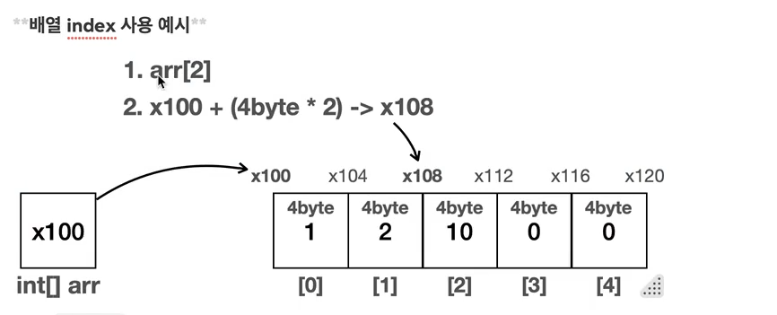
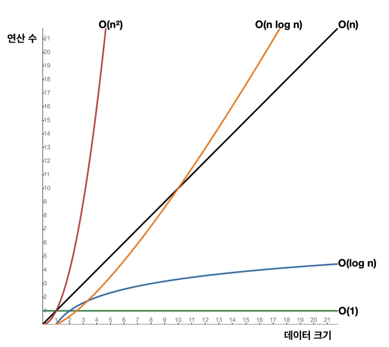
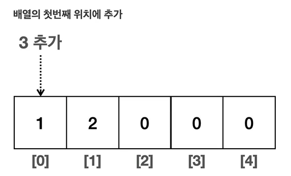
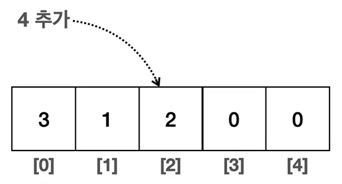
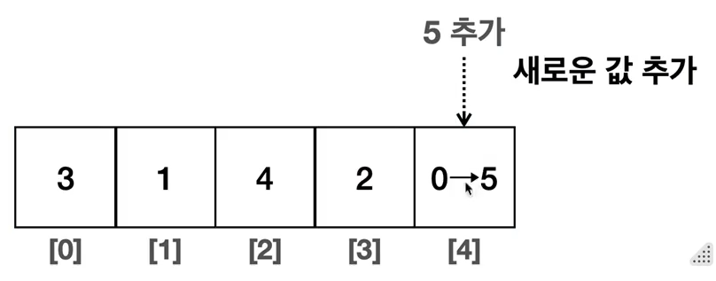
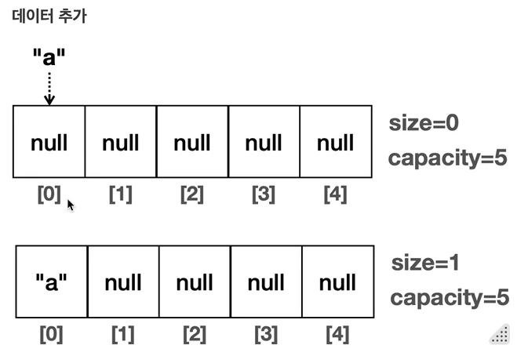
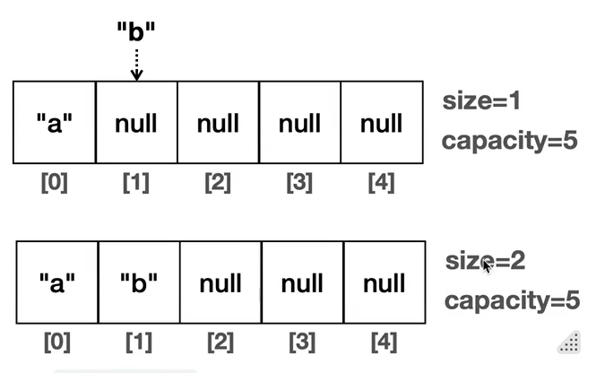
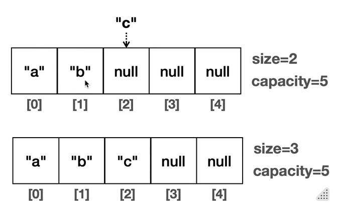
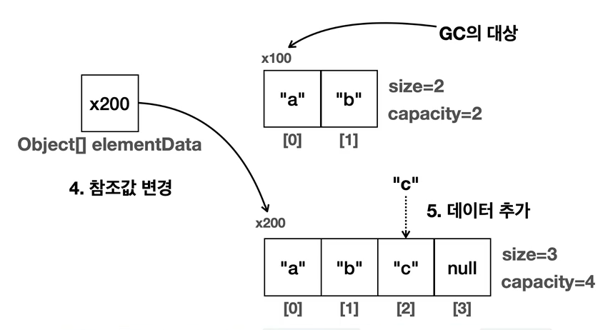
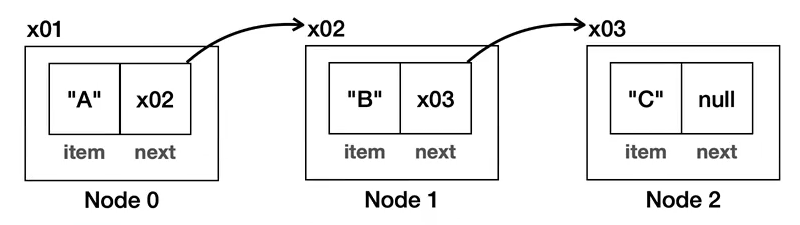

## 3. 컬렉션 프레임워크 - ArrayList
### 3-1. 배열의 특징1 - 배열과 인덱스
- 배열과 같이 여러 데이터(자료)를 구조화해서 다루는 것을 자료 구조라 한다.
- 자바는 배열 뿐만 아니라, 컬렉션 프레임워크라는 이름으로 다양한 자료 구조를 제공한다.
- 컬렉션 프레임워크와 자료 구조를 설명하기 전에 먼저 자룍구조의 가장 기본이 되는 배열의 특징을 알아보자.

####
    public class ArrayMain1 {
    
        public static void main(String[] args) {
            int[] arr = new int[5];
    
            // index 입력: O(1)
            System.out.println("==index 입력: O(1)==");
            arr[0] = 1;
            arr[1] = 2;
            arr[2] = 3;
            System.out.println(Arrays.toString(arr));
    
            // index 변경: O(1)
            System.out.println("==index 변경: O(1)==");
            arr[2] = 10;
            System.out.println(Arrays.toString(arr));
    
            // index 조회: O(1)
            System.out.println("===index 조회: O(1)=");
            System.out.println("arr[2]: " + arr[2]);
    
            // 배열 검색: O(n)
            System.out.println("==배열 검색: O(n)==");
            System.out.println(Arrays.toString(arr));
            int value = 10;
            for (int i = 0; i < arr.length; i++) {
                System.out.println("arr[" + i + "]: " + arr[i]);
                if (arr[i] == value) {
                    System.out.println(value + " 찾음");
                    break;
                }
            }
        }
    }
- 배열에서(입력, 변경, 조회 처럼) 인덱스 값을 사용하면 한 번에 찾아서 빠르다.
- 검색을 하면 배열의 개수 만큼 찾아야해서 느리다.

#### 배열의 index 사용 예시

- 배열을 생성하면 힙 영역에 오른쪽 공간이 만들어 진다. (위 예시에서는 int 로 했으니까 초기값이 0이다.)
####

- arr[2] 에 위치한 자료를 찾는다고 가정해보자.
- **배열은 메모리상에 순서대로 붙어서 존재한다.**
- int 는 4byte 를 차지한다.
- 따라서 배열의 시작위치인 x100 부터 시작해서 자료의 크기(4byte)와 인덱스 번호를 곱하면 원하는 메모리 위치를 찾을 수 있다.
- 배열의 시작 참조(x100) + (자료의 크기(4byte) * 인덱스 위치(2)) = x108 이 나온다.
- **배열의 시작 지점, 각 데이터의 크기, 인덱스 번호를 알면 한 번의 계산으로 위치를 찾을 수 있다.**
- **따라서 배열이 아무리 많아도 단 한 번의 연산으로 데이처를 찾을 수 있다.**
####
- 배열의 경우 인덱스를 사용하면 한번의 계산으로 매우 효율적으로 자료의 위치를 찾을 수 있다.
- 인데스를 통한 입력, 변경, 조회 모두 한번의 계산으로 필요한 위치를 찾아서 처리할 수 있다.
- **배열에서 인덱스를 사용하는 경우 데이터가 아무리 많아도 한 번의 연산으로 필요한 위치를 찾을 수 있다.**

#### 배열의 검색
- 배열에 들어있는 데이터를 찾는 것을 검색이라 한다.
- 배열에 들어있는 데이터를 검색할 때는 배열에 들어있는 데이터를 하나하나 비교해야 한다.
- 이때는 이전과 같이 인덱스를 사용해서  한 번에 찾을 수 없다.
- 대신에 배열 안에 들어있는 데이터를 하나하나 확인해야 한다.
- 따라서 평균적으로 볼 때 배열의 크기가 클수록 오랜 시간이 걸린다.
- **배열의 순차 검색은 배열에 들어있는 크기 만큼 연산이 필요하다. 배열의 크기가 n이면, 연산도 n만큼 필요하다.**

### 3-2. 빅오 표기법

- 빅오(Big O) 표기법은 알고리즘의 성능을 분석할 때 사용하는 수학적 표현 반식이다.
- 이는 특히 알고리즘이 처리해야 할 데이터의 양이 증가할 때, 그 알고리즘이 얼마나 빠르게 실행되는지 나타낸다.
- 여기서 중요한 것은 알고리즘의 정확한 실행 시간을 계산하는 것이 아니라,   
  데이터 양의 증가에 따른 성능 변화 추세를 이해하는 것이다.

#### 빅오 표기법의 예시
- **O(1) - 상수 시간**: 입력 데이터의 크기에 관계없이 알고리즘의 실행 시간이 일정하다.  
  예) 배열에서 인덱스를 사용하는 경우
- **O(log n) - 로그 시간**: 알고리즘의 실행 시간이 데이터의 크기의 로그에 비례하여 증가한다.
  예) 이진 탐색
- **O(n) - 선형 시간**: 알고리즘의 실행 시간이 입력 데이터의 크기에 비례하여 증가한다.  
  예) 배열의 검색, 배열의 모든 요소를 순회하는 경우
- **O(n log n) - 선형 로그 시간**:   
  예) 많은 효율적인 정렬 알고리즘들
- **O(n^2) - 제곱 시간**: 알고리즘의 실행 시간이 입력 데이터의 크기의 제곱에 비례하여 증가한다.   
  예) 보통 이중 루프를 사용하는 알고리즘에 나타난다.

#### 빅오 표기법
- 빅오 표기법은 매우 큰 데이터를 입력한다고 가정하고, 데이터 양 증가에 따른 성능 변화 추세를 표현하는 데 사용한다.
- 쉽게 이야기해서 정확한 성능을 측정하는 것이 목표가 아니라 매우 큰 데이터가 들어왔을 때의 대략적인 추세를 비교하는 것이 목적이다.
- 따라서 데이터가 매우 많이 들어오면 추세를 보는데 상수는 크게 의미가 없어진다.
- 이런 이유로 빅오 표기법에서는 상수를 제거한다. 예를 들어 O(n + 2), O(n/2) 모두 O(n)으로 표시한다.
- 빅오 표기법은 별도의 이야기가 없으면 보통 최악의 상황을 가정해서 표기한다.
- 물론 최적, 보통, 최악의 경우로 나누어 표기하는 경우도 있다. 예를 들어 배열 순차 검색의 경우를 나누어 보면
    - 최적의 경우: 배열의 첫번째 항목에서 바로 값을 찾으면 O(1)이 된다.
    - 최악의 경우: 마지막 항목에 있거나 항목이 없는 경우 전체 요소를 순회한다. 이 경우 O(n)이 된다.
    - 평균의 경우: 평균적으로 보면 보통 중간쯤 데이터를 발견하게 된다. 이경우 O(n/2)가 되지만,  
      상수를 제외해서 O(n) 으로 표기한다. 최악과 비교하기 위해 O(n/2)로 표기하는 경우도 있다.

### 3-3. 배열의 특징2 - 데이터 추가
- 데이터 추가는 기존 데이터를 유지하면서 새로운 데이터를 입력하는 것을 뜻한다.
- 참고로 데이터를 중간에 추가하면 기존 데이터가 오른쪽으로 한 칸씩 이동해야 한다.
- 이 말은 좀 더 쉽게 풀어보자면 데이터를 추가하려면 새로운 데이터를 입 력할 공간을 확보해야 한다.
- 따라서 기존 데이터를 오른쪽으로 한 칸씩 밀어내야 한다.(기존 데이터의 인덱스를 하나씩 증가시켜야 한다.)

#### 배열의 데이터 추가 예시
- 배열에 데이터를 추가하는 위치에 따라서 크게 3가지로 나눌 수 있다.
    - 배열의 첫번째 위치에 추가  
          
      
        - 기존 배열들을 오른쪽으로 한 칸씩 밀어서 추가할 위치를 확보한다.
        - 이때 배열의 마지막 부분 부터 오른쪽으로 밀어야 데이터를 유지할 수 있다.
        - 왼쪽의 데이털를 오른쪽에 대입하는 과정을 반복한다.
        - 이 과정이 끝나면 1,1,2 라고 저장되어 있다.

      
        - 이제 첫번째 공간이 확보되었으므르 여기에 새로운 값을 추가한다.
    - 배열의 중간 위치에 추가  
        
      
        - 지정한 index 에 데이터를 추가할 위치를 확보해야 한다.
        - 따라서 마지막 부분부터 index 까지 데이터들을 오른쪽으로 한 칸씩 밀어야한다.
        - index 왼쪽의 데이터는 이동하지 않아도 된다.

      
    - 배열의 마지막 위치에 추가  
      
        - 배열의 마지막 위치에 추가하는 경우 기존 데이터를 이동하지 않아도 된다.
        - 따라서 단순하게 값만 입력하면 된다.

#### 배열에 데이터를 추가할 때 위치에 따른 성능 변화
- 배열의 첫번째 위치에 추가
    - 배열의 첫번째 위치를 찾는 데는 인덱스를 사용하므로 O(1)이 걸린다.
    - 모든 데이터를 배열의 크기만큼 한 칸씩 이동해야 한다. 따라서 O(n) 만큼의 연산이 걸린다.
    - O(1 + n) -> O(n) 이 된다.
- 배열의 중간 위치에 추가
    - 배열의 첫번째 위치를 찾는 데는 O(1)이 걸린다.
    - index의 오른쪽에 있는 데이터들을 모두 한 칸씩 이동해야 한다. 따라서 평균 연산은 O(n/2)이 된다.
    - O(1 + n/2) -> O(n) 이 된다.
- 배열의 마지막 위치에 추가
    - 배열이 이동하지 않고 배열의 길이를 사용하면 마지막 인덱스에 바로 접근할 수 있다.
    - 한 번의 계산으로 위치를 찾을 수 있고 기존 배열을 이동하지 않아도 되기 때문에 O(1) 이 된다.

#### 코드 구현
    public class ArrayMain2 {
    
        public static void main(String[] args) {
            int[] arr = new int[5];
            arr[0] = 1;
            arr[1] = 2;
            System.out.println(Arrays.toString(arr));
    
            // 배열의 첫번째이 위치에 추가
            // 기존 배열의 데이터를 한 칸씩 뒤로 밀고 배열의 첫번째 위치에 추가
            System.out.println("배열의 첫번째 위치에 3 추가 O(n)");
            int newValue = 3;
            addFirst(arr, newValue);
            System.out.println(Arrays.toString(arr));
    
            // index 위치에 추가
            // 기존 배열의 데이터를 한 칸씩 뒤로 밀고 배열의 인덱스 위치에 추가
            System.out.println("배열의 index(2) 위치에 4 추가 O(n/2)");
            int index = 2;
            int value = 4;
            addAtIndex(arr, index, value);
            System.out.println(Arrays.toString(arr));
    
            // 마지막 위치에 추가
            // 기존 배열의 마지막 위치에 추가
            System.out.println("배열의 마지막 위치에 5 추가 O(1)");
            addLast(arr, 5);
            System.out.println(Arrays.toString(arr));
        }
    
        private static void addFirst(int[] arr, int newValue) {
            for (int i = arr.length - 1 ; i > 0; i--) {
                arr[i] = arr[i-1];
            }
            arr[0] = newValue;
        }
    
        private static void addAtIndex(int[] arr, int index, int newValue) {
            for (int i = arr.length - 1 ; i > index; i--) {
                arr[i] = arr[i-1];
            }
            arr[index] = newValue;
        }
    
        private static void addLast(int[] arr, int newValue) {
            arr[arr.length - 1] = newValue;
        }
    
    }

#### 배열의 한계
- **배열은 가장 기본적인 자료 구조이고, 특히 인덱스를 사용할 때 최고의 효율이 나온다.**
- 하지만 **이런 배열에는 큰 단점이 있다. 바로 배열의 크기를 배열을 생성하는 시점에 미리 정해야 한다는 점이다.**
- 예를 들어 이벤트를 하는데, 누구나 이벤트에 참여할 수 있고, 이벤트가 끝나면 추첨을 통해서 당첨자를 정한다고 가정해보자.  
  이때 이벤트에 참여하는 사용자를 배열에 보관하는 경우, 사용자들은 실시간으로 계속 추가된다.  
  넉넉하게 길이가 1000인 배열을 사용했는데, 예상보다 이벤트 참여자가 많아서 1000명을 넘게 된다면,  
  더 많은 사용자가 이벤트에 참여하지 못하는 문제가 발생한다. 그렇다고 처음부터 너무 많은 배열을 확보하면 메모리가 낭비된다.
- 배열처럼 처음부터 정적으로 정해져있는 것이 아니라, 동적으로 언제든지 길이를 늘리고 줄일 수 있는 자료구조가 있다면 편리할 것이다.

### 3-4. 직접 구현하는 배열 리스트1 - 시작
- 배열의 경우 다음 2가지 불편함이 있다.
    - 배열의 길이를 동적으로 변경할 수 없다.
    - 데이터를 추가하기 불편하다.
        - 데이터를 추가하는 경우 직접 오른쪽으로 한 칸씩 데이터를 밀어야 한다.(이런 코드를 직접 작성해야 한다.)
- 배열의 이런 불편함을 해소하고 동적으로 데이터를 추가할 수 있는 자료구조를 List(리스트)라 한다.

#### List 자료 구조
- 순서가 있고, 중복을 허용하는 자료 구조를 리스트라 한다.
- 일반적으로 배열과 리스트는 구분해서 이야기한다. 리스트는 배열보다 유연한 자료 구조로, 크기가 동적으로 변할 수 있다.
    - 배열: 순서가 있고 중복을 허용하지만 크기가 정적으로 고정된다.
    - 리스트: 순서가 있고 중복을 허용하지만 크기가 동적으로 변할 수 있다.
- 여기서 중복을 허용한다는 뜻은 같은 데이터를 입력할 수 있다는 뜻이다.  
  참고로 자료 구조중 Set 은 중복을 허용하지 않는다.

#### MyArrayListV1 구현
- 보통 배열을 사용한 리스트라고 해서 ArrayList 라고 부른다.
- 예제를 점진적으로 발전시킬 예정이므로, 우선은 최대한 단순하게 구현한다.
####
    public class MyArrayListV1 {
    
        private static final int DEFAULT_CAPACITY = 5;
    
        private Object[] elementData;
        private int size = 0;
    
        // 기본 생성자
        public MyArrayListV1() {
            elementData = new Object[DEFAULT_CAPACITY];
        }
    
        // 직접 크기를 정하는 생성자
        public MyArrayListV1(int initialCapacity) {
            elementData = new Object[initialCapacity];
        }
    
        public int size() {
            return size;
        }
    
        public void add(Object e) {
            elementData[size] = e;
            size++;
        }
    
        public Object get(int index) {
            return elementData[index];
        }
    
        public Object set(int index, Object element) {
            Object oldValue = get(index);
            elementData[index] = element;
            return oldValue;
        }
    
        public int indexOf(Object o) {
            for (int i = 0; i < size; i++) {
                if (elementData[i].equals(o)) {
                    return i;
                }
            }
            return -1;  // 못찾은 경우
        }
    
        public String toString() {
            // [1, 2, 3, null, null] size=3
            // [1, 2, 3] size=3
            return Arrays.toString(Arrays.copyOf(elementData, size)) +
                    " size=" + size + ", capacity=" + elementData.length;
        }
    }
####
    public class MyArrayListV1Main {
    
        public static void main(String[] args) {
            MyArrayListV1 list = new MyArrayListV1();
            System.out.println(list);
            System.out.println("==데이터 추가==");
            list.add("a");
            System.out.println(list);
            list.add("b");
            System.out.println(list);
            list.add("c");
            System.out.println(list);
    
            System.out.println("==기능 사용==");
            System.out.println("list.size() = " + list.size());
            System.out.println("list.get(1) = " + list.get(1));
            System.out.println("list.indexOf(\"c\") = " + list.indexOf("c"));
            System.out.println("list.set(2, \"z\") = " + list.set(2, 'z'));
            System.out.println(list);
    
            System.out.println("==범위 초과==");
            list.add("d");
            System.out.println(list);
            list.add("e");
            System.out.println(list);
    
            // 범위 초과, capacity 가 늘어나지 않으면 예외 발생 (ArrayIndexOutOfBoundsException 에러)
            list.add("f");
            System.out.println(list);
        }
    }

- 리스트의 사이즈(size)는 실제 데이터가 입력된 킄기를 뜻한다. 
- 배열의 크기와는 무관하고 배열의 크기는 capacity 로 표현한다.
  - 리스트의 크기는 배열의 크기가 아니라 size 로 판단해야한다. 
  - 처음에 데이터가 없을 때의 size 는 0 이다.
- 데이터를 추가하면 size 가 하나 증가한다.

  
  
- 데이터를 추가하면 리스트에 들어있는 데이터의 마지막 부분에 새로운 데이터를 추가한다.

-  인덱스를 사용해서 데이터를 변경한다. 해당 인덱스의 위치를 찾앗서 변경한다.

- size 가 배열의 크기안 capacity에 도달하면 더는 데이터를 추가할 수 없다.
- 따라서 f 값을 입력할 때 예외가 발생한다.
- 우리가 원하는 리스트는 동적으로 저장할 수 있는 크기가 커지는 리스트이다.
- 저장할 수 있는 데이터의 크기를 동적으로 변할 수 있도록 코드를 변경해보자.

### 3-5. 직접 구현하는 배열 리스트2 - 동적 배열
- 데이터를 추가할 때 리스트의 size 가 배열의 크기인 capacity 를 넘어가는 경우  
  더 큰 배열을 만들고 그곳에 기존 배열을 복사한 뒤 참조를 바꿔 문제를 해결해보자.

####
    public class MyArrayListV2 {
    
        private static final int DEFAULT_CAPACITY = 5;
    
        private Object[] elementData;
        private int size = 0;
    
        public MyArrayListV2() {
            elementData = new Object[DEFAULT_CAPACITY];
        }
    
        public MyArrayListV2(int initialCapacity) {
            elementData = new Object[initialCapacity];
        }
    
        public int size() {
            return size;
        }
    
        public void add(Object e) {
            // 코드 추가
            if (size == elementData.length) {
                grow();
            }
            elementData[size] = e;
            size++;
        }
    
        private void grow() {
            int oldCapacity = elementData.length;
            int newCapacity = oldCapacity * 2;
    
            // 배열을 새로 만들고, 기존 배열을 새로운 배열에 복사 후 참조 변경
            //Object[] newArr = new Object[newCapacity];
            //for (int i = 0; i < elementData.length; i++) {
            //    newArr[i] = elementData[i];
            //}
            //elementData = newArr;
    
            // 배열 새로 만들고 기존 배열을 복사하는 것을 간단하게 해주는 메소드
             elementData = Arrays.copyOf(elementData, newCapacity);
        }
    
        public Object get(int index) {
            return elementData[index];
        }
    
        public Object set(int index, Object element) {
            Object oldValue = get(index);
            elementData[index] = element;
            return oldValue;
        }
    
        public int indexOf(Object o) {
            for (int i = 0; i < size; i++) {
                if (elementData[i].equals(o)) {
                    return i;
                }
            }
            return -1;  // 못찾은 경우
        }
    
        public String toString() {
            // [1, 2, 3, null, null] size=3
            // [1, 2, 3] size=3
            return Arrays.toString(Arrays.copyOf(elementData, size)) +
                    " size=" + size + ", capacity=" + elementData.length;
        }
    }
- 추가된 부분은 grow( ) 메서드와 이 메서드를 호출하는 add( ) 메서드이다.
- add( ) 메서드에서 데이터를 추가할 때 size 가 배열의 크기에 도달했다면 더는 데이터를 추가할 수 없다.
- 따라서 이때는 grow( ) 를 호출해서 기존 배열을 복사한 새로운 배열을 만들고 배열의 크기도 여유있게 2배로 늘려준다.
  - **Arrays.copyOf(기존배열, 새로운길이)**: 새로운 길이로 배열을 생성하고, 기존 배열의 값을 새로운 배열에 복사한다.

####
    public class MyArrayListV2Main {
    
        public static void main(String[] args) {
            MyArrayListV2 list = new MyArrayListV2(2);
            System.out.println(list);
            System.out.println("==데이터 추가==");
            list.add("a");
            System.out.println(list);
            list.add("b");
            System.out.println(list);
            list.add("c");
            System.out.println(list);
            list.add("d");
            System.out.println(list);
            list.add("e");
            System.out.println(list);
            list.add("f");
            System.out.println(list);
        }
    }

1. 데이터를 추가하면 size 가 배열의 크기인 capacity 를 초과하게 된다.
2. 이때 grow( ) 메서드를 호출하는데, 이 메서드는 다음과 같은 역할을 수행한다.
   1. 2배 큰 배열을 새로 생성한다.
   2. 새로운 배열에 기존 배열의 값을 복사한다.
   3. Arrays.copyOf(기존배열, 새로운길이) 를 사용해서 2배 큰 배열을 새로 생성하면서   
      동시에 새로운 배열에 기존 배열의 값을 복사한다.
   4. 참조값을 변경한다.

3. 이렇게 되면 내부 데이터를 보관하는 elementData 는 기존 보다 2배 큰 capacity 를 가진 배열을 보유하게 된다.
4. 이렇게 증가된 배열의 데이터를 추가하면 된다.
5. 기존 배열(x001)은 더는 참조하는 곳이 없으므로 GC 의 대상이 된다.

- grow( )를 호출할 대 배열의 크기는 기존과 비교해서 2배씩 증가한다.
- 데이터가 하나 추가될 때마다 배열의 크기를 1씩만 증가하게 되면 배열을 복사하는 연산이 너무 자주 발생할 가능성이 높다.
- 배열을 새로 복사해서 만드는 연산은 배열을 새로 만들고 또 기존 데이터를 복사하는 시간이 걸리므로 가능한 줄이는 것이 좋다.
- 이렇게 2배씩 증가하면 배열을 새로 만들고 복사하는 연산을 줄일 수 있지만, 너무 크게 증가하면 낭비되는 메모리가 많아진다.
- 보통은 50% 정도 증가하는 방법을 사용한다.

#### 정리
- 우리가 만든 MyArrayListV2 는 정적인 배열과 다르게 크기가 동적으로 변하는 자료 구조이다.
- 따라서 데이터의 크기를 미리 정하지 않아도 된다.
- 물론 MyArrayListV2 의 내부에서는 배열을 사용하지만, MyArrayListV2 를 사용하는 개발자들은 이른 부분을 신경쓰지 않아도 된다.

### 3-6. 직접 구현하는 배열 리스트3 - 기능 추가
- MyArrayList 를 더 가치있게 만들기 위해 다음 기능을 추가하자.
  - add(index, data): index 위치에 데이처를 추가한다.
  - remove(index): index 위치의 데이터를 삭제한다.
- 앞서 만든 add( ) 메서드는 리스트의 마지막에 데이터를 추가하기 때문에 배열에 들어 있는 기존 데이터는 이동하지 않는다.  
  하지만 앞이나 중간에 데이터를 추가하면 배열에 들어 있는 기존 데이터를 이동하고 데이터를 추가해야한다. 
- 삭제의 경우도 마찬가지다. 마지막에 있는 데이터를 삭제하면 기존 데이터를 이동하지 않아도 된다.   
  하지만 앞이나 중간에 있는 데이터를 삭제하면 빈자리를 채우기 위해 데이터를 한 칸씩 왼쪽으로 이동해야 한다.

#### 코드 구현
    public class MyArrayListV3 {
    
        private static final int DEFAULT_CAPACITY = 5;
    
        private Object[] elementData;
        private int size = 0;
    
        public MyArrayListV3() {
            elementData = new Object[DEFAULT_CAPACITY];
        }
    
        public MyArrayListV3(int initialCapacity) {
            elementData = new Object[initialCapacity];
        }
    
        public int size() {
            return size;
        }
    
        public void add(Object e) {
            if (size == elementData.length) {
                grow();
            }
            elementData[size] = e;
            size++;
        }
    
        // 코드추가
        public void add(int index, Object e) {
            if (size == elementData.length) {
                grow();
            }
            // 데이터 이동(인덱스를 기준으로 오른쪽으로 한칸씩 이동)
            shiftRightFrom(index);
            // 데이터 삽입
            elementData[index] = e;
            size++;
        }
    
        // 코드 추가, 요소의 마지막부터 index 까지 오른쪽으로 밀기
        private void shiftRightFrom(int index) {
            for (int i = size; i > index; i--) {
                elementData[i] = elementData[i - 1];
            }
        }
    
        private void grow() {
            int oldCapacity = elementData.length;
            int newCapacity = oldCapacity * 2;
            elementData = Arrays.copyOf(elementData, newCapacity);
        }
    
        public Object get(int index) {
            return elementData[index];
        }
    
        public Object set(int index, Object element) {
            Object oldValue = get(index);
            elementData[index] = element;
            return oldValue;
        }
    
        // 코드 추가
        public Object remove(int index) {
            Object oldValue = get(index);
            // 데이터 이동
            shiftLeftFrom(index);
            // 사이즈 줄이기
            size--;
            elementData[size] = null;
            // 제거한 값 반환
            return oldValue;
        }
    
        // 코드 추가, 요소의 index 부터 마지막까지 왼쪽으로 밀기
        private void shiftLeftFrom(int index) {
            for (int i = index; i < size - 1; i++) {
                elementData[i] = elementData[i + 1];
            }
        }
    
        public int indexOf(Object o) {
            for (int i = 0; i < size; i++) {
                if (elementData[i].equals(o)) {
                    return i;
                }
            }
            return -1;  // 못찾은 경우
        }
    
        public String toString() {
            // [1, 2, 3, null, null] size=3
            // [1, 2, 3] size=3
            return Arrays.toString(Arrays.copyOf(elementData, size)) +
                    " size=" + size + ", capacity=" + elementData.length;
        }
    }
####
    public class MyArrayListV3Main {
    
        public static void main(String[] args) {
            MyArrayListV3 list = new MyArrayListV3();
    
            // 마지막에 추가 O(1)
            list.add("a");
            list.add("b");
            list.add("c");
            System.out.println(list);
    
            // 원하는 위치에 추가 O(n)
            System.out.println("addLast");
            list.add(3, "addLast"); // 0(1)
            System.out.println(list);
    
            System.out.println("addFirst");
            list.add(0, "addFirst"); // O(n)
            System.out.println(list);
    
            // 원하는 위치 삭제
            Object removed1 = list.remove(4); // O(1)
            System.out.println("remove(4) = " + removed1);
            System.out.println(list);
    
            Object removed2 = list.remove(0); // O(n)
            System.out.println("remove(0) = " + removed2);
            System.out.println(list);
        }
    }

#### 배열 리스트의 빅오
- 데이터 추가 
  - 마지막에 추가: O(1)
  - 앞, 중간에 추가: O(n)
- 데이터 삭제
  - 마지막에 삭제: O(1)
  - 앞, 중간에 삭제: O(n)
- 인스턴스 조회: O(1)
- 데이터 검색: O(n)

#### 정리
- 지금까지 우리가 만든 자료 구조를 배열 리스트(ArrayList)라 한다.
- 리스트(List) 자료 구조를 사용하는데, 내부의 데이터는 배열(Array)에 보관하는 것이다.
- 배열 리스트는 마지막에 데이터를 추가하거나 마지막에 있는 데이터를 삭제할 때는 O(1)로 매우 빠르지만,  
  중간에 데이터를 추가하거나 삭제하는 경우에는 O(n)으로 느리다.
- 배열 리스트는 보통 데이터를 중간에 추가하고 삭제하는 변경 보다는,  
  데이터를 순서대로 입력하고(데이터를 마지막에 추가하고), 순서대로 출력하는 경우에 가장 효율적이다.

### 3-7. 직접 구현하는 배열 리스트4 - 제네릭1
- 앞서 만든 MyArrayList 들은 Object 를 입력받기 때문에 아무 데이터나 입력할 수 있고, 또 결과로 Object 를 반환한다. 
- 따라서 필요한 경우 다운 캐스팅을 해야하고, 또 타입 안정성이 떨어지는 단점이 있다.

#### 다운 캐스팅 시 오류 발생, ClassCastException 
    public class MyArrayListV3BadMain {
    
        public static void main(String[] args) {
            MyArrayListV3 numberList = new MyArrayListV3();
    
            // 숫자만 입력 하기를 기대
            numberList.add(1);
            numberList.add(2);
            numberList.add("문자3");  // 문자를 입력
            System.out.println(numberList);
    
            // Object 를 반환하므로 다운 캐스팅 필요
            Integer num1 = (Integer) numberList.get(0);
            Integer num2 = (Integer) numberList.get(1);
    
            // ClassCastException 발생, 문자를 Integer 로 캐스팅
            Integer num3 = (Integer) numberList.get(2);
            
        }
    }
- numberList 에는 숫자만 입력하기를 기대했지만, Object 를 받아서 저장하기 때문에 자바의 몸든 타입을 다 저장할 수 있다.
- 따라서 숫자를 입력하다가 실수로 문자를 입력해도 알아차리지 못한다.
- 값을 꺼낼 때 Object 를 반환하기 때문에 원래 입력한 타입으로 받으려면 다운 캐스팅 해야 한다.
- 이때 입력한 데이터 타입을 정확하게 알고 있지 않으면 예외가 발생한다. 지금 처럼 중간에 문자가 들어가면 문제가 될 수 있다.
- 제네릭을 도입하면 타입 안정성을 확보하면서 이런 문제를 한 번에 해결할 수 있다. 
- 제네릭은 자료를 보관하는 자료 구조에 가장 어울린다. 

> **!참고** - 하나의 자료 구조에 숫자와 문자처럼 서로 관계없는 여러 데이터 타입을 섞어서 보관하는 일은 거의 없다.  
> 일반적으로 같은 데이터 타입을 보관하고 관리한다.

#### 제네릭을 적용한 ArrayList
    public class MyArrayListV4<E> {
    
        private static final int DEFAULT_CAPACITY = 5;
    
        private Object[] elementData;
        private int size = 0;
    
        public MyArrayListV4() {
            // 생성자에는 제네릭 타입을 사용하지 못한다.
            elementData = new Object[DEFAULT_CAPACITY];
        }
    
        public MyArrayListV4(int capacity) {
            elementData = new Object[capacity];
        }
    
        public int size() {
            return size;
        }
    
        public void add(E e) {
            if (size == elementData.length) {
                grow();
            }
            elementData[size] = e;
            size++;
        }
        
        public void add(int index, E e) {
            if (size == elementData.length) {
                grow();
            }
            shiftRightFrom(index);
            elementData[index] = e;
            size++;
        }
        
        private void shiftRightFrom(int index) {
            for (int i = size; i > index; i--) {
                elementData[i] = elementData[i - 1];
            }
        }
    
        private void grow() {
            int oldCapacity = elementData.length;
            int newCapacity = oldCapacity * 2;
            elementData = Arrays.copyOf(elementData, newCapacity);
        }
    
        @SuppressWarnings("unchecked")  // 경고를 무시하겠다.
        public E get(int index) {
            // E 로 다운 캐스팅 필요
            return (E) elementData[index];
        }
    
        public E set(int index, E element) {
            E oldValue = get(index);
            elementData[index] = element;
            return oldValue;
        }
    
        public E remove(int index) {
            E oldValue = get(index);
            shiftLeftFrom(index);
            size--;
            elementData[size] = null;
            return oldValue;
        }
        
        private void shiftLeftFrom(int index) {
            for (int i = index; i < size - 1; i++) {
                elementData[i] = elementData[i + 1];
            }
        }
    
        public int indexOf(E o) {
            for (int i = 0; i < size; i++) {
                if (elementData[i].equals(o)) {
                    return i;
                }
            }
            return -1; 
        }
    
        public String toString() {
            return Arrays.toString(Arrays.copyOf(elementData, size)) +
                    " size=" + size + ", capacity=" + elementData.length;
        }
    }
- MyArrayListV4<E> 로 제네릭 타입을 선언한다. E 는 Element 로 요소의 줄임말이다.
- Object 로 입력받고 출력했던 곳을 타입 매개변수 E 로 변경한다.
- 생성자의 Object[] elementData 는 그대로 유지한다. 이 부분은 바로 뒤에서 설명한다.

#### 
    public class MyArrayListV4Main {
    
        public static void main(String[] args) {
            MyArrayListV4<String> stringList = new MyArrayListV4<>();
            stringList.add("a");
            stringList.add("b");
            stringList.add("c");
            String string = stringList.get(0);
            System.out.println("str = " + string);
    
            MyArrayListV4<Integer> integerList = new MyArrayListV4<>();
            integerList.add(1);
            integerList.add(2);
            integerList.add(3);
            Integer integer = integerList.get(0);
            System.out.println("integer = " + integer);
        }
    }
- 이제 stringList 에는 String 문자열만 보관 및 조회하고, integerList에는 Integer 숫자만 보관 및 조회할 수 있다.
- 다른 타입의 값을 저장하면 컴파일 오류가 발생한다. 
- 추가로 값을 조회할 때도 위험한 다운 캐스팅 없이 지정한 타입으로 안전하게 조회할 수 있다.
- 제네릭을 사용한 덕분에 타입 인자로 지정한 타입으로만 안전하게 데이터를 저장하고, 조회할 수 있게 되었다.
- 제네릭의 도움으로 타입 안정성이 높은 자료 구조를 만들 수 있었다.

### 3-8. 직접 구현하는 배열 리스트5 - 제네릭2
#### Object 배열을 사용한 이유
- Object[] elementsData 를 그대로 사용하는 이유
  - **제네릭은 런타임에 이레이저에 의해 타입 정보가 사라진다. 따라서 런타임에 타입 정보가 필요한 생성자에 사용할 수 없다**.
  - 제네릭을 기반으로 배열을 생성하는 다음 코드는 작동하지 않고, 컴파일 오류가 발생한다.  
    참고로 이것은 자바가 제공하는 제네릭의 한계이다.
  - 대신에 다음과 같이 모든 데이터를 담을 수 있는 Object 를 그대로 사용해야 한다.  
    
        new Object[DEFAULT_CAPACITY]
- 이렇게 Object[ ] 을 생성해서 사용해도 문제가 없는, 이 부분을 조금 더 살펴보자.
- new MyArrayListV4<String> 을 사용한 경우 E 가 다음과 같이 처리된다.

#### 제네릭 타입 인자 적용 전
    Object[] elementData;
    
    void add(E e) {
        elementData[size] = e;
        ...
    }
    String get(int index) {
        return (E) elementData[index];
    }

#### 제네릭 타입 인자 적용 후 
    Object [] elementData;
    
    void add(String e) {
        elementData[size] = e;
        ...
    }
    
    String get(int index) {
        return (String) elementData[index]
    }

- elementData[ ] 에 데이터를 보관하는 add(E e) 메서드를 보자. E 타입으로 데이터를 입 력한다.
- elementData[ ] 에 데이터를 조회하는 get( ) 메서드를 보자. 보관할 때와 같은 E 타입으로 데이터를 다운 캐스팅해서 반환한다.
- 따라서 배열의 모든 데이터는 E 타입으로 보관된다. 
- 그리고 get( ) 으로 배열에서 데이터를 꺼낼 때 (E) 로 다운 캐스팅해도 보관한 E 타입으로 다운 캐스팅하기 때문에 문제가 되지 않는다.
-  구체적인 예시
   - MyArrayListV4 를 생성할 때 타입 매개변수 E 를 String 으로 지정했다면 elementData 에는 항상 String 이 저장된다.
   - add(String e) 에서 배열의 모든 데이터는 String 타입으로 보관된다.
   - get( ) 에서 데이터를 꺼낼 때 항상 (String) 로 다운 캐스팅 한다.   
   - 저장한 String 타입으로 다운 캐스팅 하기 때문에 아무런 문제가 되지 않는다.
   - Object 는 모든 데이터를 담을 수 있기 때문에 데이터를 담는데는 아무런 문제가 없다.
   - 다만 데이터를 조회할 때 문제가 될 수 있는데, 이때는 조회한 Object 타입을 지정한 타입 매개변수로 다운 캐스팅 해준다.
- 정리하자면 
   - 생성자에는 제네릭의 타입 매개변수를 사용할 수 없는 한계가 있다.
   - 따라서 배열을 생성할 때 대안으로 Object 배열을 사용해야 한다.
   - 하지만 제네릭이 리스트의 데이터를 입력 받고 반환하는 곳의 타입을 고정해준다.
   - 따라서 고정된 타입으로 Object 배열에 데이터를 보관하고, 꺼낼 때도 같은 고정된 타입으로 안전하게 다운 캐스팅 할 수 있다.

#### MyArrayList의 단점
- 배열을 사용한 리스트인 MyArrayList 는 다음과 같은 단점이 있다.
  - 정확한 크기를 미리 알지 못하면 메모리가 낭비된다.   
    배열을 사용하므로 배열의 뒷 부분에 사용되지 않고, 낭비되는 메모리가 있다.
  - 데이터를 중간에 추가하거나 삭제할 때 비효율적이다.
    - 이 경우 데이터를 한 칸씩 밀어야 한다. 이것은 O(n) 으로 성능이 좋지 않다.
    - 만약 데이터의 크기가 1,000,000 건 이라면 최악의 경우 데이터를 추가할 때 마다 1,000,000 건의 데이터를 밀어야 한다.
  
#### ArrayList 의 빅오 정리
- 데이터 추가
  - 마지막에 추가: O(1)
  - 앞,중간에 추가: O(n)
- 데이터 삭제
  - 마지막에 삭제: O(1)
  - 앞,중간에 삭제: O(n)
- 인덱스 조회: O(1) 
- 데이터 검색: O(n)

####
- 배열 리스트는 순서대로 마지막에 데이터를 추가하거나 삭제할 때는 성능이 좋지만,  
  앞이나 중간에 데이터를 추가하거나 삭제할 때는 성능이 좋지 않다.
- 다음 시간에는 이런 단점을 해결한 자료 구조인 연결 리스트(LinkedList)에 대해 알아보자.

 

## 4. 컬렉션 프레임워크 - LinkedList
### 4-1. 노드와 연결1
#### 배열 리스트의 단점
- 배열 리스트는 내부에 배열을 사용해서 데이터를 보관하고 관리한다. 이로 인해 다음과 같은 단점을 가진다.
  - 배열은 필요한 배열의 크기를 미리 확보해야 한다. 데이터가 얼마나 추가될지 예측할 수 없는 경우 나머지 공간은 낭비된다.
  - 배열의 중간 데이터 추가/삭제 시 기존 데이터들을 이동시켜야 해서 성능이 좋지 않다.

#### 노드와 연결
- 낭비되는 메모리 없이 딱 필요한 만큼만 메모리를 확보해서 사용하고,  
  또 앞이나 중간에 데이터를 추가하거나 삭제할 때도 효율적인 자료구조가 있다.
- 바로 노드를 만들고 각 노드를 서로 연결하는 방식이다.
- 노드 클래스 

      public class Node {
          Object item;
          Node next;
      }
  - 노드 클래스는 내부에 저장할 데이터인 Item 과, 다음으로 연결한 노드의 참조인 next 를 가진다.
  - 이 노드 클래스를 사용해서 데이터 A, B, C 를 순서대로 연결해보자.
- 노드에 데이터 A 추가  
       
    - Node 인스턴스를 생성하고, item 에 "A" 를 넣어준다.   
  
    
    - Node 인스턴스를 생성하고, item 에 "B" 를 넣어준다.
    - 처음 만든 노드의 Node next 필드에 새로 만든 노드의 참조값을 넣어준다.
    - 이렇게 하면 첫 번째 노드와 두 번째 노드가 서로 연결된다.
    - 첫 번째 노드의 node.next 를 호출하면 두 번째 노드를 구할 수 있다.  

     
    - Node 인슽너스를 생성하고, item 에 "C" 를 넣어준다.
    - 두 번째 만든 노드의 Node next 필드에 새로 만든 노드의 참조값을 넣어준다.
    - 이렇게하면 두 번째 노드와 세 번째 노드가 서로 연결된다.
    - 첫 번째 노드의 node.next 를 호출하면 두 번째 노드를 구할 수 있다.
    - 두 번째 노드의 node.next 를 호출하면 세 번째 노드를 구할 수 있다.
    - 첫 번째 노드의 node.next.next 를 호출하면 세 번째 노드를 구할 수 있다.
  
#### 코드 예제 
    public class Node {
    
        Object item;
        Node next;
    
        public Node(Object item) {
            this.item = item;
        }
    }
- 필드의 접근 제어자는 private 으로 선언하는 것이 좋지만, 이 예제에서는 설명을 단순하게 하기 위해 디폴트 접근 제어자를 사용했다.
####
    public class NodeMain1 {
    
        public static void main(String[] args) {
            // 노드 생성하고 연결하기:  A -> B -> C
            Node first = new Node("A");
            first.next = new Node("B");
            first.next.next = new Node("C");

            Node x = first;
            while (x != null) {
                System.out.println(x.item);
                x = x.next;
            }
        }
    }

#### 연결된 노드를 찾는 방법
- Node first 를 통해 첫 번째 노드를 구할 수 있다.
- 첫 번째 노드의 node.next 를 호출하면 두 번째 노드를 구할 수 있다.
- 두 번째 노드의 node.next 를 호출하면 세 번째 노드를 구할 수 있다.
- 첫 번째 노드의 node.next.next 를 호출하면 세 번째 노드를 구할 수 있다.

#### 모든 노드 탐색하기

    
    Node x = first;
    while (x != null) {
        System.out.println(x.item);
        x = x.next;
    }

### 4-2. 노드와 연결2

### 4-3. 노드와 연결3

### 4-4. 직접 구현하는 연결 리스트1 - 시작

### 4-5. 직접 구현하는 연결 리스트2 - 추가와 삭제1

### 4-6. 직접 구현하는 연결 리스트3 - 추가와 삭제2

### 4-7. 직접 구현하는 연결 리스트4 - 제네릭 도입

 

## 5. 컬렉션 프레임워크 - List
### 5-1. 리스트 추상화1 - 인터페이스 도입

### 5-2. 리스트 추상화2 - 의존관계 주입

### 5-3. 리스트 추상화3 - 컴파일 타임, 런타임 의존관계

### 5-4. 직접 구현한 리스트의 성능 비교

### 5-5. 자바 리스트

### 5-6.자바 리스트의 성능 비교

### 5-7. 문제와 풀이1

### 5-8. 문제와 풀이2

 

## 6. 컬렉션 프레임워크 - Hash
### 6-1. 리스트 vs 세트

### 6-2. 직접 구현하는 Set0 - 시작

### 6-3. 해시 알고리즘1 - 시작

### 6-4. 해시 알고리즘2 - index 사용

### 6-5. 해시 알고리즘3- 메모리 낭비

### 6-6. 해시 알고리즘4 - 나머지 연산

### 6-7. 해시 알고리즘5 - 해시 충돌 설명

### 6-8. 해시 알고리즘6 - 해시 충돌 구현

 

## 7. 컬렉션 프레임워크 - HashSet
### 7-1. 직접 구현하는 Set1 - MyHashSetV1

### 7-2. 문자열 해시 코드

### 7-3. 자바의 hashCode()

### 7-4. 직접 구현하는 Set2 - MyHashSetV2

### 7-5. 직접 구현하는 Set3 - 직접 만든 객체 보관

### 7-6. equals, hashCode 의 중요성1

### 7-7. equals, hashCode 의 중요성2

### 7-8. 직접 구현하는 Set4 - 제네릭과 인터페이스 도입

 

## 8. 컬렉션 프레임워크 - Set
### 8-1. 자바가 제공하는 Set1 - HashSet, LinkedHashSet

### 8-2. 자바가 제공하는 Set2 - TreeSet

### 8-3. 자바가 제공하는 Set3 - 예제

### 8-4. 자바가 제공하는 Set4 - 최적화

### 8-5. 문제와 풀이1

### 8-6. 문제와 풀이2

 

## 9. 컬렉션 프레임워크 - Map, Stack, Queue
### 9-1. 컬렉션 프레임워크 - Map 소개1

### 9-2. 컬렉션 프레임워크 - Map 소개2

### 9-3. 컬렉션 프레임워크 - Map 구현체

### 9-4. 스택 자료 구조

### 9-5. 큐 자료 구조

### 9-6. Deque 자료 구조

### 9-7. Deque 와 Stack, Queue

### 9-8. 문제와 풀이1 - Map1

### 9-9. 문제와 풀이2 - Map2

### 9-10. 문제와 풀이3 - Stack

### 9-11. 문제와 풀이4 - Queue

 

## 10. 컬렉션 프레임워크 - 순회, 정렬, 전체 정리
### 10-1. 순회1 - 직접 구현하는 Iterable, Iterator

### 10-2. 순회2 - 향상된 for 문

### 10-3. 순회3 - 자바가 제공하는 Iterable, Iterator

### 10-4. 정렬1 - Comparable, Comparator

### 10-5. 정렬2 - Comparable, Comparator

### 10-6. 정렬3 - Comparable, Comparator

### 10-7. 컬렉션 유틸

### 10-8. 컬렉션 프레임워크 전체 정리

### 10-9. 문제와 풀이

 

## 11. 다음으로