## 3. 컬렉션 프레임워크 - ArrayList
### 3-1. 배열의 특징1 - 배열과 인덱스
- 배열과 같이 여러 데이터(자료)를 구조화해서 다루는 것을 자료 구조라 한다.
- 자바는 배열 뿐만 아니라, 컬렉션 프레임워크라는 이름으로 다양한 자료 구조를 제공한다.
- 컬렉션 프레임워크와 자료 구조를 설명하기 전에 먼저 자룍구조의 가장 기본이 되는 배열의 특징을 알아보자.

####
    public class ArrayMain1 {
    
        public static void main(String[] args) {
            int[] arr = new int[5];
    
            // index 입력: O(1)
            System.out.println("==index 입력: O(1)==");
            arr[0] = 1;
            arr[1] = 2;
            arr[2] = 3;
            System.out.println(Arrays.toString(arr));
    
            // index 변경: O(1)
            System.out.println("==index 변경: O(1)==");
            arr[2] = 10;
            System.out.println(Arrays.toString(arr));
    
            // index 조회: O(1)
            System.out.println("===index 조회: O(1)=");
            System.out.println("arr[2]: " + arr[2]);
    
            // 배열 검색: O(n)
            System.out.println("==배열 검색: O(n)==");
            System.out.println(Arrays.toString(arr));
            int value = 10;
            for (int i = 0; i < arr.length; i++) {
                System.out.println("arr[" + i + "]: " + arr[i]);
                if (arr[i] == value) {
                    System.out.println(value + " 찾음");
                    break;
                }
            }
        }
    }
- 배열에서(입력, 변경, 조회 처럼) 인덱스 값을 사용하면 한 번에 찾아서 빠르다.
- 검색을 하면 배열의 개수 만큼 찾아야해서 느리다.

#### 배열의 index 사용 예시
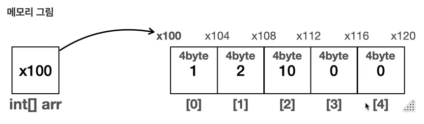
- 배열을 생성하면 힙 영역에 오른쪽 공간이 만들어 진다. (위 예시에서는 int 로 했으니까 초기값이 0이다.)
####

- arr[2] 에 위치한 자료를 찾는다고 가정해보자.
- **배열은 메모리상에 순서대로 붙어서 존재한다.**
- int 는 4byte 를 차지한다.
- 따라서 배열의 시작위치인 x100 부터 시작해서 자료의 크기(4byte)와 인덱스 번호를 곱하면 원하는 메모리 위치를 찾을 수 있다.
- 배열의 시작 참조(x100) + (자료의 크기(4byte) * 인덱스 위치(2)) = x108 이 나온다.
- **배열의 시작 지점, 각 데이터의 크기, 인덱스 번호를 알면 한 번의 계산으로 위치를 찾을 수 있다.**
- **따라서 배열이 아무리 많아도 단 한 번의 연산으로 데이처를 찾을 수 있다.**
####
- 배열의 경우 인덱스를 사용하면 한번의 계산으로 매우 효율적으로 자료의 위치를 찾을 수 있다.
- 인데스를 통한 입력, 변경, 조회 모두 한번의 계산으로 필요한 위치를 찾아서 처리할 수 있다.
- **배열에서 인덱스를 사용하는 경우 데이터가 아무리 많아도 한 번의 연산으로 필요한 위치를 찾을 수 있다.**

#### 배열의 검색
- 배열에 들어있는 데이터를 찾는 것을 검색이라 한다.
- 배열에 들어있는 데이터를 검색할 때는 배열에 들어있는 데이터를 하나하나 비교해야 한다.
- 이때는 이전과 같이 인덱스를 사용해서  한 번에 찾을 수 없다.
- 대신에 배열 안에 들어있는 데이터를 하나하나 확인해야 한다.
- 따라서 평균적으로 볼 때 배열의 크기가 클수록 오랜 시간이 걸린다.
- **배열의 순차 검색은 배열에 들어있는 크기 만큼 연산이 필요하다. 배열의 크기가 n이면, 연산도 n만큼 필요하다.**

### 3-2. 빅오 표기법
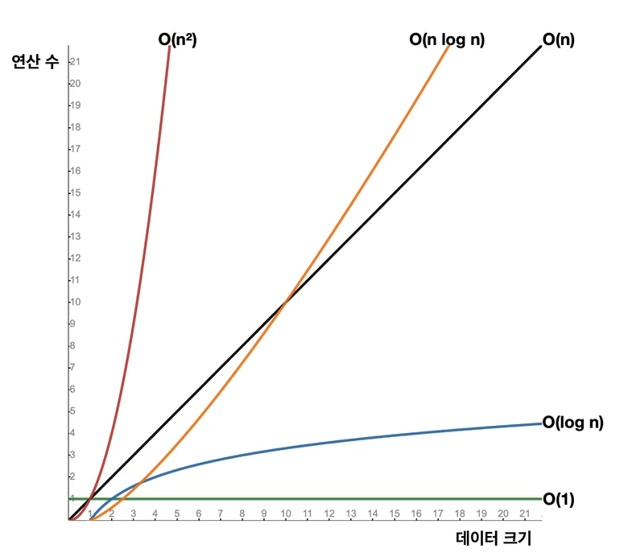
- 빅오(Big O) 표기법은 알고리즘의 성능을 분석할 때 사용하는 수학적 표현 반식이다.
- 이는 특히 알고리즘이 처리해야 할 데이터의 양이 증가할 때, 그 알고리즘이 얼마나 빠르게 실행되는지 나타낸다.
- 여기서 중요한 것은 알고리즘의 정확한 실행 시간을 계산하는 것이 아니라,   
  데이터 양의 증가에 따른 성능 변화 추세를 이해하는 것이다.

#### 빅오 표기법의 예시
- **O(1) - 상수 시간**: 입력 데이터의 크기에 관계없이 알고리즘의 실행 시간이 일정하다.  
  예) 배열에서 인덱스를 사용하는 경우
- **O(log n) - 로그 시간**: 알고리즘의 실행 시간이 데이터의 크기의 로그에 비례하여 증가한다.
  예) 이진 탐색
- **O(n) - 선형 시간**: 알고리즘의 실행 시간이 입력 데이터의 크기에 비례하여 증가한다.  
  예) 배열의 검색, 배열의 모든 요소를 순회하는 경우
- **O(n log n) - 선형 로그 시간**:   
  예) 많은 효율적인 정렬 알고리즘들
- **O(n^2) - 제곱 시간**: 알고리즘의 실행 시간이 입력 데이터의 크기의 제곱에 비례하여 증가한다.   
  예) 보통 이중 루프를 사용하는 알고리즘에 나타난다.

#### 빅오 표기법
- 빅오 표기법은 매우 큰 데이터를 입력한다고 가정하고, 데이터 양 증가에 따른 성능 변화 추세를 표현하는 데 사용한다.
- 쉽게 이야기해서 정확한 성능을 측정하는 것이 목표가 아니라 매우 큰 데이터가 들어왔을 때의 대략적인 추세를 비교하는 것이 목적이다.
- 따라서 데이터가 매우 많이 들어오면 추세를 보는데 상수는 크게 의미가 없어진다.
- 이런 이유로 빅오 표기법에서는 상수를 제거한다. 예를 들어 O(n + 2), O(n/2) 모두 O(n)으로 표시한다.
- 빅오 표기법은 별도의 이야기가 없으면 보통 최악의 상황을 가정해서 표기한다.
- 물론 최적, 보통, 최악의 경우로 나누어 표기하는 경우도 있다. 예를 들어 배열 순차 검색의 경우를 나누어 보면
    - 최적의 경우: 배열의 첫번째 항목에서 바로 값을 찾으면 O(1)이 된다.
    - 최악의 경우: 마지막 항목에 있거나 항목이 없는 경우 전체 요소를 순회한다. 이 경우 O(n)이 된다.
    - 평균의 경우: 평균적으로 보면 보통 중간쯤 데이터를 발견하게 된다. 이경우 O(n/2)가 되지만,  
      상수를 제외해서 O(n) 으로 표기한다. 최악과 비교하기 위해 O(n/2)로 표기하는 경우도 있다.

### 3-3. 배열의 특징2 - 데이터 추가
- 데이터 추가는 기존 데이터를 유지하면서 새로운 데이터를 입력하는 것을 뜻한다.
- 참고로 데이터를 중간에 추가하면 기존 데이터가 오른쪽으로 한 칸씩 이동해야 한다.
- 이 말은 좀 더 쉽게 풀어보자면 데이터를 추가하려면 새로운 데이터를 입 력할 공간을 확보해야 한다.
- 따라서 기존 데이터를 오른쪽으로 한 칸씩 밀어내야 한다.(기존 데이터의 인덱스를 하나씩 증가시켜야 한다.)

#### 배열의 데이터 추가 예시
- 배열에 데이터를 추가하는 위치에 따라서 크게 3가지로 나눌 수 있다.
    - 배열의 첫번째 위치에 추가  
      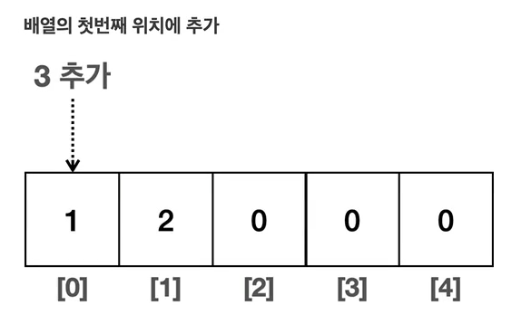    
      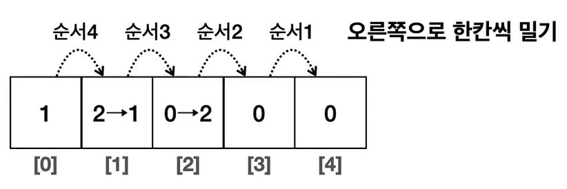
        - 기존 배열들을 오른쪽으로 한 칸씩 밀어서 추가할 위치를 확보한다.
        - 이때 배열의 마지막 부분 부터 오른쪽으로 밀어야 데이터를 유지할 수 있다.
        - 왼쪽의 데이털를 오른쪽에 대입하는 과정을 반복한다.
        - 이 과정이 끝나면 1,1,2 라고 저장되어 있다.

      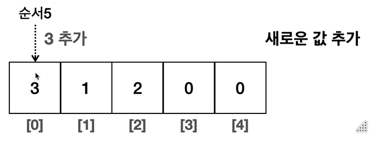
        - 이제 첫번째 공간이 확보되었으므르 여기에 새로운 값을 추가한다.
    - 배열의 중간 위치에 추가  
      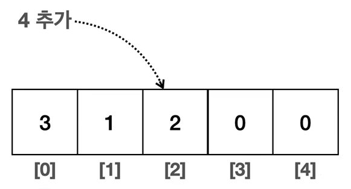  
      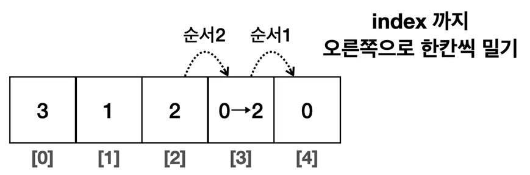
        - 지정한 index 에 데이터를 추가할 위치를 확보해야 한다.
        - 따라서 마지막 부분부터 index 까지 데이터들을 오른쪽으로 한 칸씩 밀어야한다.
        - index 왼쪽의 데이터는 이동하지 않아도 된다.

      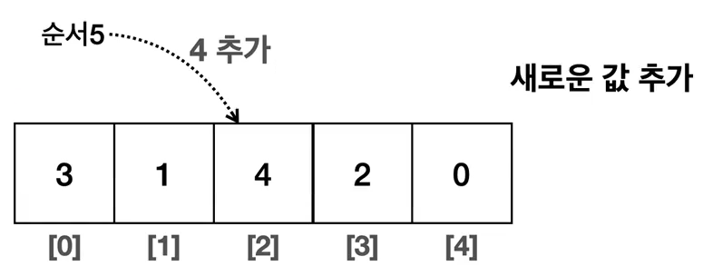
    - 배열의 마지막 위치에 추가  
      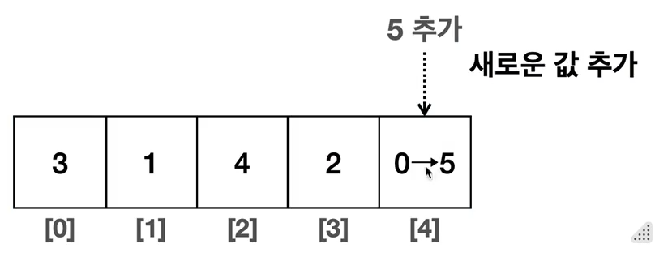
        - 배열의 마지막 위치에 추가하는 경우 기존 데이터를 이동하지 않아도 된다.
        - 따라서 단순하게 값만 입력하면 된다.

#### 배열에 데이터를 추가할 때 위치에 따른 성능 변화
- 배열의 첫번째 위치에 추가
    - 배열의 첫번째 위치를 찾는 데는 인덱스를 사용하므로 O(1)이 걸린다.
    - 모든 데이터를 배열의 크기만큼 한 칸씩 이동해야 한다. 따라서 O(n) 만큼의 연산이 걸린다.
    - O(1 + n) -> O(n) 이 된다.
- 배열의 중간 위치에 추가
    - 배열의 첫번째 위치를 찾는 데는 O(1)이 걸린다.
    - index의 오른쪽에 있는 데이터들을 모두 한 칸씩 이동해야 한다. 따라서 평균 연산은 O(n/2)이 된다.
    - O(1 + n/2) -> O(n) 이 된다.
- 배열의 마지막 위치에 추가
    - 배열이 이동하지 않고 배열의 길이를 사용하면 마지막 인덱스에 바로 접근할 수 있다.
    - 한 번의 계산으로 위치를 찾을 수 있고 기존 배열을 이동하지 않아도 되기 때문에 O(1) 이 된다.

#### 코드 구현
    public class ArrayMain2 {
    
        public static void main(String[] args) {
            int[] arr = new int[5];
            arr[0] = 1;
            arr[1] = 2;
            System.out.println(Arrays.toString(arr));
    
            // 배열의 첫번째이 위치에 추가
            // 기존 배열의 데이터를 한 칸씩 뒤로 밀고 배열의 첫번째 위치에 추가
            System.out.println("배열의 첫번째 위치에 3 추가 O(n)");
            int newValue = 3;
            addFirst(arr, newValue);
            System.out.println(Arrays.toString(arr));
    
            // index 위치에 추가
            // 기존 배열의 데이터를 한 칸씩 뒤로 밀고 배열의 인덱스 위치에 추가
            System.out.println("배열의 index(2) 위치에 4 추가 O(n/2)");
            int index = 2;
            int value = 4;
            addAtIndex(arr, index, value);
            System.out.println(Arrays.toString(arr));
    
            // 마지막 위치에 추가
            // 기존 배열의 마지막 위치에 추가
            System.out.println("배열의 마지막 위치에 5 추가 O(1)");
            addLast(arr, 5);
            System.out.println(Arrays.toString(arr));
        }
    
        private static void addFirst(int[] arr, int newValue) {
            for (int i = arr.length - 1 ; i > 0; i--) {
                arr[i] = arr[i-1];
            }
            arr[0] = newValue;
        }
    
        private static void addAtIndex(int[] arr, int index, int newValue) {
            for (int i = arr.length - 1 ; i > index; i--) {
                arr[i] = arr[i-1];
            }
            arr[index] = newValue;
        }
    
        private static void addLast(int[] arr, int newValue) {
            arr[arr.length - 1] = newValue;
        }
    
    }

#### 배열의 한계
- **배열은 가장 기본적인 자료 구조이고, 특히 인덱스를 사용할 때 최고의 효율이 나온다.**
- 하지만 **이런 배열에는 큰 단점이 있다. 바로 배열의 크기를 배열을 생성하는 시점에 미리 정해야 한다는 점이다.**
- 예를 들어 이벤트를 하는데, 누구나 이벤트에 참여할 수 있고, 이벤트가 끝나면 추첨을 통해서 당첨자를 정한다고 가정해보자.  
  이때 이벤트에 참여하는 사용자를 배열에 보관하는 경우, 사용자들은 실시간으로 계속 추가된다.  
  넉넉하게 길이가 1000인 배열을 사용했는데, 예상보다 이벤트 참여자가 많아서 1000명을 넘게 된다면,  
  더 많은 사용자가 이벤트에 참여하지 못하는 문제가 발생한다. 그렇다고 처음부터 너무 많은 배열을 확보하면 메모리가 낭비된다.
- 배열처럼 처음부터 정적으로 정해져있는 것이 아니라, 동적으로 언제든지 길이를 늘리고 줄일 수 있는 자료구조가 있다면 편리할 것이다.

### 3-4. 직접 구현하는 배열 리스트1 - 시작
- 배열의 경우 다음 2가지 불편함이 있다.
    - 배열의 길이를 동적으로 변경할 수 없다.
    - 데이터를 추가하기 불편하다.
        - 데이터를 추가하는 경우 직접 오른쪽으로 한 칸씩 데이터를 밀어야 한다.(이런 코드를 직접 작성해야 한다.)
- 배열의 이런 불편함을 해소하고 동적으로 데이터를 추가할 수 있는 자료구조를 List(리스트)라 한다.

#### List 자료 구조
- 순서가 있고, 중복을 허용하는 자료 구조를 리스트라 한다.
- 일반적으로 배열과 리스트는 구분해서 이야기한다. 리스트는 배열보다 유연한 자료 구조로, 크기가 동적으로 변할 수 있다.
    - 배열: 순서가 있고 중복을 허용하지만 크기가 정적으로 고정된다.
    - 리스트: 순서가 있고 중복을 허용하지만 크기가 동적으로 변할 수 있다.
- 여기서 중복을 허용한다는 뜻은 같은 데이터를 입력할 수 있다는 뜻이다.  
  참고로 자료 구조중 Set 은 중복을 허용하지 않는다.

#### MyArrayListV1 구현
- 보통 배열을 사용한 리스트라고 해서 ArrayList 라고 부른다.
- 예제를 점진적으로 발전시킬 예정이므로, 우선은 최대한 단순하게 구현한다.
####
    public class MyArrayListV1 {
    
        private static final int DEFAULT_CAPACITY = 5;
    
        private Object[] elementData;
        private int size = 0;
    
        // 기본 생성자
        public MyArrayListV1() {
            elementData = new Object[DEFAULT_CAPACITY];
        }
    
        // 직접 크기를 정하는 생성자
        public MyArrayListV1(int initialCapacity) {
            elementData = new Object[initialCapacity];
        }
    
        public int size() {
            return size;
        }
    
        public void add(Object e) {
            elementData[size] = e;
            size++;
        }
    
        public Object get(int index) {
            return elementData[index];
        }
    
        public Object set(int index, Object element) {
            Object oldValue = get(index);
            elementData[index] = element;
            return oldValue;
        }
    
        public int indexOf(Object o) {
            for (int i = 0; i < size; i++) {
                if (elementData[i].equals(o)) {
                    return i;
                }
            }
            return -1;  // 못찾은 경우
        }
    
        public String toString() {
            // [1, 2, 3, null, null] size=3
            // [1, 2, 3] size=3
            return Arrays.toString(Arrays.copyOf(elementData, size)) +
                    " size=" + size + ", capacity=" + elementData.length;
        }
    }
####
    public class MyArrayListV1Main {
    
        public static void main(String[] args) {
            MyArrayListV1 list = new MyArrayListV1();
            System.out.println(list);
            System.out.println("==데이터 추가==");
            list.add("a");
            System.out.println(list);
            list.add("b");
            System.out.println(list);
            list.add("c");
            System.out.println(list);
    
            System.out.println("==기능 사용==");
            System.out.println("list.size() = " + list.size());
            System.out.println("list.get(1) = " + list.get(1));
            System.out.println("list.indexOf(\"c\") = " + list.indexOf("c"));
            System.out.println("list.set(2, \"z\") = " + list.set(2, 'z'));
            System.out.println(list);
    
            System.out.println("==범위 초과==");
            list.add("d");
            System.out.println(list);
            list.add("e");
            System.out.println(list);
    
            // 범위 초과, capacity 가 늘어나지 않으면 예외 발생 (ArrayIndexOutOfBoundsException 에러)
            list.add("f");
            System.out.println(list);
        }
    }

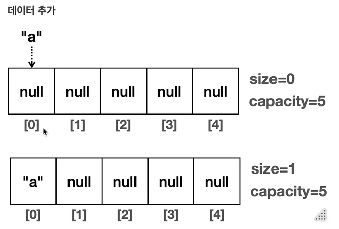
- 리스트의 사이즈(size)는 실제 데이터가 입력된 킄기를 뜻한다. 
- 배열의 크기와는 무관하고 배열의 크기는 capacity 로 표현한다.
  - 리스트의 크기는 배열의 크기가 아니라 size 로 판단해야한다. 
  - 처음에 데이터가 없을 때의 size 는 0 이다.
- 데이터를 추가하면 size 가 하나 증가한다.

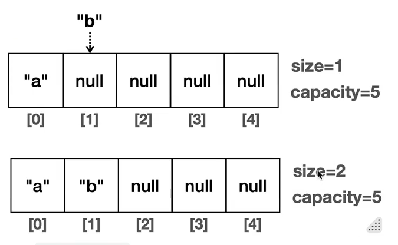  
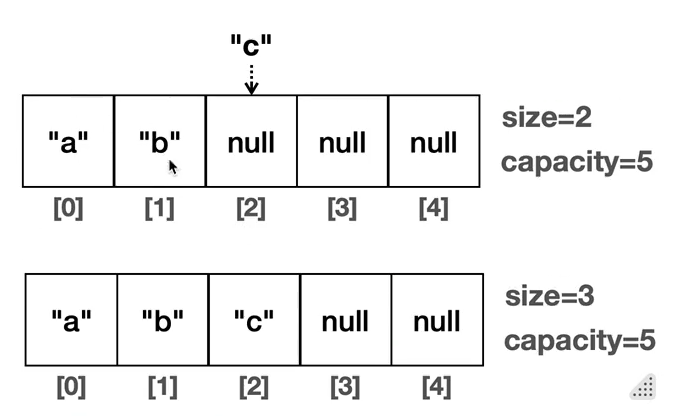  
- 데이터를 추가하면 리스트에 들어있는 데이터의 마지막 부분에 새로운 데이터를 추가한다.

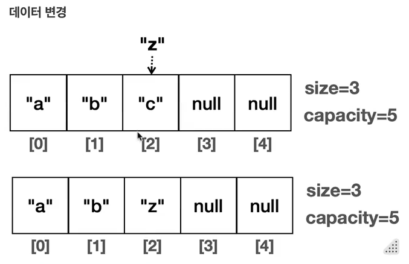
-  인덱스를 사용해서 데이터를 변경한다. 해당 인덱스의 위치를 찾앗서 변경한다.

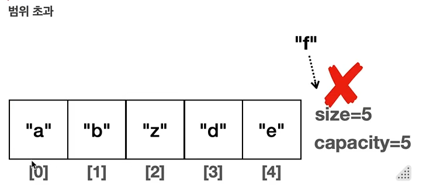
- size 가 배열의 크기안 capacity에 도달하면 더는 데이터를 추가할 수 없다.
- 따라서 f 값을 입력할 때 예외가 발생한다.
- 우리가 원하는 리스트는 동적으로 저장할 수 있는 크기가 커지는 리스트이다.
- 저장할 수 있는 데이터의 크기를 동적으로 변할 수 있도록 코드를 변경해보자.

### 3-5. 직접 구현하는 배열 리스트2 - 동적 배열
- 데이터를 추가할 때 리스트의 size 가 배열의 크기인 capacity 를 넘어가는 경우  
  더 큰 배열을 만들고 그곳에 기존 배열을 복사한 뒤 참조를 바꿔 문제를 해결해보자.

####
    public class MyArrayListV2 {
    
        private static final int DEFAULT_CAPACITY = 5;
    
        private Object[] elementData;
        private int size = 0;
    
        public MyArrayListV2() {
            elementData = new Object[DEFAULT_CAPACITY];
        }
    
        public MyArrayListV2(int initialCapacity) {
            elementData = new Object[initialCapacity];
        }
    
        public int size() {
            return size;
        }
    
        public void add(Object e) {
            // 코드 추가
            if (size == elementData.length) {
                grow();
            }
            elementData[size] = e;
            size++;
        }
    
        private void grow() {
            int oldCapacity = elementData.length;
            int newCapacity = oldCapacity * 2;
    
            // 배열을 새로 만들고, 기존 배열을 새로운 배열에 복사 후 참조 변경
            //Object[] newArr = new Object[newCapacity];
            //for (int i = 0; i < elementData.length; i++) {
            //    newArr[i] = elementData[i];
            //}
            //elementData = newArr;
    
            // 배열 새로 만들고 기존 배열을 복사하는 것을 간단하게 해주는 메소드
             elementData = Arrays.copyOf(elementData, newCapacity);
        }
    
        public Object get(int index) {
            return elementData[index];
        }
    
        public Object set(int index, Object element) {
            Object oldValue = get(index);
            elementData[index] = element;
            return oldValue;
        }
    
        public int indexOf(Object o) {
            for (int i = 0; i < size; i++) {
                if (elementData[i].equals(o)) {
                    return i;
                }
            }
            return -1;  // 못찾은 경우
        }
    
        public String toString() {
            // [1, 2, 3, null, null] size=3
            // [1, 2, 3] size=3
            return Arrays.toString(Arrays.copyOf(elementData, size)) +
                    " size=" + size + ", capacity=" + elementData.length;
        }
    }
- 추가된 부분은 grow( ) 메서드와 이 메서드를 호출하는 add( ) 메서드이다.
- add( ) 메서드에서 데이터를 추가할 때 size 가 배열의 크기에 도달했다면 더는 데이터를 추가할 수 없다.
- 따라서 이때는 grow( ) 를 호출해서 기존 배열을 복사한 새로운 배열을 만들고 배열의 크기도 여유있게 2배로 늘려준다.
  - **Arrays.copyOf(기존배열, 새로운길이)**: 새로운 길이로 배열을 생성하고, 기존 배열의 값을 새로운 배열에 복사한다.

####
    public class MyArrayListV2Main {
    
        public static void main(String[] args) {
            MyArrayListV2 list = new MyArrayListV2(2);
            System.out.println(list);
            System.out.println("==데이터 추가==");
            list.add("a");
            System.out.println(list);
            list.add("b");
            System.out.println(list);
            list.add("c");
            System.out.println(list);
            list.add("d");
            System.out.println(list);
            list.add("e");
            System.out.println(list);
            list.add("f");
            System.out.println(list);
        }
    }
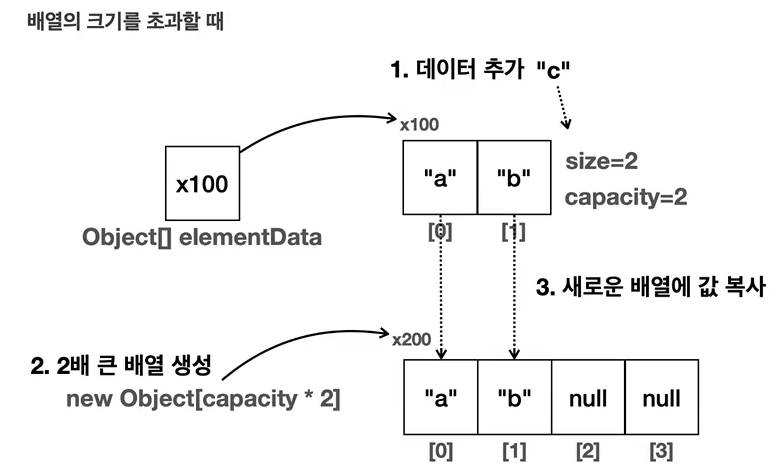
1. 데이터를 추가하면 size 가 배열의 크기인 capacity 를 초과하게 된다.
2. 이때 grow( ) 메서드를 호출하는데, 이 메서드는 다음과 같은 역할을 수행한다.
   1. 2배 큰 배열을 새로 생성한다.
   2. 새로운 배열에 기존 배열의 값을 복사한다.
   3. Arrays.copyOf(기존배열, 새로운길이) 를 사용해서 2배 큰 배열을 새로 생성하면서   
      동시에 새로운 배열에 기존 배열의 값을 복사한다.
   4. 참조값을 변경한다.

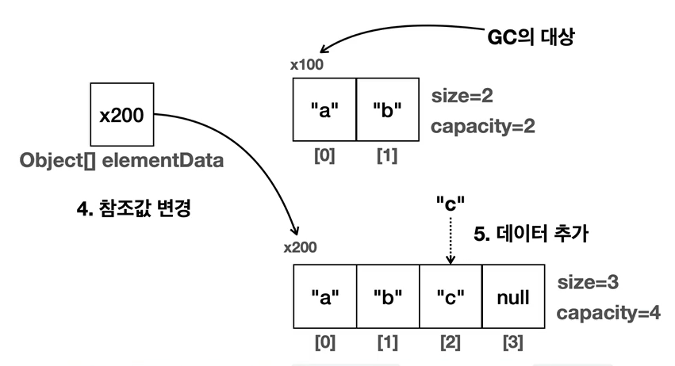
3. 이렇게 되면 내부 데이터를 보관하는 elementData 는 기존 보다 2배 큰 capacity 를 가진 배열을 보유하게 된다.
4. 이렇게 증가된 배열의 데이터를 추가하면 된다.
5. 기존 배열(x001)은 더는 참조하는 곳이 없으므로 GC 의 대상이 된다.

- grow( )를 호출할 대 배열의 크기는 기존과 비교해서 2배씩 증가한다.
- 데이터가 하나 추가될 때마다 배열의 크기를 1씩만 증가하게 되면 배열을 복사하는 연산이 너무 자주 발생할 가능성이 높다.
- 배열을 새로 복사해서 만드는 연산은 배열을 새로 만들고 또 기존 데이터를 복사하는 시간이 걸리므로 가능한 줄이는 것이 좋다.
- 이렇게 2배씩 증가하면 배열을 새로 만들고 복사하는 연산을 줄일 수 있지만, 너무 크게 증가하면 낭비되는 메모리가 많아진다.
- 보통은 50% 정도 증가하는 방법을 사용한다.

#### 정리
- 우리가 만든 MyArrayListV2 는 정적인 배열과 다르게 크기가 동적으로 변하는 자료 구조이다.
- 따라서 데이터의 크기를 미리 정하지 않아도 된다.
- 물론 MyArrayListV2 의 내부에서는 배열을 사용하지만, MyArrayListV2 를 사용하는 개발자들은 이른 부분을 신경쓰지 않아도 된다.

### 3-6. 직접 구현하는 배열 리스트3 - 기능 추가
- MyArrayList 를 더 가치있게 만들기 위해 다음 기능을 추가하자.
  - add(index, data): index 위치에 데이처를 추가한다.
  - remove(index): index 위치의 데이터를 삭제한다.
- 앞서 만든 add( ) 메서드는 리스트의 마지막에 데이터를 추가하기 때문에 배열에 들어 있는 기존 데이터는 이동하지 않는다.  
  하지만 앞이나 중간에 데이터를 추가하면 배열에 들어 있는 기존 데이터를 이동하고 데이터를 추가해야한다. 
- 삭제의 경우도 마찬가지다. 마지막에 있는 데이터를 삭제하면 기존 데이터를 이동하지 않아도 된다.   
  하지만 앞이나 중간에 있는 데이터를 삭제하면 빈자리를 채우기 위해 데이터를 한 칸씩 왼쪽으로 이동해야 한다.

#### 코드 구현
    public class MyArrayListV3 {
    
        private static final int DEFAULT_CAPACITY = 5;
    
        private Object[] elementData;
        private int size = 0;
    
        public MyArrayListV3() {
            elementData = new Object[DEFAULT_CAPACITY];
        }
    
        public MyArrayListV3(int initialCapacity) {
            elementData = new Object[initialCapacity];
        }
    
        public int size() {
            return size;
        }
    
        public void add(Object e) {
            if (size == elementData.length) {
                grow();
            }
            elementData[size] = e;
            size++;
        }
    
        // 코드추가
        public void add(int index, Object e) {
            if (size == elementData.length) {
                grow();
            }
            // 데이터 이동(인덱스를 기준으로 오른쪽으로 한칸씩 이동)
            shiftRightFrom(index);
            // 데이터 삽입
            elementData[index] = e;
            size++;
        }
    
        // 코드 추가, 요소의 마지막부터 index 까지 오른쪽으로 밀기
        private void shiftRightFrom(int index) {
            for (int i = size; i > index; i--) {
                elementData[i] = elementData[i - 1];
            }
        }
    
        private void grow() {
            int oldCapacity = elementData.length;
            int newCapacity = oldCapacity * 2;
            elementData = Arrays.copyOf(elementData, newCapacity);
        }
    
        public Object get(int index) {
            return elementData[index];
        }
    
        public Object set(int index, Object element) {
            Object oldValue = get(index);
            elementData[index] = element;
            return oldValue;
        }
    
        // 코드 추가
        public Object remove(int index) {
            Object oldValue = get(index);
            // 데이터 이동
            shiftLeftFrom(index);
            // 사이즈 줄이기
            size--;
            elementData[size] = null;
            // 제거한 값 반환
            return oldValue;
        }
    
        // 코드 추가, 요소의 index 부터 마지막까지 왼쪽으로 밀기
        private void shiftLeftFrom(int index) {
            for (int i = index; i < size - 1; i++) {
                elementData[i] = elementData[i + 1];
            }
        }
    
        public int indexOf(Object o) {
            for (int i = 0; i < size; i++) {
                if (elementData[i].equals(o)) {
                    return i;
                }
            }
            return -1;  // 못찾은 경우
        }
    
        public String toString() {
            // [1, 2, 3, null, null] size=3
            // [1, 2, 3] size=3
            return Arrays.toString(Arrays.copyOf(elementData, size)) +
                    " size=" + size + ", capacity=" + elementData.length;
        }
    }
####
    public class MyArrayListV3Main {
    
        public static void main(String[] args) {
            MyArrayListV3 list = new MyArrayListV3();
    
            // 마지막에 추가 O(1)
            list.add("a");
            list.add("b");
            list.add("c");
            System.out.println(list);
    
            // 원하는 위치에 추가 O(n)
            System.out.println("addLast");
            list.add(3, "addLast"); // 0(1)
            System.out.println(list);
    
            System.out.println("addFirst");
            list.add(0, "addFirst"); // O(n)
            System.out.println(list);
    
            // 원하는 위치 삭제
            Object removed1 = list.remove(4); // O(1)
            System.out.println("remove(4) = " + removed1);
            System.out.println(list);
    
            Object removed2 = list.remove(0); // O(n)
            System.out.println("remove(0) = " + removed2);
            System.out.println(list);
        }
    }

#### 배열 리스트의 빅오
- 데이터 추가 
  - 마지막에 추가: O(1)
  - 앞, 중간에 추가: O(n)
- 데이터 삭제
  - 마지막에 삭제: O(1)
  - 앞, 중간에 삭제: O(n)
- 인스턴스 조회: O(1)
- 데이터 검색: O(n)

#### 정리
- 지금까지 우리가 만든 자료 구조를 배열 리스트(ArrayList)라 한다.
- 리스트(List) 자료 구조를 사용하는데, 내부의 데이터는 배열(Array)에 보관하는 것이다.
- 배열 리스트는 마지막에 데이터를 추가하거나 마지막에 있는 데이터를 삭제할 때는 O(1)로 매우 빠르지만,  
  중간에 데이터를 추가하거나 삭제하는 경우에는 O(n)으로 느리다.
- 배열 리스트는 보통 데이터를 중간에 추가하고 삭제하는 변경 보다는,  
  데이터를 순서대로 입력하고(데이터를 마지막에 추가하고), 순서대로 출력하는 경우에 가장 효율적이다.

### 3-7. 직접 구현하는 배열 리스트4 - 제네릭1
- 앞서 만든 MyArrayList 들은 Object 를 입력받기 때문에 아무 데이터나 입력할 수 있고, 또 결과로 Object 를 반환한다. 
- 따라서 필요한 경우 다운 캐스팅을 해야하고, 또 타입 안정성이 떨어지는 단점이 있다.

#### 다운 캐스팅 시 오류 발생, ClassCastException 
    public class MyArrayListV3BadMain {
    
        public static void main(String[] args) {
            MyArrayListV3 numberList = new MyArrayListV3();
    
            // 숫자만 입력 하기를 기대
            numberList.add(1);
            numberList.add(2);
            numberList.add("문자3");  // 문자를 입력
            System.out.println(numberList);
    
            // Object 를 반환하므로 다운 캐스팅 필요
            Integer num1 = (Integer) numberList.get(0);
            Integer num2 = (Integer) numberList.get(1);
    
            // ClassCastException 발생, 문자를 Integer 로 캐스팅
            Integer num3 = (Integer) numberList.get(2);
            
        }
    }
- numberList 에는 숫자만 입력하기를 기대했지만, Object 를 받아서 저장하기 때문에 자바의 몸든 타입을 다 저장할 수 있다.
- 따라서 숫자를 입력하다가 실수로 문자를 입력해도 알아차리지 못한다.
- 값을 꺼낼 때 Object 를 반환하기 때문에 원래 입력한 타입으로 받으려면 다운 캐스팅 해야 한다.
- 이때 입력한 데이터 타입을 정확하게 알고 있지 않으면 예외가 발생한다. 지금 처럼 중간에 문자가 들어가면 문제가 될 수 있다.
- 제네릭을 도입하면 타입 안정성을 확보하면서 이런 문제를 한 번에 해결할 수 있다. 
- 제네릭은 자료를 보관하는 자료 구조에 가장 어울린다. 

> **!참고** - 하나의 자료 구조에 숫자와 문자처럼 서로 관계없는 여러 데이터 타입을 섞어서 보관하는 일은 거의 없다.  
> 일반적으로 같은 데이터 타입을 보관하고 관리한다.

#### 제네릭을 적용한 ArrayList
    public class MyArrayListV4<E> {
    
        private static final int DEFAULT_CAPACITY = 5;
    
        private Object[] elementData;
        private int size = 0;
    
        public MyArrayListV4() {
            // 생성자에는 제네릭 타입을 사용하지 못한다.
            elementData = new Object[DEFAULT_CAPACITY];
        }
    
        public MyArrayListV4(int capacity) {
            elementData = new Object[capacity];
        }
    
        public int size() {
            return size;
        }
    
        public void add(E e) {
            if (size == elementData.length) {
                grow();
            }
            elementData[size] = e;
            size++;
        }
        
        public void add(int index, E e) {
            if (size == elementData.length) {
                grow();
            }
            shiftRightFrom(index);
            elementData[index] = e;
            size++;
        }
        
        private void shiftRightFrom(int index) {
            for (int i = size; i > index; i--) {
                elementData[i] = elementData[i - 1];
            }
        }
    
        private void grow() {
            int oldCapacity = elementData.length;
            int newCapacity = oldCapacity * 2;
            elementData = Arrays.copyOf(elementData, newCapacity);
        }
    
        @SuppressWarnings("unchecked")  // 경고를 무시하겠다.
        public E get(int index) {
            // E 로 다운 캐스팅 필요
            return (E) elementData[index];
        }
    
        public E set(int index, E element) {
            E oldValue = get(index);
            elementData[index] = element;
            return oldValue;
        }
    
        public E remove(int index) {
            E oldValue = get(index);
            shiftLeftFrom(index);
            size--;
            elementData[size] = null;
            return oldValue;
        }
        
        private void shiftLeftFrom(int index) {
            for (int i = index; i < size - 1; i++) {
                elementData[i] = elementData[i + 1];
            }
        }
    
        public int indexOf(E o) {
            for (int i = 0; i < size; i++) {
                if (elementData[i].equals(o)) {
                    return i;
                }
            }
            return -1; 
        }
    
        public String toString() {
            return Arrays.toString(Arrays.copyOf(elementData, size)) +
                    " size=" + size + ", capacity=" + elementData.length;
        }
    }
- MyArrayListV4<E> 로 제네릭 타입을 선언한다. E 는 Element 로 요소의 줄임말이다.
- Object 로 입력받고 출력했던 곳을 타입 매개변수 E 로 변경한다.
- 생성자의 Object[] elementData 는 그대로 유지한다. 이 부분은 바로 뒤에서 설명한다.

#### 
    public class MyArrayListV4Main {
    
        public static void main(String[] args) {
            MyArrayListV4<String> stringList = new MyArrayListV4<>();
            stringList.add("a");
            stringList.add("b");
            stringList.add("c");
            String string = stringList.get(0);
            System.out.println("str = " + string);
    
            MyArrayListV4<Integer> integerList = new MyArrayListV4<>();
            integerList.add(1);
            integerList.add(2);
            integerList.add(3);
            Integer integer = integerList.get(0);
            System.out.println("integer = " + integer);
        }
    }
- 이제 stringList 에는 String 문자열만 보관 및 조회하고, integerList에는 Integer 숫자만 보관 및 조회할 수 있다.
- 다른 타입의 값을 저장하면 컴파일 오류가 발생한다. 
- 추가로 값을 조회할 때도 위험한 다운 캐스팅 없이 지정한 타입으로 안전하게 조회할 수 있다.
- 제네릭을 사용한 덕분에 타입 인자로 지정한 타입으로만 안전하게 데이터를 저장하고, 조회할 수 있게 되었다.
- 제네릭의 도움으로 타입 안정성이 높은 자료 구조를 만들 수 있었다.

### 3-8. 직접 구현하는 배열 리스트5 - 제네릭2
#### Object 배열을 사용한 이유
- Object[] elementsData 를 그대로 사용하는 이유
  - **제네릭은 런타임에 이레이저에 의해 타입 정보가 사라진다. 따라서 런타임에 타입 정보가 필요한 생성자에 사용할 수 없다**.
  - 제네릭을 기반으로 배열을 생성하는 다음 코드는 작동하지 않고, 컴파일 오류가 발생한다.  
    참고로 이것은 자바가 제공하는 제네릭의 한계이다.
  - 대신에 다음과 같이 모든 데이터를 담을 수 있는 Object 를 그대로 사용해야 한다.  
    
        new Object[DEFAULT_CAPACITY]
- 이렇게 Object[ ] 을 생성해서 사용해도 문제가 없는, 이 부분을 조금 더 살펴보자.
- new MyArrayListV4<String> 을 사용한 경우 E 가 다음과 같이 처리된다.

#### 제네릭 타입 인자 적용 전
    Object[] elementData;
    
    void add(E e) {
        elementData[size] = e;
        ...
    }
    String get(int index) {
        return (E) elementData[index];
    }

#### 제네릭 타입 인자 적용 후 
    Object [] elementData;
    
    void add(String e) {
        elementData[size] = e;
        ...
    }
    
    String get(int index) {
        return (String) elementData[index]
    }

- elementData[ ] 에 데이터를 보관하는 add(E e) 메서드를 보자. E 타입으로 데이터를 입 력한다.
- elementData[ ] 에 데이터를 조회하는 get( ) 메서드를 보자. 보관할 때와 같은 E 타입으로 데이터를 다운 캐스팅해서 반환한다.
- 따라서 배열의 모든 데이터는 E 타입으로 보관된다. 
- 그리고 get( ) 으로 배열에서 데이터를 꺼낼 때 (E) 로 다운 캐스팅해도 보관한 E 타입으로 다운 캐스팅하기 때문에 문제가 되지 않는다.
-  구체적인 예시
   - MyArrayListV4 를 생성할 때 타입 매개변수 E 를 String 으로 지정했다면 elementData 에는 항상 String 이 저장된다.
   - add(String e) 에서 배열의 모든 데이터는 String 타입으로 보관된다.
   - get( ) 에서 데이터를 꺼낼 때 항상 (String) 로 다운 캐스팅 한다.   
   - 저장한 String 타입으로 다운 캐스팅 하기 때문에 아무런 문제가 되지 않는다.
   - Object 는 모든 데이터를 담을 수 있기 때문에 데이터를 담는데는 아무런 문제가 없다.
   - 다만 데이터를 조회할 때 문제가 될 수 있는데, 이때는 조회한 Object 타입을 지정한 타입 매개변수로 다운 캐스팅 해준다.
- 정리하자면 
   - 생성자에는 제네릭의 타입 매개변수를 사용할 수 없는 한계가 있다.
   - 따라서 배열을 생성할 때 대안으로 Object 배열을 사용해야 한다.
   - 하지만 제네릭이 리스트의 데이터를 입력 받고 반환하는 곳의 타입을 고정해준다.
   - 따라서 고정된 타입으로 Object 배열에 데이터를 보관하고, 꺼낼 때도 같은 고정된 타입으로 안전하게 다운 캐스팅 할 수 있다.

#### MyArrayList의 단점
- 배열을 사용한 리스트인 MyArrayList 는 다음과 같은 단점이 있다.
  - 정확한 크기를 미리 알지 못하면 메모리가 낭비된다.   
    배열을 사용하므로 배열의 뒷 부분에 사용되지 않고, 낭비되는 메모리가 있다.
  - 데이터를 중간에 추가하거나 삭제할 때 비효율적이다.
    - 이 경우 데이터를 한 칸씩 밀어야 한다. 이것은 O(n) 으로 성능이 좋지 않다.
    - 만약 데이터의 크기가 1,000,000 건 이라면 최악의 경우 데이터를 추가할 때 마다 1,000,000 건의 데이터를 밀어야 한다.
  
#### ArrayList 의 빅오 정리
- 데이터 추가
  - 마지막에 추가: O(1)
  - 앞,중간에 추가: O(n)
- 데이터 삭제
  - 마지막에 삭제: O(1)
  - 앞,중간에 삭제: O(n)
- 인덱스 조회: O(1) 
- 데이터 검색: O(n)

####
- 배열 리스트는 순서대로 마지막에 데이터를 추가하거나 삭제할 때는 성능이 좋지만,  
  앞이나 중간에 데이터를 추가하거나 삭제할 때는 성능이 좋지 않다.
- 다음 시간에는 이런 단점을 해결한 자료 구조인 연결 리스트(LinkedList)에 대해 알아보자.

 

## 4. 컬렉션 프레임워크 - LinkedList
### 4-1. 노드와 연결1
#### 배열 리스트의 단점
- 배열 리스트는 내부에 배열을 사용해서 데이터를 보관하고 관리한다. 이로 인해 다음과 같은 단점을 가진다.
  - 배열은 필요한 배열의 크기를 미리 확보해야 한다. 데이터가 얼마나 추가될지 예측할 수 없는 경우 나머지 공간은 낭비된다.
  - 배열의 중간 데이터 추가/삭제 시 기존 데이터들을 이동시켜야 해서 성능이 좋지 않다.

#### 노드와 연결
- 낭비되는 메모리 없이 딱 필요한 만큼만 메모리를 확보해서 사용하고,  
  또 앞이나 중간에 데이터를 추가하거나 삭제할 때도 효율적인 자료구조가 있다.
- 바로 노드를 만들고 각 노드를 서로 연결하는 방식이다.
- 노드 클래스 

      public class Node {
          Object item;
          Node next;
      }
  - 노드 클래스는 내부에 저장할 데이터인 Item 과, 다음으로 연결한 노드의 참조인 next 를 가진다.
  - 이 노드 클래스를 사용해서 데이터 A, B, C 를 순서대로 연결해보자.
- 노드에 데이터 A 추가  
    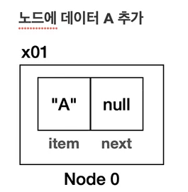   
    - Node 인스턴스를 생성하고, item 에 "A" 를 넣어준다.   
  
    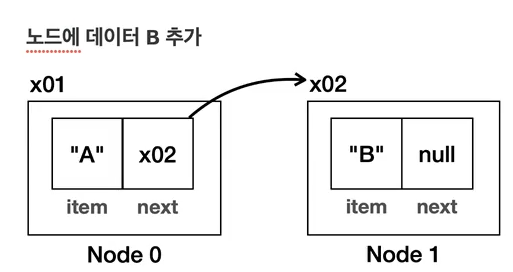
    - Node 인스턴스를 생성하고, item 에 "B" 를 넣어준다.
    - 처음 만든 노드의 Node next 필드에 새로 만든 노드의 참조값을 넣어준다.
    - 이렇게 하면 첫 번째 노드와 두 번째 노드가 서로 연결된다.
    - 첫 번째 노드의 node.next 를 호출하면 두 번째 노드를 구할 수 있다.  

    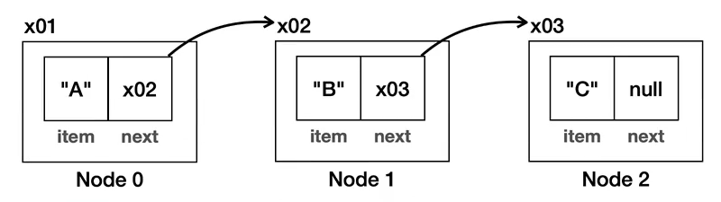 
    - Node 인슽너스를 생성하고, item 에 "C" 를 넣어준다.
    - 두 번째 만든 노드의 Node next 필드에 새로 만든 노드의 참조값을 넣어준다.
    - 이렇게하면 두 번째 노드와 세 번째 노드가 서로 연결된다.
    - 첫 번째 노드의 node.next 를 호출하면 두 번째 노드를 구할 수 있다.
    - 두 번째 노드의 node.next 를 호출하면 세 번째 노드를 구할 수 있다.
    - 첫 번째 노드의 node.next.next 를 호출하면 세 번째 노드를 구할 수 있다.
  
#### 코드 예제 
    public class Node {
    
        Object item;
        Node next;
    
        public Node(Object item) {
            this.item = item;
        }
    }
- 필드의 접근 제어자는 private 으로 선언하는 것이 좋지만, 이 예제에서는 설명을 단순하게 하기 위해 디폴트 접근 제어자를 사용했다.
####
    public class NodeMain1 {
    
        public static void main(String[] args) {
            // 노드 생성하고 연결하기:  A -> B -> C
            Node first = new Node("A");
            first.next = new Node("B");
            first.next.next = new Node("C");

            Node x = first;
            while (x != null) {
                System.out.println(x.item);
                x = x.next;
            }
        }
    }

#### 연결된 노드를 찾는 방법
- Node first 를 통해 첫 번째 노드를 구할 수 있다.
- 첫 번째 노드의 node.next 를 호출하면 두 번째 노드를 구할 수 있다.
- 두 번째 노드의 node.next 를 호출하면 세 번째 노드를 구할 수 있다.
- 첫 번째 노드의 node.next.next 를 호출하면 세 번째 노드를 구할 수 있다.

#### 모든 노드 탐색하기
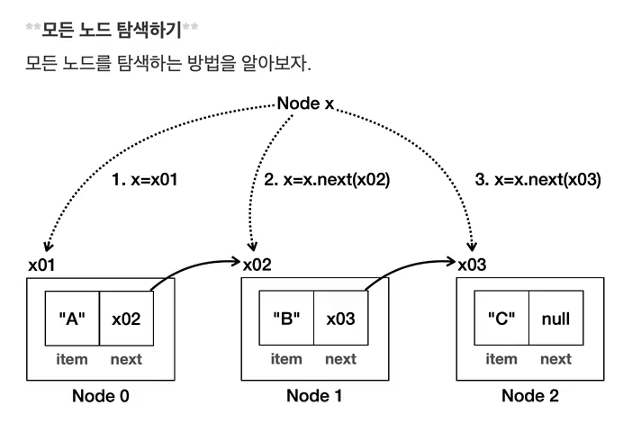
    
    Node x = first;
    while (x != null) {
        System.out.println(x.item);
        x = x.next;
    }

### 4-2. 노드와 연결2
#### toString( ) - IDE
- 노드의 연결 상태를 더 편하게 보기 위해 toString( ) 을 오버라이딩 해보자.
- 먼저 IDE 의 도움을 받아서 구현해보자.
####
    public class Node {
    
        Object item;
        Node next;
    
        public Node(Object item) {
            this.item = item;
        }
    
        // 코드 추가, IDE 생성 toString()
        @Override
        public String toString() {
            return "Node{" +
                    "item=" + item +
                    ", next=" + next +
                    '}';
        }
    }
####
    public class NodeMain2 {
    
        public static void main(String[] args) {
            // 노드 생성하고 연결하기: A -> B -> C
            Node first = new Node("A"); // x01
            first.next = new Node("B"); // x02
            first.next.next = new Node("C");  // x03
    
            System.out.println("연결된 노드 출력하기");
            System.out.println(first);  // Node{item=A, next=Node{item=B, next=Node{item=C, next=null}}}
    
            // Node{item=A, next=x02}
            // Node{item=A, next=Node{item=B, next=x03}}
            // Node{item=A, next=Node{item=B, next=Node{item=C, next=null}}}
        }
    }
- IDE 의 도움을 받아서 만든 toString( ) 으로 필요한 정보를 확인할 수는 있지만, 한둔에 보기에는 좀 복잡하다.
- 대신에 [A -> B -> C] 와 같이 필요한 정보만 편리하게 확인할 수 있게 toString( ) 을 직접 구현해보자.

#### toString( ) - 직접 구현
    public class Node {
    
        Object item;
        Node next;
    
        public Node(Object item) {
            this.item = item;
        }
    
        /* Generate 로 IDE 자동 생성 toString()
        @Override
        public String toString() {
                return "Node{" +
                    "item=" + item +
                    ", next=" + next +
            '}';
        } */
    
        // [A -> B -> C]
        @Override
        public String toString() {
            StringBuilder sb = new StringBuilder(); // 루프에서 문자를 더해야 되기 때문에 스트링빌더 사용
            Node x = this;
            sb.append("[");
            while (x != null) {
                sb.append(x.item);
                if (x.next != null) {
                    sb.append("->");
                }
                x = x.next;
            }
            sb.append("]");
            return sb.toString();
        }
    }
####
    public class NodeMain2 {
    
        public static void main(String[] args) {
            // 노드 생성하고 연결하기: A -> B -> C
            Node first = new Node("A"); // x01
            first.next = new Node("B"); // x02
            first.next.next = new Node("C");  // x03
    
            System.out.println("연결된 노드 출력하기");
            System.out.println(first);  // Node{item=A, next=Node{item=B, next=Node{item=C, next=null}}}
    
            Node modeB = first.next;
            System.out.println(modeB);
    
            // Node{item=A, next=x02}
            // Node{item=A, next=Node{item=B, next=x03}}
            // Node{item=A, next=Node{item=B, next=Node{item=C, next=null}}}
        }
    }

### 4-3. 노드와 연결3
    public class NodeMain3 {
    
        public static void main(String[] args) {
            // 노드 생성하고 연결하기: A -> B -> C
            Node first = new Node("A"); // x01
            first.next = new Node("B"); // x02
            first.next.next = new Node("C");  // x03
    
            System.out.println(first);
    
            // 모든 노드 탐색하기
            System.out.println("모든 노드 탐색하기");
            printAll(first);
    
            // 마지막 노드 조회하기
            Node lastNode = getLastNode(first);
            System.out.println("lastNode = " + lastNode);
    
            // 특정 index 의 노드 조회하기
            int index = 2;
            Node index2Node = getNode(first, index);
            System.out.println("index2Node = " + index2Node.item);
    
            // 데이터 추가하기
            System.out.println("데이터 추가하기");
            add(first, "D");
            System.out.println(first);
            add(first, "E");
            System.out.println(first);
            add(first, "F");
            System.out.println(first);
        }
    
        private static void printAll(Node node) {
            Node x = node;
            while (x != null) {
                System.out.println(x.item);
                x = x.next;
            }
        }
    
        private static Node getLastNode(Node node) {
            Node x = node;
            // 다음 노드가 null 이면, 현재 노드가 마지막 노드임을 알 수 있음
            while (x.next != null) {
                x = x.next;
            }
            return x;
        }
    
        private static Node getNode(Node node, int index) {
            Node x = node;
            // next 를 인덱스 번호만큼 호출하하기 위해서 루프문 사용
            for (int i = 0; i < index; i++) {
                x = x.next;
            }
            return x;
        }
    
        private static void add(Node node, String item) {
            // 데이터 추가는 마지막 노드에 연결하는 것이기 때문에 마지막을 먼저 찾아야 한다.
            Node lastNode = getLastNode(node);
            lastNode.next = new Node(item);
        }
    
    }
#### 모든 노드 탐색하기
- printAll(Node node): 다음 노드가 없을 때 까지 반복해서 노드의 데이터를 출력한다.

#### 마지막 노드 조회하기
- Node getLastNode(Node node): 마지막 노드를 조회한다.
- Node.next 의 참조값이 null 이면 노드의 끝이다.
- getLastNode( ) 는 노드를 순서대로 탐색하면서 Node.next 의 참조값이 null 인 노드를 찾아서 반환한다.

#### 특정 index 의 노드 조회하기
- getNode(Node node, int index): index 로 특정 위치의 노드를 찾는다.
- x = x.next 를 호출할 때마다 x 가 참조하는 노드의 위치가 순서대로 하나씩 증가한다.
- index 의 수 만큼 반복해서 이동하면 원하는 위치의 노드를 찾을 수 있다.

#### 데이터 추가하기
- 데이터를 추가할 때는 새로운 노드를 만들고, 마지막 노드에 새로 만든 노드를 연결하면 된다.
- 순서대로 설명하면 먼저 마지막 노드를 찾고, 마지막 노드의 next 에 새로운 노드를 연결하면 된다.

#### 정리 
- 노드는 내부에 데이터와 다음 노드에 대한 참조를 가지고 있다.
- 지금까지 설명한 구조는 각각의 노드가 참조를 통해 연결(Link, 링크)되어 있다.
- 데이터를 추가할 때 동적으로 필요한 만큼의 노드만 만들어서 연결하면 된다. 따라서 배열과 다르게 메모리를 낭비하지 않는다.
  - 물론 next 필드를 통해 참조값을 보관해야 하기 때문에 배열과 비교해서 추가적인 메모리 낭비도 발생한다.
- 노드와 연결 구조를 처음 공부하면 이해하기 쉽지 않다. 하지만 반복해서 학습하고 또 코드도 직접 만들어 보면서 반드시 이해해야 한다.  
  이해가 어렵다면 코드를 따라서 종이에 천천히 노드를 그려보면 이해가 될 것이다.
- 이렇게 각각의 노드를 연결(링크)해서 사용하는 자료 구조로 리스트를 만들 수 있는데, 이것을 연결 리스트라 한다.

### 4-4. 직접 구현하는 연결 리스트1 - 시작
- 우리는 앞서 배열을 통해서 리스트를 만들었는데 이것을 배열 리스트(ArrayList)라 한다.
- 이번에는 배열이 아닌 학습한 노드와 연결 구조를 통해서 리스트를 만들어 보자. 이런 자료 구조를 연결 리스트(LinkedList)라 한다.
- 연결 리스트는 배열 리스트의 단점인, 메모리 낭비, 중간 위치의 데이터 추가에 대한 성능 문제를 어느정도 극복할 수 있다.

#### 리스트 자료 구조
- 순서가 있고, 중복을 허용하는 자료 구조를 리스트(List)라고 한다.
- 우리는 앞서 MyArrayList 시리즈를 만들어 보았다. 배열 리스트도, 연결 리스트도 모두 같은 리스트이다.
- 리스트의 내부에서 배열을 사용하는가 아니면 노드와 연결 구조를 사용하는가의 차이가 있을 뿐이다.
- 배열 리스트를 사용하든 연결리스트를 사용하든 둘다 리스트 자료 구조이기 때문에 리스트를 사용하는 개발자 입장에서는  
  거의 비슷하게 느껴져야 한다. 
- 쉽게 이야기해서 리스트를 사용하는 개발자 입장에서 MyArrayList 를 사용하든 MyLinkedList 를 사용하든 내부를 몰라도,   
  그냥 순서가 있고, 중복을 허용하는 자료 구조구나 생각하고 사용할 수 있어야 한다.

#### 연결 리스트 직접 구현 
    public class MyLinkedListV1 {
    
        private Node first;
        private int size = 0;
    
        public void add(Object o) {
            Node newNode = new Node(o);
            if (first == null) {
                first = newNode;
            } else {
                Node lastNode = getLastNode();
                lastNode.next = newNode;
            }
            size++;
        }
    
        private Node getLastNode() {
            Node x = first;
            while (x.next != null) {
                x = x.next;
            }
            return x;
        }
    
        public Object set(int index, Object e) {
            // 값을 세팅하고 이전 값 반환
            Node x = getNode(index);
            Object oldValue = x.item;
            x.item = e;
            return oldValue;
        }
    
        public Object get(int index) {
            Node node = getNode(index);
            return node.item;
        }
    
        private Node getNode(int index) {
            Node x = first;
            for (int i = 0; i < index; i++) {
                x = x.next;
            }
            return x;
        }
    
        public int indexOf(Object o) {
            int index = 0;
            for(Node x = first; x != null; x = x.next) {
                if(x.item.equals(o)) {
                    return index;
                }
                index++;
            }
            return -1;
        }
    
        public int size() {
            return size;
        }
    
        @Override
        public String toString() {
            return "MyLinkedListV1{" +
                    "first=" + first +
                    ", size=" + size +
                    '}';
        }
    }
- Node first: 첫 노드의 위치를 가리킨다.
- size: 자료 구조에 입력된 데이터의 사이즈, 데이터가 추가될 때 마다 하나씩 증가한다.
- void add(Object)
  - 마지막에 데이터를 추가한다.
  - 새로운 노드를 만들고, 마지막 노드를 찾아서 새로운 노드를 마지막에 연결한다.
  - 만약 노드가 하나도 없다면 새로운 노드를 만들고 first 에 연결한다.
- Object set(int index, Object element)
  - 특정 위치에 있는 데이터를 찾아서 변경한다. 그리고 기존 값을 반환한다.
  - getNode(index) 를 통해 특정 위치에 있는 노드를 찾고, 단순히 그 노드에 있는 item 데이터를 변경한다.
- Object get(int index)
  - 특정 위치에 있는 데이터를 반환한다.
  - getNode(index) 를 통해 특정 위치에 있는 노드를 찾고, 해당 노드에 있는 값을 반환한다.
- int indexOf(Object o)
  - 데이터를 검색하고, 검색된 위치를 반환한다.
  - 모든 노드를 순회하면서 equals( )를 사용해서 같은 데이터가 있는지 찾는다.

####
    public class MyLinkedListV1Main {
    
        public static void main(String[] args) {
            MyLinkedListV1 list = new MyLinkedListV1();
            System.out.println(list);
            System.out.println("==데이터 추가==");
            list.add("a");
            System.out.println(list);
            list.add("b");
            System.out.println(list);
            list.add("c");
            System.out.println(list);
    
            System.out.println("==기능 사용==");
            System.out.println("list.size() = " + list.size());
            System.out.println("list.get(1) = " + list.get(1));
            System.out.println("list.indexOf(\"c\") = " + list.indexOf("c"));
            System.out.println("list.set(2, \"z\") = " + list.set(2, 'z'));
            System.out.println(list);

            list.add("d");
            System.out.println(list);
            list.add("e");
            System.out.println(list);
            list.add("f");
            System.out.println(list);
        }
    }
- MyArrayListV1Main 에 있는 코드를 거의 그대로 사용했다.
- 연결 리스트는 데이터를 추가할 때마다 동적으로 노드가 늘어나기 때문에 범위를 초과하는 문제는 발생하지 않는다.

#### 연결 리스트와 빅오 
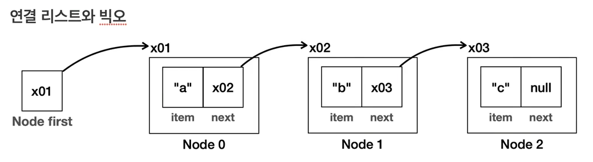
- **Object get(int index)**
  - 특정 위치에 있는 데이터를 반환한다.
  - O(n)
    - 배열은 인덱스로 원하는 데이터를 즉시 찾을 수 있다. 
    - 따라서 배열을 사용하는 배열 리스트(ArrayList)도 인덱스로 조회시 O(1)의 빠른 성능을 보장한다.  
    - 하지만 연결 리스트에서 사용하는 노드들은 배열이 아니다. 단지 다음 노드에 대한 참조가 있을 뿐이다.
    - 인덱스로 원하는 위치의 데이터를 찾으려면 인덱스 숫자만큼 다음 노드를 반복해서 찾아야 한다.
    - 따라서 인덱스 조쇠 성능이 나쁘다.
    - 특정 위치의 노드를 찾는데 O(n) 이 걸린다.
- **void add(Object e)**
  - 마지막에 데이터를 추가한다.
  - O(n)
    - 마지막 노드를 찾는데 O(n)이 소요된다. 
    - 마지막 노드에 새로운 노드를 추가하는데 O(1) 이 걸린다.
- **Object set(int index, Object e)**
  - 특정 위치에 있는 데이터를 찾아서 변경한다. 그리고 기존 값을 반환한다.
  - O(n)
    - 특정 위치의 노드를 찾는데 O(n)이 걸린다.
- **int indexOf(Object o)**
  - 데이터를 검색하고, 검색된 위치를 반환한다.
  - O(n)
    - 모든 노드를 순회하면서 equals( )를 사용해서 같은 데이터가 있는지 찾는다.
  
#### 정리
- 연결 리스트를 통해 데이터를 추가하는 방식은 꼭 필요한 메모리만 사용한다. 
- 따라서 배열 리스트의 단점인 메모리 낭비를 해결할 수 있었다.
  - 물론 연결을 유지하기 위한 추가 메모리가 사용되는 단점도 함께 존재한다.
  

### 4-5. 직접 구현하는 연결 리스트2 - 추가와 삭제1
- 배열 리스트는 중간에 데이터를 추가하거나 삭제할 때 기존 데이터를 한 칸씩 이동해야 하는 문제가 있었다.
- 연결 리스트는 이 문제를 어떻게 해결하는지 알아보기 위해 다음 두 기능을 추가해보자.
- **void add(int index, Object e)**
  - 특정 위치에 데이터를 추가한다.
  - 내부에서 노드도 함께 추가된다.
- **Object remove(int index)**
  - 특정 위치에 있는 데이터를 제거한다.
  - 내부에서 노드도 함께 제거된다.

#### 첫 번째 위치에 데이터 추가
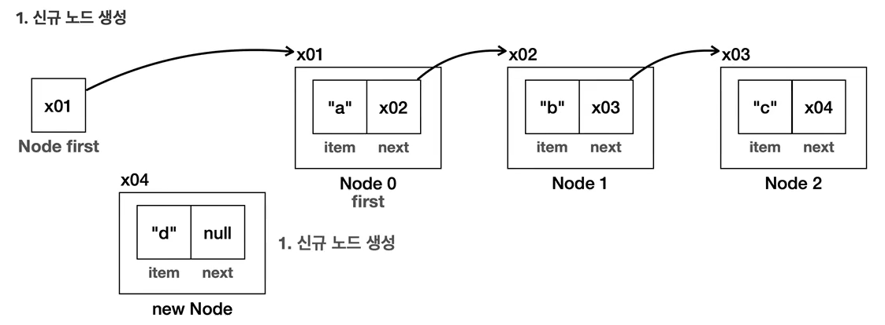  
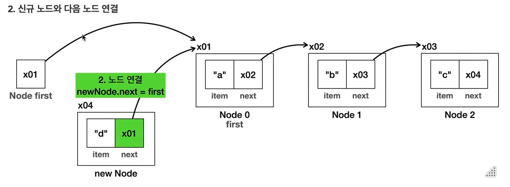  
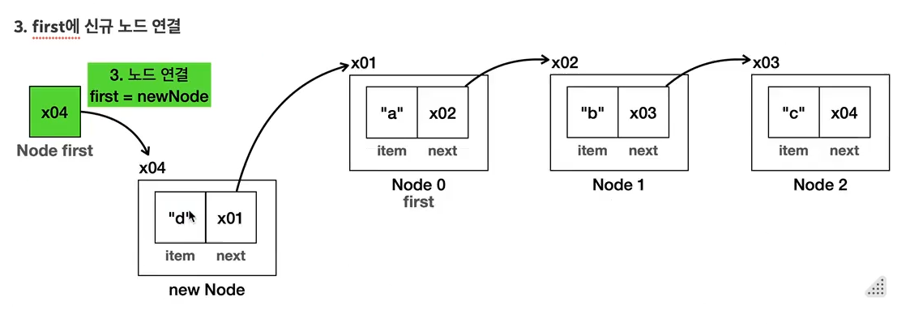
- 노드를 추가했으므로 오른족 노드의 index 가 하나씩 뒤로 밀려난다. (물리적으로가 아니라 논리적으로 밀려난다.)
  - 연결 리스트는 배열처럼 실제 index 가 존재하는 것이 아니다. 처음으로 연결된 노드를 index 0,  
    그 다음으로 연결된 노드를 index 1 로 가정할 뿐이다. 연결 리스트에서 index 는 연결된 순서를 뜻한다.
- 배열의 경우 첫 번재 항목에 데이터가 추가되면 모든 데이터를 오른쪽으로 하나씩 밀어야 하지만  
  연결 리스트는 새로 생성한 노드의 참조만 변경하면 된다. 나머지 노드는 어떤 일이 일어난지도 모른다.
- 연결 리스트의 첫 번째 항목에 값을 추가하는 것은 매우 빠르다. O(1)로 표현할 수 있다.  
  (실제로는 한 번이 아니어도 상수로 나오는 연산은 O(1)로 표현한다.)

#### 첫 번째 위치의 데이터 삭제 
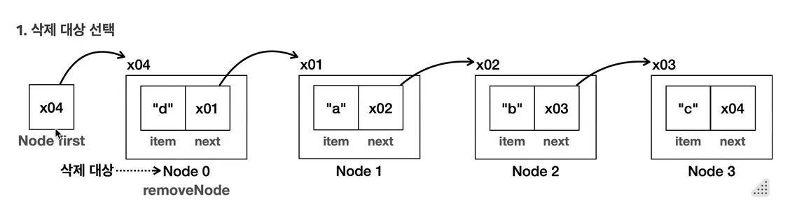  
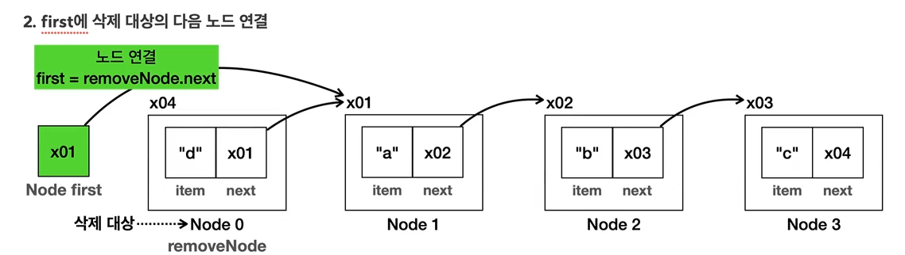   
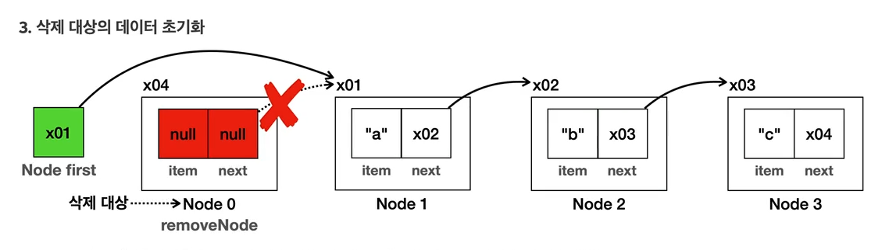  
- 더는 삭제 노드를 참조하는 곳이 없다. 이후 삭제 노드는 GC 의 대상이 되어서 제거된다.
- 노드를 삭제했으므로 오른족 노드의 index 가 하나씩 당겨진다.
- 배열의 경우 첫 번재 항목이 삭제되면 모든 데이터를 왼쪽으로 하나씩 밀어야 하지만  
  연결 리스트는 일부 참조만 변경하면 된다. 나머지 노드는 어떤 일이 일어난지도 모른다.
- 연결 리스트의 첫 번째 항목에 값을 삭제하는 것은 매우 빠르다. O(1)로 표현할 수 있다.

#### 중간 위치에 데이터 추가
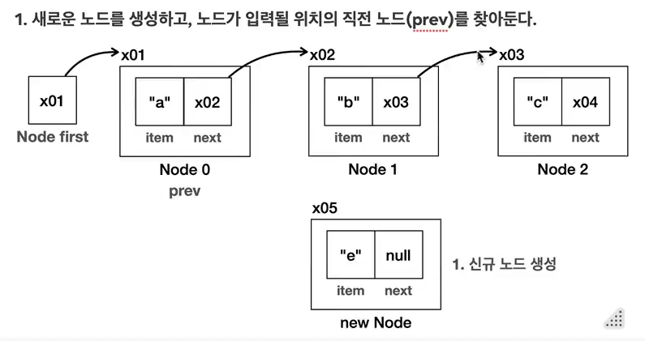  
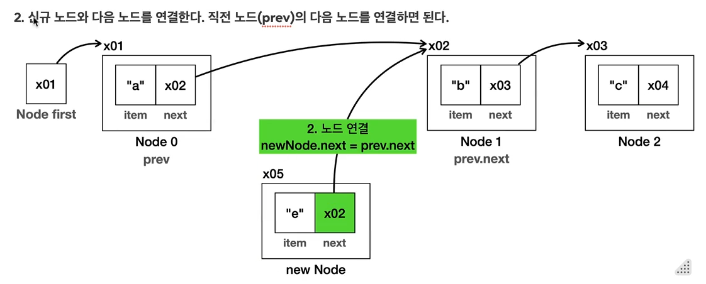   
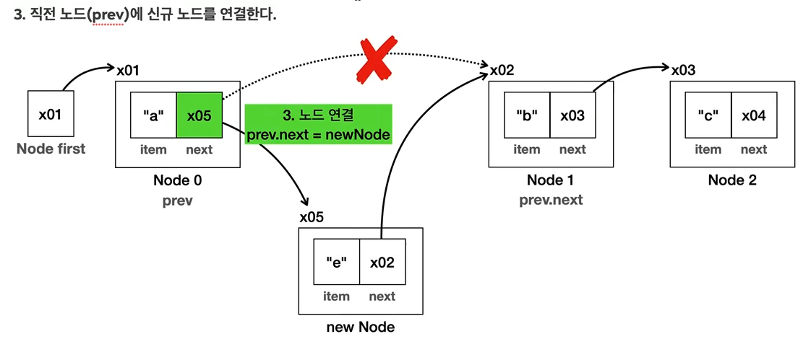  
- 노드를 추가했으므로 추가한 노드 오른쪽에 있는 노드들의 index 가 하나씩 뒤로 밀려난다.
- 배열의 경우 첫 번째 항목에 데이터가 추가되면 모든 데이터를 오른쪽으로 하나씩 밀어야 하지만  
  연결 리스트는 새로 생성한 노드의 참조만 변경하면 된다. 나머지 노드는 어떤 일이 일어난지 모른다.
- O(n)
  - 연결 리스트는 인덱스를 사욕해서 노드를 추가할 위치를 찾는데 O(n)이 걸린다.
  - 위치를 찾고 노드를 추가하는데 O(1)이 걸린다.
  - 따라서 둘을 합치면 O(n)이 걸린다.

#### 중간 위치의 데이터 삭제
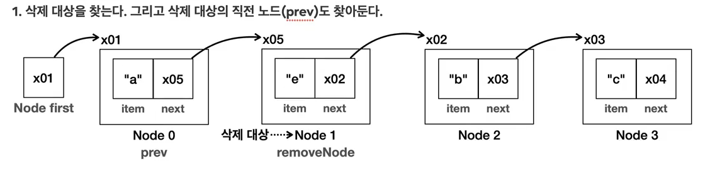  
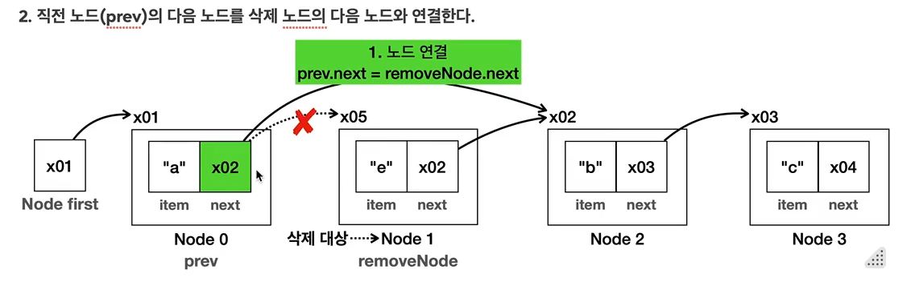  
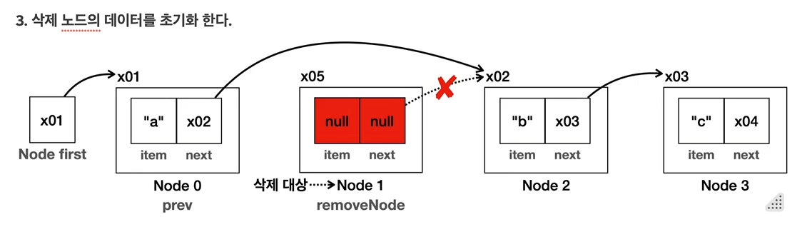  
- 노드를 삭제했으므로 오른쪽 노드의 index 가 하나씩 당겨진다.
- O(n)의 성능이다.
  - 연결 리스트에서 인덱스로 삭제할 항목을 찾는데 O(n)이 걸린다.
  - 연결 리스트에서 항목을 삭제하는 것은 매우 빠르다. O(1)로 표현할 수 있다.
- 연결 리스트와 배열 리스트 둘다 중간에 있는 항목을 추가하거나 삭제하는 경우 같은 O(n)이다.
- 배열 리스트는 찾는데 O(1) 이지만 추가하거나 삭제한 뒤 O(n) 이고,  
  연결 리스트는 찾는데 O(n) 이지만 추가하거나 삭제할 땐 O(1) 이다.  

### 4-6. 직접 구현하는 연결 리스트3 - 추가와 삭제2
- 특정 위치에 있는 데이터를 추가하고, 삭제하는 기능을 코드로 구현해보자.
####
    // 추가 코드
    public void add(int index, Object o) {
        Node newNode = new Node(o);
        if (index == 0) {   // 처음에 추가
            newNode.next = first;
            first = newNode;
        } else {            // 중간에 추가
            // 직전 노드를 찾기 위해서 -1
            Node prev = getNode(index - 1);
            newNode.next = prev.next;
            prev.next = newNode;
        }
        size++;
    }

    // 추가 코드
    public Object remove(int index) {
        Node removeNode = getNode(index);
        Object removedItem = removeNode.item;
        if (index == 0) {   // 첫 노드 삭제
            first = removeNode.next;
        } else {            // 중간 노드 삭제
            Node prev = getNode(index - 1);
            prev.next = removeNode.next;
        }
        removeNode.item = null;
        removeNode.next = null;
        size--;

        return removedItem;
    }
####
    public class MyLinkedListV2Main {
    
        public static void main(String[] args) {
            MyLinkedListV2 list = new MyLinkedListV2();
    
            // 마지막에 추가 O(n)
            list.add("a");
            list.add("b");
            list.add("c");
            System.out.println(list);
    
            // 첫 번째 항목에 추가, 삭제 O(1)
            System.out.println("첫 번째 항목에 추가");
            list.add(0, "d");
            System.out.println(list);
    
            System.out.println("첫 번째 항목에 삭제");
            list.remove(0);
            System.out.println(list);
    
            // 중간 항목에 추가, 삭제 O(n)
            System.out.println("중간 항목에 추가");
            list.add(1, "e");
            System.out.println(list);
    
            System.out.println("중간 항목에 삭제");
            list.remove(1);
            System.out.println(list);
        }
    }

#### 직접 만든 배열 리스트와 직접 만든 연결 리스트의 성능 비교 표
| 기능        | 배열 리스트 | 연결 리스트 |
|-----------|--------|--------|
| 인덱스 조회    | O(1)   | O(n)   |
| 검색        | O(n)   | O(n)   |
| 앞에 추가(삭제) | O(n)   | O(1)   |
| 뒤에 추가(삭제) | O(1)   | O(n)   |
| 평균 추가(삭제) | O(n)   | O(n)   |
- 배열 리스트는 인덱스를 통해 추가나 삭제할 위치를 O(1) 로 빠르게 찾지만,  
  추가나 삭제 이후에 데이터를 한 칸씩 밀어야 한다. 이 부분이 O(n)으로 오래걸린다.
- 반면에 연결 리스트는 인덱스를 통해 추가나 삭제할 위치를 O(n)으로 느리게 찾지만,  
  찾은 이후에는 일부 노드의 참조값만 변경하면 되므로 이 부분이 O(1)로 빠르다.
- 앞에 추가하는 경우: 연결 리스트는 배열 리스트처럼 추가한 항목의 오른쪽에 있는 데이터를 모두 한 칸씩 밀지 않아도 된다.  
  단순히 일부 노드의 참조만 변경하면 된다. 따라서 데이터를 앞쪽에 추가하는 경우 보통 연결 리스트 성능이 더 좋다.
  - 배열 리스트: 데이터를 앞쪽에 추가하는 경우 모든 데이터를 오른쪽으로 한 칸씩 밀어야 한다. O(n)
  - 연결 리스트: 데이터를 앞쪽에 추가하는 경우 일부 노드의 참조만 변경함녀 된다. O(1)
- 마지막에 데이터를 추가하는 경우
  - 배열 리스트
    - 인덱스로 마지막 위치를 바로 찾을 수 있다. O(1)
    - 데이터를 마지막에 추가하는 경우 데이터를 이동하지 않아도 된다. O(1)
    - 따라서 O(1)의 성능을 제공한다.
  - 연결 리스트 
    - 노드를 마지막까지 순회해야 마지막 노드를 찾을 수 있다. 따라서 마지막 노드를 찾는데 O(n)의 시간이 걸린다.
    - 데이터를 추가하는 경우 일부 노드의 참조만 변경하면 된다. O(1)
    - 따라서 O(n)의 성능을 제공한다.

#### 배열 리스트 vs 연결 리스트 사용 
- 데이터를 조회할 일이 많고, 뒷 부분에 데이터를 추가한다면 배열 리스트가 보통 더 좋은 성능을 제공한다.  
- 앞쪽의 데이터를 추가하거나 삭제할 일이 많다면 연결 리스트를 사용하는 것이 보통 더 좋은 성능을 제공한다.]

> **!참고** - 우리가 구현한 연결 리스트는 한 방향으로만 이동하는 단일 연결 리스트다.   
> 노드 앞뒤로 모두 연결하는 이중 연결 리스트를 사용하면 성능을 더 개선할 수 있다.
> 뒤에서 설명하지만 자바가 제공하는 연결 리스트는 이중 연결 리스트다.  
> 추가로 자바가 제공하는 연결 리스트는 마지막 노드를 참조하는 변수를 가지고 있어서,  
> 뒤에서 추가하거나 삭제하는 경우에도 O(1)의 성능을 제공한다.

#### 이중 연결 리스트 예시
    public class Node {
        Object item;
        Node next;  // 다음 노드 참조
        Node prev;  // 이전 노드 참조
    }

### 4-7. 직접 구현하는 연결 리스트4 - 제네릭 도입
- 지금까지 만든 연결 리스트에 제네릭을 도입해서 타입 안정성을 높여보자.
- 추가로 여기서 사용하는 Node 는 외부에서 사용되는 것이 아니라 연결 리스트 내부에서만 사용된다. 
- 따라서 중첩 클래스로 만들자.

####
    public class MyLinkedListV3<E> {
    
        private Node<E> first;
        private int size = 0;
    
        public void add(E o) {
            Node<E> newNode = new Node<>(o);
            if (first == null) {
                first = newNode;
            } else {
                Node<E> lastNode = getLastNode();
                lastNode.next = newNode;
            }
            size++;
        }
    
        private Node<E> getLastNode() {
            Node<E> x = first;
            while (x.next != null) {
                x = x.next;
            }
            return x;
        }
    
        // 추가 코드
        public void add(int index, E o) {
            Node<E> newNode = new Node<>(o);
            if (index == 0) {   // 처음에 추가
                newNode.next = first;
                first = newNode;
            } else {            // 중간에 추가
                // 직전 노드를 찾기 위해서 -1
                Node<E> prev = getNode(index - 1);
                newNode.next = prev.next;
                prev.next = newNode;
            }
            size++;
        }
    
        public E set(int index, E e) {
            // 값을 세팅하고 이전 값 반환
            Node<E> x = getNode(index);
            E oldValue = x.item;
            x.item = e;
            return oldValue;
        }
    
        // 추가 코드
        public E remove(int index) {
            Node<E> removeNode = getNode(index);
            E removedItem = removeNode.item;
            if (index == 0) {   // 첫 노드 삭제
                first = removeNode.next;
            } else {            // 중간 노드 삭제
                Node<E> prev = getNode(index - 1);
                prev.next = removeNode.next;
            }
            removeNode.item = null;
            removeNode.next = null;
            size--;
    
            return removedItem;
        }
    
    
        public E get(int index) {
            Node<E> node = getNode(index);
            return node.item;
        }
    
        private Node<E> getNode(int index) {
            Node<E> x = first;
            for (int i = 0; i < index; i++) {
                x = x.next;
            }
            return x;
        }
    
        public int indexOf(E o) {
            int index = 0;
            for(Node<E> x = first; x != null; x = x.next) {
                if(x.item.equals(o)) {
                    return index;
                }
                index++;
            }
            return -1;
        }
    
        public int size() {
            return size;
        }
    
        @Override
        public String toString() {
            return "MyLinkedListV1{" +
                    "first=" + first +
                    ", size=" + size +
                    '}';
        }
    
        private static class Node<E> {
            E item;
            Node<E> next;
    
            public Node(E item) {
                this.item = item;
            }
    
            // [A -> B -> C]
            @Override
            public String toString() {
                StringBuilder sb = new StringBuilder(); // 루프에서 문자를 더해야 되기 때문에 스트링빌더 사용
                Node<E> x = this;
                sb.append("[");
                while (x != null) {
                    sb.append(x.item);
                    if (x.next != null) {
                        sb.append("->");
                    }
                    x = x.next;
                }
                sb.append("]");
                return sb.toString();
            }
        }
    }
- MyLinkedListV3<E> 로 제네릭 클래스를 선언했다.
- Object 로 처리하던 부분을 타입 매개변수 <E> 로 변경했다.
- 정적 중첩 클래스로 새로 선언한 Node<E> 도 제네릭으로 선언했다.

#### 중첩 클래스 예시
    class OuterClass {
        ...
        static class StaticnestedClass {
            ...
        }
    }
- 이렇게 클래스 안에서 클래스를 선언하는 것을 중첩 클래스라고 한다.
- 중첩 클래스는 특정 클래스 안에서만 사용될 때 주로 사용한다.
- Node 클래스는 MyLinkedList 안에서만 사용된다. 외부에서는 사용할 이유가 없다.
- 이럴 때 중첩 클래스를 사용하면 특정 클래스 안으로 클래스 선언을 숨길 수 있다.
- 중첩 클래스를 사용하면 MyLinkedListV3 입장에서 외부에 있는 Node 클래스보다 내부에 선언한 Node 클래스를 먼저 사용한다.

#### 
    public class MyLinkedListV3Main {
    
        public static void main(String[] args) {
            MyLinkedListV3<String> stringList = new MyLinkedListV3<>();
            stringList.add("a");
            stringList.add("b");
            stringList.add("c");
            String string = stringList.get(0);
            System.out.println("string = " + string);
    
            MyLinkedListV3<Integer> integerList = new MyLinkedListV3<>();
            integerList.add(1);
            integerList.add(2);
            integerList.add(3);
            Integer integer = integerList.get(1);
            System.out.println("integer = " + integer);
        }
    }

 

## 5. 컬렉션 프레임워크 - List
- 자바 기본편에서 학습한 다형성과 OCP 원칙을 가장 잘 활용할 수 있는 곳 중 하나가 자료구조이다.
- 자료 구조에서 다형성과 OCP 원칙이 어떻게 적용되는지 알아보자.### 5-1. 리스트 추상화1 - 인터페이스 도입

> **!참고** - OCP 원칙   
> Open/Clos Principle, 개방- 폐쇄 원칙으로 객체지향 설계 원칙 중 하나이다.  
> 확장에는 열려있고, 수정에는 닫혀 있어야 한다는 개념을 의미한다.
> - Open: 새로운 기능이나 요구사항이 추가될 때, 기존 코드를 변경하지 않고도 새로운 기능을 추가할 수 있어야 한다.
> - Close: 기존 코드가 잘 작동하고 있다면, 그 코드를 수정하지 않아야 한다.   
>   즉, 기존 코드의 안정성을 유지하면서 새로운 기능을 추가할 수 있어야 한다.

### 5-1. 리스트 추상화1 - 인터페이스 도입 
#### List 자료 구조
- 순서가 있고, 중복을 허용하는 자료 구조를 리스트(List)라 한다.
- 우리가 지금까지 만든 MyArrayList 와 MyLinkedList 는 내부 구현만 다를 뿐 같은 기능을 제공하는 리스트이다.  
- 물론 내부 구현이 다르기 때문에 상황에 따라 성능은 달라질 수 있다.
- 핵심은 사용자 입장에서 보면 같은 기능을 제공한다는 것이다.
- 이 둘의 공통 기능을 인터페이스로 봅아서 추상화하면 다형성을 활용한 다양한 이득을 어얻을 수 있다. 
####
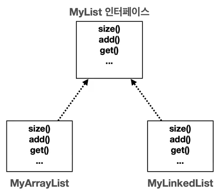

    public interface MyList<E> {
    
        int size();
    
        void add(E e);
    
        void add(int index, E e);
    
        E get(int index);
    
        E set(int index, E e);
    
        E remove(int index);
    
        int indexOf(E e);
    }

####
    public class MyArrayList<E> implements MyList<E> {
        ...
    }

####
    public class MyLinkedList<E> implements MyList<E> {
        ...
    }
- 기존의 작성한 코드와 메서드 이름이 같기 때문에 문제가 발생하지는 않을 것이다.
- 만약 메서드 정보가 다르다면 오류가 발생할 수 있다. 이때는 MyList 인터페이스 맞추면 된다.
- 추가로 재정의한 메서드에 @Override 어노테이션을 넣어주자.

### 5-2. 리스트 추상화2 - 의존관계 주입
- MyArrayList 를 활용해서 많은 데이터를 처리하는 BatchProcessor 클래스를 개발하고 있다고 가정하자.
- 그런데 막상 프로그램을 개발하고 보니 데이터를 앞에서 추가하는 일이 많은 상황이라고 가정해보자.
- 데이터를 앞에서 추가하거나 삭제하는 일이 많다면 MyArrayList 보다는 MyLinkedList 를 사용하는 것이 훨씬 효율적이다.

#### 데이터를 앞에서 추가하거나 삭제할 때 빅오 비교 
- MyArrayList: O(n)
- MyLinkedList: O(1)

#### 구체적인 MyArrayList 에 의존하는 BatchProcessor 예시 
    public class BatchProcessor {
        private final MyArrayList<Integer> list = new MyArrayList<>();  // 코드 변경
    
        public void logic(int size) {
            for (int i = 0; i < size; i++) {
                list.add(0, i); // 앞에 추가 
            }
        }
    }
- MyArrayList 를 사용해보니 성능이 너무 느려서 MyLinkedList 를 사용하도록 코드를 변경해야 한다면  
- BatchProcessor 의 내부 코드도 MyArrayList 에서 MyLinkedList 를 사용하도록 함께 변경해야 한다.

#### 구체적인 MyLinkedList 에 의존하는 BatchProcessor 예시 
    public class BatchProcessor {
        private final MyLinkedList<Integer> list = new MyLinkedList<>();    // 코드 변경
        
        public void logic(int size) {
            for (int 1 = 0; 1 < size; i++) {
                list.add(0, i); // 앞에 추가
            }
        }
    }
- BatchProcessor 는 구체적인 MyArrayList 또는 MyLinkedList 를 사용하고 있다.
- 이것을 BatchProcessor 가 구체적인 클래스에 의존한다고 표현한다.
- 이렇게 구체적인 클래스에 직접 의존하면 MyArrayList 를 MyLinkedList 로 변경할 때마다   
  여기에 의존하는 BatchProcessor 의 코드도 함께 수정해야 한다.

#### 추상적인 MyList 에 의존하는 BatchProcessor 예시
- BatchProcessor 가 구체적인 클래스에 의존하는 대신 추상적인 MyList 인터페이스에 의존하는 방법도 있다.
####
    public class BatchProcessor {
        
        private final MyList<Integer> list;
    
        // MyList 는 new MyArrayList 를 받을 수 있다.
        // MyList 는 new MyLinkedList 도 받을 수 있다.
        public BatchProcessor(MyList<Integer> list) {
            this.list = list;
        }
    
        public void logic(int size) {
            for (int i = 0; i < size; i++) {        
                list.add(0, i); // 앞에 추가 
            }
        }
    }
####
    main() {
        new BatchProcessor(new MyArrayList);    // MyArrayList 를 사용하고 싶을 때
        new BatchProcessor(new MyLinkedList);    // MyLinkedList 를 사용하고 싶을 때
    }
- BatchProcessor 를 생성하는 시점에 생성자를 통해 원하는 리스트 전략(알고리즘)을 선택해서 전달하면 된다.
- 이렇게 하면 MyList 를 사용하는 클라이언트 코드인 BatchProcessor 를 전혀 변경하지 않고,  
  원하는 리스트 전략을 런타임에 지정할 수 있다.

####
    public class BatchProcessor {
    
        private final MyList<Integer> list;
    
        public BatchProcessor(MyList<Integer> list) {
            this.list = list;
        }
    
        public void logic(int size) {
            long startTime = System.currentTimeMillis();
            for (int i = 0; i < size; i++) {
                list.add(0, i); // 앞에 추가
            }
            long endTime = System.currentTimeMillis();
            System.out.println("크기: " + size + ", 계산 시간: " + (endTime - startTime) + "ms");
        }
    
    }
- logic(int size) 메서드는 매우 복잡한 비즈니스 로직을 다룬다고 가정하자. 이 메서드는 list 의 앞 부분에 데이터를 추가한다.
- 어떤 MyList list 의 구현체를 선택할 지는 실행 시점에 생성자를 통해서 결정한다.
- 생성자를 통해서 MyList 구현체가 전달된다.
  - MyArrayList 의 인스턴스가 들어올 수도 있고, MyLinkedList 의 인스턴스가 들어올 수도 있다.
- 이것은 BatchProcessor 의 외부에서 의존관계가 결정되어 BatchProcessor 인스턴스에 들오는 것 같다.  
  마치 의존관계가 외부에서 주입되는 것 같다고 해서 이것을 **의존관계 주입**이라 한다.
- 참고로 생성자를 통해서 의존관계를 주입했기 때문에 **생성자 의존관계 주입**이라 한다.

#### 의존관계 주입 
- Dependency Injection, 줄여서 DI 라고 부른다. 의존성 주입이라고도 부른다.
####
    public class BatchProcessorMain {
    
        public static void main(String[] args) {
            MyArrayList<Integer> list = new MyArrayList<>();
            // MyLinkedList<Integer> list = new MyLinkedList<>();
    
            BatchProcessor processor = new BatchProcessor(list);
            processor.logic(50_000);
        }
    
    }
- BatchProcessor 의 생성자에 MyArrayList 를 사용할지, MyLinkedList 를 사용할지 결정해서 넘겨야 한다.
- 이후에 processor.logic() 을 호출하면 생성자로 넘긴 자료 구조를 사용해서 실행한다.

#### MyArray - 실행 결과
    크기: 50000, 계산 시간: 1319ms
    (for 문으로 O(n) 만큼 돌고, 배열 리스트 앞에 추가라서 O(n) 만큼 돌아서 O(n^2)) 
#### MyLinked - 실행 결과
    크기: 50000, 계산 시간: 3ms
    (for 문으로 O(n) 만큼 돌고, 연결 리스트 앞에 추가라서 O(1) 만큼 돌아서 O(n))
- MyLinkedList 를 사용한 덕분에 O(n) -> O(1) 성능이 개선된 것을 확인할 수 있다.
- 이러한 성능 차이는 데이터 양이 증가할수록 더 벌어진다.

### 5-3. 리스트 추상화3 - 컴파일 타임, 런타임 의존관계
- 의존관계는 크게 컴파일 타임 의존관계와 런타임 의존관계로 나눌 수 있다.
  - 컴파일 타임(compile time): 코드 컴파일 시점을 뜻한다. 
  - 런 타임(runtime): 프로그램 실행 시점을 뜻한다.

#### 컴파일 타임 의존관계 vs 런타임 의존관계
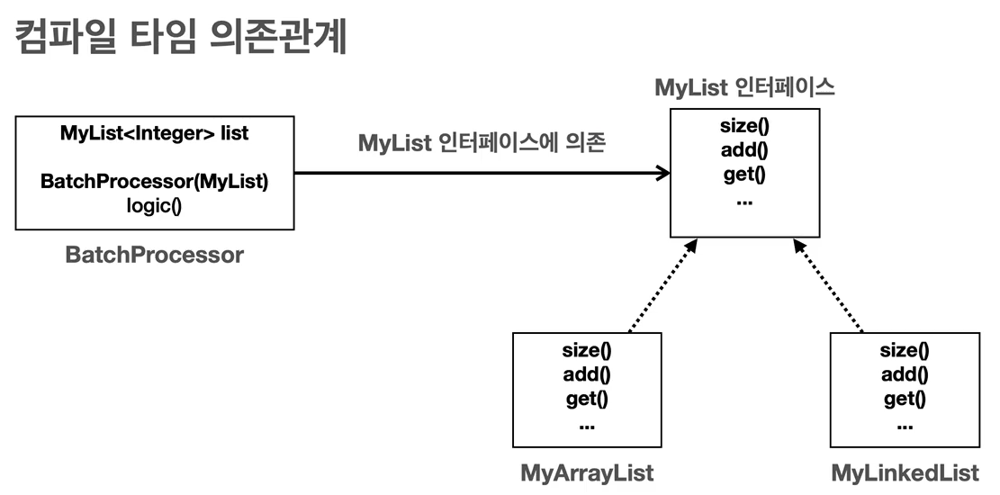
- 컴파일 타임 의존관계는 자바 컴파일러가 보는 의존관계이다. 클래스에 모든 의존관계가 다 나타난다.
- 쉽게 이야기해서 클래스에 바로 보이는 의존관계이다. 그리고 실행하지 않은 소스 코드에 정적으로 나타나는 의존관계이다.
- BatchProcessor 클래스는 MyList 인터페이스만 사용한다. 코드 어디에서 MyArrayList 나 MyLinkedList 같은 정보는 보이지 않는다.
- 따라서 BatchProcessor 는 MyList 인터페이스에만 의존한다.
- 화살표의 의미는 이 클래스가 화살표로 가리키는 클래스의 정보를 알고 있다는 것이다.   
  (자식은 부모를 알지만, 부모는 자식을 모른다.)
####
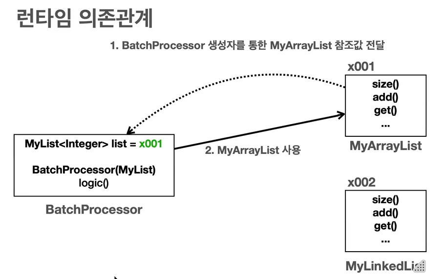  
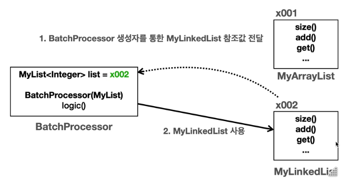
- 런타임 의존관계는 실제 프로그램이 작동할 때 보이는 의존관계다. 주로 생성된 인스턴스와 그것을 참조하는 의존관계다.
- 쉽게 이야기해서 프로그램이 실행될 때 인스턴스 간에 의존관계로 보면 된다.
- 런타임 의존관계는 프로그램 실행 중에 계속 변할 수 있다.
- 다음과 같이 코드를 작성하고 실행한다고 가정해보자

      MyArrayList<Integer> list = new MyArrayList<>();
      BatchProcessor processor = new BatchProcessor(list);
      processor.logic(50_000);

    - BatchProcessor 인스턴스의 MyList list 는 생성자를 통해 MyArrayList(x001) 인스턴스를 참조한다.
    - BatchProcessor 인스턴스에 MyArrayList(x001) 의존관계를 주입한다.
    - 따라서 이후 logic() 을 호출하면 MyArrayList 인스턴스를 사용하게 된다.

#### 정리
- MyList 인터페이스의 도입으로 같은 리스트 자료구조를 그대로 사용하면서 원하는 구현을 변경할 수 있게 되었다.
- BatchProcessor 에서 다음과 같이 처음부터 MyArrayList 를 사용하도록 컴파일 타임 의존관계를 지정했다면  
  이후에 MyLinkedList 로 수정하기 위해서는 BatchProcessor 의 코드를 변경해야 한다.

      public class BatchProcessor {
          private final MyArrayList,Integer> list = new MyArrayList(); // 코드 변경 ㅂ필요
      }
- BatchProcessor 클래스는 구체적인 MyArrayList 나 MyLinkedList 에 의존하는 것이 아니라 추상적인 MyList 에 의존한다.
- 따라서 런타임에 MyList 의 구현체를 얼마든지 선택할 수 있다.
- BatchProcessor 에서 리스트의 의존관계를 클래스에서 미리 결정하는 것이 아니라, 런타임에 객체를 생성하는시점으로 미룬다.  
- 따라서 런타임에 MyList 의 구현체를 변경해도 BatchProcessor 의 코드는 전혀 변경하지 않아도 된다.
- 이렇게 생성자를 통해 런타임 의존관계를 주입하는 것을 생성자 의존관계 주입 또는 줄여서 생성자 주입이라고 한다.
- OCP 원칙을 지켰다. 클라이언트 코드의 변경 없이, 구현 알고리즘인 MyList 인터페이스의 구현을 자유롭게 확잦ㅇ할 수 있다.
- 클라이언트 클래스는 컴파일 타임에 추상적인 것에 의존하고, 의존관계 주입을 통해 구현체를 주입받아 사용했다.

> **!전략 패턴(Strategy Pattern)**  
> 디자인 패턴 중에 가장 중요한 패턴을 하나 뽑으라고 하면 전략 패턴을 뽑을 수 있다.  
> 전략 패턴은 클라이언트 코드의 변경 없이 알고리즘을 쉽게 교체할 수 있다. 방금 설명한 코드가 바로 전략 패턴을 사용한 코드이다.  
> MyList 인터페이스가 전략을 정의하는 인터페이스이고, 각각의 구현체인 MyArrayList, MyLinkedList 가 전략의 구체적인 구현이다.  
> 그리고 전략을 클라이언트 코드(여기서는 BatchProcessor)의 변경 없이 손쉽게 교체할 수 있다.

####
- 재사용성을 높이려면 나중으로 미루는 것이 좋다.
  - 특정 기능을 수행하는 메소드의 재사용성을 높이기 위해 기능을 달라지게하는 요인을 매개변수로 받으면 재사용 성이 높아진다.
  - 제네릭 역시 타입을 나중에 결정하여 재사용성을 높인다.
  - 전략적 패턴 역시 전략 인터페이스가 사용할 구체적인 타입 결정을 나중으로 미루는 것이다.

### 5-4. 직접 구현한 리스트의 성능 비교
####
    public class MyListPerformanceTest {
    
        public static void main(String[] args) {
            int size = 50_000;
    
            System.out.println("==MyArrayList 추가==");
            addFirst(new MyArrayList<>(), size);
            addMid(new MyArrayList<>(), size);      // 찾는데 O(1), 데이터 추가(밀기) O(n)
            MyArrayList<Integer> arrayList = new MyArrayList<>(size); // 조회용 데이터로 사용
            addLast(arrayList, size);               // 찾는데 O(1), 데이터 추가(밀기) O(1)
    
            System.out.println("==MyLinkedList 추가==");
            addFirst(new MyLinkedList<>(), size);
            addMid(new MyLinkedList<>(), size);     // 찾는데 O(n), 데이터 추가 O(1)
            MyLinkedList<Integer> linkedList = new MyLinkedList<>();  // 조회용 데이터로 사용
            addLast(linkedList, size);              // 찾는데 O(n), 데이처 추가 O(1)
    
            int loop = 1000;
            System.out.println("==MyArrayList 조회==");
            getIndex(arrayList, loop, 0);
            getIndex(arrayList, loop, size / 2);
            getIndex(arrayList, loop, size - 1);
    
            System.out.println("==MyArrayList 조회==");
            getIndex(linkedList, loop, 0);
            getIndex(linkedList, loop, size / 2);
            getIndex(linkedList, loop, size - 1);
    
            System.out.println("==MyArrayList 검색==");
            getIndex(arrayList, loop, 0);
            getIndex(arrayList, loop, size / 2);
            getIndex(arrayList, loop, size - 1);
    
            System.out.println("==MyArrayList 검색==");
            getIndex(linkedList, loop, 0);
            getIndex(linkedList, loop, size / 2);
            getIndex(linkedList, loop, size - 1);
        }
    
        private static void addFirst(MyList<Integer> list, int size) {
            long startTime = System.currentTimeMillis();
            for (int i = 0; i < size; i++) {
                list.add(0, i);
            }
            long endTime = System.currentTimeMillis();
            System.out.println("앞에 추가 - 크기: " + size + ", 계산 시간: " + (endTime - startTime) + "ms");
        }
    
        private static void addMid(MyList<Integer> list, int size) {
            long startTime = System.currentTimeMillis();
            for (int i = 0; i < size; i++) {
                list.add(i / 2, i);
            }
            long endTime = System.currentTimeMillis();
            System.out.println("중간에 추가 - 크기: " + size + ", 계산 시간: " + (endTime - startTime) + "ms");
        }
    
        private static void addLast(MyList<Integer> list, int size) {
            long startTime = System.currentTimeMillis();
            for (int i = 0; i < size; i++) {
                list.add(i);
            }
            long endTime = System.currentTimeMillis();
            System.out.println("뒤에 추가 - 크기: " + size + ", 계산 시간: " + (endTime - startTime) + "ms");
        }
    
        private static void getIndex(MyList<Integer> list, int loop, int index) {
            long startTime = System.currentTimeMillis();
            for (int i = 0; i < loop; i++) {
                list.get(index);
            }
            long endTime = System.currentTimeMillis();
            System.out.println("index: " + index + ", 반복" + loop + ", 계산 시간: " + (endTime - startTime) + "ms");
        }
    
        private static void search(MyList<Integer> list, int loop, int findValue) {
            long startTime = System.currentTimeMillis();
            for (int i = 0; i < loop; i++) {
                list.indexOf(findValue);
            }
            long endTime = System.currentTimeMillis();
            System.out.println("findValue: " + findValue + ", 반복" + loop + ", 계산 시간: " + (endTime - startTime) + "ms");
        }
    
    }

#### 실행 결과
    ==MyArrayList 추가==
    앞에 추가 - 크기: 50000, 계산 시간: 1302ms
    중간 추가 - 크기: 50000, 계산 시간: 558ms
    뒤에 추가 - 크기: 50000, 계산 시간: 1ms
    ==MyLinkedList 추가==
    앞에 추가 - 크기: 50000, 계산 시간: 2ms
    중간 추가 - 크기: 50000, 계산 시간: 787ms
    뒤에 추가 - 크기: 50000, 계산 시간: 1394ms
    ==MyArrayList 조회==
    index: 0, 반복10000, 계산 시간: 1ms
    index: 25000, 반복10000, 계산 시간: 0ms
    index: 49999, 반복10000, 계산 시간: 0ms
    ==MyLinkedList 조회==
    index: 0, 반복10000, 계산 시간: 1ms
    index: 25000, 반복10000, 계산 시간: 273ms
    index: 49999, 반복10000, 계산 시간: 556ms
    ==MyArrayList 검색==
    findValue: 0, 반복10000, 계산 시간: 1ms
    findValue: 25000, 반복10000, 계산 시간: 88ms
    findValue: 49999, 반복10000, 계산 시간: 177ms
    ==MyLinkedList 검색==
    findValue: 0, 반복10000, 계산 시간: 0ms
    findValue: 25000, 반복10000, 계산 시간: 399ms
    findValue: 49999, 반복10000, 계산 시간: 807ms

#### 직접 만든 배열 리스트와 연결 리스트 - 성능 비교 표
| 기능       | 배열 리스트        | 연결 리스트          |
|----------|---------------|-----------------|
| 앞에 추가(삭제) | O(n) - 1302ms | O(1) - 2ms      |
| 중간 추가(삭제) | O(n) - 558ms  | O(n) - 787ms    |
| 뒤에 추가(삭제) | O(1) - 1ms    | O(n) - 1394ms   |
| 인덱스 조회   | O(1) - 1ms    | O(n) - 평균 277ms |
| 검색       | O(n) - 평균 89ms | O(n) - 평균 402ms |

#### 추가, 삭제
- 배열 리스트는 인덱스를 통해 추가나 삭제할 위치를 O(1) 로 빠르게 찾지만, 추가나 삭제 이후에 데이터를 한칸씩 밀어야 한다.  
  이 부분이 부분이 O(n) 으로 오래 걸린다.
- 연결 리스트는 인덱스를 통해 추가나 삭제할 위치를 O(n) 으로 느리게 찾지만,  
  실제 데이터 추가는 간단한 참조 변경으로 빠르게 O(1) 수행한다.

#### 앞에 추가(삭제)
- 배열 리스트: 추가나 삭제할 위치를 찾는데 O(1), 데이터를 한칸씩 이동 O(n) => O(n)
- 연결 리스트: 추가나 삭제할 위치를 찾는데 O(1), 노드를 변경하는데 O(1) => O(1)

#### 중간 추가(삭제)
- 배열 리스트: 추가나 삭제할 위치를 찾는데 O(1), 인덱스 이후의 데이터를 한칸씩 이동 O(n/2) => O(n)
- 연결 리스트: 추가나 삭제할 위치를 찾는데 O(n), 노드를 변경하는데 O(1) => O(n)

#### 뒤에 추가(삭제)
- 배열 리스트: 추가나 삭제할 위치를 찾는데 O(1), 인덱스 이후의 데이터를 한칸씩 이동 O(1) => O(1)
- 연결 리스트: 추가나 삭제할 위치를 찾는데 O(n), 노드를 변경하는데 O(1) => O(n)

#### 인덱스 조회
- 배열 리스트: 배열의 인덱스를 사용해서 찾음 => O(1)
- 연결 리스트: 노드를 인덱스 수 만큼 이동 => O(n)

#### 검색
- 배열 리스트: 데이터를 찾을 때 까지 배열을 순회 => O(n)
- 연결 리스트: 데이터를 찾을 때 까지 노드를 순회 => O(n)

#### 시간 복잡도와 실제 성능 
- 이론적으로 MyLinkedList 의 평균 추가(중간 삽입) 연산은 MyArrayList 보다 빠를 수 있다.  
- 그러나 실제 성능은 요소의 순차적 접근 속도, 메모리 할당 및 해제 비용, CPU 캐시 활용도 등 다양한 요소에 의해 영향을 받는다.
- MyArrayList 는 요소들이 메모리 상에서 연속적으로 위치하여 CPU 캐시 효율이 좋고, 메모리 접근 속도가 빠르다.
- 반면, MyLinkedList 는 각 요소가 별도의 객체로 존재하고 다음 요소의 참조를 저장하기 때문에 CPU 효율이 떨어지고,  
  메모리 접근 속도가 상대적으로 느릴 수 있다.
- MyArrayList 의 경우 CAPACITY 를 넘어서면 배열을 다시 만들고 복사하는 과정이 추가된다.  
- 하지만 한 번에 2배씩 늘어나기 때문에 이 과정은 가금 발생하므로, 전체 성능에 큰 영향을 주지는 않는다.

#### 배열 리스트 vs 연결 리스트
- 대부분의 경우 배열 리스트가 성능상 유리하다. 이런 이유로 실무에서는 주로 배열 리스트를 기본으로 사용한다.
- 만약 데이터를 앞쪽에서 자주 추가하거나 삭제할 일이 있다면 연결 리스트를 고려하자.

### 5-5. 자바 리스트
#### List 자료 구조 
- 순서가 있고, 중복을 허용하는 자료 구조를 리스트라 한다. 
- 자바의 컬렉션 프레임워크가 제공하는 가장 대표적인 자료 구조가 바로 리스트이다.
- 리스트와 관련된 컬렉션 프레임 워크는 다음 구조를 가진다.

#### 컬렉션 프레임 워크 - 리스트 
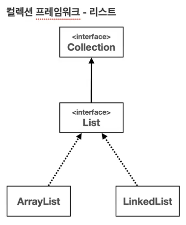

#### Collection 인터페이스
- Collection 인터페이스는 java.util 패키지의 컬렉션 프레임워크의 핵심 인터페이스 중 하나이다.
- 이 인터페이스는 자바에서 다양한 컬렉션, 즉 데이터 그룹을 다루기 위한 메서드를 정의한다.
- Collection 인터페이스는 List, Set, Queue 와 같은 다양한 하위 인터페이스와 함께 사용되며,  
  이를 통해 데이터를 리스트, 세트, 큐 드으이 형태로 관리할 수 있다.

#### List 인터페이스 
- List 인터페이스는 java.util 패키지에 있는 컬렉션 프레임워크의 일부이다.
- List 는 객체들의 순서가 있는 컬렉션을 나타내며, 같은 객체의 중복 저장을 허용한다.
- 이 리스트는 배열과 비슷하지만, 크기가 동적으로 변화하는 컬렉션을 다룰 때 유연하게 사용할 수 있다.
- List 인터페이스는 ArrayList, LinkedList 와 같은 여러 구현 클래스를 가지고 있으며,  
  각 클래스는 List 인터페이스의 메서드를 구현한다.

#### 자바 ArrayList 특징 
- java.util.ArrayList
- 자바가 제공하는 ArrayList 는 우리가 직접 만든 MyArrayList 와 거의 비슷하다.
- 배열을 사용해서 데이터를 관리한다.
- 기본 CAPACITY 는 10이다. (DEFAULT_CAPACITY = 10)
  - CAPACITY 를 넘어가면 배열을 50% 증가한다.
  - 10 -> 15 -> 22 -> 33 -> 49 로 증가한다.(최적화는 자바 버전에 따라 달라질 수 있다.)
- 메모리 고속 복사 연산을 사용한다.
  - ArrayList 의 중간 위치에 데이터를 추가하면, 추가할 위치 이후의 모든 요소를 한 칸씩 뒤로 이동시켜야 한다.
  - 자바가 제공하는 ArrayList 는 이 부분을 최적화 하는데, 배열의 요소 이동은 시스템 레벨에서 최적화된   
    메모리 고속 복사 연산을 사용해서 비교적 빠르게 수행된다. 참고로 System.arraycopy( ) 를 사용한다.
- 메모리 고속 복사 연산  
  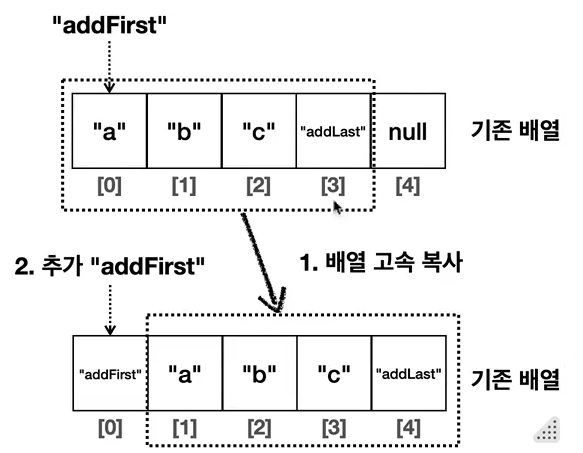
  - 시스템 레벨에서 배열을 한 번 아주 빠르게 복사한다. 이 부분은 OS, 하드웨어에 따라 성능이 다르다.
  - 하지만 한 칸씩 이동하는 방식과 비교하면 보통 수 배 이상의 빠른 성능을 제공한다.

#### 자바 LinkedList 특징
- java.util.LinkedList
- 자바가 제공하는 LinkedList 는 우리가 직접 만든 MyLinkedList 와 거의 비슷하다.
- 이중 연결 트리 구조  
  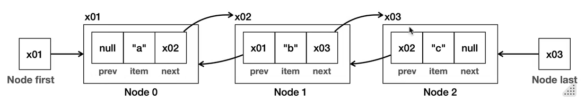
  - 자바가 제공하는 LinkedList 는 이중 연결 구조를 사용한다. 이 구조는 다음 노드 뿐만 아니라 이전 노드로도 이동할 수 있다.
    - ex) node.next 를 호출하면 다음 노드로, node.prev 를 호출하면 이전 노드로 이동한다.
  - 마지막 노드에 대한 참조를 제공한다. 따라서 데이터를 마지막에 추가하는 경우에도 O(1)의 성능 제공한다.
  - 이전 노드로 이동할 수 있기 때문에 마지막 노드부터 앞으로, 그러니까 역방향을 조회할 수 있다.
    - 덕분에 인덱스 조회 성능ㅇ르 최적화 할 수 있다.
    - 예를 들어 인덱스로 조회하는 경우 인덱스가 사이즈의 절반 이하라면 처음부터 찾아서 올라가고,  
      인덱스가 사이지의 절반을 넘으면 마지막 노드 부터 역방향으로 조회해서 성능을 최적화 할 수 있다.

- 첫 번재 노드와 마지막 노드 둘다 참조  

      class Node {
          E item;
          Node next;
          Node prev;
      }

      class LinkedList {
          Node first;  // 첫 번째 노드 참조
          Node last;   // 마지막 노드 참조
          int size;
      }

### 5-6.자바 리스트의 성능 비교
    import java.util.ArrayList;
    import java.util.LinkedList;
    import java.util.List;
    
    public class JavaListPerformanceTest {
    
        public static void main(String[] args) {
            int size = 50_000;
    
            System.out.println("==ArrayList 추가==");
            addFirst(new ArrayList<>(), size);
            addMid(new ArrayList<>(), size);      // 찾는데 O(1), 데이터 추가(밀기) O(n)
            ArrayList<Integer> arrayList = new ArrayList<>(size); // 조회용 데이터로 사용
            addLast(arrayList, size);             // 찾는데 O(1), 데이터 추가(밀기) O(1)
    
            System.out.println("==LinkedList 추가==");
            addFirst(new LinkedList<>(), size);
            addMid(new LinkedList<>(), size);     // 찾는데 O(n), 데이터 추가 O(1)
            LinkedList<Integer> linkedList = new LinkedList<>();  // 조회용 데이터로 사용
            addLast(linkedList, size);            // 찾는데 O(1), 데이처 추가 O(1)
    
            int loop = 10000;
            System.out.println("==ArrayList 조회==");
            getIndex(arrayList, loop, 0);
            getIndex(arrayList, loop, size / 2);
            getIndex(arrayList, loop, size - 1);
    
            System.out.println("==LinkedList 조회==");
            getIndex(linkedList, loop, 0);
            getIndex(linkedList, loop, size / 2);
            getIndex(linkedList, loop, size - 1);
    
            System.out.println("==ArrayList 검색==");
            search(arrayList, loop, 0);
            search(arrayList, loop, size / 2);
            search(arrayList, loop, size - 1);
    
            System.out.println("==LinkedList 검색==");
            search(linkedList, loop, 0);
            search(linkedList, loop, size / 2);
            search(linkedList, loop, size - 1);
        }
    
        private static void addFirst(List<Integer> list, int size) {
            long startTime = System.currentTimeMillis();
            for (int i = 0; i < size; i++) {
                list.add(0, i);
            }
            long endTime = System.currentTimeMillis();
            System.out.println("앞에 추가 - 크기: " + size + ", 계산 시간: " + (endTime - startTime) + "ms");
        }
    
        private static void addMid(List<Integer> list, int size) {
            long startTime = System.currentTimeMillis();
            for (int i = 0; i < size; i++) {
                list.add(i / 2, i);
            }
            long endTime = System.currentTimeMillis();
            System.out.println("중간 추가 - 크기: " + size + ", 계산 시간: " + (endTime - startTime) + "ms");
        }
    
        private static void addLast(List<Integer> list, int size) {
            long startTime = System.currentTimeMillis();
            for (int i = 0; i < size; i++) {
                list.add(i);
            }
            long endTime = System.currentTimeMillis();
            System.out.println("뒤에 추가 - 크기: " + size + ", 계산 시간: " + (endTime - startTime) + "ms");
        }
    
        private static void getIndex(List<Integer> list, int loop, int index) {
            long startTime = System.currentTimeMillis();
            for (int i = 0; i < loop; i++) {
                list.get(index);
            }
            long endTime = System.currentTimeMillis();
            System.out.println("index: " + index + ", 반복" + loop + ", 계산 시간: " + (endTime - startTime) + "ms");
        }
    
        private static void search(List<Integer> list, int loop, int findValue) {
            long startTime = System.currentTimeMillis();
            for (int i = 0; i < loop; i++) {
                list.indexOf(findValue);
            }
            long endTime = System.currentTimeMillis();
            System.out.println("findValue: " + findValue + ", 반복" + loop + ", 계산 시간: " + (endTime - startTime) + "ms");
        }
    
    }

#### 실행 결과 
    ==ArrayList 추가==
    앞에 추가 - 크기: 50000, 계산 시간: 81ms
    중간 추가 - 크기: 50000, 계산 시간: 41ms
    뒤에 추가 - 크기: 50000, 계산 시간: 3ms
    ==LinkedList 추가==
    앞에 추가 - 크기: 50000, 계산 시간: 3ms
    중간 추가 - 크기: 50000, 계산 시간: 802ms
    뒤에 추가 - 크기: 50000, 계산 시간: 2ms
    ==ArrayList 조회==
    index: 0, 반복10000, 계산 시간: 1ms
    index: 25000, 반복10000, 계산 시간: 0ms
    index: 49999, 반복10000, 계산 시간: 1ms
    ==LinkedList 조회==
    index: 0, 반복10000, 계산 시간: 0ms
    index: 25000, 반복10000, 계산 시간: 287ms
    index: 49999, 반복10000, 계산 시간: 0ms
    ==ArrayList 검색==
    findValue: 0, 반복10000, 계산 시간: 1ms
    findValue: 25000, 반복10000, 계산 시간: 117ms
    findValue: 49999, 반복10000, 계산 시간: 228ms
    ==LinkedList 검색==
    findValue: 0, 반복10000, 계산 시간: 0ms
    findValue: 25000, 반복10000, 계산 시간: 409ms
    findValue: 49999, 반복10000, 계산 시간: 809ms

#### 성능 비교 표 
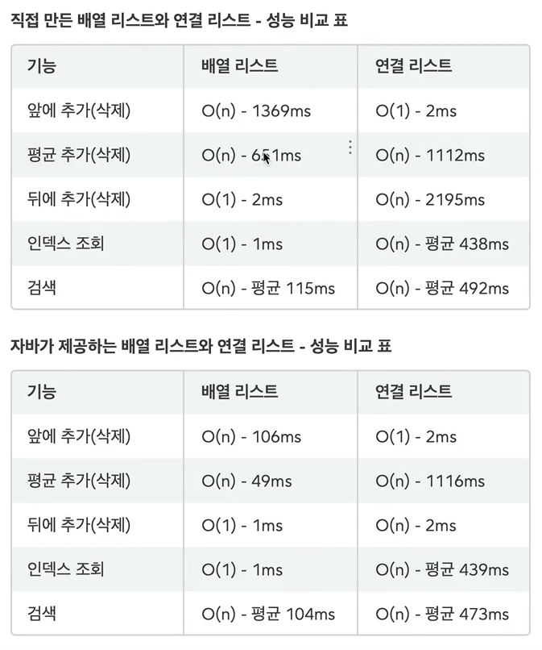
- 배열 리스트 앞에 추가(삭제), 중간 추가(삭제)의 경우 고속 복사 덕분에 많이 빨라졌다.  
  - 메모리 고속 복사는 시스템에 따라 성능이 다르지만 대략 O(n/10) 정도로 추정할 수 있다.
  - 그러나 상수를 제거하면 O(n)이기 때문에 데이터가 아주 많으면 메모리 고속 복사라도 느려진다.
- 연결 리스트의 경우 뒤에 추가가 last node 의 참조값을 가고 있어서 빨라졌다.
- 인덱스 조회와 검색은 같다.

 

## 6. 컬렉션 프레임워크 - Hash
### 6-1. 리스트 vs 세트
- 자료 구조에서의 List 와 Set 은 각각 특정한 방식으로 데이터를 저장하고 관리하는 데 사용된다.
#### List 
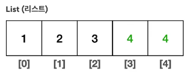  
- **정의**: 리스트는 요소들의 순차적인 컬렉션이다. 요소들은 특정 순서를 가지며, 같은 요소가 여러 번 나타날 수 있다.
- **특징**
  - 순서 유지: 리스트에 추가된 요소는 특정한 순서를 유지한다. 이 순서는 요소가 추가된 순서를 반영할 수 있다.
  - 중복 허용: 리스트는 동일한 값이나 객체의 중복을 허용한다. 예를 들어, 같은 숫자나 문자열을 리스트 안에 여러 번 저장할 수 있다.
  - 인덱스 접근: 리스트의 각 요소는 인덱스를 통해 접근할 수 있다. 이 인덱스는 보통 0부터 시작한다.
- **용도**: 순서가 중요하거나 중복된 요소를 허용해야 하는 경우에 주로 사용한다.
- 예시: 장바구니 목록, 순서가 중요한 일련의 이벤트 목록

#### Set
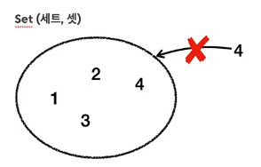  
- **정의**: 세트는 유일한 요소들의 컬렉션이다. 참고로 세트보다는 셋으로 많이 불린다.
- **특징**
  - 유연성: 셋에는 중복된 요소가 존재하지 않는다. 셋에 요소를 추가할 때, 이미 존재하는 요소면 무시한다.
  - 순서 미보장: 대부분의 셋 구현에는 요소들의 순서를 보장하지 않는다. 즉 요소를 출력할 때 입력 순서와 다를 수 있다.
  - 빠른 검색: 셋은 요소의 유무를 빠르게 확인할 수 있도록 최적화되어 있다. 이는 데이터의 중복을 방지하고 빠른 조회를 가능하게 한다.
- **용도**: 중복을 허용하지 않고, 요소의 유무만 중요한 경우에 사용한다.
- 예시: 회원 ID 집함, 고유한 항목의 집합

### 6-2. 직접 구현하는 Set0 - 시작
- 셋을 구현하는 것은 아주 단순하다. 인덱스가 없기 때문에 단순히 데이터를 넣고, 데이터가 있는지 확인하고,   
  데이터를 삭제하는 정도면 충분하다. 그리고 데이터를 추가할 때 중복 여부만 체크해주면 된다.
    - add(value): 셋에 값을 추가한다. 중복 데이터는 저장하지 않는다.
    - contains(value): 셋에 값이 있는지 확인한다.
    - remove(value): 셋에 있는 값을 제거한다.

#### 셋 직접 구현하기
    public class MyHashSetV0 {
    
        private int[] elementData = new int[10];
        private int size = 0;
    
        // O(n)
        public boolean add(int value) {
            if (contains(value)) {
                return false;
            }
            elementData[size] = value;
            size++;
            return true;
        }
    
        // O(n)
        public boolean contains(int value) {
            for (int data: elementData) {
                if (data == value) {
                    return true;
                }
            }
            return false;
        }
    
        @Override
        public String toString() {
            return "MyHashSetV0{" +
                    "elementData=" + Arrays.toString(Arrays.copyOf(elementData, size)) +
                    ", size=" + size +
                    '}';
        }
    }
- 예제에서는 단순함을 위해 배열에 데이터를 저장한다. 배열의 크기도 10으로 고정했다.
- add(value): 셋에 중복된 값이 있는지 체크하고, 중복된 값이 있으면 false 를 반환한다.  
  중복된 값이 없으면 값을 저장하고 true 를 반환한다.
- contains(value): 셋에 값이 있는지 확인한다. 값이 있으면 true 를 반환하고, 값이 없으면 false 를 반환한다.
- toString(): 배열을 출력하는 부분에 Arrays.copyOf()를 사용해서 배열에 데이터가 입력된 만큼만 출력한다.
####
    public class MyHashSetV0Main {
    
        public static void main(String[] args) {
            MyHashSetV0 set = new MyHashSetV0();
            set.add(1); // O(1)
            set.add(2); // O(n)
            set.add(3);
            set.add(4);
            set.add(5);
            System.out.println(set);
    
            boolean result = set.add(4); // 중복 데이터 저장
            System.out.println("중복 데이터 저장 결과 = " + result);
            System.out.println(set);
    
            System.out.println("set.contains(3) = " + set.contains(3));
            System.out.println("set.contains(99) = " + set.contains(99));
        }
    }
- add() 로 데이터를 추가할 때 셋에 데이터가 있는지 전체 데이터를 항상 확인해야 한다. 따라서 입력 성능이 O(n)으로 나쁘다.
- contains() 로 데이터를 찾을 때는 배열에 있는 모든 데이터를 찾고 비교해야 하므로 평균 O(n) 이 걸린다.

#### 정리 
- 우리가 만든 셋은 구조는 단순하지만, 데이터 추가, 검색 모두 O(n)으로 성능이 좋지 않다.
- 특히 데이터가 많을수록 효율은 매우 떨어진다. 검색의 경우 이전에 보았던 ArrayList or LinkedList 도 O(n) 이어서 받아들일 수 있다.
- 그러나 데이터의 추가가 특히 문제이다. 데이터를 추가할 때마다 중복 데이터가 있는지 체크하기 위해 전체 데이터를 확인해야 한다.
- 데이터를 추가할 때마다 이렇게 성능이 느린 자료 구조는 사용하기 어렵다.
- 결국 중복 데이터를 찾는 부분이 성능의 발복을 잡는 것이다. 이런 부분을 어떻게 개선할 수 있을까?

### 6-3. 해시 알고리즘1 - 시작
- 해시(hash) 알고리즘을 사용하면 데이터를 찾는 검색 성능을 평균 O(1)로 비약적으로 끌어올릴 수 있다.

#### 이해를 돕기위한 간단한 문제 
- 입력: 0~9 사이의 여러 값이 입력된다.중복된 값은 입력되지 않는다.
- 찾기: 0~9 사이의 값이 하나 입력된 된다. 입력된 값 중에 찾는 값이 있는지 확인해보자.
####
    public class HashStart1 {
    
        public static void main(String[] args) {
            Integer[] inputArray = new Integer[4];
            inputArray[0] = 1;
            inputArray[1] = 2;
            inputArray[2] = 5;
            inputArray[3] = 8;
            System.out.println("inputArray = " + Arrays.toString(inputArray));
    
            int searchValue = 8;
            // 4번 반복 O(n)
            for (int inputValue : inputArray) {
                if (inputValue == searchValue) {
                    System.out.println(inputValue);
                }
            }
        }
    }
- 입력 값은 1, 2, 5, 8 이다. 이 값을 배열에 넣고, 배열에서 검색 값 8을 찾아보자. 이 값을 찾으려면 배열에 들어 있는 데이터를 모두 찾아서 비교해야 한다.
- 따라서 배열에서 특정 데이터를 찾는 성능은 O(n)으로 느리다. 물론 데이터가 많아질 수록 더 느려진다. 여기서 문제의 핵심은 찾기 성능이 O(n)으로 느리다는 것이다.

### 6-4. 해시 알고리즘2 - index 사용
- 배열은 인덱스의 위치를 사용해서 데이터를 찾을 때 O(1)로 매우 빠른 특징을 가지고 있다.
- 반면에 데이터를 검색할 때는 배열에 들어있는 데이터 하나하나를 모두 비교해야 하므로 인덱스를 활용할 수 없다.
- 그런데 만약 데이터를 검색할 때도 인덱스를 활용해서 데이터를 한 번에 찾을 수 있다면 어떻게 될까?
- 이렇게만 할 수 있다면 O(n) -> O(1) 로 바뀌어서 성능을 획기적으로 끌어올릴 수 있을 것이다.
- 데이터의 값 자체를 인덱스와 맞추어 저장하면 어떨까? 그러니가 데이터의 값 자체를 배열의 인덱스로 사용하면 어떨까?  
  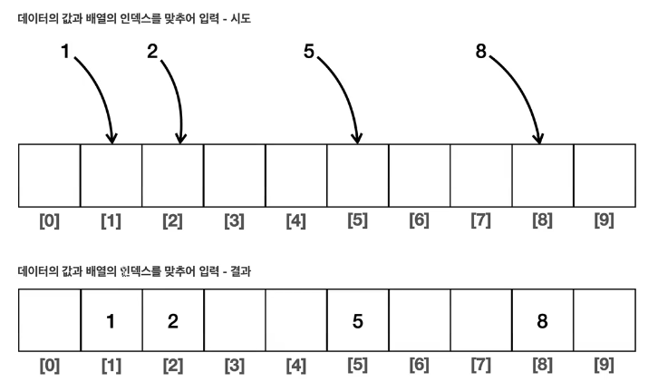   
- 저장하는 데이터와 인덱스를 완전히 맞춘 것이다. 이제 인덱스 번호가 데이터가 되고, 데이터가 인덱스 번호가 되었다.
- 이제 데이터를 검색해보자
  - 데이터 1을 찾으려면 array[1] 을 입력하면 된다.
  - 데이터 5을 찾으려면 array[5] 를 입력하면 된다.
  - 데이터 8을 찾으려면 array[8] 을 입력하면 된다.
- 데이터가 인덱스 번호가 되었기 때문에 배열의 인덱스를 활용해서 단번에 필요한 데이터를 찾을 수 있다.
- 데이터의 값을 인덱스 번호로 사용하는 아주 간단한 아디어로 O(n) 의 검색 연산을 O(1) 의 검색 연산으로 바꿀 수 있다!
####
    public class HashStart2 {
    
        public static void main(String[] args) {
            // 입력: 1, 2, 5, 8
            // [null, 1, 2, null, null, 5, null, null, 8, null]
            Integer[] inputArray = new Integer[10];
            inputArray[1] = 1;
            inputArray[2] = 2;
            inputArray[5] = 5;
            inputArray[8] = 8;
            System.out.println("inputArray = " + Arrays.toString(inputArray));
    
            int searchValue = 8;
            Integer result = inputArray[searchValue];
            System.out.println("result = " + result);
        }
    }

### 6-5. 해시 알고리즘3- 메모리 낭비
- 이번에는 입력 값으 범위를 0~99로 넓혀보자.
- 입력: 0~99 사이의 여러 값이 입력된다. 중복된 값은 입력되지 않는다.
- 찾기: 0~99 사이의 값이 하나 입력된다. 입력된 값 중에 찾는 값이 있는지 확인해보자.
- 검색 속도를 높이기 위해서 앞서 학습한 것 처럼 데이터의 값을 배열의 인덱스로 사용하자.
- 따라서 데이터가 0~99까지 입력될 수 있다면 인덱스도 0~99까지 사용할 수 있어야 한다.
####
    public class HashStart3 {
    
        public static void main(String[] args) {
            // 입력: {1, 2, 5, 8, 14, 99}
            Integer[] inputArray = new Integer[100];
            inputArray[1] = 1;
            inputArray[2] = 2;
            inputArray[5] = 5;
            inputArray[8] = 8;
            inputArray[14] = 14;
            inputArray[99] = 99;
            System.out.println("inputArray = " + Arrays.toString(inputArray));
    
            int searchValue = 99;
            Integer result = inputArray[searchValue];
            System.out.println("result = " + result);
        }
    }

#### 한계
- 데이터의 값을 인덱스로 사용한 덕분에 O(1) 의 매우 빠른 검색 속도를 얻을 수 있다.
- 그리고 이 코드는 정상적으로 수행된다. 하지만 낭비되는 메모리 공간이 너무 많다.
- 만약 입력 값의 범위를 0~99를 넘어서 int 숫자의 모든 범위를 입력할 수 있도록 하려면 배열의 크기를 얼마나 잡아야 할까?
  - 0~99: 사이즈 100의 배열 필요, 100 * 4byte (단순히 값의 크기로만 계산시)
  - int 범위 입력(-2,147,483,648~2,147,438,647): 약 42억 * 4byte
- 데이터의 값을 인덱스로 사용할 때, 입력할 수 있는 값의 범위가 int 라면 한번의 연산에 최신 컴퓨터의 메모리가 거의 다 소모되어 버린다.
- 뿐만 아니라 처음 배열을 생성하기 위해 메모리를 할당하는 데도 너무 오랜 시간이 소모된다.
- 따라서 데이터의 값을 인덱스로 사용하는 방식은 입력 값의 범위가 넓다면 사용하기 어려워보인다.
- 데이터의 값을 인덱스로 사용하는 방법은 매우 빠른 성능을 보장하지만, 입력 값의 범위가 조금만 커져도 메모리 낭비가 너무 심하다.

### 6-6. 해시 알고리즘4 - 나머지 연산
- 앞에서 이야기한 거서럼 모든 숫자를 입력할 수 있다고 가정하면, 입력값의 범위가 너무 넓어져서 데이터의 값을 인덱스로 사용하기는 어렵다.
- 하지만 입력 값의 범위가 넓어도 해당 범위의 값을 모두 다 입력하는 것은 아니다.
- 앞의 예에서 0~99 범위의 값 중에 1,2,5,8,14,99 만 입력했다. 따라서 대부분의 공간은 낭비되었다.
- 공간도 절약하면서, 넓은 범위의 값을 사용할 수 있는 방법이 있는데, 바로 나머지 연산을 사용하는 것이다.
- 저장할 수 있는 배열의 크기(CAPACITY)를 10이라고 가정하자. 그 크기에 맞추어 나머지 연산을 사용하면 된다.

#### 나머지 연산
    1 % 10 = 1
    2 % 10 = 2
    5 % 10 = 5
    8 % 10 = 8
    14 % 10 = 4
    99 % 10 = 9
- 여기서 14, 99 는 10보다 큰 값이다. 따라서 일반적인 방법으로는 크기가 1-인 배열의 인덱스로 사용할 수 없다.
- 하지만 나머지 연산의 결과를 사용하면 14 는 4로, 99는 9로 크기가 10인 배열의 인덱스로 사용할 수 있다.
- 나머지 연산의 결과는 절대 배열의 크기를 넘지 않는다. 예를 들어 나머지 연ㅅ낭 10을 사용하면 결과는 0~9까지만 나온다. 절대로 10이 되거나 10을 넘지 않는다.
- 따라서 연산 결과는 배열의 크기를 넘지 않으므로 안전하게 인덱스로 사용할 수 있다.

#### 해시 인덱스

### 6-7. 해시 알고리즘5 - 해시 충돌 설명

### 6-8. 해시 알고리즘6 - 해시 충돌 구현

 

## 7. 컬렉션 프레임워크 - HashSet
### 7-1. 직접 구현하는 Set1 - MyHashSetV1

### 7-2. 문자열 해시 코드

### 7-3. 자바의 hashCode()

### 7-4. 직접 구현하는 Set2 - MyHashSetV2

### 7-5. 직접 구현하는 Set3 - 직접 만든 객체 보관

### 7-6. equals, hashCode 의 중요성1

### 7-7. equals, hashCode 의 중요성2

### 7-8. 직접 구현하는 Set4 - 제네릭과 인터페이스 도입

 

## 8. 컬렉션 프레임워크 - Set
### 8-1. 자바가 제공하는 Set1 - HashSet, LinkedHashSet

### 8-2. 자바가 제공하는 Set2 - TreeSet

### 8-3. 자바가 제공하는 Set3 - 예제

### 8-4. 자바가 제공하는 Set4 - 최적화

### 8-5. 문제와 풀이1

### 8-6. 문제와 풀이2

 

## 9. 컬렉션 프레임워크 - Map, Stack, Queue
### 9-1. 컬렉션 프레임워크 - Map 소개1

### 9-2. 컬렉션 프레임워크 - Map 소개2

### 9-3. 컬렉션 프레임워크 - Map 구현체

### 9-4. 스택 자료 구조

### 9-5. 큐 자료 구조

### 9-6. Deque 자료 구조

### 9-7. Deque 와 Stack, Queue

### 9-8. 문제와 풀이1 - Map1

### 9-9. 문제와 풀이2 - Map2

### 9-10. 문제와 풀이3 - Stack

### 9-11. 문제와 풀이4 - Queue

 

## 10. 컬렉션 프레임워크 - 순회, 정렬, 전체 정리
### 10-1. 순회1 - 직접 구현하는 Iterable, Iterator

### 10-2. 순회2 - 향상된 for 문

### 10-3. 순회3 - 자바가 제공하는 Iterable, Iterator

### 10-4. 정렬1 - Comparable, Comparator

### 10-5. 정렬2 - Comparable, Comparator

### 10-6. 정렬3 - Comparable, Comparator

### 10-7. 컬렉션 유틸

### 10-8. 컬렉션 프레임워크 전체 정리

### 10-9. 문제와 풀이

 

## 11. 다음으로