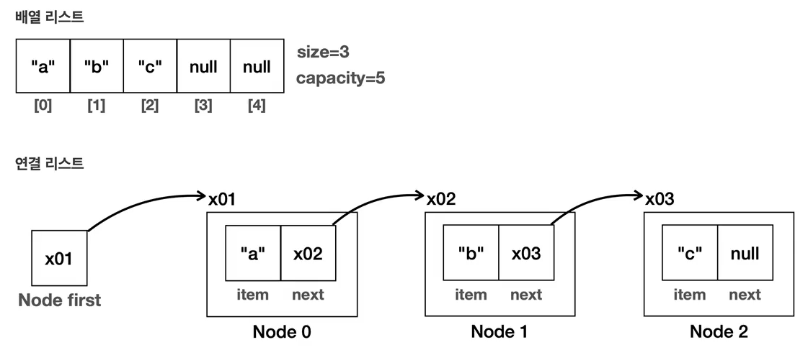
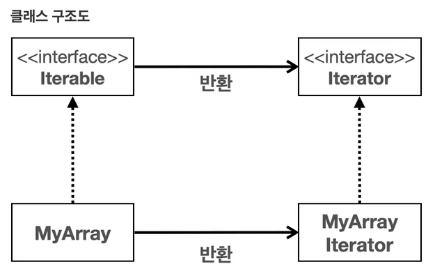
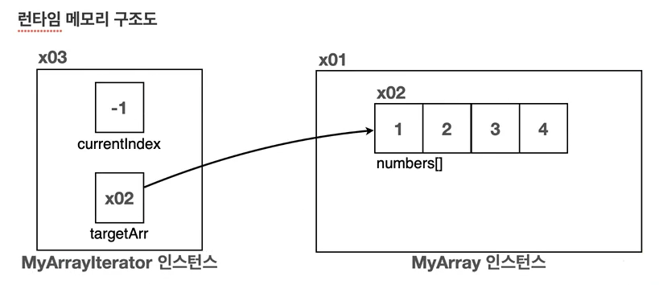
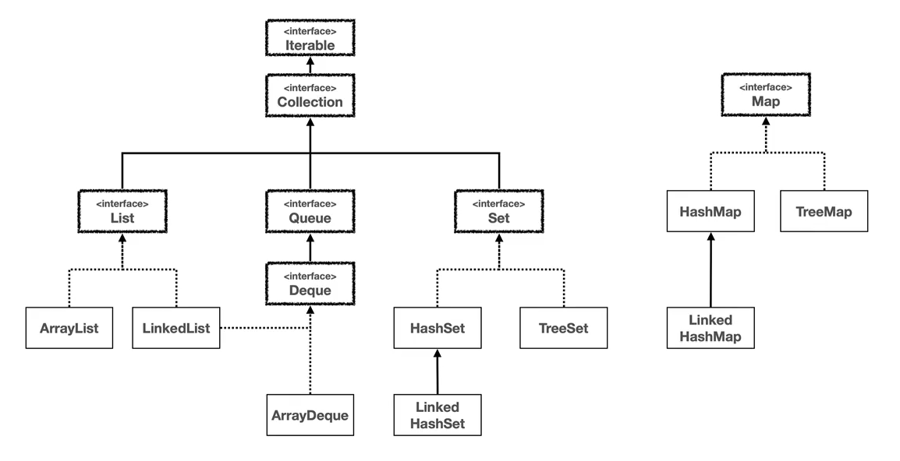
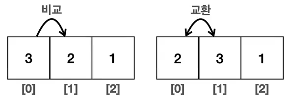
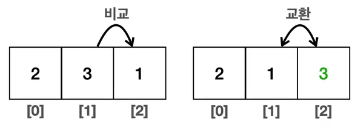
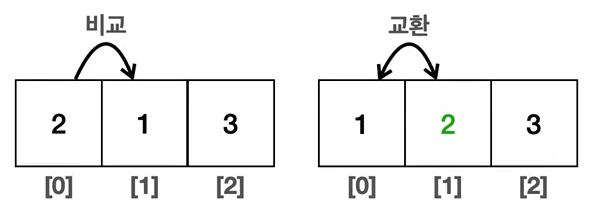
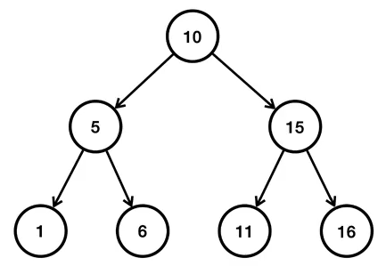

## 9. 컬렉션 프레임워크 - Map, Stack, Queue
### 9-1. 컬렉션 프레임워크 - Map 소개1
  
- Map dms key-value 의 쌍을 저장하는 자료 구조이다.
- 키는 맵 내에서 유일해야 한다. 그리고 키를 통해 값을 빠르게 검색할 수 있다,
- 키는 중복될 수 없지만, 값은 중복될 수 있다.
- Map 은 순서를 유지하지 않는다.

#### 컬렉션 프레임워크 - Map
  
- 자바는 HashMap, TreeMap, LinkedHashMap 등 다양한 Map 구현체를 제공한다.
- 이들은 Map 인터페이스의 메서드를 구현하며, 각기 다른 특성과 성능 특징을 가지고 있다.

#### 
    public class MapMain1 {
    
        public static void main(String[] args) {
            Map<String, Integer> studentMap = new HashMap<>();
    
            // 학생 성적 데이터 추가
            studentMap.put("studentA", 90);
            studentMap.put("studentB", 80);
            studentMap.put("studentC", 80);
            studentMap.put("studentD", 100);
            System.out.println(studentMap);
    
            // 특정 학생의 값 조회
            Integer result = studentMap.get("studentD");
            System.out.println("result = " + result);
    
            // KeySet 활용
            System.out.println("KeySet 활용");
            Set<String> keySet = studentMap.keySet();   // keySet()은 key 만 꺼낸다. key 는 사실 Set 과 같은 자료 구조로 저장된다.
            for (String key : keySet) {
                Integer value = studentMap.get(key);
                System.out.println("key= "+ key + ", valu = " + value);
            }
    
            // entrySet 활용
            System.out.println("entrySet 활용");
            Set<Map.Entry<String, Integer>> entries = studentMap.entrySet();    // Entry 는 key 와 value 를 저장하는 객체이다.
            for (Map.Entry<String, Integer> entry : entries) {
                System.out.println("key= " + entry.getKey() + ", value= " + entry.getValue());
            }
    
    
            // values 활용
            System.out.println("values 활용");
            Collection<Integer> values = studentMap.values();   // values()는 value 만 꺼낸다. values 는 중복이될 수 있어서 Collection 으로 나온다. (순서를 보장하지 않아서 List 로 나오지 않음)
            for (Integer value : values) {
                System.out.println("value= " + value);
            }
        }
    }
#### 
    // 실행 결과  
    {studentB=80, studentA=90, studentD=100, studentC=80}
    result = 100
    KeySet 활용
    key= studentB, valu = 80
    key= studentA, valu = 90
    key= studentD, valu = 100
    key= studentC, valu = 80
    entrySet 활용
    key= studentB, value= 80
    key= studentA, value= 90
    key= studentD, value= 100
    key= studentC, value= 80
    values 활용
    value= 80
    value= 90
    value= 100
    value= 80

#### 키 목록 조회
    Set<String> keySet = studentMap.keySet();
  - Map 의 키는 중복을 허용하지 않는다. 따라서 Map 의 모든 키 목록을 조회하는 keySet( )을 호출하면,  
    중복을 허용하지 않는 자료 구조인 Set 을 반환한다.
#### 키와 값 목록 조회  

- Map 은 키와 값을 보관하는 자료 구조 이다. 따라서 키와 값을 하나로 묶을 수 있는 방법이 필요하다.
- 이때 Entry 를 사용한다. Entry 는 키-값의 쌍으로 이루어진 간단한 객체이다.
- Entry 는 Map 내부에서 키와 값을 함께 묶어서 저장할 때 사용한다.
- 쉽게 이야기해서 우리가 Map 에 키와 값으로 데이터를 저장하면 Map 은 내부에서 키와 값을 하나로 묶는  
  Entry 객체를 만들어서 보관한다. 참고로 하나의 Map 에 여러 Entry 가 저장될 수 있다.
- Entry 는 Map 내부에 있는 인터페이스이다. 우리는 구현체보다는 이 인터페이스를 사용하면 된다.
#### 값 목록 조회
    Collection<Integer> values = studentMap.values();
- Map 의 값 목록은 중복을 허용한다. 따라서 중복을 허용하지 않는 Set 으로 반환할 수는 없다.
- 그리고 입력 순서를 보장하지 않기 때문에 순서를 보장하는 List 로 반환하기도 애매하다.
- 따라서 단순히 값의 모흠이라는 의미의 상위 인터페이스인 Collection 으로 반환한다.

### 9-2. 컬렉션 프레임워크 - Map 소개2
    public class MapMain2 {
    
        public static void main(String[] args) {
            HashMap<String, Integer> studentMap = new HashMap<>();
    
            // 학생 성적 데이터 추가
            studentMap.put("studentA", 90);
            System.out.println(studentMap);
    
            // 같은 키에 저장시 기존 값 교체
            studentMap.put("studentA", 100);
            System.out.println(studentMap);
    
            boolean containsKey = studentMap.containsKey("studentA");
            System.out.println("containsKey = " + containsKey);
    
            // 특정 학생의 값 삭제
            studentMap.remove("studentA");
            System.out.println(studentMap);
        }
    }
####
    // 실행 결과 
    {studentA=90}
    {studentA=100}
    containsKey = true
    {}
- Map 에 값을 저장할 때 같은 키에 다른 값을 저장하면 기존 값을 교체한다.
- 만약 같은 학생이 Map 에 없는 경우에만 데이터를 저장하려면 어떻게 해야할까? -> .putIfAbsent( )
####
    public class MapMain3 {
    
        public static void main(String[] args) {
            HashMap<String, Integer> studentMap = new HashMap<>();
    
            // 학생 성적 데이터 추가
            studentMap.put("studentA", 50);
            System.out.println(studentMap);
    
            // 학생이 없는 경우에만 추가1
            if (!studentMap.containsKey("studentA")) {
                studentMap.put("studentA", 100);
            }
            System.out.println(studentMap);
    
            // 학생이 없는 경우에만 추가2 (putIfAbsent)
            studentMap.putIfAbsent("studentA", 100);
            studentMap.putIfAbsent("studentB", 100);
            System.out.println(studentMap);
        }
    }
- putIfAbsent( ) 는 영어 그대로 없는 경우에만 입력하라는 뜻이다.
- 이 메서드를 사용하면 키가 없는 경우에만 데이터를 저장하고 싶을 때 코드를 한줄로 편리하게 처리할 수 있다.

### 9-3. 컬렉션 프레임워크 - Map 구현체
- 자바의 Map 인터페이스는 키-값 쌍을 저장하는 자료 구조이다. Map 은 인터페이스이기 때문에 직접 인스턴스를 생성할 수는 없다.   
- 대신 Map 인터페이스를 구현한 여러 클래스를 통해 사용할 수 있다. 대표적으로 HashMap, TreeMap, LinkedHashMap 이 있다.

#### Map vs Set
- Map 의 키는 중복을 허용하지 않고, 순서를 보장하지 않는다. Map 의 키가 바로 Set 과 같은 구조이다.
- 그리고 Map 은 모든 것이 Key 를 중심으로 동작한다. value 는 단순히 Key 옆에 따라 붙은 것 뿐이다.
- Key 옆에 value 만 하나 추가해주면 Map 이 되는 것이다. Map 과 Set 은 거의 같다.
- 단지 옆에 value 를 가지고 있는가 없는가의 차이가 있을 뿐이다.  

- 이런 이유로 Set 과 Map 의 구현체는 거의 같다.
  - HashSet -> HashMap
  - LinkedHashSet -> LinkedHashMap
  - TreeSet -> TreeMap

> !참고 - 실제로 자바 HashSet 의 구현은 대부분 HashMap 의 구현을 가져다 사용한다.  
> Map 에서 Value 만 비워두면 Set 으로 사용할 수 있다.

#### HashMap
- 구조: HashMap 은 해시를 사용해서 요소를 저장한다. 키(key)는 같은 해시 함수를 통해 해시 코드로 변환되고,  
  이 해시 코드는 데이터를 저장하고 검색하는 데 사용된다.
- 특징: 삽입, 삭제, 검색 작업은 해시 자료 구조로 사용하므로 일반적으로 상수 시간 O(1)의 복잡도를 가진다.
- 순서: 순서를 보장하지 않는다.

#### LinkedHashMap
- 구조: LinkedHashMap 은 HashMap 과 유사하지만, 연결 리스트를 사용하여 삽입 순서 또는 최근 근접 순서에 따라 요소를 유지한다.
- 특징: 입력 순서에 따라 순회가 가능하다. HashMap 과 같지만 입력 순서를 링크로 유지해야 하므로 조금 더 무겁다.
- 성능: HashMap 과 유사하게 대부분의 작업은 O(1)의 시간 복잡도를 가진다.
- 순서: 입력 순서를 보장한다.

#### TreeMap
- 구조: TreeMap 은 레드-블랙 트리를 기반으로 한 구현이다.
- 특징: 모든 키는 자연 순서 또는 생성자에 제공된 Comparator 에 의해 정렬된다.
- 성능: get, put, remove 와 같은 주요 작업들은 O(log n) 의 시간 복잡도를 가진다.
- 순서: 키는 정렬된 순서로 저장된다.

#### 
    public class JavaMapMain {
    
        public static void main(String[] args) {
            run(new HashMap<>());
            run(new LinkedHashMap<>());
            run(new TreeMap<>());
        }
    
        private static void run(Map<String, Integer> collection.map) {
            System.out.println("collection.map = " + collection.map.getClass());
            collection.map.put("C", 10);
            collection.map.put("B", 20);
            collection.map.put("A", 30);
            collection.map.put("1", 40);
            collection.map.put("2", 50);
    
            Set<String> keySet = collection.map.keySet();
            Iterator<String> iterator = keySet.iterator();
            while (iterator.hasNext()) {
                String key = iterator.next();
                System.out.print(key + "=" + collection.map.get(key) + " ");
            }
            System.out.println();
        }
    }

####
    // 실행 결
    collection.map = class java.util.HashMap
    A=30 1=40 B=20 2=50 C=10
    collection.map = class java.util.LinkedHashMap
    C=10 B=20 A=30 1=40 2=50
    collection.map = class java.util.TreeMap
    1=40 2=50 A=30 B=20 C=10
- HashMap: 입력한 순서를 보장하지 않는다.
- LinkedHashMap: 키를 기준으로 입력한 순서를 보장한다.
- TreeMap: 키의 값을 기준으로 정렬한다.

#### 자바 HashMap 작동 원리
- 자바의 HashMap 은 HashSet 과 작동 원리가 같다.
- Set 과 비교하면 다음과 같은 차이가 있다.
  - Key 를 사용해서 해시 코드를 생성한다.
  - Key 뿐만 아니라 값(Value)을 추가로 저장해야 하기 때문에 Entry 를 사용해서 Key, Value 를 하나로 묶어서 저장한다.  
   
        "A",80  "F",80  "G",90  "K",90  

  
- 이렇게 해시를 사용해서 키와 값을 저장하는 자료 구조를 일반적으로 해시 테이블이라 한다.
- 앞서 학습한 HashSet 은 해시 테이블의 주요 원리를 사용하지만,  
  키-값 저장 방식 대신 키만 저장하는 특수한 형태의 해시테이블로 이해하면 된다.

> !주의 - Map 의 Key 로 사용되는 객체는 hashCode( ), equals( )를 반드시 구해야 한다.

> !주의 - .containsKey(Object key) 메소드는 O(1)의 시간 복잡도를 가지지만  
> .containsValue(Object value) 메소드는 O(n)의 시간 복잡도를 가진다. (다 뒤져야해서)

#### 정리
- 실무에서는 Map 이 필요한 경우 HashMap 을 많이 사용한다.
- 그리고 순서 유지, 정렬의 필요에 따라서 LinkedHashMap, TreeMap 을 선택하면 된다.

### 9-4. 스택 자료 구조
- 다음과 같이 1, 2, 3 이름표가 붙은 블록이 있다고 가정하자.  
  
- 이 블록을 아래쪽은 막혀있고 위쪽만 열려 있는 통에 넣는다고 생각해보자.   
  
- 위쪽만 열려 있기 때문에 위쪽으로 블록을 넣고, 위쪽으로 블록을 빼야 한다.  
- 이번에는 넣은 블록을 빼자.  
  
- 정리하면 다음과 같다.

      1(넣기) -> 2(넣기) -> 3(넣기) -> 3(빼기) -> 2(빼기) -> 1(빼기)

#### 후입 선출(LIFO, Last In First Out)
- 여기서 가장 마지막에 넣은 3번이 가장 먼저 나온다. 이렇게 나중에 넣은 것이 가장 먼저 나오는 것을 후입 선출이라 하고,  
  이런 자료 구조를 스택이라 한다.

#### 
public class StackMain {

    public static void main(String[] args) {
        Stack<Integer> stack = new Stack<>();

        stack.push(1);
        stack.push(2);
        stack.push(3);
        System.out.println("stack = " + stack);

        // 단음 꺼낼 요소 확인(꺼내지 않고 단순 조회만)
        System.out.println("stack.peek() = " + stack.peek());

        // 스택 요소 뽑기
        System.out.println("stack.pop() = " + stack.pop());
        System.out.println("stack.pop() = " + stack.pop());
        System.out.println("stack.pop() = " + stack.pop());
        System.out.println("stack = " + stack);
    }
}
####
    // 실행 결과
    stack = [1, 2, 3]
    stack.peek() = 3
    stack.pop() = 3
    stack.pop() = 2
    stack.pop() = 1
    stack = []

> **!주의 - Stack 클래스는 사용하지 말자**  
> 자바의 Stack 클래스는 내부에서 Vector 라는 자료 구조를 사용한다.  
> 이 자료 구조는 자바 1.0에 개발되었는데, 지금은 사용되지 않고 하위 호환을 위해 존재한다.  
> 지금은 더 빠른 좋은 자료 구조가 많다. 따라서 Vector 를 사용하는 Stack 도 사용하지 않는 것을 권장한다.  
> 대신 이후에 설명할 Deque 를 사용하는 것이 좋다.

### 9-5. 큐 자료 구조
#### 선입 선출(FIFO, First In First Out)
- 후입 선출과 반대로 가장 먼저 넣은 것이 가장 먼저 나오는 것을 선입 선출이라 한다.  
- 이런 자료 구조를 큐(Queue)라 한다.  
  
- 전통적으로 큐에 값을 넣는 것을 offer 라하고, 큐에서 값을 꺼내는 것을 poll 이라 한다.
- 정리하면 다음과 같다.
  
      1(넣기) -> 2(넣기) -> 3(넣기) -> 1(빼기) -> 2(빼기) -> 3(빼기)
####

- Queue 인터페이스는 List, Set 과 같이 Collection 의 자식이다.
- Queue 의 대표적인 구현체는 ArrayDeque, LinkedList 가 있다.
- 참고로 LinkedList 는 Deque 와 List 인터페이스를 모두 구현한다.

      public class LinkedList<E> extends AbstractSequentialList,E> 
          implements List<E>, Deque<E>, Cloneable, java.io.Serializable {}

####
    public class QueueMain {
    
        public static void main(String[] args) {
            Queue<Integer> queue = new ArrayDeque<>();
    
            // 데이터 추가
            queue.offer(1);
            queue.offer(2);
            queue.offer(3);
            System.out.println("queue = " + queue);
    
            // 다음 꺼낼 데이터 확인(꺼내지 않고 단순 조회만)
            System.out.println("queue.peek() = " + queue.peek());
    
            // 데이터 꺼내기
            System.out.println("queue.poll() = " + queue.poll());
            System.out.println("queue.poll() = " + queue.poll());
            System.out.println("queue.poll() = " + queue.poll());
        }
    }
####
    // 실행 결과
    queue = [1, 2, 3]
    queue.peek() = 1
    queue.poll() = 1
    queue.poll() = 2
    queue.poll() = 3

### 9-6. Deque 자료 구조
- Deque 는 Double Ended Queue 의 약자로, 이름에서 알 수 있듯, 양쪽 끝에서 요소를 추가하거나 제거할 수 있다.
- Deque 는 일반적인 큐와 스택의 기능을 모두 포함하고 있어 매우 유연한 자료 구조이다.  
  
  - offerFirst( ): 앞에 추가한다. 
  - offerLast( ): 뒤에 추가한다.
  - pollFirst( ): 앞에서 꺼낸다.
  - pollLast( ): 뒤에서 꺼낸다.
- Deque 의 대표적인 구현체는 ArrayDeque, LinkedList 가 있다.

####
    public class DequeMain {
    
        public static void main(String[] args) {
            Deque<Integer> collection.deque = new ArrayDeque<>();
    
            // 데이터 추가
            collection.deque.offerFirst(1);
            System.out.println("collection.deque = " + collection.deque);
            collection.deque.offerFirst(2);
            System.out.println("collection.deque = " + collection.deque);
            collection.deque.offerLast(3);
            System.out.println("collection.deque = " + collection.deque);
            collection.deque.offerLast(4);
            System.out.println("collection.deque = " + collection.deque);
    
            // 다음 꺼낼 데이터 확인(꺼내지 않고 단순 조회만)
            System.out.println("collection.deque.peekFirst() = " + collection.deque.peekFirst());
            System.out.println("collection.deque.peekLast() = " + collection.deque.peekLast());
    
            // 데이터 꺼내기
            System.out.println("collection.deque.pollFirst() = " + collection.deque.pollFirst());
            System.out.println("collection.deque.pollFirst() = " + collection.deque.pollFirst());
            System.out.println("collection.deque.pollLast() = " + collection.deque.pollLast());
            System.out.println("collection.deque.pollLast() = " + collection.deque.pollLast());
            System.out.println("collection.deque = " + collection.deque);
        }
    }
#### 
    // 실행 결과 
    collection.deque = [1]
    collection.deque = [2, 1]
    collection.deque = [2, 1, 3]
    collection.deque = [2, 1, 3, 4]
    collection.deque.peekFirst() = 2
    collection.deque.peekLast() = 4
    collection.deque.pollFirst() = 2
    collection.deque.pollFirst() = 1
    collection.deque.pollLast() = 4
    collection.deque.pollLast() = 3
    collection.deque = [] 

#### Deque 구현체와 성능 테스트
- Deque 의 대표적인 구현체는 ArrayDeque, LinkedList 가 있다. 이 둘중 모든 면에서 ArrayDeque 가 더 빠르다.
- 100만 건 입력(앞, 뒤평균)
  - ArrayDeque: 110ms
  - LinkedList: 480ms
- 100만 건 조회(앞, 뒤 평균)
  - ArrayDeque: 9ms
  - LinkedList: 20ms
- 둘의 차이는 ArrayList vs LinkedList 의 차이와 비슷한데, 작동원리가 하나는 배열을 하나는 동적 노드 링크를 사용하기 때문이다.
- ArrayDeque 는 추가로 특별한 원형 큐 자료 구조를 사용하는데, 덕분에 앞, 뒤 입력 모두 O(1)의 성능을 제공한다.
- 물론 LinkedList 도 앞 뒤 입력 모두 O(1)의 성능을 제공한다.
- 이론적으로 LinkedList 가 삽입 삭제가 자주 발생할 때 더 효율적일 수 있지만, 현대 컴퓨터 시스템의 메모리 접근 패턴,  
  CPU 캐시 최적화 등을 고려할 때 배열을 사용하는 ArrayDeque 가 실제 사용환경에서는 더 나은 성능을 보여주는 경우가 많다.

### 9-7. Deque 와 Stack, Queue
- Deque 는 양쪽으로 데이터를 입력하고 출력할 수 있으므로, 스택과 큐의 역할을 모두 수행할 수 있다.
- Deque 를 Stack 과 Queue 로 사용하기 위한 메서드 이름까지 제공한다.  
  
  
#### Deque - Stack
    public class DequeStackMain {
    
        public static void main(String[] args) {
            Deque<Integer> collection.deque = new ArrayDeque<>();
    
            // 데이터 추가
            collection.deque.push(1);
            collection.deque.push(2);
            collection.deque.push(3);
            System.out.println("collection.deque = " + collection.deque);
    
            System.out.println("collection.deque.peek() = " + collection.deque.peek());
    
            System.out.println("collection.deque.pop() = " + collection.deque.pop());
            System.out.println("collection.deque.pop() = " + collection.deque.pop());
            System.out.println("collection.deque.pop() = " + collection.deque.pop());
            System.out.println("collection.deque = " + collection.deque);
        }
    }
####
    // 실행 결과 
    collection.deque = [3, 2, 1]
    collection.deque.peek() = 3
    collection.deque.pop() = 3
    collection.deque.pop() = 2
    collection.deque.pop() = 1
    collection.deque = []
- Deque 에서 Stack 을 위한 메서드 이름까지 제공하는 것을 확인할 수 있다.
- 자바의 Stack 클래스는 성능이 좋지 않고 하위 호환을 위해 남겨져 있다.
- Stack 자료 구조가 필요하면 Deque 의 ArrayDeque 구현체를 사용하자.

#### Deque - Queue
    public class DequeQueueMain {
    
        public static void main(String[] args) {
            Deque<Integer> collection.deque = new ArrayDeque<>();
    
            collection.deque.offer(1);
            collection.deque.offer(2);
            collection.deque.offer(3);
            System.out.println("collection.deque = " + collection.deque);
    
            System.out.println("collection.deque.peek() = " + collection.deque.peek());
    
            System.out.println("collection.deque.poll() = " + collection.deque.poll());
            System.out.println("collection.deque.poll() = " + collection.deque.poll());
            System.out.println("collection.deque.poll() = " + collection.deque.poll());
            System.out.println("collection.deque = " + collection.deque);
        }
    }
####
    // 실행 결과
    collection.deque = [1, 2, 3]
    collection.deque.peek() = 1
    collection.deque.poll() = 1
    collection.deque.poll() = 2
    collection.deque.poll() = 3
    collection.deque = []
- Deque 에서 Queue 를 위한 메서드 이름까지 제공하는 것을 확인할 수 있다.
- Deque 인터페이스는 Queue 인터페이스의 자식이기 때문에, 단순히 Queue 의 기능만 필요하면 Queue 인터페이스를 사용하고,  
  더 많은 기능이 필요하다면 Deque 인터페이스를 사용하면 된다.

 

## 10. 컬렉션 프레임워크 - 순회, 정렬, 전체 정리
### 10-1. 순회1 - 직접 구현하는 Iterable, Iterator
- 순회라는 단어는 여러 곳을 돌아다닌다는 뜻이다.
- 자료 구조에 순회는 자료 구조에 들어있는 데이터를 차례대로 접근해서 처리하는 것을 순회라 한다.
- 그런데 다양한 자료 구조가 있고, 각각의 자료 구조마다 데이터를 접근하는 방법이 모두 다르다.

  - 예를 들어 배열 리스트는 index 를 size 까지 차례로 증가하면서 순회해야 한다.
  - 연결 리스트는 node.next 를 사용해서 node 의 끝이 null 일 때 까지 순회해야 한다.
- 배열 리스트, 연결 리스트, 해시 셋, 연결 해시 셋, 트리 셋 등등 다양한 자료 구조가 있다.
- 각각의 자료 구조마다 순회하는 방법이 서로 다르기 때문에, 각 자료 구조의 순회 방법을 배워야 한다.
- 그리고 순회 방법을 배우려면 자료 구조의 내부 구조도 알아야 한다. 결과적으로 너무 많은 내용을 알아야 하는 것이다.
- 하지만 자료 구조를 사용하는 개발자 입장에서 보면 단순히 자료 구조에 들어있는 모든 데이터에 순서대로 접근해서   
  출력하거나 계산하고 싶을 것이다.
- 자료 구조의 구현과 관계 없이 모든 자료 구조를 동일한 방법으로 순회할 수 있는 일관성 있는 방법이 있다면,  
  자료 구조를 사용하는 개발자 입장에서 매우 편리할 것이다.
- 자바는 이런 문제를 해결하기 위해 Iterable 과 Iterator 인터페이스를 제공한다.
- 자료 구조에 들어있는 데이터를 처음부터 끝가지 순회하는 방법은 단순하다. 자료 구조에 데이터가 있는지 물어보고,  
  있으면 다음 요소를 꺼내는 과정을 반복하면 된다. 만약 다음 요소가 없다면 종료하면 된다.
- 이렇게 하면 자료 구조에 있는 모든 데이터를 순회할 수 있다.

#### Iterable, Iterator
- Iterable: "반복 가능한"이라는 뜻이다.
- Iterator: "반복자"라는 뜻이다.

#### Iterable 인터페이스의 주요 메서드
    public interface Iterable<T> {
        Iterator<T> iterator();
    }
- 단순히 Iterator 반복자를 반환한다.

#### Iterator 인터페이스의 주요 메서드
    public interface Iterator<E> {
        boolean hasNext();
        E next();
    }
- hasNext( ): 다음 요소가 있는지 확인한다. 다음 요소가 없으면 false 를 반환한다.
- next( ): 다음 요소를 반환한다. 내부에 있는 위치를 다음으로 이동한다.

#### 예시 - Iterable, Iterator 를 사용하는 자료 구조
    public class MyArrayIterator implements Iterator<Integer>{
    
        private int currentIndex = -1;
        private int[] targetArr;
    
        public MyArrayIterator(int[] targetArr) {
            this.targetArr = targetArr;
        }
    
        @Override
        public boolean hasNext() {
            return currentIndex < targetArr.length - 1;
        }
    
        @Override
        public Integer next() {
            return targetArr[++currentIndex];
        }
    }
- 생성자를 통해 반복자가 사용할 배열을 참조한다. 여기서 참조한 배열을 순회할 것이다.
- currentIndex: 현재 인덱스, next( )를 호출할 때마다 하나씩 증가한다.
- hasNext( ): 다음 항목이 있는지 검사한다. 배열의 끝에 다다르면 순회가 끝났으므로 false 를 반환한다.
  - 참고로 인덱스의 길이는 0부터 시작하므로 배열의 길이에 1을 빼야 마지막 인덱스가 나온다.
- next( ): 다음 항목을 반환한다.
  - currentIndex 를 하나 증가하고 항목을 반환한다.
  - 인덱스는 0부터 시작하기 때문에 currentIndex 는 처음에 -1을 가진다.  
    (이렇게 하면 다음 항목을 조회했을 때 0 이 된다.)
####
- Iterator 는 단독으로 사용할 수 없다. Iterator 를 통해 순회의 대상이 되는 자료 구조를 만들어보자.
- 여기서낸 매우 간단한 자료 구조를 하나 만들자. 내부에는 숫자 배열을 보관한다.
####
    public class MyArray implements Iterable<Integer> {
    // Iterable 인터페이스를 구현하여 반복가능한 객체라는 것을 알 수 있다.
    
        private int[] numbers;
    
        public MyArray(int[] numbers) {
            this.numbers = numbers;
        }
    
        // 반복 가능하다는 것은 반복자를 반환하는 것이다.
        // Iterator 에 대한 구현체는 각 자료 구조마다 다 구현을 해야한다. 하지만 우리는 신경쓸 필요 없이 인터페이스만 가져다 쓰면 된다.
        @Override
        public Iterator<Integer> iterator() {
            return new MyArrayIterator(numbers);
        }
    }
- 배열을 가지는 매우 단순한 자료 구조이다.
- Iterable 인터페이스를 구현한다.
  - 이 인터페이스는 이 자료 구조에 사용할 반복자(Iterator)를 반환하면 된다.
  - 앞서 만든 반복자인 MyArrayIterator 를 반환한다.
  - 이때 MyArrayIterator 는 생산자를 통해 MyArray 의 내부 배열인 numbers 를 참조한다.
####
    public class MyArrayMain {
    
        public static void main(String[] args) {
            MyArray myArray = new MyArray(new int[]{1, 2, 3, 4});
            Iterator<Integer> iterator = myArray.iterator();
            System.out.println("iterator 사용");
    
            while (iterator.hasNext()) {
                Integer value = iterator.next();
                System.out.println("value = " + value);
            }
        }
    }
####
  
- MyArray 는 Iterable(반복할 수 있는) 인터페이스를 구현한다. 따라서 MyArray 는 반복할 수 있다는 의미가 된다.
- Iterable 인터페이스를 구현하면 iterator( )메서드를 구현해야 한다. 
- 이 메서드는 Iterator 인터페이스를 구현한 반복자를 반환한다. 여기서는 MyArrayIterator 를 생성해서 반환했다.
####

- MyArrayIterator 의 인터페이스를 생성할 대 순회할 대상을 지정해야 한다. 여기서는 MyArray 의 배열을 지정했다.
- MyArrayIterator 인스턴스는 내부에서 MyArray 의 배열을 참조한다.
- 이제 MyArrayIterator 를 통해 MyArray 가 가진 내부 데이터를 순회할 수 있다.

### 10-2. 순회2 - 향상된 for 문
- Iterable, Iterator 를 사용하면 또 하나의 큰 장점을 얻을 수 있다.
#### Iterable 과 향상된 for 문 (Enhanced For Loop)
    // 추가 
    System.out.println("for-each 사용");
    for (int value : myArray) {
        System.out.println("value = " + value);
    }
####
    // 실행 결과
    for-each 사용 
    value = 1
    value = 2
    value = 3
    value = 4
- for-each 문으로 불리는 향상된 for 문은 자료 구조를 순회하는 것이 목적이다.
- 자바는 Iterable 인터페이스를 구현한 객체에 대해서 향상된 for 문을 사용할 수 있게 해준다.
- 즉 향상된 for 을 사용하기 위해서는 배열이거나 collection.iterable interface 를 구현해야 한다.
- collection.iterable 을 가지고 있으면 자바는 컴파일 시점에 다음과 같이 코드를 변경한다.
####
    while (iterator.hasNext()) {
        Integer value = iterator.next();
        System.out.println("value = " + value);
    }
- 따라서 두 코드는 같은 코드이다. 물론 모든 데이터를 순회한다면 둘 중에 깔끔한 향상된 for 문이 좋다.
- 용어를 보면 Iterable 은 반복 가능한 이라는 뜻이다. 우리가 만든 MyArray 는 Iterable 을 구현 했다.
- 따라서 MyArray 는 반복 가능하다는 뜻이다.  MyArray 가 반복 가능하기 때문에 Iterator 를 반환하고, for-each 도 작동한다.

#### 정리
- 만드는 사람이 수고로우면 쓰는 사람이 편하고, 만드는 사람이 편하면 쓰는 사람이 수고롭다.
- 특정 자료 구조가 Iterable, Iterator 를 구현한다면, 해당 자료 구조를 사용하는 개발자는 단순히 hasNext(), next() 또는   
  for-each 문을 사용해서 순회할 수 있다.
- 자료 구조가 아무리 복잡해도 해당 자료 구조를 사용하는 개발자는 동일한 방법으로 매우 쉽게 자료 구조를 순회할 수 있다.  
  이것이 인터페이스가 주는 큰 장점이다.
- 물론 자료 구조를 만드는 개발자 입장에서는 구현해야하니 번거롭겠지만, 해당 자료 구조를 사용하는 개발자 입장에선느 매우 편리하다.

### 10-3. 순회3 - 자바가 제공하는 Iterable, Iterator

- 자바 컬렉션 프레임워크는 배열 리스트, 연결 리스트, 해시 셋, 연결 해시 셋, 트리 셋 등등 다양한 자료 구조를 제공한다.
- 자바는 컬렉션 프레임워크를 사용하는 개발자가 편리하고 일관된 방법으로 자료 구조를 순회할 수 있도록 Iterable 인터페이스를  
  제공하고, 이미 각각의 구현체에 맞는 Iterator 도 다 구현해두었다.
- Collection 인터페이스의 상위에 Iterable 이 있다는 것은 모든 컬렉션을 Iterable 과 Iterator 를 사용해서 순회할 수 있다는 뜻이다.
- Map 의 경우 Key 뿐만 아니라 Value 까지 있기 때문에 바로 순회를 할 수는 없다. 대신에 Key 나 Value 를 정해서 순회할 수 있는데,  
  keySet(), values() 를 호출하면 Set, Collection 을 반환하기 때문에 Key 나 Value 를 정해서 순회할 수 있다.  
- 물론 Entry 를 Set 구조로 반환하는 entrySet() 도 순회가 가능하다.
####
    public class JavaIterableMain {
    
        public static void main(String[] args) {
            List<Integer> list = new ArrayList<>();
            list.add(1);
            list.add(2);
            list.add(3);
    
            Set<Integer> set = new HashSet<Integer>();
            set.add(1);
            set.add(2);
            set.add(3);
    
            printAll(list.iterator());
            printAll(set.iterator());
            foreach(list);
            foreach(set);
        }
    
        private static void printAll(Iterator<Integer> iterator) {
            System.out.println("iterator = " + iterator.getClass());
            while (iterator.hasNext()) {
                System.out.println(iterator.next());
            }
        }
    
        // Iterable 이 최상위에 있어서 Iterable 객체로 받으면 List, Set 모두 받을 수 있음
        private static void foreach(Iterable<Integer> collection.iterable) {
            System.out.println("collection.iterable = " + collection.iterable.getClass());
            for (Integer i : collection.iterable) {
                System.out.println(i);
            }
        }
    }
####
    // 실행 결과
    iterator = class java.util.ArrayList$Itr
    1
    2
    3
    iterator = class java.util.HashMap$KeyIterator
    1
    2
    3
    collection.iterable = class java.util.ArrayList
    1
    2
    3
    collection.iterable = class java.util.HashSet
    1
    2
    3
- Iterator, Iterable 은 인터페이스 이다. 따라서 다형성을 적극 활용할 수 있다.
- printAll(), foreach() 메서드는 새로운 자료 구조가 추가되어도 해당 자료 구조가 Iterator, Iterable 만 구현하고 있다면  
  코드 변경 없이 사용할 수 있다.
- java.util.ArrayList$Itr: ArrayList 의 Iterator 는 ArrayList 의 중첩 클래스이다.
- java.util.HashMap$KeyIterator: HashSet 자료 구조는 사실은 내부에서 HashMap 자료 구조를 사용한다.  
  HashMap 자료 구조에서 Value 를 사용하지 않으면 HashSet 과 같다.

> !참고 - Iterator(반복자) 디자인 패턴은 객체 지향 프로그래밍에서 컬렉션의 요소들을 순회할 때 사용되는 디자인 패턴이다.  
> 이 패턴은 컬렉션의 내부 표현 방식을 노출시키지 않으면서도 그 안의 각 요소에 순차적으로 접근할 수 있게 해준다. Iterator  
> 패턴은 컬렉션의 구현과는 독립적으로 요소들을 탐색할 수 있는 방법을 제공하며, 이로 인해 코드의 복잡성을 줄이고, 재사용성을  
> 높일 수 있다.

### 10-4. 정렬1 - Comparable, Comparator
#### 
    public class SortMain1 {
    
        public static void main(String[] args) {
            Integer[] array = {3, 2, 1};
            System.out.println(Arrays.toString(array));
    
            System.out.println("기본 정렬 후");
            Arrays.sort(array);
            System.out.println(Arrays.toString(array));
        }
    }
####
    // 실행 결과
    [3, 2, 1]
    기본 정렬 후
    [1, 2, 3]
- Arrays.sort( )를 사용하면 배열에 들어있는 데이터를 순서대로 정렬할 수 있다.
- 원래 3, 2, 1 순서로 데이터가 들어있었는데, 정렬 후에는 1, 2, 3의 순서로 데이터가 정렬되는 것을 확인할 수 있다.

#### 정렬 알고리즘
  
- 먼저 가장 왼쪽에 있는 데이터와 그 다음 데이터를 비교한다.
- 3과 2를 비교했을 때 3이 더 크기 때문에 둘을 교환한다.
####
  
- 다음 차례의 둘을 비교한다.
- 3과 1을 비교했을 때 3이 더 크기 때문에 둘을 교환한다.
- 이렇게 처음부터 끝까지 비교하면 마지막 항목은 가장 큰 값이 된다. 여기서는 3이다.
####
  
- 처음으로 돌아와서 다시 비교를 시작한다.
- 2와 1을 비교했을 때 2가 더 크기 때문에 둘을 교환한다.
- 최종적으로 1, 2, 3으로 정렬된다.
####
- 위에서 설명한 정렬은 가장 단순한 정렬의 예시이다. 실제로는 정렬 성능을 높이기 위한 다양한 정렬 알고리즘이 존재한다.
- 자바는 초기 퀵소트를 사용했다가 지금은 데이터가 작을때는 듀얼 피벗 퀵소트를 사용하고, 데이터가 많을 때는 팀소트를 사용한다.  
  이런 알고리즘은 평균 O(n lon n)의 성넝을 제공한다.

#### 비교자 - Comparator
- 그런데 정렬을 할 때 1, 2, 3 순서가 아니라 반대로 3, 2, 1로 정렬하고 싶다면 어떻게 해야할까?
- 이때는 비교자를 사용하면 된다. 이름 그대로 두 값을 비교할 때 비교 기준을 직접 제공할 수 있다.

      public interface Comparator<T> {
          int collection.compare(T o1, T o2);
      }
- 두 인수를 비교해서 결과 값을 반환하면 된다.
  - 첫 번째 인수가 더 작으면 음수
  - 두 값이 같으면 0
  - 첫 번째 인수가 더 크면 양수
####
    public class SortMain2 {
    
        public static void main(String[] args) {
            Integer[] array = {3, 2, 1};
            System.out.println(Arrays.toString(array));
            System.out.println("Comparator 비교");
            Arrays.sort(array, new AscComparator());
            System.out.println("AscComparator: " + Arrays.toString(array));
    
            Arrays.sort(array, new DescComparator());
            System.out.println("DescComparator: " + Arrays.toString(array));
            Arrays.sort(array, new AscComparator().reversed()); // Asc + reversed 는 Desc 와 같다.
            System.out.println("AscComparator.reversed: " + Arrays.toString(array));
        }
    
        // Asc 는 오름차순 Desc 는 내림차순
        static class AscComparator implements Comparator<Integer> {
            @Override
            public int collection.compare(Integer o1, Integer o2) {
                System.out.println("o1: " + o1 + ", o2: " + o2);
                return (o1 < o2) ? -1 : (o1 == o2) ? 0 : 1; // 3항 연산자
            }
        }
    
        static class DescComparator implements Comparator<Integer> {
            @Override
            public int collection.compare(Integer o1, Integer o2) {
                System.out.println("o1: " + o1 + ", o2: " + o2);
                return  ((o1 < o2) ? -1 : (o1 == o2) ? 0 : 1) * -1; // 최종 결과에 -1 을 곱하면 반대로 된다.
            }
        }
    }

####
    // 실행 결과
    [3, 2, 1]
    Comparator 비교
    o1: 2, o2: 3
    o1: 1, o2: 2
    AscComparator: [1, 2, 3]
    o1: 2, o2: 1
    o1: 3, o2: 2
    DescComparator: [3, 2, 1]
    o1: 3, o2: 2
    o1: 2, o2: 1
    AscComparator.reversed: [3, 2, 1]
- Arrays.sort( )를 사용할 때 비교자를 넘겨주면 알고리즘에서 어떤 값이 더 큰지 두 값을 비교할 때, 비교자를 사용한다.
- AscComparator 를 사용하면 숫자가 점점 올라가는 오름차순으로 정렬된다.
- DescComparator 를 사용하면 숫자가 점점 내려가는 내림차순으로 정렬된다.  
- 왜냐하면 DescComparator 구현의 마지막에 -1을 곱해주었기 때문에 이렇게 하면 양수는 음수로, 음수는 양수로 반환횐다.  
  쉽게 이야기해서 계산의 결과가 반대로 된다. 따라서 정렬의 결과 반대이다.
- 비교자 Comparator 를 사용하면 정렬의 기준을 자유롭게 변경할 수 있다.

#### 정렬을 반대로
    new AscComparator().reversed()
- 정렬을 반대로하고 싶으면 reversed( ) 메서드를 사용하면 된다. 이렇게 하면 비교의 결과를 반대로 변경한다.  
  앞서 설명한 -1을 곱한 것과 같은 결과가 나온다.

  
### 10-5. 정렬2 - Comparable, Comparator
- 자바가 기본으로 제공하는 Integer, String 같은 객체를 제외하고 MyUser 와 같은 직접 만든 객체를 정렬하려면 어떻게 해야할까?  
- 내가 만든 객체이기 때문에 정렬을 할 때 내가 만든 두 객체 중에 어떤 객체가 더 큰지 알려줄 방법이 있어야 한다.
- 이때는 Comparable 인터페이스를 구현하면 된다. 이 인터페이스는 이름 그대로 비교 가능한, 비교할 수 있는 이라는 뜻으로,  
  객체에 비교 기능을 추가해준다.
####
    public interface Comparable<T> {
        public int compareTo(T o)
    }
- 자기 자신과 인수로 넘어온 객체를 비교해서 반환하면 된다.
  - 현재 객체가 인수로 주어진 객체보다 더 작으면 음수, 예(-1)
  - 두 객체의 크기가 같으면 0
  - 현재 객체가 인수로 주어진 객체보다 더 크면 양수, 예(1)
####
    public class MyUser implements Comparable<MyUser> {
    
        private String id;
        private int age;
    
        public MyUser(String id, int age) {
            this.id = id;
            this.age = age;
        }
    
        public String getId() {
            return id;
        }
    
        public int getAge() {
            return age;
        }
    
        // 나와 넘어온 것을 비교
        @Override
        public int compareTo(MyUser o) {
            System.out.println(this + " vs " + o);
            return this.age < o.age ? -1 : this.age > o.age ? 1 : 0;
        }
    
        @Override
        public String toString() {
            return "MyUser{" +
                    "id='" + id + '\'' +
                    ", age=" + age +
                    '}';
        }
    }
- MyUser 가 Comparable 인터페이스를 구현한 것을 확인할 수 있다.
- compareTo( ) 구현을 보면 여기서는 정렬의 기준을 나이(age)로 정했다.
- MyUser 클래스의 기본 정렬 방식을 나이 오름차순으로 정한 것이다.
- Comparable 을 통해 구현한 순서를 자연 순서(Natural Ordering)라 한다.
####
    public class SortMain3 {
    
        public static void main(String[] args) {
            MyUser myUser1 = new MyUser("a", 30);
            MyUser myUser2 = new MyUser("b", 20);
            MyUser myUser3 = new MyUser("c", 10);
    
            MyUser[] array = {myUser1, myUser2, myUser3};
            System.out.println("기본 데이터");
            System.out.println(Arrays.toString(array));
    
            System.out.println("Comparable 기본 정렬");
            Arrays.sort(array); // 기존 array 배열이 변경되는 듯
            System.out.println(Arrays.toString(array));
        }
    }
####
    // 실행 결과
    기본 데이터
    [MyUser{id='a', age=30}, MyUser{id='b', age=20}, MyUser{id='c', age=10}]
    Comparable 기본 정렬
    MyUser{id='b', age=20} vs MyUser{id='a', age=30}
    MyUser{id='c', age=10} vs MyUser{id='b', age=20}
    [MyUser{id='c', age=10}, MyUser{id='b', age=20}, MyUser{id='a', age=30}]

#### Arrays.sort(array)
- 기본 정렬을 시도한다. 이때는 객체가 스스로 가지고 있는 Comparable 인터페이스를 사용해서 비교한다.
- MyUser 가 구현한 대로 나이(age) 오름차순으로 정렬된 것을 확인할 수 있다. MyUser 의 natural ordering 을  사용했다.

#### 다른 방식으로 정렬
- 만약 객체가 가지고 있는 Comparable 기본 정렬이 아니라 다른 정렬을 사용하고 싶다면 어떻게 해야할까?
- 기본 정렬이 아닌 다른 정렬 방식을 쓸 때는 우리가 앞서 배운 Comparator 를 쓰면 된다.
- 나이가 아니라 아이디로 비교하는 예제를 추가로 만들어보자.
####
    public class IdComparator implements Comparator<MyUser> {
    
        @Override
        public int collection.compare(MyUser o1, MyUser o2) {
            return o1.getId().compareTo(o2.getId());    // .compareTo() 자바에서 문자를 비교하기 위해 구현해놓은 메소드
        }
    }
####
    ...
    // SortMain3 에 추가
    System.out.println("IdComparator 정렬");
    Arrays.sort(array, new IdComparator());
    System.out.println(Arrays.toString(array));

    System.out.println("IdComparator().reversed() 정렬");
    Arrays.sort(array, new IdComparator().reversed());
    System.out.println(Arrays.toString(array));
#### 
    // 실행 결과 
    IdComparator 정렬
    [MyUser{id='a', age=30}, MyUser{id='b', age=20}, MyUser{id='c', age=10}]
    IdComparator().reversed() 정렬
    [MyUser{id='c', age=10}, MyUser{id='b', age=20}, MyUser{id='a', age=30}]

#### Arrays.sort(array, Comparator)
- 기본 정렬이 아니라 정렬 방식을 지정하고 싶다면 Arrays.sort 의 인수로 비교자를 만들어서 넣어주면 된다.
- 이렇게 비교자로 전달하면 객체가 기본으로 가지고 있는 Comparable 을 무시하고, 별도로 전달한 비교자를 사용해서 정렬한다.
- 여기서는 기본으로 나이를 기준으로 정렬하지만, 아이디로 정렬하고 싶다면 IdComparator 를 넘겨주면 된다.

> !주의 - 만약 Comparable 도 구현하지 않고, Comparator 도 제공하지 않으면 런타임 오류가 발생한다.  
> Comparator 가 없으니, 객체가 가지고 있는 기본 정렬을 사용해야하는데 Comparable 도 없으니 예외가 발생한 것

#### Comparable, Comparator 정리 
- 객체의 기본 정렬 방법은 객체에 Comparable 을 구현해서 정의한다. 이렇게 하면 객체는 이름 그대로 비교할 수 있는 객체가 된다.
- 그런데 기본 정렬 외에 다른 정렬 방법을 사용해야 하는 경우 Comparator 를 별도로 구현해서 정렬 메서드에 전달하면 된다.  
  이 경우 전달한 Comparator 가 항상 우선권을 가진다.
- 자바가 제공하는 Integer, String 같은 기본 객체들은 대부분 Comparable 을 구현해 두었다.

### 10-6. 정렬3 - Comparable, Comparator
- **정렬은** 배열 뿐만 아니라 **순서가 있는** List 같은 **자료 구조에도 사용할 수 있다.**
#### List 와 정렬
    public class SortMain4 {
    
        public static void main(String[] args) {
            MyUser myUser1 = new MyUser("a", 30);
            MyUser myUser2 = new MyUser("b", 20);
            MyUser myUser3 = new MyUser("c", 10);
    
            List<MyUser> list = new LinkedList<MyUser>();
            list.add(myUser1);
            list.add(myUser2);
            list.add(myUser3);
            System.out.println("기본 데이터");
            System.out.println(list);
    
            System.out.println("Comparable 기본 정렬");
            //Collections.sort(list);   // 이렇게 해도 정렬이된다. 그래도 list.sort() 를 쓰는게 더 낫
            list.sort(null);    // Comparator 파라미터를 null 로 입력하면 기본 정렬 된다. (자기 자신을 정렬할 거라서 list 는 안넣어도 된다.)
            System.out.println(list);
    
            System.out.println("IdComparator 정렬");
            //Collections.sort(list, new IdComparator());
            list.sort(new IdComparator());
            System.out.println(list);
    
            System.out.println("IdComparator().reversed() 정렬");
            list.sort(new IdComparator().reversed());
            System.out.println(list);
        }
    }
#### Collections.sort(list)
- 리스트는 순서가 있는 컬렉션이므로 정렬이 적용된다.
- 이 메서드를 사용하면 기본 정렬이 적용된다.
- 하지만 이 방식보다는 객체 스스로 정렬 메서드를 가지고 있는 list.sort( ) 사용을 더 권장한다. 참고로 둘의 결과는 같다.  
  (객체가 이미 자신의 데이터를 가지고 있기 때문에 내걸 가지고 내가 정렬한다는 게 더 객체지향적이다.)

#### list.sort(null)
- 별도의 비교자가 없으므로 Comparable 로 비교해서 정렬한다.
- 자연적인 순서로 비교한다.
- 자바 1.8 부터 사용

#### Collections.sort(list, new IdComparator())
- 별도의 비교자로 비교하고 싶다면 다음 인자에 비교자를 넘기면 된다.
- 하지만 이 방식보다는 객체 스스로 정렬 메서드를 가지고 있는 list.sort() 사용을 더 권장한다. 참고로 둘의 결과는 같다.

#### list.sort(new IdComparator())
- 전달한 비교자로 비교한다.
- 자바 1.8 부터 사용

#### Tree 구조와 정렬

- TreeSet 과 같은 이진 탐색 트리 구조는 데이터를 보관할 때, 데이터를 정렬하면서 보관한다.
- 따라서 정렬 기준ㅇ르 제공하는 것이 필수다.
- 이진 탐색 트리는 데이터를 저장할 때 왼쪼 노드에 저장해야할 지, 오른쪽 노드에 저장해야할 지 비교가 필요하다.
- 따라서 TreeSet, TreeMap 은 Comparable 또는 Comparator 가 필수다.

####
    public class SortMain5 {
    
        public static void main(String[] args) {
            MyUser myUser1 = new MyUser("a", 30);
            MyUser myUser2 = new MyUser("b", 20);
            MyUser myUser3 = new MyUser("c", 10);
    
            TreeSet<MyUser> treeSet1 = new TreeSet<>();
            treeSet1.add(myUser1);
            treeSet1.add(myUser2);
            treeSet1.add(myUser3);
            System.out.println("Comparable 기본 정렬");
            System.out.println(treeSet1);   // 데이터를 추가할 때 기본 정렬로 정렬되어 추가된다.
    
            System.out.println("IdComparator 정렬");
            TreeSet<MyUser> treeSet2 = new TreeSet<>(new IdComparator());  // TreeSet 생성자에 비교자를 넣으면 정렬 기준이 바뀐다.
            treeSet2.add(myUser1);
            treeSet2.add(myUser2);
            treeSet2.add(myUser3);
            System.out.println(treeSet2);
        }
    }
- TreeSet 을 사용할 때 별도의 비교자를 제공하지 않으면 객체가 구현한 Comparable 을 사용한다.
- TreeSet 을 생성할 때 별도의 비교자를 제공하면 Comparable 대신 Comparator 를 사용한다.

> !주의 - 만약 Comparable 도 구현하지 않고 Comparator 도 전달하지 않으면 런타임 오류가 발생한다.

#### 정리
- 자바의 정렬 알고리즘은 매우 복잡하고 또 거의 완성형에 가깝다.
- 자바는 개발자가 복잡한 정렬 알고리즘을 신경 쓰지 않으면서 정렬의 기준만 간단히 변경할 수 있도록,  
  정렬의 기준을 Comparable, Comparator 인터페이스를 통해 추상화해 두었다.
- 객체의 정렬이 필요한 경우 Comparable 을 통해 기본 자연 순서를 제공하자.
- 자연 순서 외에 다른 정렬 기준이 추가로 필요하면 Comparator 를 제공하자 

### 10-7. 컬렉션 유틸
#### 정렬 
    public class CollectionsSortMain {
    
        public static void main(String[] args) {
            // ArrayList<Object> 는 ArrayList 만 쓸 수 있는걸 사용할 대 선언하고한다. (LinkedList 도 마찬가지)  
            // List<Object> 는 ArrayList 나 LinkedList 로 쓰다가 다른 List 로 간편하게 바꾸고 싶을 때 선언한다.
            ArrayList<Integer> list = new ArrayList<>();
            
            list.add(1);
            list.add(2);
            list.add(3);
            list.add(4);
            list.add(5);
    
            Integer max = Collections.max(list);
            Integer min = Collections.min(list);
    
            System.out.println("max = " + max);
            System.out.println("min = " + min);
    
            System.out.println("list = " + list);
            Collections.shuffle(list);  // 랜덤하게 List 에 있는 요소를 섞는다.
            System.out.println("shuffle list = " + list);
            Collections.sort(list);
            System.out.println("sort list = " + list);
            Collections.reverse(list);
            System.out.println("reverse list = " + list);
        }
    }

#### 편리한 컬렉션 생성
    public class OfMain {
    
        public static void main(String[] args) {
            // 편리한 불변 컬렉션 생성
            List<Integer> list = List.of(1, 2, 3);
            Set<Integer> set = Set.of(1, 2, 3);
            Map<Integer, String> map = Map.of(1, "one", 2, "two", 3, "three");
    
            System.out.println("list = " + list);
            System.out.println("set = " + set);
            System.out.println("map = " + map);
            System.out.println("list class = " + list.getClass());
    
            // java.lang.UnsupportedOperationException 예외 발생
            // list.add(4);
        }
    }

#### 
    // 실행 결과
    list = [1, 2, 3]
    set = [3, 2, 1]
    map = {3=three, 2=two, 1=one}
    list class = class java.util.ImmutableCollections$ListN
- List.of(...)를 사용하면 컬렉션을 편리하게 생성할 수 있다. 이때는 가변이 아니라 불변 컬렉션이 생성된다.
- .getClass( )로 리스트를 찍어보면 ImmutableCollections 라고 나온다. 즉 불변 객체란 뜻이다.  
  (Set, Map 도 마찬가지다.)

#### 불변 컬렉션과 가변 컬렉션 전환
    public class ImmutableMain {
    
        public static void main(String[] args) {
            // 불변 리스트 생성
            List<Integer> list = List.of(1, 2, 3);
    
            // 불변 -> 가변
            ArrayList<Integer> mutableList = new ArrayList<>(list);
            mutableList.add(4);
            System.out.println("mutableList = " + mutableList);
            System.out.println("mutableList.getClass() = " + mutableList.getClass());
    
            // 가변 -> 불변
            List<Integer> unmodifiableList = Collections.unmodifiableList(mutableList);
            System.out.println("unmodifiableList.getClass() = " + unmodifiableList.getClass());
    
            //java.lang.UnsupportedOperationException 예외 발생
            //unmodifiableList.add(5);
        }
    }
- 불변 리스트를 가변 리스트로 전환하려면 new ArrayList<>( )를 사용하면 된다.
- 가변 리스트를 불변 리스트로 전환하려면 Collections.unmodifiableList( )를 사용하면 된다.
  - 물론 다양한 unmodifiableXxx( )가 존재한다.

#### 빈 리스트 생성 
- Null 을 반환하기 좀 그렇고 List 를 반환하는데 빈 List 반환할 때 사용
####
    public class EmptyListMain {
    
        public static void main(String[] args) {
            // 빈 가변 리스트 생성
            List<Integer> list1 = new ArrayList<>();
            List<Integer> list2 = new ArrayList<>();
    
            // 빈 불변 리스트 생성
            List<Integer> list3 = Collections.emptyList();  // 자바5
            List<Integer> list4 = List.of();    // 자바9
    
            System.out.println("list3.getClass() = " + list3.getClass());
            System.out.println("list4.getClass() = " + list4.getClass());
        }
    }
- 빈 가변 리스트는 원하는 컬렉션의 구현체를 직접 생성하면 된다.
- 빈 불변 리스트는 2가지 방법이 있다.
  - Collections.emptyList( ): 자바5부터 제공되는 기능이다.
  - List.of( ): 자바9부터 제공되는 최신 기능이다.
  - List.of( )가 더 간결하고, List.of(1, 2, 3)도 불변이기 때문에 사용법에 일관성이 있다.  
    자바9 이상을 사용한다면 이 기능을 권장한다.

#### Arrays.asList( )

### 10-8. 컬렉션 프레임워크 전체 정리

## 11. 다음으로