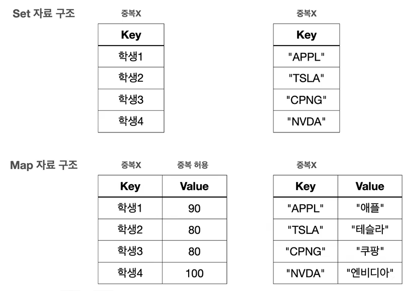

## 9. 컬렉션 프레임워크 - Map, Stack, Queue
### 9-1. 컬렉션 프레임워크 - Map 소개1
  
- Map dms key-value 의 쌍을 저장하는 자료 구조이다.
- 키는 맵 내에서 유일해야 한다. 그리고 키를 통해 값을 빠르게 검색할 수 있다,
- 키는 중복될 수 없지만, 값은 중복될 수 있다.
- Map 은 순서를 유지하지 않는다.

#### 컬렉션 프레임워크 - Map
  
- 자바는 HashMap, TreeMap, LinkedHashMap 등 다양한 Map 구현체를 제공한다.
- 이들은 Map 인터페이스의 메서드를 구현하며, 각기 다른 특성과 성능 특징을 가지고 있다.

#### 
    public class MapMain1 {
    
        public static void main(String[] args) {
            Map<String, Integer> studentMap = new HashMap<>();
    
            // 학생 성적 데이터 추가
            studentMap.put("studentA", 90);
            studentMap.put("studentB", 80);
            studentMap.put("studentC", 80);
            studentMap.put("studentD", 100);
            System.out.println(studentMap);
    
            // 특정 학생의 값 조회
            Integer result = studentMap.get("studentD");
            System.out.println("result = " + result);
    
            // KeySet 활용
            System.out.println("KeySet 활용");
            Set<String> keySet = studentMap.keySet();   // keySet()은 key 만 꺼낸다. key 는 사실 Set 과 같은 자료 구조로 저장된다.
            for (String key : keySet) {
                Integer value = studentMap.get(key);
                System.out.println("key= "+ key + ", valu = " + value);
            }
    
            // entrySet 활용
            System.out.println("entrySet 활용");
            Set<Map.Entry<String, Integer>> entries = studentMap.entrySet();    // Entry 는 key 와 value 를 저장하는 객체이다.
            for (Map.Entry<String, Integer> entry : entries) {
                System.out.println("key= " + entry.getKey() + ", value= " + entry.getValue());
            }
    
    
            // values 활용
            System.out.println("values 활용");
            Collection<Integer> values = studentMap.values();   // values()는 value 만 꺼낸다. values 는 중복이될 수 있어서 Collection 으로 나온다. (순서를 보장하지 않아서 List 로 나오지 않음)
            for (Integer value : values) {
                System.out.println("value= " + value);
            }
        }
    }
#### 
    // 실행 결과  
    {studentB=80, studentA=90, studentD=100, studentC=80}
    result = 100
    KeySet 활용
    key= studentB, valu = 80
    key= studentA, valu = 90
    key= studentD, valu = 100
    key= studentC, valu = 80
    entrySet 활용
    key= studentB, value= 80
    key= studentA, value= 90
    key= studentD, value= 100
    key= studentC, value= 80
    values 활용
    value= 80
    value= 90
    value= 100
    value= 80

#### 키 목록 조회
    Set<String> keySet = studentMap.keySet();
  - Map 의 키는 중복을 허용하지 않는다. 따라서 Map 의 모든 키 목록을 조회하는 keySet( )을 호출하면,  
    중복을 허용하지 않는 자료 구조인 Set 을 반환한다.
#### 키와 값 목록 조회  

- Map 은 키와 값을 보관하는 자료 구조 이다. 따라서 키와 값을 하나로 묶을 수 있는 방법이 필요하다.
- 이때 Entry 를 사용한다. Entry 는 키-값의 쌍으로 이루어진 간단한 객체이다.
- Entry 는 Map 내부에서 키와 값을 함께 묶어서 저장할 때 사용한다.
- 쉽게 이야기해서 우리가 Map 에 키와 값으로 데이터를 저장하면 Map 은 내부에서 키와 값을 하나로 묶는  
  Entry 객체를 만들어서 보관한다. 참고로 하나의 Map 에 여러 Entry 가 저장될 수 있다.
- Entry 는 Map 내부에 있는 인터페이스이다. 우리는 구현체보다는 이 인터페이스를 사용하면 된다.
#### 값 목록 조회
    Collection<Integer> values = studentMap.values();
- Map 의 값 목록은 중복을 허용한다. 따라서 중복을 허용하지 않는 Set 으로 반환할 수는 없다.
- 그리고 입력 순서를 보장하지 않기 때문에 순서를 보장하는 List 로 반환하기도 애매하다.
- 따라서 단순히 값의 모흠이라는 의미의 상위 인터페이스인 Collection 으로 반환한다.

### 9-2. 컬렉션 프레임워크 - Map 소개2
    public class MapMain2 {
    
        public static void main(String[] args) {
            HashMap<String, Integer> studentMap = new HashMap<>();
    
            // 학생 성적 데이터 추가
            studentMap.put("studentA", 90);
            System.out.println(studentMap);
    
            // 같은 키에 저장시 기존 값 교체
            studentMap.put("studentA", 100);
            System.out.println(studentMap);
    
            boolean containsKey = studentMap.containsKey("studentA");
            System.out.println("containsKey = " + containsKey);
    
            // 특정 학생의 값 삭제
            studentMap.remove("studentA");
            System.out.println(studentMap);
        }
    }
####
    // 실행 결과 
    {studentA=90}
    {studentA=100}
    containsKey = true
    {}
- Map 에 값을 저장할 때 같은 키에 다른 값을 저장하면 기존 값을 교체한다.
- 만약 같은 학생이 Map 에 없는 경우에만 데이터를 저장하려면 어떻게 해야할까? -> .putIfAbsent( )
####
    public class MapMain3 {
    
        public static void main(String[] args) {
            HashMap<String, Integer> studentMap = new HashMap<>();
    
            // 학생 성적 데이터 추가
            studentMap.put("studentA", 50);
            System.out.println(studentMap);
    
            // 학생이 없는 경우에만 추가1
            if (!studentMap.containsKey("studentA")) {
                studentMap.put("studentA", 100);
            }
            System.out.println(studentMap);
    
            // 학생이 없는 경우에만 추가2 (putIfAbsent)
            studentMap.putIfAbsent("studentA", 100);
            studentMap.putIfAbsent("studentB", 100);
            System.out.println(studentMap);
        }
    }
- putIfAbsent( ) 는 영어 그대로 없는 경우에만 입력하라는 뜻이다.
- 이 메서드를 사용하면 키가 없는 경우에만 데이터를 저장하고 싶을 때 코드를 한줄로 편리하게 처리할 수 있다.

### 9-3. 컬렉션 프레임워크 - Map 구현체
- 자바의 Map 인터페이스는 키-값 쌍을 저장하는 자료 구조이다. Map 은 인터페이스이기 때문에 직접 인스턴스를 생성할 수는 없다.   
- 대신 Map 인터페이스를 구현한 여러 클래스를 통해 사용할 수 있다. 대표적으로 HashMap, TreeMap, LinkedHashMap 이 있다.

#### Map vs Set
- Map 의 키는 중복을 허용하지 않고, 순서를 보장하지 않는다. Map 의 키가 바로 Set 과 같은 구조이다.
- 그리고 Map 은 모든 것이 Key 를 중심으로 동작한다. value 는 단순히 Key 옆에 따라 붙은 것 뿐이다.
- Key 옆에 value 만 하나 추가해주면 Map 이 되는 것이다. Map 과 Set 은 거의 같다.
- 단지 옆에 value 를 가지고 있는가 없는가의 차이가 있을 뿐이다.  

- 이런 이유로 Set 과 Map 의 구현체는 거의 같다.
  - HashSet -> HashMap
  - LinkedHashSet -> LinkedHashMap
  - TreeSet -> TreeMap

> !참고 - 실제로 자바 HashSet 의 구현은 대부분 HashMap 의 구현을 가져다 사용한다.  
> Map 에서 Value 만 비워두면 Set 으로 사용할 수 있다.

#### HashMap
- 구조: HashMap 은 해시를 사용해서 요소를 저장한다. 키(key)는 같은 해시 함수를 통해 해시 코드로 변환되고,  
  이 해시 코드는 데이터를 저장하고 검색하는 데 사용된다.
- 특징: 삽입, 삭제, 검색 작업은 해시 자료 구조로 사용하므로 일반적으로 상수 시간 O(1)의 복잡도를 가진다.
- 순서: 순서를 보장하지 않는다.

#### LinkedHashMap
- 구조: LinkedHashMap 은 HashMap 과 유사하지만, 연결 리스트를 사용하여 삽입 순서 또는 최근 근접 순서에 따라 요소를 유지한다.
- 특징: 입력 순서에 따라 순회가 가능하다. HashMap 과 같지만 입력 순서를 링크로 유지해야 하므로 조금 더 무겁다.
- 성능: HashMap 과 유사하게 대부분의 작업은 O(1)의 시간 복잡도를 가진다.
- 순서: 입력 순서를 보장한다.

#### TreeMap
- 구조: TreeMap 은 레드-블랙 트리를 기반으로 한 구현이다.
- 특징: 모든 키는 자연 순서 또는 생성자에 제공된 Comparator 에 의해 정렬된다.
- 성능: get, put, remove 와 같은 주요 작업들은 O(log n) 의 시간 복잡도를 가진다.
- 순서: 키는 정렬된 순서로 저장된다.

#### 
    public class JavaMapMain {
    
        public static void main(String[] args) {
            run(new HashMap<>());
            run(new LinkedHashMap<>());
            run(new TreeMap<>());
        }
    
        private static void run(Map<String, Integer> map) {
            System.out.println("map = " + map.getClass());
            map.put("C", 10);
            map.put("B", 20);
            map.put("A", 30);
            map.put("1", 40);
            map.put("2", 50);
    
            Set<String> keySet = map.keySet();
            Iterator<String> iterator = keySet.iterator();
            while (iterator.hasNext()) {
                String key = iterator.next();
                System.out.print(key + "=" + map.get(key) + " ");
            }
            System.out.println();
        }
    }

####
    // 실행 결
    map = class java.util.HashMap
    A=30 1=40 B=20 2=50 C=10
    map = class java.util.LinkedHashMap
    C=10 B=20 A=30 1=40 2=50
    map = class java.util.TreeMap
    1=40 2=50 A=30 B=20 C=10
- HashMap: 입력한 순서를 보장하지 않는다.
- LinkedHashMap: 키를 기준으로 입력한 순서를 보장한다.
- TreeMap: 키의 값을 기준으로 정렬한다.

#### 자바 HashMap 작동 원리
- 자바의 HashMap 은 HashSet 과 작동 원리가 같다.
- Set 과 비교하면 다음과 같은 차이가 있다.
  - Key 를 사용해서 해시 코드를 생성한다.
  - Key 뿐만 아니라 값(Value)을 추가로 저장해야 하기 때문에 Entry 를 사용해서 Key, Value 를 하나로 묶어서 저장한다.  
   
        "A",80  "F",80  "G",90  "K",90  

  
- 이렇게 해시를 사용해서 키와 값을 저장하는 자료 구조를 일반적으로 해시 테이블이라 한다.
- 앞서 학습한 HashSet 은 해시 테이블의 주요 원리를 사용하지만,  
  키-값 저장 방식 대신 키만 저장하는 특수한 형태의 해시테이블로 이해하면 된다.

> !주의 - Map 의 Key 로 사용되는 객체는 hashCode( ), equals( )를 반드시 구해야 한다.

> !주의 - .containsKey(Object key) 메소드는 O(1)의 시간 복잡도를 가지지만  
> .containsValue(Object value) 메소드는 O(n)의 시간 복잡도를 가진다. (다 뒤져야해서)

#### 정리
- 실무에서는 Map 이 필요한 경우 HashMap 을 많이 사용한다.
- 그리고 순서 유지, 정렬의 필요에 따라서 LinkedHashMap, TreeMap 을 선택하면 된다.

### 9-4. 스택 자료 구조
- 다음과 같이 1, 2, 3 이름표가 붙은 블록이 있다고 가정하자.  
  
- 이 블록을 아래쪽은 막혀있고 위쪽만 열려 있는 통에 넣는다고 생각해보자.   
  
- 위쪽만 열려 있기 때문에 위쪽으로 블록을 넣고, 위쪽으로 블록을 빼야 한다.  
- 이번에는 넣은 블록을 빼자.  
  
- 정리하면 다음과 같다.

      1(넣기) -> 2(넣기) -> 3(넣기) -> 3(빼기) -> 2(빼기) -> 1(빼기)

#### 후입 선출(LIFO, Last In First Out)
- 여기서 가장 마지막에 넣은 3번이 가장 먼저 나온다. 이렇게 나중에 넣은 것이 가장 먼저 나오는 것을 후입 선출이라 하고,  
  이런 자료 구조를 스택이라 한다.

#### 
public class StackMain {

    public static void main(String[] args) {
        Stack<Integer> stack = new Stack<>();

        stack.push(1);
        stack.push(2);
        stack.push(3);
        System.out.println("stack = " + stack);

        // 단음 꺼낼 요소 확인(꺼내지 않고 단순 조회만)
        System.out.println("stack.peek() = " + stack.peek());

        // 스택 요소 뽑기
        System.out.println("stack.pop() = " + stack.pop());
        System.out.println("stack.pop() = " + stack.pop());
        System.out.println("stack.pop() = " + stack.pop());
        System.out.println("stack = " + stack);
    }
}
####
    // 실행 결과
    stack = [1, 2, 3]
    stack.peek() = 3
    stack.pop() = 3
    stack.pop() = 2
    stack.pop() = 1
    stack = []

> **!주의 - Stack 클래스는 사용하지 말자**  
> 자바의 Stack 클래스는 내부에서 Vector 라는 자료 구조를 사용한다.  
> 이 자료 구조는 자바 1.0에 개발되었는데, 지금은 사용되지 않고 하위 호환을 위해 존재한다.  
> 지금은 더 빠른 좋은 자료 구조가 많다. 따라서 Vector 를 사용하는 Stack 도 사용하지 않는 것을 권장한다.  
> 대신 이후에 설명할 Deque 를 사용하는 것이 좋다.

### 9-5. 큐 자료 구조
#### 선입 선출(FIFO, First In First Out)
- 후입 선출과 반대로 가장 먼저 넣은 것이 가장 먼저 나오는 것을 선입 선출이라 한다.  
- 이런 자료 구조를 큐(Queue)라 한다.  
  
- 전통적으로 큐에 값을 넣는 것을 offer 라하고, 큐에서 값을 꺼내는 것을 poll 이라 한다.
- 정리하면 다음과 같다.
  
      1(넣기) -> 2(넣기) -> 3(넣기) -> 1(빼기) -> 2(빼기) -> 3(빼기)
####

- Queue 인터페이스는 List, Set 과 같이 Collection 의 자식이다.
- Queue 의 대표적인 구현체는 ArrayDeque, LinkedList 가 있다.
- 참고로 LinkedList 는 Deque 와 List 인터페이스를 모두 구현한다.

      public class LinkedList<E> extends AbstractSequentialList,E> 
          implements List<E>, Deque<E>, Cloneable, java.io.Serializable {}

####
    public class QueueMain {
    
        public static void main(String[] args) {
            Queue<Integer> queue = new ArrayDeque<>();
    
            // 데이터 추가
            queue.offer(1);
            queue.offer(2);
            queue.offer(3);
            System.out.println("queue = " + queue);
    
            // 다음 꺼낼 데이터 확인(꺼내지 않고 단순 조회만)
            System.out.println("queue.peek() = " + queue.peek());
    
            // 데이터 꺼내기
            System.out.println("queue.poll() = " + queue.poll());
            System.out.println("queue.poll() = " + queue.poll());
            System.out.println("queue.poll() = " + queue.poll());
        }
    }
####
    // 실행 결과
    queue = [1, 2, 3]
    queue.peek() = 1
    queue.poll() = 1
    queue.poll() = 2
    queue.poll() = 3

### 9-6. Deque 자료 구조
- Deque 는 Double Ended Queue 의 약자로, 이름에서 알 수 있듯, 양쪽 끝에서 요소를 추가하거나 제거할 수 있다.
- Deque 는 일반적인 큐와 스택의 기능을 모두 포함하고 있어 매우 유연한 자료 구조이다.  
  
  - offerFirst( ): 앞에 추가한다. 
  - offerLast( ): 뒤에 추가한다.
  - pollFirst( ): 앞에서 꺼낸다.
  - pollLast( ): 뒤에서 꺼낸다.
- Deque 의 대표적인 구현체는 ArrayDeque, LinkedList 가 있다.

####
    public class DequeMain {
    
        public static void main(String[] args) {
            Deque<Integer> deque = new ArrayDeque<>();
    
            // 데이터 추가
            deque.offerFirst(1);
            System.out.println("deque = " + deque);
            deque.offerFirst(2);
            System.out.println("deque = " + deque);
            deque.offerLast(3);
            System.out.println("deque = " + deque);
            deque.offerLast(4);
            System.out.println("deque = " + deque);
    
            // 다음 꺼낼 데이터 확인(꺼내지 않고 단순 조회만)
            System.out.println("deque.peekFirst() = " + deque.peekFirst());
            System.out.println("deque.peekLast() = " + deque.peekLast());
    
            // 데이터 꺼내기
            System.out.println("deque.pollFirst() = " + deque.pollFirst());
            System.out.println("deque.pollFirst() = " + deque.pollFirst());
            System.out.println("deque.pollLast() = " + deque.pollLast());
            System.out.println("deque.pollLast() = " + deque.pollLast());
            System.out.println("deque = " + deque);
        }
    }
#### 
    // 실행 결과 
    deque = [1]
    deque = [2, 1]
    deque = [2, 1, 3]
    deque = [2, 1, 3, 4]
    deque.peekFirst() = 2
    deque.peekLast() = 4
    deque.pollFirst() = 2
    deque.pollFirst() = 1
    deque.pollLast() = 4
    deque.pollLast() = 3
    deque = [] 

#### Deque 구현체와 성능 테스트
- Deque 의 대표적인 구현체는 ArrayDeque, LinkedList 가 있다. 이 둘중 모든 면에서 ArrayDeque 가 더 빠르다.
- 100만 건 입력(앞, 뒤평균)
  - ArrayDeque: 110ms
  - LinkedList: 480ms
- 100만 건 조회(앞, 뒤 평균)
  - ArrayDeque: 9ms
  - LinkedList: 20ms
- 둘의 차이는 ArrayList vs LinkedList 의 차이와 비슷한데, 작동원리가 하나는 배열을 하나는 동적 노드 링크를 사용하기 때문이다.
- ArrayDeque 는 추가로 특별한 원형 큐 자료 구조를 사용하는데, 덕분에 앞, 뒤 입력 모두 O(1)의 성능을 제공한다.
- 물론 LinkedList 도 앞 뒤 입력 모두 O(1)의 성능을 제공한다.
- 이론적으로 LinkedList 가 삽입 삭제가 자주 발생할 때 더 효율적일 수 있지만, 현대 컴퓨터 시스템의 메모리 접근 패턴,  
  CPU 캐시 최적화 등을 고려할 때 배열을 사용하는 ArrayDeque 가 실제 사용환경에서는 더 나은 성능을 보여주는 경우가 많다.

### 9-7. Deque 와 Stack, Queue
- Deque 는 양쪽으로 데이터를 입력하고 출력할 수 있으므로, 스택과 큐의 역할을 모두 수행할 수 있다.
- Deque 를 Stack 과 Queue 로 사용하기 위한 메서드 이름까지 제공한다.  
  
  
#### Deque - Stack
    public class DequeStackMain {
    
        public static void main(String[] args) {
            Deque<Integer> deque = new ArrayDeque<>();
    
            // 데이터 추가
            deque.push(1);
            deque.push(2);
            deque.push(3);
            System.out.println("deque = " + deque);
    
            System.out.println("deque.peek() = " + deque.peek());
    
            System.out.println("deque.pop() = " + deque.pop());
            System.out.println("deque.pop() = " + deque.pop());
            System.out.println("deque.pop() = " + deque.pop());
            System.out.println("deque = " + deque);
        }
    }
####
    // 실행 결과 
    deque = [3, 2, 1]
    deque.peek() = 3
    deque.pop() = 3
    deque.pop() = 2
    deque.pop() = 1
    deque = []
- Deque 에서 Stack 을 위한 메서드 이름까지 제공하는 것을 확인할 수 있다.
- 자바의 Stack 클래스는 성능이 좋지 않고 하위 호환을 위해 남겨져 있다.
- Stack 자료 구조가 필요하면 Deque 의 ArrayDeque 구현체를 사용하자.

#### Deque - Queue
    public class DequeQueueMain {
    
        public static void main(String[] args) {
            Deque<Integer> deque = new ArrayDeque<>();
    
            deque.offer(1);
            deque.offer(2);
            deque.offer(3);
            System.out.println("deque = " + deque);
    
            System.out.println("deque.peek() = " + deque.peek());
    
            System.out.println("deque.poll() = " + deque.poll());
            System.out.println("deque.poll() = " + deque.poll());
            System.out.println("deque.poll() = " + deque.poll());
            System.out.println("deque = " + deque);
        }
    }
####
    // 실행 결과
    deque = [1, 2, 3]
    deque.peek() = 1
    deque.poll() = 1
    deque.poll() = 2
    deque.poll() = 3
    deque = []
- Deque 에서 Queue 를 위한 메서드 이름까지 제공하는 것을 확인할 수 있다.
- Deque 인터페이스는 Queue 인터페이스의 자식이기 때문에, 단순히 Queue 의 기능만 필요하면 Queue 인터페이스를 사용하고,  
  더 많은 기능이 필요하다면 Deque 인터페이스를 사용하면 된다.

 

## 10. 컬렉션 프레임워크 - 순회, 정렬, 전체 정리
### 10-1. 순회1 - 직접 구현하는 Iterable, Iterator

### 10-2. 순회2 - 향상된 for 문

### 10-3. 순회3 - 자바가 제공하는 Iterable, Iterator

### 10-4. 정렬1 - Comparable, Comparator

### 10-5. 정렬2 - Comparable, Comparator

### 10-6. 정렬3 - Comparable, Comparator

### 10-7. 컬렉션 유틸

### 10-8. 컬렉션 프레임워크 전체 정리

 

## 11. 다음으로