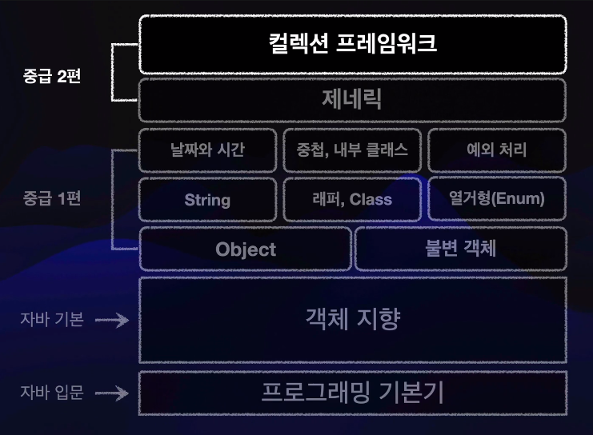
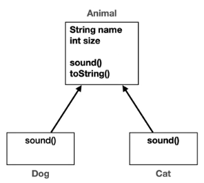

# JAVA MIDDLE 2

### 단축키
- Shift + F6 : 리네임 단축키
- Ctrl + R : 한번에 제거 또는 바꾸기
- Ctrl + O : 오버라이딩할 메소드 목록
- Shift + Shift : 모든 항목을 검색할 수 있는 검색 상자 오픈

### Linux
- Ctrl + Alt + Shift + T : 인라인 베리어블

### MacOS
- ^T : 인라이 베리어블

#### 자료구조의 이해
- 자바 컬렉션의 기능을 아는 것을 넘어 자료 구조 자체의 기본기를 다지고  
  실무에 필요한 자료 구조를 제대로 활용할 수 있게되는 것이 이 강의 목표이다.

## 1. 제네릭 - Generic1
### 1-1. 프로젝트 환경 구성 
- Eclipse Temurin 21

### 1-2 제네릭이 필요한 이유
- 대부분의 최신 프로그래밍 언어는 제네릭(Generic) 개념을 제공한다.
- 처음 제네릭을 접하는 경우 내용을 이해하기 쉽지 않을 수 있다. 제네릭이 왜 필요한지 지금부터 코드로 알아보자.

#### 
    public class IntegerBox {
    
        private Integer value;
    
        public void set(Integer value) {
            this.value = value;
        }
    
        public Integer get() {
            return value;
        }
    }
- IntegerBox 는 숫자를 보관하고 꺼낼 수 있는 단순한 기능을 제공한다.

#### 
    public class StringBox {
    
        private String value;
    
        public void set(String object) {
            this.value = object;
        }
    
        public String get(){
            return this.value;
        }
    }
- StringBox 는 문자열을 보관하고 꺼낼 수 있는 단순한 기능을 제공한다.

####
    public class BoxMain1 {
    
        public static void main(String[] args) {
            IntegerBox integerBox = new IntegerBox();
            integerBox.set(10); // 오토 박싱
            Integer integer = integerBox.get();
            System.out.println("integer = " + integer);
    
            StringBox stringBox = new StringBox();
            stringBox.set("hello");
            String string = stringBox.get();
            System.out.println("string = " + string);
        }
    }
- 코드를 보면 먼저 숫자를 보관하는 IntegerBox 를 생성하고, 숫자 10을 보관하고, 꺼낸다 음 출력했다.  
  (참고로 오토 박싱에 의해 int 가 Integer 로 자동 변환 된다.)
- 다음으로 문자열을 보관하는 StringBox 를 생성하고 그곳에 문자열 "hello" 를 보관하고, 꺼낸 다음 출력했다.

#### 문제
- 이후에 Double, Boolean 을 포함한 다양한 타입을 담는 박스가 필요하다면 각각의 타입별로 박스를 새로 만들어야 한다.
- 담는 타입이 수십개라면, 수십개의 XxxBox 클래스를 만들어야 한다. 이 문제를 어떻게 해결할 수 있을까?
- 타입 안정성은 높지만 코드 재사용성(다형성)이 떨어진다.

> !복습 - int 대신 integer 를 사용하는 이유  
> int 는 기본 자료형이라서 null 을 가질 수 없지만 integer 는 object 의 자식이라 가질 수 있다.

### 1-3. 다형성을 통한 중복 해결 시도 
- Object 는 모든 타입의 부모이다. 따라서 다형성(다형적 참조)를 사용해서 이 문제를 해결할 수 있을 것 같다.
####
    public class ObjectBox {
    
        private Object value;
        
        public void set(Object object) {
            this.value = object;
        }
        
        public Object get() {
            return value;
        }
    }
- 내부에 Object value 를 가지고 있다. Object 는 모든 타입의 부모이다.  
  부모는 자식을 담을 수 있으므로 세상의 모든 타입을 ObjectBox 에 보관할 수 있다.
####
    public class BoxMain2 {
    
        public static void main(String[] args) {
            ObjectBox integerBox = new ObjectBox();
            integerBox.set(10);
            Integer integer = (Integer) integerBox.get(); // 그대로 못받으니까 다운 캐스팅
            System.out.println("integer = " + integer);
    
            ObjectBox stringBox = new ObjectBox();
            stringBox.set("hello");
            String string = (String) stringBox.get();   // 그대로 못받으니까 다운 캐스팅
            System.out.println("string = " + string);
        }
    }

#### 문제 
    public class BoxMain2 {
    
        public static void main(String[] args) {
            ObjectBox integerBox = new ObjectBox();
            integerBox.set(10);
            // 반환 타입이 Object 라서 다운 캐스팅을 해줘야 한다.
            Integer integer = (Integer) integerBox.get(); // 다운 캐스팅
            System.out.println("integer = " + integer);
    
            ObjectBox stringBox = new ObjectBox();
            stringBox.set("hello");
            String string = (String) stringBox.get();   // 다운 캐스팅
            System.out.println("string = " + string);
    
            // 잘못된 타입의 인수 전달시 다운 캐스팅이 제대로 되지 않는다.
            // integerBox.set("문자100");
            // Integer result = (Integer) integerBox.get();
            // System.out.println("result = " + result);
        }
    }
- 반환 타입이 맞지 않는 문제: 반환 타입이 Object 라서 다운 캐스팅을 해줘야 한다.
- 잘못된 타입의 인수 전달 문제: 잘못된 타입의 인수 전달시 다운 캐스팅이 제대로 되지 않는다.
- 코드 재사용성(다형성)은 높아지지만 타입 안전성이 떨어진다.

### 1-4. 제네릭 적용
- 제네릭을 사용하면 코드 재사용과 타입 안정성이라는 두 마리 토끼를 한 번에 잡을 수 있다.
####
    public class GenericBox<T> {
        private T value;
    
        public void set(T value) {
            this.value = value;
        }
    
        public T get() {
            return value;
        }
    }
- <>를 사용한 클래스를 제네릭 클래스라고 한다. 이 기호를 보통 다이아몬드라고 한다.
- 제네릭 클래스를 사용할 때는 Integer, String 같은 타입을 미리 결정하지 않는다.
- 대신에 클래스명 오른쪽에 <T> 와 같이 선언하면 제네릭 클래스가 된다.  
  여기서 T를 **타입 매개변수**라 한다. 이 타입 매개변수는 이후에 Integer, String 으로 변환할 수 있다.
- 그리고 클래스 내부에 T 타입이 필요한 곳에 T value 와 같이 타입 매개 변수를 적어두면 된다.
####
    public class BoxMain3 {
    
        public static void main(String[] args) {
            GenericBox<Integer> integerBox = new GenericBox<Integer>(); // 생성 시점에 T의 타입 결정
            integerBox.set(10); // T의 타입을 integer 로 정의 했기 때문에 inter 만 입력 가능
            // integerBox.set("10");    // 타입 안정성 상승
            Integer integer = integerBox.get(); // 더불어 다운 캐스팅 할 필요 없음
            System.out.println("integer = " + integer);
    
            // 원하는 모든 타입 사용 가능
            GenericBox<Double> doubleBox = new GenericBox<Double>();
            doubleBox.set(10.5);
            Double doubleValue = doubleBox.get();
            System.out.println("doubleValue = " + doubleValue);
    
            // 타입 추론: 생성하는 제네릭 타입 생략 가능
            GenericBox<Integer> integerBox2 = new GenericBox<>();
        }
    }
- 제네릭 클래스는 생성하는 시점에 <> 사이에 원하는 타입을 지정한다.
- 이렇게 하면 앞서 정의한 GenericBox 의 T 가 다음과 같이 지정한 타입으로 변한 다음 생성된다.
- 즉 제네릭을 사용하면 재사용과 타입 안정성이라는 두마리 토끼를 모두 잡을 수 있다.

> !참고 - 제네릭을 도입한다고 해서 앞서 설명한 GenericBox<String>, Generic<Integer> 와 같은 코드가  
> 실제 만들어지는 것은 아니다. 대신에 자바 컴파일러가 우리가 입력한 타입 정보를 기반으로 이런 코드가 있다고  
> 가정하고 컴파일 과정에서 타입 정보를 반영한다. 이 과정에서 타입이 맞지 않으면 컴파일 오류가 발생한다.

#### 타입 추론 
    GenericBox<Integer> integerBox = new GenericBox<Integer>();   // 타입 직접 입력
    GenericBox<Integer> integerBox2 = new GenricBox<>();          // 타입 추론
- 첫 번째 줄의 코드를 보면 변수를 선언할 때와 객체를 생성할 때 <Integer> 가 두 번 나온다.
- 자바는 왼쪽에 있는 변수를 선언할 때의 <Integer> 를 보고 오른쪽에 있는 객체를 생성할 때 필요한 타입 정보를 얻을 수 있다.
- 따라서 두번째 줄의 오른쪽 코드 new GenericBox<>() 와 같이 타입 정보를 생략할 수 있다.  
  이렇게 자바가 스스로 타입 정보를 추론해서 개발자가 타입 정보를 생략할 수 있는 것을 타입 추론이라 한다.
    

### 1-5. 제네릭 용어와 관례
- 제네릭의 핵심은 사용할 타입을 미리 결정하지 않는다는 점이다. 클래스 내부에서 사용하는 타입을   
  클래스를 정의하는 시점에서 결정하는 것이 아니라 실제 사용하는 생성 시점에 타입을 결정하는 것이다.
- 이것을 쉽게 비유하자면 메서드의 매개변수와 인자의 관계와 유사하다.

#### 메서드에 필요한 값을 메서드 정의 시점에 미리 결정 
    void methoid1() {
      println("hello");
    }
- 메서드에 필요한 값을 이렇게 메서드 정의 시점에 미리 결정하게 되면,  
  이 메서드는 오직 "hello" 라는 값만 출력할 수 있어 재사용성이 떨어진다.

#### 메서드에 필요한 값을 인자를 통해 매개변수로 전달해서 결정 
    void method2(String param) {
      println(param);
    }

    void main() {
      method2("hello");
      method2("hi");
    }
- 메서드에 필요한 값을 메서드를 정의하는 시점에 미리 결정하는 것이 아니라, 메서드를 실제 사용하는 시점으로 미룰 수 있다.
- 메서드에 매개변수를 지정하고, 메서드를 사용할 때 원하는 값을 인자로 전달하면 된다.

#### 다양한 값을 처리하는 메서드
    // method2("hello") 호출 예 
    void method2(String param="hello") {
      println(param); 
    }

    // moethod2("hi") 호출 예
    void method2(String param="hi") {
      println(param); 
    }
- 매개 변수를 정의하고, 실행하는 시점에 인자를 통해 원하는 값을 매개변수에 전달했다.
- 이렇게 하면 이 메서드는 실행 시점에 얼마든지 다른 값을 받아서 처리할 수 있다. 따라서 재사용성이 크게 늘어난다.

#### 매서드의 매개변수와 인자 
    void method(String param) // 매개변수

    void main() {
      String arg = "hello";
      call(arg) // 인수 전달
    }
- 매개변수(Parameter): String param (메소드 안에 있는 것으로 어디선가 넘어오는 것)
- 인자, 인수(Arguemnt): arg (메소드 안에 넣어주는 것)

#### 제네릭의 타입 매개변수와 타입 인자
- 제네릭도 앞서 설명한 메서드의 매개변수와 인자의 관계와 비슷하게 작동한다.
- 제네릭 클래스를 정의할 때 내부에서 사용할 타입ㅇ르 미리 결정하는 것이 아니라,  
  해당 클래스를 실제로 사용하는 생성 시점에 내부에서 상요할 타입을 결정하는 것이다.
- 차이가 있다면 메서드의 매개변수는 사용할 값에 대한 결정을 나중으로 미루는 것이고,  
  제네릭의 타입 매개변수는 사용할 타입에 대한 결정을 나중으로 미루는 것이다.
- 정리하면 다음과 같다.
  - 메서드는 매개변수의 인자를 전달해서 사용할 값을 결정한다.
  - 제네릭 클래스는 타입 매개변수에 타입 인자를 전달해서 사용할 타입을 결정한다.
- 제네릭에서 사용하는 용어도 매개변수 인자의 용어를 그대로 가져다 사용한다.  
  다만 값이 아니라 타입을 결정하는 것이기 때문에 앞에 타입을 붙인다.
  - 타입 매개변수: GenericBox<T> 에서 T
  - 타입 인자:  
      GenericBox<Integer> 에서 Integer  
      GenericBox<String> 에서 String
- 제네릭 타입의 타입 매개변수 <T> 에 타입 인자를 전달해서 제네릭의 사용 타입을 결정한다.  

#### 용어 정리
- 제네릭(Generic) 
  - 제네릭이라는 단어는 일반적인, 범용적인이라는 영어 단어 뜻이다.
  - 풀어보면 특정 타입에 속한 것이 아니라 일반적으로, 범용적으로 사용할 수 있다는 뜻이다.
- 제네릭 타입(Generic Type) 
  - 클래스나 인터페이스를 정의할 때 타입 매개변수를 사용하는 것을 말한다.
  - 제네릭 클래스, 제네릭 인터페이스를 모두 합쳐서 제네릭 타입이라 한다.
    - 타입은 클래스, 인터페이스, 기본형(int 등)을 모두 합쳐서 부르는 말이다.  
      예: class GenericBox<T> { private T t; }  
      여기에서 GenericBox<T> 를 제네릭 타입이라 한다. 
- 타입 매개변수(Type Parameter)
  - 제네릭 타입이나 메서드에서 사요되는 변수로, 실제 타입으로 대체된다.
- 타입 인자(Type Argument)
  - 제네릭 타입을 사용할 때 제공되는 실제 타입니다.

#### 제네릭 명명 관례 
- 타입 매개변수는 일반적인 변수명처럼 소문자로 사용해도 문제는 없다.
- 하지만 일반적으로 대문자를 사용하고 용도에 맞는 단어의 첫글자를 사용하는 관례를 따른다.
- 주로 사용하는 키워드는 다음과 같다
  - E: Element
  - K: Key
  - N: Number
  - T: Type
  - V: Value
  - S,U,V etc.: 2nd, 3rd, 4th types

#### 제네릭 기타
- 다음과 같이 한 번에 여러 타입 매개변수를 선언할 수 있다.
        
      class Data<K, V> {}
- 타입 인자로 기본형(int, double ...)은 사용할 수 없다. 대신에 래퍼 클래스(Integer, Double ...) 을 사용하면 된다.

####  로 타입(row Type)
    public class RowTypeMain {
    
        public static void main(String[] args) {
            GenericBox integerBox = new GenericBox(); // 로 타입
            //  GenericBox<Object> integerBox = new GenericBox<>();  // 권장
            integerBox.set(10);
            Integer result = (Integer) integerBox.get();
            System.out.println("result = " + result);
        }
    }
- 제네릭 타입을 사용할 때는 항상 <> 를 사용해서 사용시점에 원하는 타입을 지정해야 한다.
- 그런데 다음과 같이 <>를 지정하지 않을 수 있는데, 이것을 로 타입(row type), 또는 원시 타입이라 한다.

      GenericBox integerBox = new GenericBox();
- 원시 타입을 사용하면 내부의 타입 매개변수가 Object 로 사용된다고 이해하면 된다.
- 제네릭 타입을 사용할 때는 항상 <> 를 사용해서 사용시점에 타입을 지정해야 한다.  
  그런데 왜 이런 로 타입을 지원하는 것일까?
- 자바의 제네릭이 자바가 처음 등장할 때 부터 있던것이 아니라 자바가 오랜기간 사용된 이후에 등장했기 때문에  
  제네릭이 없던 시절의 과거 코드와의 하위 호환 때문에 어쩔 수 없이 로 타입을 지원하게 되었다.

### 1-6. 제네릭 활용 예제 

    public class Animal {
        private String name;
        private int size;
    
        public Animal(String name, int size) {
            this.name = name;
            this.size = size;
        }
    
        public String getName() {
            return name;
        }
    
        public int getSize() {
            return size;
        }
    
        public void sound() {
            System.out.println("동물 울음 소리");
        }
    
        @Override
        public String toString() {
            return "Animal{" +
                    "name='" + name + '\'' +
                    ", size=" + size +
                    '}';
        }
    }

####
    public class Dog extends Animal {
    
    
        public Dog(String name, int size) {
            super(name, size);
        }
    
        @Override
        public void sound() {
            System.out.println("멍멍");
        }
    }

#### 
    public class Cat extends Animal {
    
        public Cat(String name, int size) {
            super(name, size);
        }
    
        @Override
        public void sound() {
            System.out.println("냐옹");
        }
    }

#### 
    public class Box<T> {
    
        private T value;
    
        public void set(T value) {
            this.value = value;
        }
    
        public T get() {
            return value;
        }
    }

#### 
    public class AnimalMain1 {
    
        public static void main(String[] args) {
            Animal animal = new Animal("동물", 0);
            Dog dog = new Dog("멍멍이", 100);
            Cat cat = new Cat("냐옹이", 50);
    
            Box<Dog> dogBox = new Box<>();
            dogBox.set(dog);
            Dog findDog = dogBox.get();
            System.out.println("findDog = " + findDog);
            
            Box<Cat> catBox = new Box<>();
            catBox.set(cat);
            Cat findCat = catBox.get();
            System.out.println("findCat = " + findCat);
    
            Box<Animal> animalBox = new Box<>();
            animalBox.set(animal);
            Animal findAnimal = animalBox.get();
            System.out.println("findAnimal = " + findAnimal);
        }
    }
- Box 제네릭 클래스에 각각의 타입에 맞는 동물을 보관하고 꺼낸다.
- Box<Dog> dogBox: Dog 타입을 보관할 수 있다.
- Box<Cat> catBox: Cat 타입을 보관할 수 있다.
- Box<Animal> animalBox: Animal 타입을 보관할 수 있다.

여기서 Box<Animal> 의 경우 타입 매개변수 T 에 타입 인자 Animal 을 대입하면 다음 코드와 같다.

    public class Box<Animal> {
    
        pirvate Animal value;
    
        public void set(Animal value) {
            this.value = value;
        }
    
        public Animal get() {
            return value;
        }
    }
- 따라서 set(Animal value) 이므로 set( )에 Animal 의 하위 타입인 Dog, Cat 도 전달할 수 있따.
- 물론 이 경우 꺼낼 때는 Animal 타입으로만 꺼낼 수 있다.
####
    public class AnimalMain2 {

        public static void main(String[] args) {
            Animal animal = new Animal("동물", 0);
            Dog dog = new Dog("멍멍이", 100);
            Cat cat = new Cat("냐옹이", 50);
    
            Box<Animal> animalBox = new Box<>();
            animalBox.set(animal);
            animalBox.set(dog);
            animalBox.set(cat);
    
            Animal findAnimal = animalBox.get();
            System.out.println("findAnimal = " + findAnimal);
        }
    }

 

## 2. 제네릭 - Generic2
### 2-1. 타입 매개변수 제한1 - 시작
- 요구사항: 개 병원은 개만 받을 수 있고, 고양이 병원은 고양이만 받을 수 있어야 한다.
####
    public class DogHospital {
    
        private Dog animal;
    
        public void set (Dog animal) {
            this.animal = animal;
        }
    
        public void checkup() {
            System.out.println("동물 이름: " + animal.getName());
            System.out.println("동물 크기: " + animal.getSize());
            animal.sound();
        }
    
        public Dog bigger(Dog target) {
            return animal.getSize() > target.getSize() ? animal : target;
        }
    }
- 개 병원 내부에 Dog 타입을 가진다.
- checkup( ): 개의 이름과 크기를 출력하고, 개의 sound( ) 메서드를 호출한다.
- bigger( ): 다른 개와 크기를 배교한다. 둘 중에 큰 개를 반환한다.
####
    public class CatHospital {
    
        private Cat animal;
    
        public void set (Cat animal) {
            this.animal = animal;
        }
    
        public void checkup() {
            System.out.println("동물 이름: " + animal.getName());
            System.out.println("동물 크기: " + animal.getSize());
            animal.sound();
        }
    
        public Cat bigger(Cat target) {
            return animal.getSize() > target.getSize() ? animal : target;
        }
    }
####
    public class AnimalHospitalMain0 {
    
        public static void main(String[] args) {
            DogHospital dogHospital = new DogHospital();
            CatHospital catHospital = new CatHospital();
    
            Dog dog = new Dog("멍멍이1", 100);
            Cat cat = new Cat("냐옹이1", 300);
    
            // 개 병원
            dogHospital.set(dog);
            dogHospital.checkup();
    
            // 고양이 병원
            catHospital.set(cat);
            catHospital.checkup();
    
            // 문제1: 개 병원에 고양이 전달
            // dogHospital.set(cat); // 다른 타입 입력: 컴파일 오류
    
            // 문제2: 개 타입 반환
            Dog biggerDog = dogHospital.bigger(new Dog("멍멍이2", 200));
            System.out.println("biggerDog = " + biggerDog);
    
        }
    }
- 이번에 만든 코드는 처음에 제시한 요구사항을 잘 지킨다   
  (요구사항: 개 병원은 개만 받을 수 있고, 고양이 병원은 고양이만 받을 수 있어야 한다.)
- 여기서는 개 병원과 고양이 병원을 각각 별도의 클래스로 만들었다.
- 각 클래스 별로 타입이 명확히기 때문에 개 병원은 개만 받을 수 있고, 고양이 병원은 고양이만 받을 수 있다.
- 따라서 개 병원에 고양이를 전달하면 컴파일 오류가 발생한다.
- 그리고 개 병원에서 bigger( )로 다른 개를 비굥하는 경우 더 큰 개를 Dog 타입으로 반환한다.

#### 문제
- 코드 재사용X: 개 병원과 고양이 병원은 중복이 많이 보인다.
- 타입 안정성O: 타입 안정성이 명확하게 지켜진다.

### 2-2. 타입 매개변수 제한2 - 다형성 시도
- Dog, Cat 은 Animal 이라는 명확한 부모 타입이 있다. 다형성을 사용해서 중복을 제거해보자.
####
    public class AnimalHospitalV1 {
    
        private Animal animal;
    
        public void set(Animal animal) {
            this.animal = animal;
        }
    
        public void checkup() {
            System.out.println("동물 이름: " + animal.getName());
            System.out.println("동물 크기: " + animal.getSize());
            animal.sound();
        }
        
        public Animal bigger(Animal target) {
            return animal.getSize() > target.getSize() ? animal : target;
        }
    }
- Animal 타입을 받아서 처리한다
- checkup( ), getBigger( ) 에서 사용하는 animal.getName( ), animal.getSize(), animal.sound( )  
  메서드는 모두 Animal 타입이 제공하는 메서드이다. 따라서 아무 문제없이 모두 호출할 수 있다.
####
    public class AnimalHospitalMainV1 {
    
        public static void main(String[] args) {
            AnimalHospitalV1 dogHospital = new AnimalHospitalV1();
            AnimalHospitalV1 catHospital = new AnimalHospitalV1();
    
            Dog dog = new Dog("멍멍이1", 100);
            Cat cat = new Cat("냐옹이1", 300);
    
            // 개 병원
            dogHospital.set(dog);
            dogHospital.checkup();
    
            // 고양이 병원
            catHospital.set(cat);
            catHospital.checkup();
    
            // 문제1: 개 병원에 고양이 전달
             dogHospital.set(cat); // 매개변수 체크 실패: 컴파일 오류가 발생하지 않아 코드 재사용성이 상승
    
            // 문제2: 개 타입 반환
            Dog biggerDog = (Dog) dogHospital.bigger(new Dog("멍멍이2", 200)); // 인위적으로 다운캐스팅을 하기 때문에 안정성이 떨어짐
            System.out.println("biggerDog = " + biggerDog);
    
        }
    }
#### 문제
- 코드 재사용O: 다형성을 통해 AnimalHostpitalV1 하나로 개와 고양이를 모두 처리한다.
- 타입 안정성X: 
  - 개 병원에 고양이를 전달하는 문제가 발생한다.
  - Animal 타입을 반환하기 때문에 다운 캐스팅을 해야 한다.
  - 실수로 고양이를 입력했는데, 개를 반환하는 상황이라면 캐스팅 예외가 발생한다.

### 2-3. 타입 매개변수 제한3 - 제네릭 도입과 실패
- 이제 앞서 배운 제네릭을 도입해서 코드 재사용은 늘리고, 타입 안정성 문제도 해결해보자.
####
    public class AnimalHospitalV2<T> {
    
        private T animal;
    
        public void set (T animal) {
            this.animal = animal;
        }
    
        public void checkup() {
            // T의 타입을 정의하는 시점에는 알 수 없다. 모든 객체의 부모인 Object 의 기능만 사용 가능
            animal.toString();
            animal.equals(null);
    
            // 컴파일 오류
            // System.out.println("동물 이름: " + animal.getName());
            // animal.sound();
        }
    
        public T getBigger(T target){
            // 컴파일 오류
            // return animal.getSize() > target.getSize() ? animal : target;
            return null;
        }
    }
- 제네릭 타입을 선언하면 자바 컴파일러 입장에서 T 에 어떤 값이 들어올지 예측할 수 없다.
- 우리는 Animal 타입의 자식이 들어오기를 기대했지만, 여기 코드 어디에도 Animal 에 대한 정보는 없다.
- T 에는 타입 인자로 Integer 가 들어올 수도 있고, Dog 가 들어올 수도 있다. 물론 Object 가 들어올 수도 있다.
- 자바 컴파일러는 어떤 타입이 들어올지 알 수 없기 때문에 T 를 어떤 타입이든 받을 수 있는 Object 타입으로 가정한다. 
- 따라서 Object 가 제공하는 메서드만 호출할 수 있다.
- 원하는 기능을 사용하려면 Animal 타입이 제공하는 기능들이 필요한데, 이 기능을 모두 사용할 수 없다.
- 추가적인 문제는 동물 병원에 Integer, Object 같은 동물과 전혀 관계 없는 타입을 타입 인자로 전달할 수 있다는 것이다.
- 우리는 최소한 Animal 이나 그 자식을 타입 인자로 제한하고 싶다.

#### 문제 
- 제네릭에서 타입 매개변수를 사용하면 어떤 타입이든 들어올 수 있다.
- 따라서 타입 매개변수를 어떤 타입이든 수용할 수 있는 Object 로 가정하고, Object 의 기능만 사용할 수 있다.
####
- 발생한 문제들을 생각해보면 타입 매개변수를 Animal 로 제한하지 않았기 때문이다.  
- 만약 타입 인자가 모두 Animal 과 그 자식만 들어올 수 있게 제한한다면 어떨까?

### 2-4. 타입 매개변수 제한4 - 타입 매개변수 제한 
- 타입 매개변수를 특정 타입으로 제한할 수 있다.
  
      <T extends 허용할 타입>
#### 
    public class AnimalHospitalV3<T extends Animal> {
    
        private T animal;
    
        public void set (T animal) {
            this.animal = animal;
        }
    
        public void checkup() {
            animal.toString();
            animal.equals(null);
    
            System.out.println("동물 이름: " + animal.getName());
            animal.sound();
        }
    
        public T getBigger(T target){
            return animal.getSize() > target.getSize() ? animal : target;
        }
    }
- 타입 매개변수 T 를 Animal 과 그 자식만 받을 수 있도록 제한을 두는 것이다. 즉 T 의 상한이 Animal 이 되는 것이다.
- 이렇게 하면 타입 인자로 들어올 수 있는 값이 Animal 과 그 자식으로 제한된다.
- 이제 자바 컴파일러는 T 에 입력될 수 있는 값의 범위를 예측할 수 있다.
- 타입 매개변수 T 에는 타입 인자로 Animal, Dog, Cat 만 들어올 수 있다.
- 따라서 이를 모두 수용할 수 있는 Animal 을 T 의 타입으로 가정해도 문제가 없다.
- 이제 Animal 이 제공하는 getName( ), getSize( ) 같은 기능을 사용할 수 있다.
####
    public class AnimalHospitalMainV3 {
    
        public static void main(String[] args) {
            AnimalHospitalV3<Dog> dogHospital = new AnimalHospitalV3<>();
            AnimalHospitalV3<Cat> catHospital = new AnimalHospitalV3<>();
            // 전혀 관계없는 타입 인자를 컴파일 시점에 막는다.
            // AnimalHospitalV3<Integer> integerHospital = new AnimalHospitalV3<>();
    
            Dog dog = new Dog("멍멍이1", 100);
            Cat cat = new Cat("냐옹이1", 300);
    
            // 개 병원
            dogHospital.set(dog);
            dogHospital.checkup();
    
            // 고양이 병원
            catHospital.set(cat);
            catHospital.checkup();
    
            // 문제1: 개 병원에 고양이 전달
            // dogHospital.set(cat); // 다른 타입 입력: 컴파일 오류
    
            // 문제2: 개 타입 반환
            Dog biggerDog = dogHospital.bigger(new Dog("멍멍이2", 200)); // 다운 캐스팅 필요 없음
            System.out.println("biggerDog = " + biggerDog);
    
        }
    }

#### 문제 해결 
- 타입 맥개변수에 입력될 수 있는 상한을 지정해서 문제 해결
  - AnimalHospitalV3<Integer> 와 같이 동물과 전혀 관계없는 타입 인자를 컴파일 시점에 막는다.
  - 제니릭 클래스 안에서 Animal 의 기능을 사용할 수 있다.
- 타입 안정성X 문제:
  - 개 병원에 고양이를 전달하는 문제가 발생한다. -> 해결
  - Animal 타입을 반환하기 때문에 다운 캐스팅을 해야 한다. -> 해결
  - 실수로 고양이를 입력했는데, 개를 반환하는 상화잉라면 캐스팅 예외가 발생한다. -> 해결
- 제네릭 도입 문제
  - 제네릭에서 타입 매개변수를 사용하면 어떤 타입이든 들어올 수 있다. -> 해결
  - 그리고 어떤 타입이든 수용할 수 있는 Object 로 가정하고, Object 의 기능만 사용할 수 있다 -> 해결  
    여기서는 Animal 을 상한으로 두어서 Animal 의 기능을 사용할 수 있다.
  
#### 정리
- 제네릭에 타입 매ㅐ개변수 상한을 사용해서 타입 안정성을 지키면서 상위 타입의 원하는 기능까지 사용할 수 있었다. 
- 덕분에 코드 재사용 성과 타입 안정성이라는 두마리 토끼를 동시에 잡을 수 있었다.

### 2-5. 제네릭 메서드
- 특정 메서드에 제네릭을 적용하는 제네릭 메서드에 대해 알아보자.
- 앞서 살펴본 제네릭 타입과 지금부터 살펴볼 제네릭 메서드는 둘다 제네릭을 사용하기는 하지만 서로 다른 기능을 제공한다.
####
    public class GenericMethod {
    
        public static Object objMethod(Object obj) {
            System.out.println("object print: " + obj);
            return obj;
        }
    
        // 이 메서드가 제네릭 메서드라는 것은 <> 를 사용해서 알려준다.
          // 클래스 옆에 적으면 클래스 전체에서 사용가능하고, 
          // 메서드 옆에 적으면 메소드 내부에서 사용가능하다.
        public static <T> T genericMethod(T t) {
            System.out.println("generic print:  " + t);
            return t;
        }
        
        public static <T extends Number> T numberMethod(T t) {
            System.out.println("bound print: " + t);
            return t;
        }
    }

####
    public class MethodMain1 {
    
        public static void main(String[] args) {
            Integer i = 10;
            Object object = GenericMethod.objMethod(i);
            // integer 로 받고 싶으면 다운캐스팅 해야한다.
            // Integer result = (Integer) GenericMethod.objMethod(i);
    
            // 타입 인자(Type Argument) 명시적 전달
            System.out.println("명시적 타입 인자 전달");
            Integer result = GenericMethod.<Integer>genericMethod(i); // 제네릭은 타입 매개변수를 무슨 타입으로 할지 정해줘야 한다.
            Integer integerValue = GenericMethod.<Integer>numberMethod(10);
            Double doubleValue = GenericMethod.<Double>numberMethod(20.0);
        }
    }

#### 제네릭 타입
- 정의: GenericClass<T>
- 타입 인자 전달: 객체를 생성하는 시점
  - ex. new GenericClass<String>

#### 제네릭 메서드
- 정의: <T> T genericMethod(T t)
- 타입 인자 전달: 메서드를 호출하는 시점 
  - ex. GenericMethod.<Integer>genericMethod(i)
- 제네릭 메서드는 클래스 전체가 아니라 특정 메서드 단위로 제네릭을 도입할 때 사용한다.
- 제네릭 메서드를 정의할 때는 메서드의 반환 타입 왼쪽에 다이아몬드를 사용해서 <T> 와 같이 타입 매개변수를 적어준다.
- 제네릭 메서드는 메서드를 실제 호출하는 시점에 다이아몬드를 사용해서 <Integer> 와 같이 타입을 정하고 호출한다.
- 제네릭 메서드의 핵심은 메서드를 호출하는 시점에 타입 인자를 전달해서 타입을 지정하는 것이다.  
  따라서 타입을 지정하면서 메서드를 호출한다.

#### 인스턴스 메서드, static 메서드
- 제네릭 메서드는 인스턴스 메서드와 static 메서드에 모두 적용할 수 있다.
      
      class Box<T> { // 제네릭 타입
          <Z> Z instnaceMethod2(Z z) { }  // 인스턴스 메서드에 제네릭 메서드 도입 가능 
          static <V> V staticMethod2(V v) { }  // static 메서드에 제네릭 메서드 도입
      }
- 하지만 제네릭 타입은 static 메서드에 타입 매개변수로 사용할 수 없다.

      class Box<T> { // 제네릭 타입
          T instanceMethod(T t) { }  // 인스턴스 메서드는 T 사용 가능       
          static T staticMethod1(T t) { }  // static 메서드는 T 사용 불가능
      }

> **!참고** - 제네릭 타입은 static 메서드에 타입 매개변수를 사용할 수 없다.  
> 제네릭 타입은 객체를 생성하는 시점에 타입이 정해진다. 그런데 static 메서드는 인스턴스 단위가 아니라  
> 클래스 단위로 작동하기 때문에 제네릭 타입과는 무관하다.  
> 따라서 static 메서드에 제네릭을 도입하려면 제네릭 메서드를 사용해야 한다.

- 정리
  - Static 메서드는 클래스 레벨에 속한다 즉, 특정 인스턴스와 연결되지 않는다.
  - 제네릭 타입은 인스턴스화될 때 결정된다. 
  - 만약  Static 메서드에서 제네릭 타입을 직접 사용할수 있게 되면,  
    어떤 타입 매개변수를 사용해야 할지 런타임에 알 수 없게 된다.  
  - **다시말해, static 메서드는 인스턴스와 연결되지 않으므로,   
    인스턴스 생성 시 결정되는 타입 매개변수 정보에 접근할 수 없다.**

#### 타입 매개변수 제한
- 제네릭 메서드도 제네릭 타입과 마찬가지로 타입 매개변수를 제한할 수 있다.
- 다음 코드는 타입 매개변수를 Number 로 제한했다. 따라서 Number 와 그 자식만 받을 수 있다.
- 참고로 Integer, Double, Long 과 같은 숫자 타입이 Number 의 자식이다.

      public static <T extends Numner> T numberMethod(T t) { }
      // GenericMethod.numberMethod("Hello"); // 컴파일 오류 Number 의 자식만 입력 가능

#### 제네릭 메서드 타입 추론
- 제네릭 메서드를 호출할 때 <Integer>와 같이 타입 인자를 계속 전달하는 것은 매우 불편하다.
  
      Integer i = 10;
      Integer result = GenericMethod.<Integer>genericMethod(i);
- 자바 컴파일러는 genericMethod() 에 전달되는 인자 i 의 타입이 Integer 라는 것을 알 수 있다.
- 반환 타입이 Integer result 라는 것도 알 수 있다. 이런 정보를 통해 자바 컴파일러는 타입 인자를 추론할 수 있다.
- 타입 추론 덕분에 타입 인자를 직접 전달하는 불편함이 줄어든다. 
- 이 경우 타입을 추론해서 컴파일러가 대신 처리하기 때문에 타입을 전달하지 않는 것 처럼 보인다.
- 하지만 실제로는 타입 인자가 전달된다는 것을 기억하자.

### 2-6. 제네릭 메서드 활용
- 앞서 제네릭 타입으로 만들었던 AnimalHospitalV3 의 주요 기능을 제네릭 메서드로 다시 만들어보자.
#### 
    public class AnimalMethod {
    
        public static <T extends Animal> void checkup(T t) {
            System.out.println("동물 이름: " + t.getName());
            System.out.println("동물 크기: " + t.getSize());
            t.sound();
        }
    
        public static <T extends Animal> T getBigger(T t1, T t2) {
            return t1.getSize() > t2.getSize() ? t1 : t2;
        }
    }
####
    public class MethodMain2 {
    
        public static void main(String[] args) {
            Dog dog = new Dog("멍멍이", 100);
            Cat cat = new Cat("냐옹이", 100);
    
            AnimalMethod.checkup(dog);
            AnimalMethod.checkup(cat);
    
            Dog targetDog = new Dog("큰 멍멍이", 200);
            Dog bigger = AnimalMethod.getBigger(dog, targetDog);
            System.out.println("bigger = " + bigger);
        }
    }
- 기존 코드와 같이 작동하는 것을 확인할 수 있다.
- 참고로 제네릭 메서드를 호출할 때 타입 추론을 사용했다.

#### 제네릭 타입과 제네릭 메서드의 우선순위
- 정적 메서드는 제네릭 메서드만 적용할 수 있지만, 인스턴스 메서드는 둘다 적용할 수 있다.
- 여기에 제네릭 타입과 제네릭 메서드의 타입 매개변수를 같은 이름으로 사용하면 어떻게 될까?
####
    public class ComplexBox <T extends Animal> {
    
        private T animal;
    
        public void set(T animal) {
            this.animal = animal;
        }
    
        public <Z> Z printAndReturn(Z z) {
            System.out.println("animal.className: " + animal.getClass().getName());
            System.out.println("t.className = " + t.getClass().getName());
            return t;
        }
    }
####
    public class MethodMain3 {
    
        public static void main(String[] args) {
            Dog dog = new Dog("멍멍이", 100);
            Cat cat = new Cat("냐옹이", 50);
    
            ComplexBox<Dog> hospital = new ComplexBox<>();
            hospital.set(dog);
    
            Cat returnCat = hospital.printAndReturn(cat);
            System.out.println("returnCat = " + returnCat);
        }
    }
#### 결과
    animal.className: generic.animal.Dog
    t.className = generic.animal.Cat
    returnCat = Animal{name='냐옹이', size=50}
- 위 코드에서 ComplexBox 의 T 는 다 Dog 로 바뀌고, Z 는 다 Cat 으로 바뀐다.
  - ComplexBox set 에 Dog 를 넣었으니 T 는 Dog 가 된다.
  - ComplexBox printAndReturn 에 Cat 을 넣었으니 Z 는 Cat 이 된다.
- 그런데 만약 Z 도 T 로 표현하면 어떻게 될까?

####
    public class ComplexBox <T extends Animal> {
    
        private T animal;
    
        public void set(T animal) {
            this.animal = animal;
        }
    
        public <T> T printAndReturn(T t) {
            System.out.println("animal.className: " + animal.getClass().getName());
            System.out.println("t.className = " + t.getClass().getName());
            return t;
        }
    }

#### 결과 
    animal.className: generic.animal.Dog
    t.className = generic.animal.Cat
    returnCat = Animal{name='냐옹이', size=50}
- 제네릭 타입 설정 
    
      class ComplexBox<T extends Animal>
- 제네릭 메서드 설정 

      <T> T printAndReturn(T t)
- 제네릭 타입보다 제네릭 메서드가 높은 웃언순위를 가진다.
- 따라서 printAndReturn( ) 은 제네릭 타입과는 무관하고 제네릭 메서드가 적용된다.  
  - 제네릭 타입 설정에서 사용된 T 와 제네릭 메서드 설정에서 사용된 T 는 관련이 없다.
- 단 여기서 적용된 제네릭 메서드의 타입 매개변수 T 는 상한이 없다.  
  따라서 Object 로 취급되고 t.getName( ) 과 같은 Animal 에 존재하는 메서드는 호출할 수 없다.
- 참고로 프로그래밍에서 이렇게 모호한 것은 좋지 않다.
- 둘의 이름이 겹치면 둘 중 하나를 다른 이름으로 변경하는 것이 좋다.

### 2-7. 와일드카드1
- 와일드 카드를 사용하면 제네릭 타입을 조금 더 편리하게 사용할 수 있다.
- 참고로 와일드 카라드는 뜻은 컴퓨터프로그래밍에서 *, ? 와 같이 하나 이상의 문자들을 상징하는 특수문자를 뜻한다.  
  쉽게 이야기해서 여러 타입이 들어올 수 있다는 뜻이다.
- 아래에 단순히 데이터를 넣고 반환할 수 있는 제네릭 타입을 하나 만들어 보자.
####
    public class Box<T> {
    
        private T value;
    
        public void set(T value) {
            this.value = value;
        }
    
        public T get() {
            return value;
        }
    }

### 2-8. 와일드카드2

### 2-9. 타입 이레이저

 

## 3. 컬렉션 프레임워크 - ArrayList
### 3-1. 배열의 특징1 - 배열과 인덱스

### 3-2. 빅오 표기법

### 3-3. 배열의 특징2 - 데이터 추가

### 3-4. 직접 구현하는 배열 리스트1 - 시작

### 3-5. 직접 구현하는 배열 리스트2 - 동적 배열 

### 3-6. 직접 구현하는 배열 리스트3 - 기능 추가 

### 3-7. 직접 구현하는 배열 리스트4 - 제네릭1

### 3-8. 직접 구현하는 배열 리스트5 - 제네릭2

 

## 4. 컬렉션 프레임워크 - LinkedList
### 4-1. 노드와 연결1

### 4-2. 노드와 연결2

### 4-3. 노드와 연결3

### 4-4. 직접 구현하는 연결 리스트1 - 시작

### 4-5. 직접 구현하는 연결 리스트2 - 추가와 삭제1

### 4-6. 직접 구현하는 연결 리스트3 - 추가와 삭제2

### 4-7. 직접 구현하는 연결 리스트4 - 제네릭 도입 

 

## 5. 컬렉션 프레임워크 - List
### 5-1. 리스트 추상화1 - 인터페이스 도입

### 5-2. 리스트 추상화2 - 의존관계 주입

### 5-3. 리스트 추상화3 - 컴파일 타임, 런타임 의존관계

### 5-4. 직접 구현한 리스트의 성능 비교 

### 5-5. 자바 리스트

### 5-6. 자바 리스트의 성능 비교 

### 5-7. 문제와 풀이1

### 5-8. 문제와 풀이2

 

## 6. 컬렉션 프레임워크 - Hash

### 6-1. 리스트 vs 세트 

### 6-2. 직접 구현하는 Set0 - 시작

### 6-3. 해시 알고리즘1 - 시작 

### 6-4. 해시 알고리즘2 - index 사용 

### 6-5. 해시 알고리즘3 - 메모리 낭비

### 6-6. 해시 알고리즘4 - 나머지 연산 

### 6-7. 해시 알고리즘5 - 해시 충돌 설명 

### 6-8. 해시 알고리즘6 - 해시 충돌 구현 

 

## 7. 컬렉션 프레임워크 - HashSet

### 7-1. 직접 구현하는 Set1 - MyHashSetV1

### 7-2. 문자열 해시 코드 

### 7-3. 자바의 hashCode()

### 7-4. 직접 구현하는 Set2 - MyHashSetV2

### 7-5. 직접 구현하는 Set3 - 직접 만든 객체 보관

### 7-6. equals, hashCode 의 중요성1 

### 7-7. equals, hashCode 의 중요성2

### 7-8. 직접 구현하는 Set4 - 제네릭과 인터페이스 도입

 

## 8. 컬렉션 프레임워크 - Set

### 8-1. 자바가 제공하는 Set1 - HashSet, LinkedHashSet

### 8-2. 자바가 제공하는 Set2 - TreeSet

### 8-3. 자바가 제공하는 Set3 - 예제 

### 8-4. 자바가 제공하는 Set4 - 최적화

### 8-5. 문제와 풀이1

### 8-6. 문제와 풀이2

 

## 9. 컬렉션 프레임워크 - Map, Stack, Queue

### 9-1. 컬렉션 프레임워크 - Map 소개1 

### 9-2. 컬렉션 프레임워크 - Map 소개2 

### 9-3. 컬렉션 프레임워크 - Map 구현체  

### 9-4. 스택 자료 구조 

### 9-5. 큐 자료 구조 

### 9-6. Deque 자료 구조

### 9-7. Deque 와 Stack, Queue

### 9-8. 문제와 풀이1 - Map1

### 9-9. 문제와 풀이2 - Map2

### 9-10. 문제와 풀이3 - Stack

### 9-11. 문제와 풀이4 - Queue

 

## 10. 컬렉션 프레임워크 - 순회, 정렬, 전체 정리

### 10-1. 순회1 - 직접 구현하는 Iterable, Iterator 

### 10-2. 순회2 - 향상된 for 문

### 10-3. 순회3 - 자바가 제공하는 Iterable, Iterator

### 10-4. 정렬1 - Comparable, Comparator

### 10-5. 정렬2 - Comparable, Comparator

### 10-6. 정렬3 - Comparable, Comparator

### 10-7. 컬렉션 유틸 

### 10-8. 컬렉션 프레임워크 전체 정리 

### 10-9. 문제와 풀이

 

## 11. 다음으로