## 6. 컬렉션 프레임워크 - Hash
### 6-1. 리스트 vs 세트
- 자료 구조에서의 List 와 Set 은 각각 특정한 방식으로 데이터를 저장하고 관리하는 데 사용된다.
#### List

- **정의**: 리스트는 요소들의 순차적인 컬렉션이다. 요소들은 특정 순서를 가지며, 같은 요소가 여러 번 나타날 수 있다.
- **특징**
    - 순서 유지: 리스트에 추가된 요소는 특정한 순서를 유지한다. 이 순서는 요소가 추가된 순서를 반영할 수 있다.
    - 중복 허용: 리스트는 동일한 값이나 객체의 중복을 허용한다. 예를 들어, 같은 숫자나 문자열을 리스트 안에 여러 번 저장할 수 있다.
    - 인덱스 접근: 리스트의 각 요소는 인덱스를 통해 접근할 수 있다. 이 인덱스는 보통 0부터 시작한다.
- **용도**: 순서가 중요하거나 중복된 요소를 허용해야 하는 경우에 주로 사용한다.
- 예시: 장바구니 목록, 순서가 중요한 일련의 이벤트 목록

#### Set

- **정의**: 세트는 유일한 요소들의 컬렉션이다. 참고로 세트보다는 셋으로 많이 불린다.
- **특징**
    - 유연성: 셋에는 중복된 요소가 존재하지 않는다. 셋에 요소를 추가할 때, 이미 존재하는 요소면 무시한다.
    - 순서 미보장: 대부분의 셋 구현에는 요소들의 순서를 보장하지 않는다. 즉 요소를 출력할 때 입력 순서와 다를 수 있다.
    - 빠른 검색: 셋은 요소의 유무를 빠르게 확인할 수 있도록 최적화되어 있다. 이는 데이터의 중복을 방지하고 빠른 조회를 가능하게 한다.
- **용도**: 중복을 허용하지 않고, 요소의 유무만 중요한 경우에 사용한다.
- 예시: 회원 ID 집함, 고유한 항목의 집합

### 6-2. 직접 구현하는 Set0 - 시작
- 셋을 구현하는 것은 아주 단순하다. 인덱스가 없기 때문에 단순히 데이터를 넣고, 데이터가 있는지 확인하고,   
  데이터를 삭제하는 정도면 충분하다. 그리고 데이터를 추가할 때 중복 여부만 체크해주면 된다.
    - add(value): 셋에 값을 추가한다. 중복 데이터는 저장하지 않는다.
    - contains(value): 셋에 값이 있는지 확인한다.
    - remove(value): 셋에 있는 값을 제거한다.

#### 셋 직접 구현하기
    public class MyHashSetV0 {
    
        private int[] elementData = new int[10];
        private int size = 0;
    
        // O(n)
        public boolean add(int value) {
            if (contains(value)) {
                return false;
            }
            elementData[size] = value;
            size++;
            return true;
        }
    
        // O(n)
        public boolean contains(int value) {
            for (int data: elementData) {
                if (data == value) {
                    return true;
                }
            }
            return false;
        }
    
        @Override
        public String toString() {
            return "MyHashSetV0{" +
                    "elementData=" + Arrays.toString(Arrays.copyOf(elementData, size)) +
                    ", size=" + size +
                    '}';
        }
    }
- 예제에서는 단순함을 위해 배열에 데이터를 저장한다. 배열의 크기도 10으로 고정했다.
- add(value): 셋에 중복된 값이 있는지 체크하고, 중복된 값이 있으면 false 를 반환한다.  
  중복된 값이 없으면 값을 저장하고 true 를 반환한다.
- contains(value): 셋에 값이 있는지 확인한다. 값이 있으면 true 를 반환하고, 값이 없으면 false 를 반환한다.
- toString(): 배열을 출력하는 부분에 Arrays.copyOf()를 사용해서 배열에 데이터가 입력된 만큼만 출력한다.
####
    public class MyHashSetV0Main {
    
        public static void main(String[] args) {
            MyHashSetV0 set = new MyHashSetV0();
            set.add(1); // O(1)
            set.add(2); // O(n)
            set.add(3);
            set.add(4);
            set.add(5);
            System.out.println(set);
    
            boolean result = set.add(4); // 중복 데이터 저장
            System.out.println("중복 데이터 저장 결과 = " + result);
            System.out.println(set);
    
            System.out.println("set.contains(3) = " + set.contains(3));
            System.out.println("set.contains(99) = " + set.contains(99));
        }
    }
- add() 로 데이터를 추가할 때 셋에 데이터가 있는지 전체 데이터를 항상 확인해야 한다. 따라서 입력 성능이 O(n)으로 나쁘다.
- contains() 로 데이터를 찾을 때는 배열에 있는 모든 데이터를 찾고 비교해야 하므로 평균 O(n) 이 걸린다.

#### 정리
- 우리가 만든 셋은 구조는 단순하지만, 데이터 추가, 검색 모두 O(n)으로 성능이 좋지 않다.
- 특히 데이터가 많을수록 효율은 매우 떨어진다. 검색의 경우 이전에 보았던 ArrayList or LinkedList 도 O(n) 이어서 받아들일 수 있다.
- 그러나 데이터의 추가가 특히 문제이다. 데이터를 추가할 때마다 중복 데이터가 있는지 체크하기 위해 전체 데이터를 확인해야 한다.
- 데이터를 추가할 때마다 이렇게 성능이 느린 자료 구조는 사용하기 어렵다.
- 결국 중복 데이터를 찾는 부분이 성능의 발복을 잡는 것이다. 이런 부분을 어떻게 개선할 수 있을까?

### 6-3. 해시 알고리즘1 - 시작
- 해시(hash) 알고리즘을 사용하면 데이터를 찾는 검색 성능을 평균 O(1)로 비약적으로 끌어올릴 수 있다.

#### 이해를 돕기위한 간단한 문제
- 입력: 0~9 사이의 여러 값이 입력된다.중복된 값은 입력되지 않는다.
- 찾기: 0~9 사이의 값이 하나 입력된 된다. 입력된 값 중에 찾는 값이 있는지 확인해보자.
####
    public class HashStart1 {
    
        public static void main(String[] args) {
            Integer[] inputArray = new Integer[4];
            inputArray[0] = 1;
            inputArray[1] = 2;
            inputArray[2] = 5;
            inputArray[3] = 8;
            System.out.println("inputArray = " + Arrays.toString(inputArray));
    
            int searchValue = 8;
            // 4번 반복 O(n)
            for (int inputValue : inputArray) {
                if (inputValue == searchValue) {
                    System.out.println(inputValue);
                }
            }
        }
    }
- 입력 값은 1, 2, 5, 8 이다. 이 값을 배열에 넣고, 배열에서 검색 값 8을 찾아보자. 이 값을 찾으려면 배열에 들어 있는 데이터를 모두 찾아서 비교해야 한다.
- 따라서 배열에서 특정 데이터를 찾는 성능은 O(n)으로 느리다. 물론 데이터가 많아질 수록 더 느려진다. 여기서 문제의 핵심은 찾기 성능이 O(n)으로 느리다는 것이다.

### 6-4. 해시 알고리즘2 - index 사용
- 배열은 인덱스의 위치를 사용해서 데이터를 찾을 때 O(1)로 매우 빠른 특징을 가지고 있다.
- 반면에 데이터를 검색할 때는 배열에 들어있는 데이터 하나하나를 모두 비교해야 하므로 인덱스를 활용할 수 없다.
- 그런데 만약 데이터를 검색할 때도 인덱스를 활용해서 데이터를 한 번에 찾을 수 있다면 어떻게 될까?
- 이렇게만 할 수 있다면 O(n) -> O(1) 로 바뀌어서 성능을 획기적으로 끌어올릴 수 있을 것이다.
- 데이터의 값 자체를 인덱스와 맞추어 저장하면 어떨까? 그러니가 데이터의 값 자체를 배열의 인덱스로 사용하면 어떨까?  
  
- 저장하는 데이터와 인덱스를 완전히 맞춘 것이다. 이제 인덱스 번호가 데이터가 되고, 데이터가 인덱스 번호가 되었다.
- 이제 데이터를 검색해보자
    - 데이터 1을 찾으려면 array[1] 을 입력하면 된다.
    - 데이터 5을 찾으려면 array[5] 를 입력하면 된다.
    - 데이터 8을 찾으려면 array[8] 을 입력하면 된다.
- 데이터가 인덱스 번호가 되었기 때문에 배열의 인덱스를 활용해서 단번에 필요한 데이터를 찾을 수 있다.
- 데이터의 값을 인덱스 번호로 사용하는 아주 간단한 아디어로 O(n) 의 검색 연산을 O(1) 의 검색 연산으로 바꿀 수 있다!
####
    public class HashStart2 {
    
        public static void main(String[] args) {
            // 입력: 1, 2, 5, 8
            // [null, 1, 2, null, null, 5, null, null, 8, null]
            Integer[] inputArray = new Integer[10];
            inputArray[1] = 1;
            inputArray[2] = 2;
            inputArray[5] = 5;
            inputArray[8] = 8;
            System.out.println("inputArray = " + Arrays.toString(inputArray));
    
            int searchValue = 8;
            Integer result = inputArray[searchValue];
            System.out.println("result = " + result);
        }
    }

### 6-5. 해시 알고리즘3- 메모리 낭비
- 이번에는 입력 값으 범위를 0~99로 넓혀보자.
- 입력: 0~99 사이의 여러 값이 입력된다. 중복된 값은 입력되지 않는다.
- 찾기: 0~99 사이의 값이 하나 입력된다. 입력된 값 중에 찾는 값이 있는지 확인해보자.
- 검색 속도를 높이기 위해서 앞서 학습한 것 처럼 데이터의 값을 배열의 인덱스로 사용하자.
- 따라서 데이터가 0~99까지 입력될 수 있다면 인덱스도 0~99까지 사용할 수 있어야 한다.
####
    public class HashStart3 {
    
        public static void main(String[] args) {
            // 입력: {1, 2, 5, 8, 14, 99}
            Integer[] inputArray = new Integer[100];
            inputArray[1] = 1;
            inputArray[2] = 2;
            inputArray[5] = 5;
            inputArray[8] = 8;
            inputArray[14] = 14;
            inputArray[99] = 99;
            System.out.println("inputArray = " + Arrays.toString(inputArray));
    
            int searchValue = 99;
            Integer result = inputArray[searchValue];
            System.out.println("result = " + result);
        }
    }

#### 한계
- 데이터의 값을 인덱스로 사용한 덕분에 O(1) 의 매우 빠른 검색 속도를 얻을 수 있다.
- 그리고 이 코드는 정상적으로 수행된다. 하지만 낭비되는 메모리 공간이 너무 많다.
- 만약 입력 값의 범위를 0~99를 넘어서 int 숫자의 모든 범위를 입력할 수 있도록 하려면 배열의 크기를 얼마나 잡아야 할까?
    - 0~99: 사이즈 100의 배열 필요, 100 * 4byte (단순히 값의 크기로만 계산시)
    - int 범위 입력(-2,147,483,648~2,147,438,647): 약 42억 * 4byte
- 데이터의 값을 인덱스로 사용할 때, 입력할 수 있는 값의 범위가 int 라면 한번의 연산에 최신 컴퓨터의 메모리가 거의 다 소모되어 버린다.
- 뿐만 아니라 처음 배열을 생성하기 위해 메모리를 할당하는 데도 너무 오랜 시간이 소모된다.
- 따라서 데이터의 값을 인덱스로 사용하는 방식은 입력 값의 범위가 넓다면 사용하기 어려워보인다.
- 데이터의 값을 인덱스로 사용하는 방법은 매우 빠른 성능을 보장하지만, 입력 값의 범위가 조금만 커져도 메모리 낭비가 너무 심하다.

### 6-6. 해시 알고리즘4 - 나머지 연산
- 앞에서 이야기한 거서럼 모든 숫자를 입력할 수 있다고 가정하면, 입력값의 범위가 너무 넓어져서 데이터의 값을 인덱스로 사용하기는 어렵다.
- 하지만 입력 값의 범위가 넓어도 해당 범위의 값을 모두 다 입력하는 것은 아니다.
- 앞의 예에서 0~99 범위의 값 중에 1,2,5,8,14,99 만 입력했다. 따라서 대부분의 공간은 낭비되었다.
- 공간도 절약하면서, 넓은 범위의 값을 사용할 수 있는 방법이 있는데, 바로 나머지 연산을 사용하는 것이다.
- 저장할 수 있는 배열의 크기(CAPACITY)를 10이라고 가정하자. 그 크기에 맞추어 나머지 연산을 사용하면 된다.

#### 나머지 연산
    1 % 10 = 1
    2 % 10 = 2
    5 % 10 = 5
    8 % 10 = 8
    14 % 10 = 4
    99 % 10 = 9
- 여기서 14, 99 는 10보다 큰 값이다. 따라서 일반적인 방법으로는 크기가 1-인 배열의 인덱스로 사용할 수 없다.
- 하지만 나머지 연산의 결과를 사용하면 14 는 4로, 99는 9로 크기가 10인 배열의 인덱스로 사용할 수 있다.
- 나머지 연산의 결과는 절대 배열의 크기를 넘지 않는다. 예를 들어 나머지 연ㅅ낭 10을 사용하면 결과는 0~9까지만 나온다. 절대로 10이 되거나 10을 넘지 않는다.
- 따라서 연산 결과는 배열의 크기를 넘지 않으므로 안전하게 인덱스로 사용할 수 있다.

#### 해시 인덱스
- 이렇게 배열의 인덱스로 사용할 수 있도록 원래의 값을 계산한 인덱스를 해시 인덱스(hashIndex)라 한다.
- 14의 해시 인덱스는 4, 99의 해시 인덱스는 9이다.
- 이렇게 나머지 연산을 통해 해시 인덱스를 구하고, 해시 인덱스를 배열의 인덱스로 사용해보자.

#### 해시 인덱스와 데이터 저장

- 저장할 값의 나머지 연산자를 사용해서 해시 인덱스를 구한다.
- 해시 인덱스를 배열의 인덱스로 사용해서 데이터를 저장한다.  
  (인덱스만 해시 인덱스를 사용하고, 값은 원래 값을 저장한다.)
- 배열의 인덱스를 사용하기 때문에 하나의 값을 저장하는데 O(1)로 빠른 성능을 제공한다.

#### 해시 인덱스와 데이터 조회

- 조회할 값에 나머지 연산자를 사용해서 해시 인덱스를 구한다.
- 해시 인덱스를 배열의 인덱스로 사용해서 데이터를 조회한다.
- 배열의 인덱스를 사용하기 때문에 하나의 값을 찾는데 O(1)로 빠른 성능을 제공한다.

#### 코드 구현
    public class HashStart4 {
    
        static final int CAPACITY = 10;
    
        public static void main(String[] args) {
            // {1, 2, 5, 8, 14, 99}
            System.out.println("hashIndex(1) = " + hashIndex(1));
            System.out.println("hashIndex(2) = " + hashIndex(2));
            System.out.println("hashIndex(5) = " + hashIndex(5));
            System.out.println("hashIndex(8) = " + hashIndex(8));
            System.out.println("hashIndex(14) = " + hashIndex(14));
            System.out.println("hashIndex(99) = " + hashIndex(99));
    
            Integer[] inputArray = new Integer[CAPACITY];
            add(inputArray, 1);
            add(inputArray, 2);
            add(inputArray, 5);
            add(inputArray, 8);
            add(inputArray, 14);
            add(inputArray, 99);
            System.out.println("inputArray = " + Arrays.toString(inputArray));
    
            // 검색
            int searchValue = 14;
            int hashIndex = hashIndex(searchValue);
            System.out.println("searchValue hashIndex = " + hashIndex);
            Integer result = inputArray[hashIndex];
            System.out.println("result = " + result);
    
        }
    
        private static void add(Integer[] inputArray, int value) {
            int hashIndex = hashIndex(value);
            inputArray[hashIndex] = value;
        }
    
        static int hashIndex(int value) {
            return value % CAPACITY;
        }
    }
- hashIndex( )
    - 해시 인덱스를 반환한다.
    - 해시 인덱스는 입력 값을 계산해서 인덱스로 사용하는 것을 뜻한다. 여기서는 입력 값을 배열의 크기로 나머지 연산해서 구한다.
- add( )
    - 해시 인덱스를 먼저 구한다.
    - 구한 해시 인덱스의 위치에 데이터를 저장한다.
- 조회
    - 해시 인덱스를 구하고, 배열에 해시 인덱스를 대입해서 값을 조회한다.

#### 정리
- 입력 값의 범위가 넓어도 실제 모든 값이 들어오지는 않기 때문에 배열의 크기를 제한하고,  
  나머지 연산을 통해 메모리가 낭비되는 문제도 해결할 수 있다.
- 해시 인덱스를 사용해서 O(1)의 성능으로 데이터를 젖아하고, O(1)의 성능으로 데이터를 조회할 수 있게 되었다.  
  덕분에 자료 구조의 조회 속도를 비약적으로 향상할 수 있게 되었다.

#### 한계 - 해시 충돌
- 그런데 지금까지 섦여한 내용은 저장할 위치가 충돌할 수 있다는 한계가 있다.
- 예를 들어 1, 11의 두 값은 이렇게 10으로 나누면 같은 값 1이 된다. 둘다 같은 해시 인덱스가 나와버리는 것이다.

      9 % 10 = 9 
      99 % 10 = 9
- 다음시간에는 해시 충돌에 대해 더 알아보고 어떻게 해시 충돌 문제를 해결할 수 있는지 알아보자.

### 6-7. 해시 알고리즘5 - 해시 충돌 설명
#### 해시 충돌
- 9, 99의 두 값은 10으로 나누면 나머지가 9이다.
- 이처럼 다른 값을 입력했찌만 같은 해시 코드가 나오게 되는 것을 해시 충돌이라 한다.
####

- 먼저 99의 값을 저장한다. 해시 인덱스는 9이므로 9번 인덱스에 99 값을 저장한다.
- 다음으로 9의 값을 젖아한다. 해시 인덱스는 9이므로 9번 인덱스에 9 값을 저장한다.
- 결과정으로 배열 인덱스 9에는 처음에 저장한 99는 사라지고 마지막에 저장한 9만 남는다.
- 이 문제를 해결하는 가장 단순한 방법은 CAPACITY 를 값의 입력 범위 만큼 키우면 된다.
- 하지만 이 방법은 메모리 낭비가 심하다.

#### 해시 충돌 해결
- 해시 충돌을 인정하면 문제 해결의 실마리가 보인다.
- 해시 충돌은 낮은 확률로 일어날 수 있다고 가정하는 것이다.
- 해결 방안은 바로 해시 충돌이 일어났을 때 단순하게 같은 해시 인덱스의 값을 같은 인덱스에 함께 저장해버리는 것이다.
- 물론 여러 데이터를 배열의 하나의 공간에 함께 저장할 수는 없다. 대신 배열 안에 배열이나 리스트 같은 자료 구조를 사용하면 된다.
####

#### 해시 충돌 조회
- 해시 충돌이 난 경우 내부의 데이터를 하나씩 비교해보면 원하는 결과를 찾을 수 있다.
#### 99를 조회하는 경우

- 99의 해시 인덱스는 9이다. 배열에서 9번 인덱스를 찾는다.
- 배열 안에 또 배열이 들어 있다. 여기에 있는 모든 값을 검색할 값과 하나씩 비교한다.
    - [99, 9]의 데이터가 들어 있는데, 첫 비교에서 원하는 데이터를 찾을 수 있다.
#### 9를 조회하는 경우

- 9의 해시 인덱스는 9이다. 배열에서 9번 인덱스를 찾는다.
- 배열 안에는 또 배열이 들어있다. 여기에 있는 모든 값을 검색할 값과 하나씩 비교한다.
    - [99, 9]의 데이터가 들어있다. 첫 비교에서 99 equals 9 는 거짓이므로 실패한다. 다음 비교에서 원하는 데이터를 찾을 수 있다.
    - 비교시 equals 를 사용했지만 기본형이라면 물론 ==을 사용해도 된다.
#### 최악의 경우

- 값을 9, 19, 29, 99 만 저장한다고 가정햅좌. 이 경우 모든 해시 인덱스가 9가 된다.
- 따라서 9번 인덱스에 데이터가 모두 저장된다.
- 이렇게 되면 데이터를 찾을 때 결국 9번에 가서 저장한 데이터의 수 만큼 값을 반복해서 비교해야 한다.
- 따라서 최악의 경우 O(n)의 성능을 보인다.

#### 정리
- 해시 인덱스를 사용하는 방식은 최악의 경우 O(n)의 성능을 보인다.
- 하지만 확류 적으로 보면 어느정도 젋게 퍼지기 때문에 평균으로 보면 대부분 O(1)의 성능을 제공한다.
- 해시 충돌이 가끔 발생해도 내부에서 값을 몇 번만 비교하는 수준이기 때문에 대부분의 경우 매우 빠르게 값을 찾을 수 있다.

### 6-8. 해시 알고리즘6 - 해시 충돌 구현
    public class HashStart5 {
    
        static final int CAPACITY = 10;
    
        public static void main(String[] args) {
            // {1, 2, 5, 8, 14, 99}
            LinkedList<Integer>[] buckets = new LinkedList[CAPACITY];   // 이건 LinkedList 를 만든게 아니라 LinkedList 를 넣을 수 있는 배열을 만든 것이다.
            System.out.println("buckets = " + Arrays.toString(buckets));
    
            for (int i = 0; i < CAPACITY; i++) {
                buckets[i] = new LinkedList<>();    // 여기서 LinkedList 를 각 배열에 담아 주었다.
            }
            System.out.println("buckets = " + Arrays.toString(buckets));
    
            // 데이터 등록
            add(buckets, 1);
            add(buckets, 2);
            add(buckets, 5);
            add(buckets, 8);
            add(buckets, 14);
            add(buckets, 99);
            add(buckets, 9);    // 중복
            System.out.println("buckets = " + Arrays.toString(buckets));
    
            // 데이터 검색
            int searchValue = 9;
            boolean contains = contains(buckets, searchValue);
            System.out.println("bucket.contains = " + contains);
        }
    
        // 데이터 검색
        private static boolean contains(LinkedList<Integer>[] buckets, int searchValue) {
            int hashIndex = hashIndex(searchValue);
            LinkedList<Integer> bucket = buckets[hashIndex];    // O(1)
            return bucket.contains(searchValue);    // O(n)
    
            //원래는 전체다 도는 코드를 만들어야하지만 LinkedList 에 이미 contains 가 있으니 그것을 사용
            //for (Integer integer : bucket) {
            //    if (integer == searchValue) {
            //        return true;
            //    }
            //    return false;
            //}
        }
    
        // 데이터 등록
        private static void add(LinkedList<Integer>[] buckets, int value) {
            int hashIndex = hashIndex(value);
            LinkedList<Integer> bucket = buckets[hashIndex];    // O(1)
    
            // 중복 체크
            if (!bucket.contains(value)) {
                bucket.add(value);
            }
        }
    
        static int hashIndex(int value) {
            return value % CAPACITY;
        }
    }
####

#### 배열 선언
    LinkedList<Integer>[] buckets = new LinkedList[CAPACITY];
- 배열 안에 단순히 값이 들어가는 것이 아니라, 해시 충돌을 고려해서 배열 안에 또 배열이 들어가야 한다.
- 여기서는 배열 안에 배열 대신 편리하게 사용할 수 있는 연결 리스트를 사용했다. LinkedList 는 하나의 바구니이다.
- 이런 바구니들을 모아서 배열을 선언했다.
- 즉 배열안에 연결리스트가 들어 있고, 연결 리스트 안에 데이터가 들어 있는 구조이다.

#### 데이터 등록
    private static void add(LinkedList<Integer>[] buckets, int value) {
        int hashIndex = hashIndex(value);
        LinkedList<Integer> bucket = buckets[hashIndex];    // O(1)

        // 중복 체크
        if (!bucket.contains(value)) {
            bucket.add(value);
        }
    }
- 데이터를 등록할 때 먼저 해시 인덱스를 구한다.
- 해시 인덱스로 배열의 인덱스를 찾는다. 배열에는 연결 리스트가 들어있다.
    - 해시 인덱스를 통해 바구니들 사이에서 바구니인 연결 리스트를 하나 찾은 것이다.
- Set 은 중복된 값을 저장하지 않는다. 따라서 바구니에 저장하기 전에 contains( )를 사용해서 중복 여부를 확인한다.
    - 연결 리스트의 contains( )는 모든 항목을 다 순회하기 때문에 O(n)의 성능이다.
    - 하지만 해시 충돌이 발생하지 않으면 데이터가 1개만 들어았기 때문에 O(1)의 성능을 제공한다.

#### 데이터 검색
    private static boolean contains(LinkedList<Integer>[] buckets, int searchValue) {
        int hashIndex = hashIndex(searchValue);
        LinkedList<Integer> bucket = buckets[hashIndex];    // O(1)
        return bucket.contains(searchValue);    // O(n)
    }
- 해시 인덱스로 배열의 인덱스를 찾는다. 여기에는 연결 리스트가 들어있다.
- 연결 리스트의 bucket.contains(searchValue) 메서드를 사용해서 찾는 데이터가 있는지 확인한다.
    - 연결 리스트의 contains( ) 는 모든 항목을 다 순회하기 때문에 O(n) 의 성능이다.
    - 하지만 해시 충돌이 발생하지 않으면 데이터가 1개만 들어있기 때문에 O(1)의 성능을 제공한다.

#### 해시 인덱스 충돌 확률
- 해시 충돌이 발생하면 데이터를 추가하거나 조회할 때, 연결 리스트 내부에서 O(n)의 추가 연산을 해야하므로 성능이 떨어진다.
- 따라서 해시 충돌은 가급적 발생하지 않도록 해야 한다.
- 해시 충돌이 발생할 확률은 입력하는 데이터의 수와 배열의 크기와 관련이 있다. 입력하는 데이터의 수와 비교해서  
  배열의 크기가 클수록 충돌 확률은 낮아진다.
- 통계적으로 입력한 데이터의 수가 배열 크기의 75%를 넘지 않으면 해시 인덱스는 자주 충돌하지 않는다.
- 반대로 75% 를 넘으면 자주 충돌하기 시작한다.
- 배열의 크기를 크게 만들면 해시 충돌은 줄어서 성능은 좋아지지만, 많은 메모리가 낭비된다.
- 반대로 배열의 크기를 너무 작게 만들면 해시가 자주 충돌해서 성능이 나빠진다.
- 상황에 따라 다르겠지만 보통 75% 를 적당한 크기로 보고 기준으로 잡는 것이 효과적이다.

#### 정리
해시 인덱스를 사용하는 경우
- 데이터 저장
    - 평균: O(1)
    - 최악: O(n)
- 데이터 조회
    - 평균: O(1)
    - 최악: O(n)
- 해시 인덱스를 사용하는 방식은 사실 최악의 경우는 거의 발생하지 않는다.
- 배열의 크기만 적절하게 잡아주면 대부분 O(1)에 가까운 매우 빠른 성능ㅇ르 보여준다.

 

## 7. 컬렉션 프레임워크 - HashSet
### 7-1. 직접 구현하는 Set1 - MyHashSetV1
#### 이전까지 학습한 Set 복습
- Set 은 중복을 허용하지 않고, 순서를 보장하지 않는 자료 구조 이다.
- 이전에 구현한 성능이 O(n)으로 느린 MyHashSetV)를 다시 확인해 보자.
    - MyHashSetV0 의 단점은 데이터를 추가할 때 중복 데이터가 있는지 체크하는 부분에서 성능이 O(n)으로 나쁘다는 것이다.
    - 이렇게 성능이 느린 MyHashSetV0 을 해시알고리즘을 사용해서 평균 O(1)로 개선할 수 있다.
- Set 을 구현하는 방법은 단순하다. 인덱스가 없기 때문에 단순히 데이터를 저장하고, 데이터가 있는지 확인하고,  
  데이터를 삭제하는 정도면 충분하다. 그리고 Set 은 중복을 허용하지 않기 때문에 데이터를 추가할 때 중복 여부만 체크하면 된다.
    - add(value): Set 에 값을 추가한다. 중복 데이터는 저장하지 않는다.
    - contains(value): 셋에 값이 있는지 확인한다.
    - remove(value): 셋에 있는 값을 제거한다.

#### 해시 알고리즘을 사용하도록 개선된 MyHashSetV1
    public class MyHashSetV1 {
    
        static final int DEFAULT_INITIAL_CAPACITY = 16;
    
        LinkedList<Integer>[] buckets;
    
        private int size = 0;   // 이 Set 에 들어오 전체 데이터가 몇개 인지
        private int capacity = DEFAULT_INITIAL_CAPACITY;    // 기본 배열의 크기
    
        public MyHashSetV1() {
            initBuckets();
        }
    
        public MyHashSetV1(int capacity) {
            this.capacity = capacity;
            initBuckets();
        }
    
        private void initBuckets() {
            buckets = new LinkedList[capacity];
            for (int i = 0; i < capacity; i++) {
                buckets[i] = new LinkedList<>();
            }
        }
    
        public boolean add(int value) {
            int hashIndex = hashIndex(value);
            LinkedList<Integer> bucket = buckets[hashIndex];
            if (bucket.contains(value)) {
                return false;
            }
            bucket.add(value);
            size++;
            return true;
        }
    
        public boolean contains(int searchValue) {
            int hashIndex = hashIndex(searchValue);
            LinkedList<Integer> bucket = buckets[hashIndex];
            return bucket.contains(searchValue);
        }
    
        public boolean remove(int value) {
            int hashIndex = hashIndex(value);
            LinkedList<Integer> bucket = buckets[hashIndex];
            boolean result = bucket.remove(Integer.valueOf(value));
            // remove 가 2가지 종류가 있다.
                // 1. 인덱스를 입력하면 인덱스 번호로 지우는 remove(int)
                // 2. 값을 입력하면 그 값을 지우는 remove(Object) -> 우리는 지울 값이 int 라서 조심해야 한다. -> Object 타입으로 넘기기 위해 래퍼타입으로 감싸줘야함
            if (result) {
                size--;
                return true  ;
            } else {
                return false;
            }
        }
    
        private int hashIndex(int value) {
            return value % capacity;
        }
    
        public int getSize() {
            return size;
        }
    
        @Override
        public String toString() {
            return "MyHashSetV1{" +
                    "buckets=" + Arrays.toString(buckets) +
                    ", size=" + size +
                    ", capacity=" + capacity +
                    '}';
        }
    }
- buckets: 연결 리스트를 배열로 사용한다.
    - 배열 안에 연결 리스트가 들어있고, 연결 리스트 안에 데이터가 저장된다.
    - 해시 인덱스가 충돌이 발생하면 같은 연결 리스트 안에 여러 데이터가 저장된다.
- initBuckets()
    - 연결 리스트를 생성해서 배열을 채운다. 배열의 모든 인덱스 위치에는 연결 리스트가 있다.
- 초기 배열의 크기를 생성자를 통해 전달할 수 있다.
    - 기본 생성자를 사용하면 DEFAULT_INITIAL_CAPACITY 의 값인 16이 사용된다.
- add( ): 해시 인덱스를 사용해서 데이터를 보관한다.
- contains( ): 해시 인덱스를 사용해서 데이터를 확인한다.
- remove( ): 해시 인덱스를 사용해서 데이터를 제거한다.
####
    public class MyHashSetV1Main {
    
        public static void main(String[] args) {
            // 생성
            MyHashSetV1 set = new MyHashSetV1(10);
    
            // 추가
            set.add(1);
            set.add(2);
            set.add(5);
            set.add(8);
            set.add(5);
            set.add(14);
            set.add(99);
            set.add(9); // hashIndex 중복
            System.out.println(set);
    
            // 검색
            int searchValue = 9;
            boolean result = set.contains(searchValue);
            System.out.println("set.contains(" + searchValue + ") = " + result);
    
            // 삭제
            boolean removeResult = set.remove(searchValue);
            System.out.println("removeResult = " + removeResult);
            System.out.println("set = " + set);
        }
    }
- MyHashSetV1 은 해시 알고리즘을 사용한 덕분에 등록, 검색, 삭제, 모두 평균 O(1)로 연산 속도를 크게 개선했다.
- 생성: new MyHashSetV1(10)을 사용해서 배열의 크기를 10으로 지정했다. (여기서는 기본생성자를 사용하지 않았다.)
- 저장: 실행 결과를 보면 99, 9의 경우 해시 인덱스가 9로 충돌하게 된다. 따라서 같은 9번 인덱스 위치에 저장된 것을 확인할 수 있다.
- 검색: 9를 검색하는 경우 해시 인덱스가 9 이다. 따라서 배열의 9번 인덱스에 있는 연결 리스트를 면저 찾는다.  
  해당 연결 리스트에 있는 모든 데이터를 순서대로 비교하면서 9를 찾는다.
    - 먼저 99와 9를 비교한다 -> 실패
    - 다음으로 9와 9를 비교한다 -> 성공

#### 남은 문제
- 해시 인덱스를 사용하려면 데이터의 값을 배열의 인덱스로 사용해야 한다. 그런데 배열의 인덱스는 0, 1, 2 같은 숫자만 사용할 수 있다.
- "A", "B"와 같은 문자열은 배열의 인덱스로 사용할 수 없다.
- 다음 예와 같이 숫자가 아닌 문자열 데이터를 저장할 대, 해시 인덱스를 사용하려면 어떻게 해야할까?

### 7-2. 문자열 해시 코드
- 지금까지 해시 인덱스를 구할 때 숫자를 기반으로 해시 인덱스를 구했다.
- 해시 인덱스는 배열의 인덱스로 사용해야 하므로 0, 1, 2 같은 숫자(양의 정수)만 사용할 수 있다. 따라서 문자를 사용할 수 없다.
- 문자 데이터를 기반으로 숫자 해시 인덱스를 구하려면 어떻게 해야 할까?
- 모든 문자는 본인만의 고유한 숫자로 표현할 수 있다. (ASCII)
- 그리고 "AB"와 같은 연속된 문자는 각각의 문자를 더하는 방식으로 숫자로 표현하면 된다.

####
    public class StringHashMain {
    
        static final int CAPACITY = 10;
    
        public static void main(String[] args) {
            // char
            char charA = 'A';
            char charB = 'B';
            System.out.println("charA = " + (int)charA);
            System.out.println("charB = " + (int)charB);
    
            // hashCode
            System.out.println();
            System.out.println("hashCode('A') = " + hashCode("A"));
            System.out.println("hashCode('B') = " + hashCode("B"));
            System.out.println("hashCode('AB') = " + hashCode("AB"));
    
            // hashIndex
            System.out.println();
            System.out.println("hashIndex('A') = " + hashIndex(hashCode("A")));
            System.out.println("hashIndex('B') = " + hashIndex(hashCode("B")));
            System.out.println("hashIndex('AB') = " + hashIndex(hashCode("AB")));
        }
    
        static int hashCode(String str) {
            char[] charArray = str.toCharArray();   // 문자열을 char 배열로 바꾼다.
            int sum = 0;
            // 여러 문자가 오면 단순히 더하기
            for (char c : charArray) {
                sum = sum + (int)c;
            }
            return sum;
        }
    
        static int hashIndex(int value) {
            return value % CAPACITY;
        }
    }

#### 해시 코드와 해시 인덱스
- 여기서는 hashCode( ) 라는 메서드를 통해서 문자를 기반으로 고유한 숫자를 만들었다. 이렇게 만들어진 숫자를 해시 코드라 한다.
- 여기서 만든 해시 코드는 숫자이기 때문에 배열의 인덱스로 사용할 수 있다.
####

- hashCode( ) 메서드를 사용해서 문자열을 해시 코드로 변경한다. 그러면 고유한 정수 숫자 값이 나오는데, 이것을 해시 코드라 한다.
- 숫자 값인 해시코드를 사용해서 해시 인덱스를 생성한다. 이렇게 생성된 해시 인덱스를 배열의 인덱스로 사용하면 된다.

#### 용어 정리
- **해시 함수(Hash Function)**
    - 해시 함수는 임의의 길이의 데이터를 입력으로 받아, 고정된 길이의 해시값(해시 코드)을 출력하는 함수이다.
    - 여기서 의미하는 고정된 길이는 저장 공간의 크기를 뜻한다.  
      예를 들어 int 형 1, 100 은 둘다 4byte 를 차지하는 고정된 길이를 뜻한다.
    - 같은 데이터를 입력하면 항상 같은 해시 코드가 출력된다.
    - 다른 데이터를 입력해도 같은 해시 코드가 출력될 수 있다. 이것을 해시 충돌이라 한다.
- **해시 코드(Hash Code)**
    - 해시 코드는 데이터를 대표하는 값을 뜻한다. 보통 해시 함수를 통해 만들어진다.
    - 데이터 A의 해시 코드는 65 (위 예제에서)
    - 데이터 B의 해시 코드는 66
    - 데이터 AB의 해시 코드는 131
- **해시 인덱스(Hash Index)**
    - 해시 인덱스는 데이터의 저장 위치를 결정하는데, 주로 해시 코드를 사용해서 만든다.
    - 보통 해시 코드의 결과에 배열의 크기를 나누어 구한다.
- 요약하면, 해시 코드는 데이터를 대표하는 값, 해시 함수는 이러한 해시 코드를 생성하는 함수,  
  그리고 해시 인덱스는 해시 코드를 사용해서 데이터의 저장 위치를 결정하는 값을 뜻한다.

#### 정리
- 문자 데이터를 사용할 때도, 해시 함수를 사용해서 정수 기반의 해시 코드로 변환한 덕분에, 해시 인덱스를 사용할 수 있게 되었다.
- 따라서 문자의 경우에도 해시 인덱스를 통해 빠르게 저장하고 조회할 수 있다.
- 세상의 어떤 객체든지 정수로 만든 해시 코드만 정의할 수 있다면 해시 인덱스를 사용할 수 있다.

### 7-3. 자바의 hashCode()
- 해시 인덱스를 사용하는 해시 자료 구조는 데이터 추가, 검색, 삭제의 성능이 O(1)로 매우 빠르다.
- 그런데 앞서 학습한 것 처럼 해시 자료 구조를 사용하려면 정수로 된 숫자 값인 해시 코드가 필요하다.
- 자바에는 정수 int, Integer 뿐만 아니라 char, String, Double, Boolean 등 수 많은 타입이 있다.
- 뿐만 아니라 개발자가 직접 정의한 Member, User 와 같은 사용자 정의 타입도 있다.
- 이 모든 타입을 해시 자료 구조에 저장하려면 모든 객체가 숫자 해시 코드를 제공할 수 있어야 한다.

#### Object.hashCode( )
- 자바는 모든 객체가 자신만의 해시 코드를 표현할 수 있는 기능을 제공한다. 바로 Object 에 있는 hashCode( ) 메서드 이다.

      public class Object {
          public int hashCode();
      }
    - 이 메서드를 그대로 사용하기 보다는 보통 오버라이딩해서 사용한다.
    - 이 메서드의 기본 구현은 객체의 참조값을 기반으로 해시 코드를 생성한다.
    - 쉽게 이야기해서 객체의 인스턴스가 다르면 해시 코드도 다르다.
####
    public class Member {
    
        private String id;
     
        public Member(String id) {
            this.id = id;
        }
    
        public String getId() {
            return id;
        }
    
        @Override
        public boolean equals(Object o) {
            if (this == o) return true;
            if (o == null || getClass() != o.getClass()) return false;
            Member member = (Member) o;
            return Objects.equals(id, member.id);
        }
    
        // 해시 코드가 없다면 참조값이 달라져서 해쉬 인덱스가 달라지는 문제가 발생할 수 있다.
        @Override
        public int hashCode() {
            return Objects.hash(id);
        }
    
        @Override
        public String toString() {
            return "Member{" +
                    "id='" + id + '\'' +
                    '}';
        }
    }
- IDE 가 제공하는 자동 완성 기능을 사용해서 equals(), hashCode() 를 생성하자.
- 여기서는 Member 의 id 값을 기준으로 equals 비교를 하고, hashCode 도 생성한다.
####
    public class JavaHashCodeMain {
    
        public static void main(String[] args) {
            // Object 의 기본 hasCode 는 객체의 참조값을 기반으로 생성 (여기선 참조값 16진수 -> 해시 코드 10진수 변환해서 다르게 보임)
            Object obj1 = new Object();
            Object obj2 = new Object();
            System.out.println("obj1.hashCode() = " + obj1.hashCode());
            System.out.println("obj2.hashCode() = " + obj2.hashCode());
    
            // 각 클래스마다 hashCode 를 이미 오버라이딩 해두었다.
            Integer i = 10;
            String strA = "A";
            String strAB = "AB";
            System.out.println("i.hashCode() = " + i.hashCode());
            System.out.println("strA.hashCode() = " + strA.hashCode());
            System.out.println("strAB.hashCode() = " + strAB.hashCode());
    
            // hashCode 에 마이너스 값이 들어올 수 있다.
            System.out.println("-1.hashCode() = " + Integer.valueOf(-1).hashCode());
    
            // 둘은 같을까?, 인스턴스는 다르지만 equals 는 같다. (물리적으론 다르지만 논리적으로 같은 경우 )
            Member member1 = new Member("idA");
            Member member2 = new Member("idA");
    
            // equals, hashCode를 오버라이딩 하지 않는 경우와, 한 경우를 비교
            System.out.println("(member1 == member2) = " + (member1 == member2));       // 인스턴스가 다르기 때문에 다르다. (참조하는 주소가 다름)
            System.out.println("member1.equals(member2) = " + member1.equals(member2)); // 인스턴스가 달라도 논리적으로 같아서 true
            System.out.println("member1.hashCode() = " + member1.hashCode());   // 해시코드가 있으면 참조값이 같게 나온다.
            System.out.println("member2.hashCode() = " + member2.hashCode());
        }
    }
#### Object 의 해시 코드 비교
- Object 가 기본으로 제공하는 hashCode( )는 객체의 참조값을 해시 코드로 사용한다.
- 따라서 각각의 인스턴스마다 서로 다른 값을 반환한다.
- 그 결과 obj1, obj2 는 서로 다른 해시 코드를 반환한다.

#### (!중요) 자바의 기본 클래스의 해시 코드
- Integer, String 같은 자바의 기본 클래스들은 대부분 내부 값을 기반으로 해시 코드를 구할 수 있도록   
  hashCode( ) 메서드를 재정의 해두었다.
- 따라서 데이터의 값이 같으면 같은 해시코드로 반환한다.
- 해시 코드의 경우 정수를 반환하기 때문에 마이너스 값이 나올 수 있다.

#### 동일성과 동등성 복습
- Object 는 동등성 비교를 위한 equals( ) 메서드를 제공한다.
- 자바는 두 객체가 같다는 표현을 2가지로 분리해서 사용한다.
    - 동일성(Identity): == 연산자를 사용해서 두 객체의 참조가 동일한 객체를 가리키고 있는지 확인
    - 동등성(Equality): equals( )메서드를 사용하여 두 객체가 논리적으로 동등한지 확인
- 쉽게 이야기해서 동일성(Identity)는 물리적으로 같은 메모리에 있는 객체인지 참조값을 확인하는 것고,  
  동등성(Equality)은 논리적으로 같은지를 확인하는 것이다.
- 동일성은 자바 머신 기준이고 메모리의 참조가 기준으로 물리적이다.
- 동등성은 보통 사람이 생각하는 논리적인 것에 기준을 맞춘다. 따라서 논리적이다.

#### 직접 구현하는 해시 코드
- Member 의 경우 회원의 id 가 같으면 논리적으로 같은 회원으로 표현할 수 있다.  
  따라서 회원 id 를 기반으로 동등성을 비교호도록 equals 를 재정의 해야 한다.
- 여기에 hashCode( )도 같은 원리가 적용된다. 회원의 id 가 같으면 논리적으로 같은 회원으로 표현할 수 있다.  
  따라서 회원 id  를 기반으로 해시 코드를 생성해야 한다.

#### Member 의 hashCode( ) 구현
- Member 는 hashCode( ) 를 재정의 했다.
- hashCode( )를 재정의할 때 Objects.hash( )에 해시 코드로 사용할 값을 지정해주면 쉽게 해시 코드를 생성할 수 있다.
- hashCode( )를 재정의 하지 않으면 Object 가 기본으로 제공하는 참조 값에 기반한 해시 코드를 생성하는 hashCode( )를 제공한다.  
  따라서 회원의 id 가 같아도 인스턴스가 다르면 다른 해시 코드를 반환하게 된다.

#### 정리
- 자바가 기본으로 제공하는 클래스 대부분은 hashCode( )를 재정의 해두었다.
- 객체를 직접 만들어야 하는 경우에 hashCode( )를 제정의하면 된다.
- hashCode( )만 재정의하면 필요한 모든 종류의 객체를 해시 자료 구조에 보관할 수 있다.
- 정리하면 해시 자료 구조에 데이터를 저장하는 경우 hashCode( )를 구현해야 한다.
- 이제 hashCode( )를 사용해서 모든 데이터 타입을 저장할 수 있는 MyHashSetV2 를 만들어보자.

### 7-4. 직접 구현하는 Set2 - MyHashSetV2
- MyHashSetV1 은 Integer 숫자만 저장할 수 있었다. 여기서는 모든 타입을 저장할 수 있는 Set 을 만들어 보자.
- 자바의 hashCode( )를 사용하면 탕비과 관계없이 해시 코드를 편리하게 구할 수 있다.
####
    public class MyHashSetV2 {
    
        static final int DEFAULT_INITIAL_CAPACITY = 16;
    
        private LinkedList<Object>[] buckets;
    
        private int size = 0;
        private int capacity = DEFAULT_INITIAL_CAPACITY;
    
        public MyHashSetV2() {
            initBuckets();
        }
    
        public MyHashSetV2(int capacity) {
            this.capacity = capacity;
            initBuckets();
        }
    
        private void initBuckets() {
            buckets = new LinkedList[capacity];
            for (int i = 0; i < capacity; i++) {
                buckets[i] = new LinkedList<>();
            }
        }
    
        public boolean add(Object value) {
            int hashIndex = hashIndex(value);
            LinkedList<Object> bucket = buckets[hashIndex];
            if (bucket.contains(value)) {
                return false;
            }
            bucket.add(value);
            size++;
            return true;
        }
    
        public boolean contains(Object searchValue) {
            int hashIndex = hashIndex(searchValue);
            LinkedList<Object> bucket = buckets[hashIndex];
            return bucket.contains(searchValue);
        }
    
        public boolean remove(Object value) {
            int hashIndex = hashIndex(value);
            LinkedList<Object> bucket = buckets[hashIndex];
            boolean result = bucket.remove(value);
            if (result) {
                size--;
                return true  ;
            } else {
                return false;
            }
        }
    
        private int hashIndex(Object value) {
            int hashCode = Math.abs(value.hashCode());
            return hashCode % capacity;
        }
    
        public int getSize() {
            return size;
        }
    
        @Override
        public String toString() {
            return "MyHashSetV2{" +
                    "buckets=" + Arrays.toString(buckets) +
                    ", size=" + size +
                    ", capacity=" + capacity +
                    '}';
        }
    }
- MyHashSetV1 은 Integer 숫자만 저장할 수 있엇다. 여기서는 모든 타입을 저장할 수 있도록 Object 를 사용한다.
- 추가로 저장, 검색, 삭제 메서드의 매개변수도 Object 로 변경했다.
- hashIndex( )
    - hashIndex( ) 부분이 변경되엇다,
    - 먼저 Object 의 hashCOde( )를 호출해서 해시 코드를 찾는다. 그리고 찾은 해시 코드를 배열의 크기(capacity)로 나머지 연산을 수행한다.  
      이렇게 해시 코드를 기반으로 해시 인덱스를 계산해서 반환한다.
    - Object 의 hasCode( )를 사용한 덕분에 모든 객체의 hashCode( )를 구할 수 있다.   
      물론 다형성에 의해 오버라이딩 된 hashCode( )가 호출된다.
    - hashCode( )의 실행 결과로 음수가 나올 수 있는데, 배열의 인덱스로 음수는 사용할 수 없다.  
      Math.abs( )를 사용하면 마이너스를 제거해서 항상 양수를 얻을 수 있다.
####

- 자바의 String 은 hashCode( )를 재정의 해두었다. 우리는 이 값을 사용하면 된다.
- hashIndex(Object value)에서 value.hashCode( )를 호출하면 실제로는 String 에서 재정의한 hashCode( )가 호출된다.
- 이렇게 반환된 해시 코드를 기반으로 해시 인덱스를 생성한다.
- 참고로 자바의 해시 함수는 단순히 문자들을 더하기만 하는 것이 아니라 더 복잡한 연산을 사용해서 해시 코드를 구한다.

### 7-5. 직접 구현하는 Set3 - 직접 만든 객체 보관
- MyHashSetV2 는 Object 를 받을 수 있다. 따라서 직접 만든 Member 와 같은 객체도 보관할 수 있다.
- 여기서 **주의할 점은 직접 만든 객체가 hashCode( ), equals( ) 두 메서드를 반드시 구현해야 한다는 점이다.**
####
    public class MyHashSetV2Main2 {
    
        public static void main(String[] args) {
            MyHashSetV2 set = new MyHashSetV2(10);
            Member hi = new Member("hi");
            Member jpa = new Member("JPA");
            Member java = new Member("java");
            Member spring = new Member("spring");
    
            System.out.println("hi.hashCode() = " + hi.hashCode());
            System.out.println("jpa.hashCode() = " + jpa.hashCode());
            System.out.println("java.hashCode() = " + java.hashCode());
            System.out.println("spring.hashCode() = " + spring.hashCode());
    
            set.add(hi);
            set.add(jpa);
            set.add(java);
            set.add(spring);
            System.out.println("set = " + set);
    
            // 검색
            Member searchValue = new Member("JPA");
            boolean result = set.contains(searchValue);
            System.out.println("set.contains(" + searchValue + ") = " + result);
        }
    }
####

- Member의 hashCode( )를 id 값을 기반으로 재정의해 두었다.
- hashIndex(Object value)에서 value.hashCode( )를 호출하면 실제로는 Member 에서 재정의한 hashCode( )가 호출된다.
- 이렇게 반환된 해시 코드를 기반으로 해시 인덱스를 생성한다.

#### equals( ) 사용처
- 그렇다면 equals( )는 언제 사용될까?
- 'JPA' 를 조회할 때 해시 인덱스는 0이다. 따라서 배열의 0번 인덱스를 조회한다.
- 여기에는 [hi, JPA]라는 회원 두 명이 있다. 이것을 하나하나 비교해야 한다. 이때 equals( )를 사용해서 비교한다.
- 따라서 해시 자료 구조를 사용할 때는 hashCode( )는 물론이고, equals( )도 반드시 재정의해야 한다.
- 참고로 자바가 제공하는 기본 클래스들은 대부분 hashCode( ), equals( )를 함께 재정의해 두었다.

### 7-6. equals, hashCode 의 중요성1
- 해시 자료구조를 사용하려면 hashCode( )도 중요하지만, 해시 인덱스가 충돌할 경우를 대비해서 equals( )도 반드시 재정의 해야 한다.
- 해시 인덱스가 충돌할 경우 같은 해시 인덱스에 있는 데이터들을 하나하나 비교해서 찾아야 한다.
- 이때 equals( )를 사용해서 하나씩 비교한다.

> !참고 - 해시 인덱스가 같아도 실제 저장된 데이터는 다를 수 있다.  
> 따라서 특정 인덱스에 데이터가 하나만 있어도 equals( )로 찾는 데이터가 맞는지 검증해야 한다.

- 따라서 해시 자료 구조를 사용하려면 반드시  hashCode( )와 equals( )를 구현해야 한다.
- 지금부터 hasCode( )와 equals( )를 제대로 구현하지 않으면 어떤 문제가 발생하는지 알아보자.
- 참고로 자바가 제공하는 String, Integer 같은 기본 클래스들은 대부분 재정의 되어 있다.

#### Object 의 기본 기능
- hashCode( ): 객체의 참조값을 기반으로 해시 코드를 반환한다.
- equals( ): == 동일성 비교를 한다. 따라서 객체의 참조값이 같아야 true 를 반환한다.
- 클래스를 만들 때 hasCode( ), equals( )를 재정의하지 않으면, 해시 자료 구조에서 Object 가 기본적으로 제공하는  
  hashCode( ), equals( )를 사용하게 된다. 그런데 Object 가 기본으로 제공하는 기능은 단순히 인스턴스의 참조를 기반으로 작동한다.

#### hashCode, equals 를 모두 구현하지 않은 경우
    // Object 가 기본으로 구현한 Hash 와 equals 사용
    public class MemberNoHashNoEq {
    
        private String id;
    
        public MemberNoHashNoEq(String id) {
            this.id = id;
        }
    
        @Override
        public String toString() {
            return "MemberNoHashNoEq{" +
                    "id='" + id + '\'' +
                    '}';
        }
    }
####
    public class HashAndEqualsMain1 {
    
        public static void main(String[] args) {
            // 중복 등록
            MyHashSetV2 set = new MyHashSetV2();
            MemberNoHashNoEq m1 = new MemberNoHashNoEq("A");
            MemberNoHashNoEq m2 = new MemberNoHashNoEq("A");
            System.out.println("m1.hashCode() = " + m1.hashCode());
            System.out.println("m2.hashCode() = " + m2.hashCode());
            System.out.println("m1.equals(m2) = " + m1.equals(m2));
    
            set.add(m1);
            set.add(m2);
            System.out.println(set);
    
            // 검색 실패
            MemberNoHashNoEq searchValue = new MemberNoHashNoEq("A");
            System.out.println("searchValue.hashCode() = " + searchValue.hashCode());
            boolean contains = set.contains(searchValue);
            System.out.println("contains = " + contains);
        }
    }
#### 
    // 실행 결과
    m1.hashCode() = 1160460865
    m2.hashCode() = 2061475679
    m1.equals(m2) = false
    MyHashSetV2{buckets=[[], [MemberNoHashNoEq{id='A'}], [], [], [], [], [], [], [], [], [], [], [], [], [], [MemberNoHashNoEq{id='A'}]], size=2, capacity=16}
    searchValue.hashCode() = 1283928880
    contains = false
- m1.hashCode( ), m2.hashCode( ) 는 Object 의 기본 기능을 사용하기 때문에 객체의 참조값을 기반으로 해시 코드를 생성한다.   
  (실행할 때 마다 값이 달라질 수 있다.)
- m1 과 m2 인스턴스는 다르지만 둘다 "A" 라는 같은 회원 id 를 가지고 있다. 따라서 논리적으로 같은 회원으로 보아야 한다.
- 데이터 저장 문제 
  - 그러나 m1 과 m2 의 해시 코드가 서로 다르기 때문에 서로 다른 위치에 각각 저장된다.
  - 또한 회원 id 가 "A" 로 같은 회원의 데이터가 중복으로 저장된다.
- 데이터 검색 문제
  - searchValue 는 새로 생성한 회원 id 가 "A" 인 다른 인스턴스이다.
  - 따라서 다른 객체 참조값을 가지기 때문에 조회 시 검색에 실패하게 된다.

#### hashCode 는 구현 했지만, equals 는 구현하지 않은 경우
    public class MemberOnlyHash {
    
        private String id;
    
        public MemberOnlyHash(String id) {
            this.id = id;
        }
    
        public String getId() {
            return id;
        }
    
        @Override
        public int hashCode() {
            return Objects.hashCode(id);
        }
    
        @Override
        public String toString() {
            return "MemberOnlyHash{" +
                    "id='" + id + '\'' +
                    '}';
        }
    }

#### 
    public class HashAndEqualsMain2 {
    
        public static void main(String[] args) {
            // 중복 저장
            MyHashSetV2 set = new MyHashSetV2();
            MemberOnlyHash m1 = new MemberOnlyHash("A");
            MemberOnlyHash m2 = new MemberOnlyHash("A");
            System.out.println("m1.hashCode() = " + m1.hashCode());
            System.out.println("m2.hashCode() = " + m2.hashCode());
            System.out.println("m1.equals(m2) = " + m1.equals(m2));
    
            set.add(m1);
            set.add(m2);
            System.out.println(set);
    
            // 검색 실패
            MemberOnlyHash searchValue = new MemberOnlyHash("A");
            System.out.println("searchValue.hashCode() = " + searchValue.hashCode());
            boolean contains = set.contains(searchValue);
            System.out.println("contains = " + contains);
        }
    }

#### 
    // 실행 결과 
    m1.hashCode() = 65
    m2.hashCode() = 65
    m1.equals(m2) = false
    MyHashSetV2{buckets=[[], [MemberOnlyHash{id='A'}, MemberOnlyHash{id='A'}], [], [], [], [], [], [], [], [], [], [], [], [], [], []], size=2, capacity=16}
    searchValue.hashCode() = 65
    contains = false
- 데이터 저장 문제 
  - hashCode( )를 재정의 했기 때문에 같은 id 를 사용하는 m1, m2 는 같은 해시 코드를 사용한다.
  - 따라서 같은 해시 인덱스에 데이터가 저장된다.
  - add( ) 로직은 중복 데이터를 체크하기 때문에 같은 데이터가 저장되면 안된다. 
  - 하지만 equals( )를 재정의 하지 않았으므로 인스턴스가 서로다른 m1, m2 비교는 실패해서 중복 저장 된다. 
- 데이터 검색 문제 
  - 역시 equals( )를 재정의 하지 않았으므로 searchValue 의 인스턴스가 m1, m2 와 달라서 검색에 실패한다.

> **!참고** - 해시 함수는 해시 코드가 최대한 충돌하지 않도록 설계  
> 다른 데이터를 입력해도 같은 해시코드가 출력될 수 있다. 이것을 해시 충돌이라 한다.  
> 해시 함수로 해시 코드를 만들 때 단순히 문자의 숫자를 더하기만 해서는 해시가 충돌할 가능성이 높다.  
> 해시가 충돌하면 결과적으로 같은 해시 인덱스에 보관된다. 따라서 성능이 나빠진다.  
> 자바의 해시 함수는 이런 문제를 해결하기 위해 문자의 숫자를 단순히 더하기만 하는 것이 아니라  
> 내부에서 복잡한 추가 연산을 수행한다. 따라서 자바의 해시코드를 사용하면 복잡한 계산 결과가 나온다.  
> 복잡한 추가 연산으로 다양한 범위의 해시 코드가 만들어지므로 해시가 충돌할 가능성이 낮아지고  
> 결과적으로 해시 자료 구조를 사용할 때 성능이 개선 된다. 

### 7-7. 직접 구현하는 Set4 - 제네릭과 인터페이스 도입
- 지금까지 만든 해시 셋에 제네릭을 도입해서 타입 안정성을 높여보자.
####
    public interface MySet<E> {
        boolean add(E element);

        boolean remove(E value);

        boolean contains(E value);
    }
- 핵심 기능을 인터페이스로 뽑았다.
- 이 인터페이스를 구현하면 해시 기반이 아니라 다른 자료 구조 기반의 Set 도 만들 수 있다.
####
    public class MyHashSetV3<E> implements MySet<E> {
    
        static final int DEFAULT_CAPACITY = 16;
    
        private LinkedList<E>[] buckets;
    
        private int size = 0;
        private int capacity = DEFAULT_CAPACITY;
    
        public MyHashSetV3(int capacity) {
            this.capacity = capacity;
            initBuckets();
        }
    
        private void initBuckets() {
            buckets = new LinkedList[capacity];
            for (int i = 0; i < capacity; i++) {
                buckets[i] = new LinkedList<>();
            }
        }
    
        public boolean add(E value) {
            int hashIndex = hashIndex(value);
            LinkedList<E> bucket = buckets[hashIndex];
            if (bucket.contains(value)) {
                return false;
            }
            bucket.add(value);
            size++;
            return true;
        }
    
        public boolean contains(E searchValue) {
            int hashIndex = hashIndex(searchValue);
            LinkedList<E> bucket = buckets[hashIndex];
            return bucket.contains(searchValue);
        }
    
        public boolean remove(E value) {
            int hashIndex = hashIndex(value);
            LinkedList<E> bucket = buckets[hashIndex];
            boolean result = bucket.remove(value);
            if (result) {
                size--;
                return true  ;
            } else {
                return false;
            }
        }
    
        private int hashIndex(E value) {
            // 음수가 절대값을 씌워 양수로 바꿔준다.
            int hashCode = Math.abs(value.hashCode());
            return hashCode % capacity;
        }
    
        public int getSize() {
            return size;
        }
    
        @Override
        public String toString() {
            return "MyHashSetV3{" +
                    "buckets=" + Arrays.toString(buckets) +
                    ", size=" + size +
                    ", capacity=" + capacity +
                    '}';
        }
    }
####
    public class MyHashSetMain3 {
    
        public static void main(String[] args) {
            MySet<String> set = new MyHashSetV3<>(10);
            set.add("A");
            set.add("B");
            set.add("C");
            System.out.println(set);
    
            // 검색
            String searchValue = "A";
            boolean result = set.contains(searchValue);
            System.out.println("set.contains(" + searchValue + ") = " + result);
        }
    }

 

## 8. 컬렉션 프레임워크 - Set
### 8-1. 자바가 제공하는 Set1 - HashSet, LinkedHashSet
- Set(세트, 셋)은 중복을 허용하지 않고, 순서를 보장하지 않는 자료 구조이다.
####
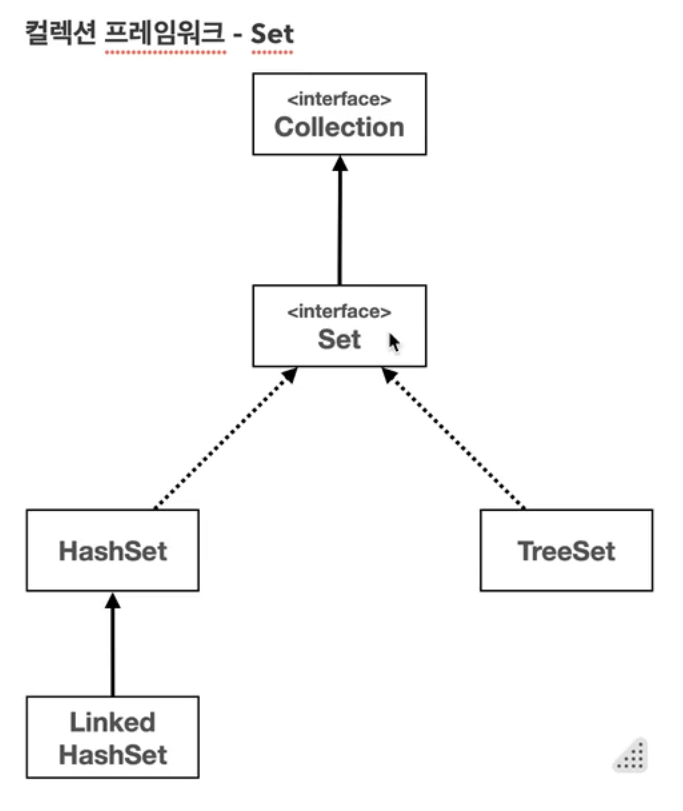  

#### Collection 인터페이스
- Collection 인터페이스는 Java.util 패키지의 컬렉션 프레임워크의 핵심 인터페이스 중 하나이다.
- 이 인터페이스는 자바에서 다양한 컬렉션, 즉 데이터 그룹을 다루기 위한 메서드를 정의한다.
- Collection 인터페이스는 List, Set, Queue 와 같은 다양한 하위 인터페이스와 함께 사용되며,  
  이를 통해 데이터를 리스트, 세트, 큐 등의 형태로 관리할 수 있다.

#### Set 인터페이스
- Set 인터페이스는 중복을 허용하지 않는 유일한 요소의 집합을 나타낸다.
- 즉, 어떤 요소도 같은 Set 에 두 번 이상 나타날 수 없다.
- Set 은 수학적 집합 개념을 구현한 것으로, 순서를 보장하지 않으며, 특정 요소가 집합에 있는지 여부를 확인하는데 최적화되어 있다.
- Set 인터페이스는 HashSet, LinkedHashSet, TreeSet 등의 여러 구현 클래스를 가지고 있으며,  
  각 클래스는 Set 인터페이스를 구현하며 각각의 특성을 가지고 있다.

#### HashSet
- 구현: 해시 자료 구조를 사용해서 요소를 저장한다.
- 순서: 요소들은 특성한 순서 없이 저장된다. 즉, 요소를 추가한 순서를 보장하지 않는다.
- 시간 복잡도: HashSet 의 주요 연산(추가, 삭제, 검색)은 평균적으로 O(1) 시간 복잡도를 가진다.
- 용도: 데이터의 유일성만 중요하고, 순서가 중요하지 않을 때 적합하다.  
  (앞서 우리가 구현한 MyHashSet 이 바로 HashSet 이다.)
####
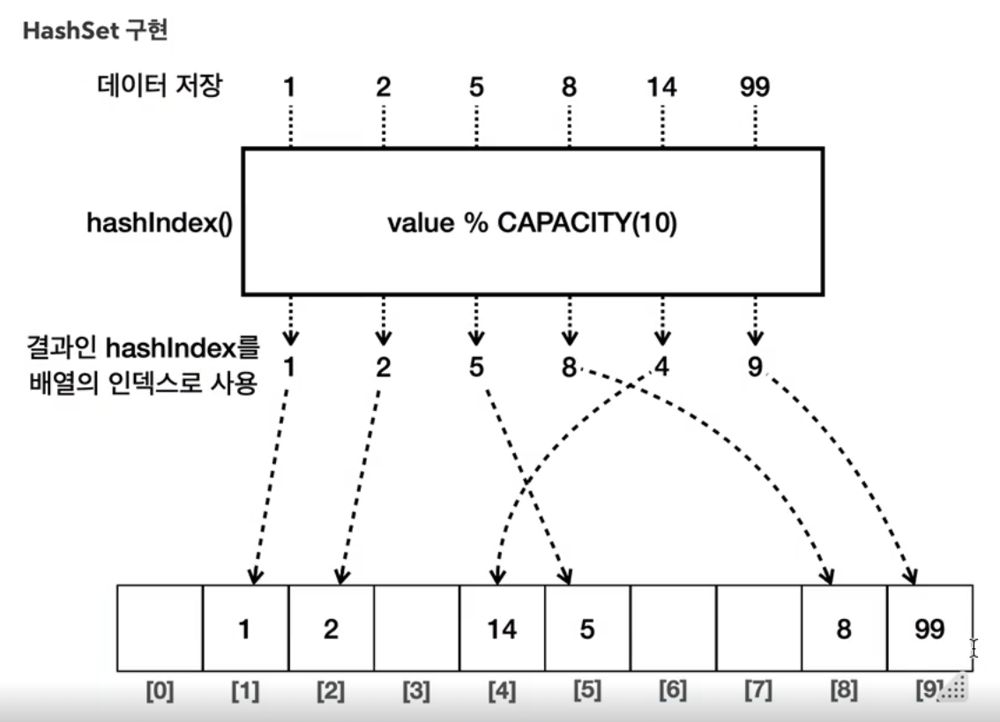

#### LinkedHashSet
- 구현: LinkedHashSet 은 HashSet 에 연결 리스트를 추가해서 요소들의 순서를 유지한다.
- 순서: 요소들은 추가된 순서대로 유지된다. 즉, 순서대로 조회 시 요소들이 추가된 순서대로 반환된다.
- 시간 복잡도: LinkedHashSet 도 HashSet 과 마찬가지로 주요 연산에 대해 평균 O(1) 시간 복잡도를 가진다.
- 용도: 데이터의 유일성과 합께 삽입 순서를 유지해야 할 때 적합하다.
- 참고: 연결 링크를 유지해야 하기 때문에 HashSet 보다는 조금 더 무겁다.
####
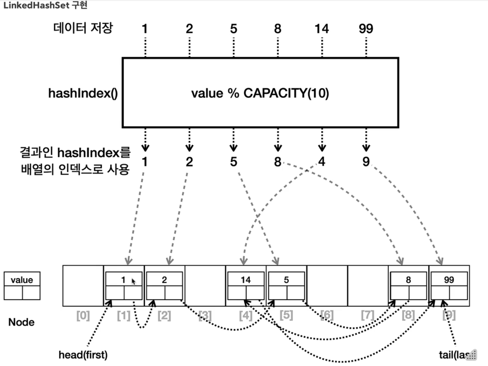  
- LinkedHashSet 은 HashSet 에 데이터 대신에 노드를 넣은 것이다.
- HashSet 에 LinkedList 를 합친 것으로 이해하면 된다.
- 이 연결 링크는 데이터를 입력한 순서대로 연결된다.
  - head(first) 부터 순서대로 링크를 따라가면 입력 순서대로 데이터를 순회할 수 있다.
  - 양방향으로 연결된다. (그림에서는 이해를 돕기위해 다음 순서만 보여주었지만 실제로는 양방향이다.)
- 여기서는 1,2,5,8,14,99 순서대로 입력된다.
- 이 링크를 first 부터 순서대로 따라가면서 출력하면 순서대로 출력할 수 있다.

#### TreeSet
- 구현: TreeSet 은 이진 탐색트리를 개선한 레드-블랙 트리를 내부에서 사용한다.
- 순서: 요소들은 정렬된 순서로 저장된다. 순서의 기준은 비교자(Comparator)로 변경할 수 있다. (비교자는 뒤에서 다룬다.)
- 시간 복잡도: 주요 연산들은 O(log n) 의 시간 복잡도를 가진다. 따라서 HashSet 보다 느리다.
- 용도: 데이터들을 정렬된 순서로 유지하면서 집합의 특성을 유지해야할 때 사용한다.  
  예를 들어, 범위 검색이나 정렬된 데이터가 필요한 경우에 유용하다. 참고로 입력된 순서가 아니라 데이터 값의 순서이다.  
  예를 들어 3, 1, 2 를 순서대로 입력해도 1, 2, 3 순서로 출력된다.
####
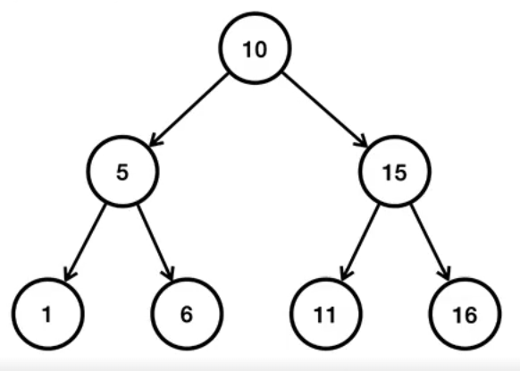  
- 트리는 부모 노드와 자식 노드로 구성된다.
- 가장 높은 조상을 루트(root)라 한다. 이 그림을 뒤집어 보면 왜 트리라고 하는지, 처음을 루트라고 하는지 이해가 될 것이다.
- 자식이 2개까지 올 수 있는 트리를 이진 트리라 한다.
- 여기에 노드의 왼쪽 자손은 더 작은 값을 가지고, 오른쪽 자손은 더 큰 값을 가지는 것을 이진 탐색 트리라고 한다.
- TreeSet 은 이진 탐색 트리를 개선한 레드-블랙 트리를 사용한다. 기본 개념은 비슷하므로 이진 탐색 트리의 원리를 알아보자.

#### 트리 구조의 구현 
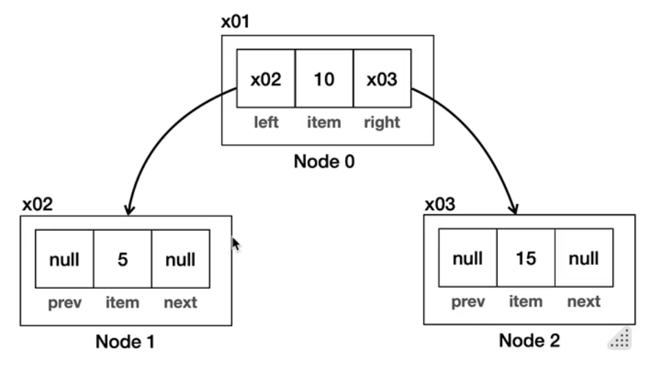  

    class Node {
        Object item;  
        Node left;
        Node right;
    }
- 트리 구조는 왼쪽, 오른쪽 노드를 알고 있으면 된다.
- 앞서 다룬 연결 리스트의 구현을 떠올려보면 쉽게 이해가 될 것이다.

#### 이진 탐색 트리 - 입력 예시  
- 이진 탐색 트리의 핵심은 데이터를 입력하는 시점에 정렬해서 보관한다는 점이다.
- 그리고 작은 값은 왼쪽에 큰 값은 오른쪽에 저장하면 된다.
- 데이터를 10, 5, 15, 1, 6, 11, 16 순서로 입력한다고 가정해보자.
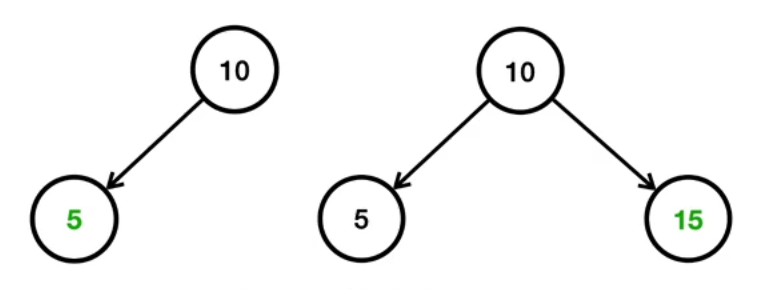  
- 5는 10보다 작으므로 왼쪽에 저장된다.
- 15는 10보다 크므로 오른쪽에 저장된다.
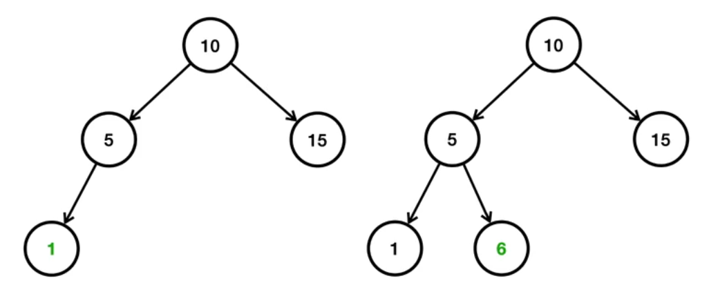  
- 1은 10보다 작다. 따라서 왼쪽으로 찾아간다. 1은 5보다 작다. 따라서 왼쪽에 저장된다.
- 6은 10보다 작다. 따라서 왼쪽으로 찾아간다. 6은 5보다 크다. 따라서 오른쪽에 저장된다.
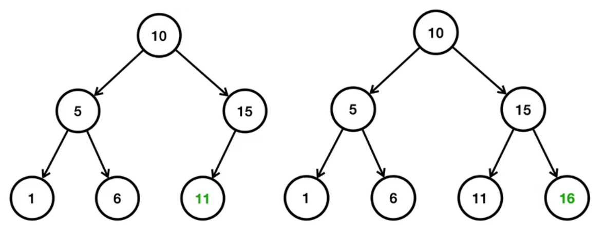  
- 11은 10보다 크다. 따라서 오른쪽으로 찾아간다. 11은 15보다 작다. 따라서 왼쪽에 저장된다.
- 16은 10보다 크다. 따라서 오른쪽으로 찾아간다. 16은 15보다 크다. 따라서 오른쪽에 저장된다.
  
#### 이진 탐색 트리 - 검색
  
- 여기에는 총 15개의 데이터가 들어있다. 여기서 숫자 35를 검색한다고 가정해보자.
1. 루트인 20과 35를 비교한다. 35가 더 크므로 오른쪽으로 찾아간다. 
2. 40과 35를 비교한다. 35가 더 작으므로 왼쪽으로 찾아간다.
3. 30과 35를 비교한다. 35가 더 크므로 오른쪽으로 찾아간다.
4. 노드에 있는 값을 비교한다. 35와 같으므로 35를 찾았다.
- 데이터가 총 15개인데 4번의 계산으로 필요한 결과를 얻을 수 있었다. 이것은 O(n)인 리스트의 검색보다는 빠르고, O(1)인 해시의 검색보다는 느리다.
  - 리스트의 경우 O(n)이므로 15번의 연산이 필요하다.
  - 해시 검색은 O(1)이므로 1번의 연산이 필요하다.
####
- 이진 탐색 트리 계산의 핵심은 한번에 절반을 날린 다는 점이다. 계산을 단순화 하기 위해 16개의 데이터가 있다고 가정하자.
  1. 16개의 데이터가 있다. 루트에서 처음 비교를 통해 절반의 데이터를 찾지 않아도 된다. 따라서 16 / 2 = 8 이 된다.
  2. 8개의 데이터가 있다. 비교를 통해 절반의 데이터만 남는다. 따라서 8 / 2 = 4 가 된다.
  3. 4개의 데이터가 있다. 비교를 통해 절반의 데이터만 남는다. 따라서 4 / 2 = 2 가 된다.
  4. 2개의 데이터가 있다. 비교를 통해 절반의 데이터만 남는다. 따라서 2 / 2 = 1 이 된다.
  5. 1이 남았으므로 이 값이 맞는지 확인한다.
- 계산 한 번당 절반을 날리기 때문에 데이터 개수에서 log2를 씌우면 된다. 즉 O(log n) 이다.

#### 이진 탐색 트리와 성능
- 이진 탐색 트리의 검색, 삽입 삭ㅈ의 평균 성능은 O(log n)이다. **하지만 트리의 균형이 맞지 않으면 최악의 경우 O(n)의 성능이 나온다.**
- 만약 데이터를 1, 5, 6, 10, 15 순서로 입력했다고 가정해보자.   
  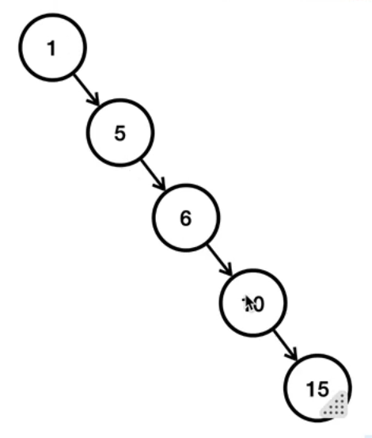
  - 이렇게 오른쪽으로 치우치게 되면, 결과적으로 15를 검색 했을 때 데이터의 수인 5만큼 검색을 해야한다.
  - 따라서 이런 최악의 경우 O(n)이 된다.

#### 이진 탐색 트리 개선 
- 이런 문제를 해결하기 위해 다양한 해결 방안이 있는데 트리의 균형이 너무 깨진 경우 동적으로 균형을 다시 맞추는 것이다.  
  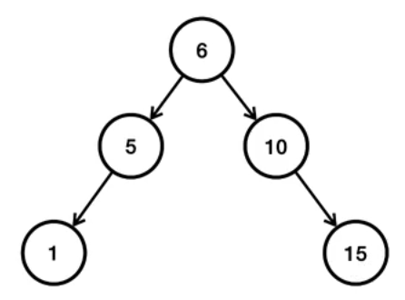
  - 앞서 중간에 있는 6을 기준으로 다시 정렬한다.
  - AVL 트리, 레드-블랙 트리 같은 균형을 맞추는 다양한 알고리즘이 존재한다.
  - 자바의 TreeSet 은 레드-블랙 트리를 사용해서 균형을 지속해서 유지한다. 따라서 최악의 경우에도 O(log n)의 성능을 유지한다.

#### 이진 탐색 트리 - 순회
- 이진 탐색 트리의 핵심은 입력 순서가 아니라, 데이터의 값을 기준으로 정렬해서 보관한다는 점이다.
- 따라서 정렬된 순서로 데이터를 차례로 조회할 수 있다. (순회 할 수 있다.)
- 데이터를 차례로 순회하려면 중위 순회라는 방법을 사용하면 된다. 왼쪽 서브트리를 방문한 다음, 현재 노드를 처리하고, 마지막으로 으론쪽 서브리를 방문한다.
- 이 방식은 이진 탐색트리의 특성상, 노드를 오름차순으로 방문한다.

#### 중위 순회 순서
- 쉽게 이야기해서 자신의 왼쪽 모든 노드를 처리하고, 자신의 노드를 처리하고, 자신의 오른쪽 모든 노드를 처리하는 방식이다.
  - 10의 기준에서 왼쪽 서브트리를 방문한다.
    - 5의 기준에서 왼쪽 서브트리를 방문한다.
      - 1을 출력한다.
    - 5 자신을 출력한다.
    - 5의 기준에서 오른쪽 서브트리를 방문한다.
      - 6을 출력한다.
  - 10을 출력한다.
  - 10의 기준에서 오른쪽 서브트리를 방문한다.
    - 15의 기준에서 왼쪽 서브트리를 방문한다.
      - 11을 출력한다.
    - 15 자신을 출력한다.
    - 15의 기준에서 오른쪽 서브트리를 방문한다.
      - 16을 출력한다.

> !참고 - 여기서는 TreeSet 을 알고 사용하기 위한 정도의 기본적인 트리 이론을 다루었다.  
> 트리 구조에 대해서 더 자세히 알고 싶다면 자료 구조와 알고리즘을 학습하자.

### 8-2. 자바가 제공하는 Set2 - 예제
    public class JavaSetMain {
    
        public static void main(String[] args) {
            HashSet<String> hashSet = new HashSet<>();
            LinkedHashSet<String> linkedHashSet = new LinkedHashSet<>();
            Set<String> treeSet = new TreeSet<>();
            run(new HashSet<>());
            run(new LinkedHashSet<>());
            run(new TreeSet<>());
        }
    
        private static void run(Set<String> set) {
            System.out.println("set = " + set.getClass());
            set.add("C");
            set.add("B");
            set.add("A");
            set.add("1");
            set.add("2");
    
            Iterator<String> iterator = set.iterator();
            while (iterator.hasNext()) {
                System.out.println(iterator.next() + " ");
            }
            System.out.println();
    
        }
    }
- HashSet, LinkedHashSet, TreeSet 모두 Set 인터페이스를 구현하기 때문에 구현체를 변경하면서 실행할 수 있다.
- iterator( )를 호출하면 컬렉션을 반복해서 출력할 수 있다.
  - iterator.hasNet( ): 다음 데이ㅓ가 있는지 확인한다.
  - iteratornext( ): 다음 데이터를 반환한다.

####
    set = class java.util.HashSet
    A
    1
    B
    2
    C
- 입력 순서와 상관 없이 들어가 있다.
####    
    set = class java.util.LinkedHashSet
    C
    B
    A
    1
    2
- LinkedHashSet 은 입력 순서대로 들어가 있다.
####
    set = class java.util.TreeSet
    1
    2
    A
    B
    C
- TreeSet 은 정렬해서 들어가 있다.

> !참고 - TreeSet 의 정렬 기준  
> TreeSet 을 사용할 때 데이터를 정렬하려면 크다, 작다라는 기준이 필요하다. 1, 2, 3 이나 "A", "B", "C" 같은 기본 데이터는    
> 크다 작다라는 기준이 명확하기 때문에 정렬할 수 있다. 하지만 우리가 직접 만든 Member 와 같은 객체는 크다 작다라는 기준을 어떻게  
> 알 수 있을까? 이런 기준을 제공하려면 Comparable, Comparator 인터페이스를 구현해야 한다. 이 부분은 뒤에서 설명한다.

### 8-3. 자바가 제공하는 Set3 - 최적화
- 자바의 HashSet 은 우리가 직접 구현한 내용과 거의 같지만 다음과 같은 최적화를 추가로 진행한다.

#### 최적화
- 해시 기반 자료 구조를 사용하는 경우 통계적으로 입력한 데이터의 수가 배열의 크기를 75% 정도 넘어가면 해시 인덱스가 자주 충돌한다.  
  따라서 75% 가 넘어가면 성능이 떨어지기 시작한다.  
  - 해시 충돌로 같은 해시 인덱스에 들어간 데이터를 검색하려면 모두 탐색해야 한다. 따라서 성능이 O(n)으로 좋지 않다.
- 하지만 데이터가 동적으로 계속 추가되기 때문에 적절한 배열의 크기를 정하는 것은 어렵다.
- 자바의 HashSet 은 데이터의 양이 배열 크기의 75% 를 넘어가면 배열의 크기를 2배로 늘리고 2배 늘어난 크기를 기준으로 모든 요소에 해시 인덱스를 다시 적용한다.
  - 해시 인덱스를 다시 적용하는 시간이 걸리지만, 결과적으로 해시 충돌이 줄어든다.
- 자바 HashSet 의 기본 크기는 16이다.
####
- 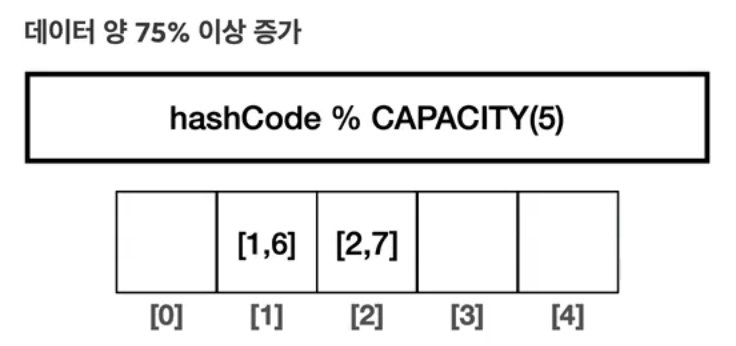  
  - 데이터 양이 75% 이상 증가하면 그 만큼 해시 인덱스의 충돌 가능성도 높아진다.
- 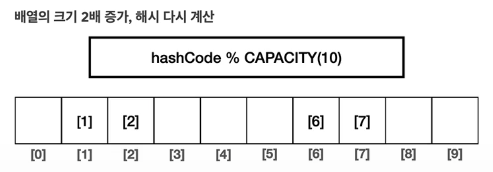
  - 데이터 양이 75% 이상이면 배열의 크기를 2배로 증가하고, 모든 데이터의 해시 인덱스를 커진 배열에 맞추어 다시 계산한다.   
    이 과정을 재해싱(rehashing)이라 한다.
  - 인덱스 충돌 가능성이 줄어든다.
  - 여기서 데이터가 다시 75% 이상 증가하면 다시 2배 증가와 재계산을 반복한다.
  
#### 정리
- 실무에서는 Set 이 필요한 경우 HashSet 을 가장 많이 사용한다. 
- 그리고 입력 순서 유지, 값 정렬의 필요에 따라서 LinkedHashSet, TreeSet 을 선택하면 된다.